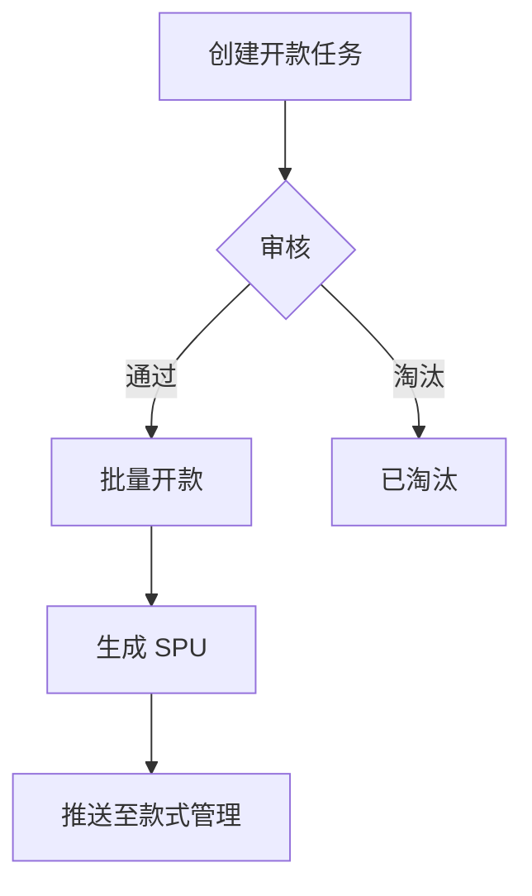

# Build-PRD 完整独立 Prompt

> 本文件是 build-prd 技能的完整独立版本，可在任何 LLM 中直接使用。

> 将本文件内容粘贴到 ChatGPT / Gemini / DeepSeek / Claude 等 LLM 中，
> 然后提供你的业务需求和现有模块文档，即可生成规划文档并执行模块更新。

---


============================================================

## SKILL.md

# build-prd

根据用户提供的业务上下文和需求背景，生成结构化的、带有初始内容的 B端 PRD规划文档。

用来说明当前这个版本：问题是什么，需要做什么，怎么做，有哪些影响。侧重于具体的功能规格说明，而不是价值分析。

同时完成文档管理：及时更新各个文档模块的最新逻辑，以及最新逻辑的来源于哪份规划文档。需要考虑多份规划文档的先后顺序，以及发布状态。

支持显式调用（如 `/build-prd`）和自动触发（当用户明确要求规划需求、分析变更影响、更新模块文档时）。

> **与 `/create-prd` 的区别**：create-prd 从零生成完整的14章 PRD 文档，重点描述需求价值（"为什么做"）。build-prd 面向**已有模块文档**的迭代场景，重点说明要做什么/怎么做，分析变更对现有模块的影响，生成规划文档并执行模块更新。

## 端到端示例

用户输入：

> "开款任务管理要增加批量审核功能，审核员可以一次选多条件记录审核通过或驳回。版本号 v2.2.0。"

**阶段 0 输出 — 需求清单：**

| 序号 | 需求描述 | 需求类型 | 涉及业务场景 | 优先级 |
|------|---------|---------|--------------|--------|
| 1 | 开款任务列表增加批量审核操作 | 功能优化 | 审核员批量处理开款任务 | P1 |

**阶段 1 输出 — 影响分析：**

| 模块 | 影响类型 | 影响说明 | 依赖影响 |
|------|---------|---------|---------|
| 开款任务管理 | 直接 | 列表页新增批量操作；状态机批量流转 | 款式管理（接收审核结果） |
| 款式管理 | 间接 | 审核结果字段需支持"批量驳回"来源标记 | — |

**阶段 2 输出 — 模块修改方案：**

- **开款任务管理**：列表页新增"批量审核"按钮 → 出现条件：选中 ≥1 条且均为"待审核"，点选后弹批量审核弹窗 → 状态机：待审核 → 已通过/已驳回（批量）
- **款式管理**：数据模型无变更；用例补充批量驳回场景的字段说明

**阶段 3-4 输出**：创建 `modules/v2.2.0/` 版本目录（含 `_module-list.md` 记录模块标题），生成规划文档 `revisions/规划文档_v2.2.0_开款任务增加批量审核.md`，在版本目录中更新 `开款任务管理.md` 和 `款式管理.md` 模块文档。

## 输入

- 用户提供的需求描述
- 或通过 `$ARGUMENTS` 传入的文件路径
- 需求所属版本，需要记录版本号

如有参数传入，优先作为输入源：

$ARGUMENTS

## 文档管理工作流

每次版本迭代遵循 **规划中 → 开发中 → 已上线** 三阶段生命周期。文件管理规则如下：

### 目录结构

```
/prd-root/
├── modules/                        # 基线模块文档（始终为当前已上线的最新版本）
│   ├── design-task.md
│   ├── style-management.md
│   └── ...
├── modules/vX.Y.Z/                 # 版本快照目录（仅存放本版本有变更的模块）
│   ├── design-task.md              # 从基线拷贝 → 在此修改
│   └── style-management.md
├── revisions/                      # 规划文档（每次迭代一份）
│   └── 规划文档_vX.Y.Z_需求简述.md
├── .meta/                          # 元数据（manifest.json, glossary.yml, template-module.md）
└── README.md
```

### 三阶段工作流

**阶段 A：规划中**

- 在 `revisions/` 创建规划文档，元数据中 `状态 = 规划中`
- 规划文档的 `关联版本` 记录本次版本号
- 此阶段不创建版本目录，不修改基线模块文档

**阶段 B：开发中**

1. 在 `modules/` 下创建版本目录 `modules/vX.Y.Z/`
2. 仅拷贝**有变更的模块文档**到版本目录中（不拷贝无变更的模块）
3. 在版本目录中的文档里修改业务逻辑，保持 frontmatter `version = "X.Y.Z"`
4. 将规划文档的状态改为 `开发中`
5. 无变更的模块不需要版本快照 —— viewer 会自动 fallback 到 `modules/` 基线

**阶段 C：已上线**

1. 将 `modules/vX.Y.Z/` 中的变更合并到 `modules/`（直接覆盖或手动合入）
2. 更新 `modules/` 中文档的 frontmatter `version`
3. 将规划文档的状态改为 `已上线`
4. 可选择删除或归档 `modules/vX.Y.Z/` 目录

### 模块加载优先级

| 状态 | 第一优先级 | Fallback |
|------|-----------|---------|
| 已上线 | `modules/foo.md` | `modules/vX.Y.Z/foo.md` |
| 开发中 | `modules/vX.Y.Z/foo.md` | `modules/foo.md` |
| 规划中 | `modules/foo.md` | — |

### 文件管理原则

- **基线即真相**：`modules/` 永远反映当前已上线的生产逻辑，不包含未上线的内容
- **版本目录只放变更**：`modules/vX.Y.Z/` 只存放本版本有变更的模块文件，不复制全量模块
- **一份规划文档对应一个版本**：每次迭代在 `revisions/` 创建一份规划文档，不修改历史规划文档
- **变更来源可追溯**：每个模块文档的更新记录必须标注来自哪份规划文档

## 生成流程

严格按以下顺序执行，不可跳过或调换步骤。每个阶段需等待用户确认后再继续。

### 阶段 0：理解上下文与需求拆解

1. 完整阅读并理解用户提供的所有业务上下文或需求描述。
2. 从用户描述中拆解需求，确定：
   - **需求类型**：功能优化 / 新增功能 / 新增模块
     - **功能优化**：基于已有的功能，修改原本的逻辑（如修改字段校验规则、调整状态流转）
     - **新增功能**：在已有模块中新增独立的子功能，模块本身已存在（如店铺管理模块下新增店铺默认值管理）
     - **新增模块**：大部分是新增的内容，需要考虑对原有功能的影响（如新增通知中心模块）
   - **变更粒度**（影响后续阶段的确认次数）：
     - **字段级**：修改单个字段的属性、校验规则、枚举值 → 可合并阶段 0-2，一次性输出需求清单+影响分析+修改方案
     - **页面级**：新增/修改/删除页面，调整交互流程 → 阶段 0 确认后，阶段 1-2 逐一确认
     - **模块级**：新增模块或模块间交互方式变更 → 完整4阶段，每阶段确认
3. 输出需求清单：

```markdown
## 需求清单

| 序号 | 需求描述 | 需求类型 | 涉及的业务场景 | 优先级 |
|------|---------|---------|--------------|--------|
| 1 | {具体要做什么内容} | 功能优化/新增模块 | {场景说明} | P0/P1/P2 |
```

4. 等待用户确认后再继续。
5. 确认后根据变更粒度决定后续流程：
   - **字段级**：直接进入阶段 1+2（合并执行，一次性输出影响分析+修改方案，无需中间确认）
   - **页面级/模块级**：进入阶段 1，逐阶段确认

### 阶段 1：排查影响点

> **无现有模块文档时**：如果项目还没有任何模块文档，则无法执行影响分析。此时应：
> 1. 提示用户：当前项目缺少模块文档，建议先用 `/create-prd` 从零生成，或手动建立核心模块文档
> 2. 生成一份**新模块定义草案**（按 规划文档结构 第4章模板），作为模块文档的初始版本
> 3. 用户确认草案后，跳过阶段 1-2，直接进入阶段 3 创建新模块文档

1. 根据需求描述，遍历现有模块文档目录，查找所有受影响的文档模块。
2. 对每个受影响的模块，分析：
   - **直接影响**：该模块的哪些页面、数据模型、状态机需要变更
   - **间接影响**：通过 `depends_on` / `exposed_api` 依赖链传播的影响
   - **冲突点**：是否存在逻辑冲突（如两个需求修改同一字段、状态流转冲突等）

3. 输出影响分析：

```markdown
## 影响分析

### 受影响模块

| 模块 | 影响类型 | 影响说明 | 依赖影响 |
|------|---------|---------|---------|
| {模块名} (module-key) | 直接/间接 | {具体影响内容} | {下游模块} |

### 冲突点（如有）

| 冲突描述 | 涉及模块 | 涉及需求 | 建议处理方式 |
|---------|---------|---------|------------|
```

> **viewer 兼容性**：模块名必须使用 `{模块名} (module-key)` 格式。prd-viewer 通过正则匹配括号内的 `module_id` 来关联模块文档，缺少此格式会导致模块被误判为"新增"而非"变更"。

4. 存在冲突逻辑无法解决时，需要等待用户确认后再继续。
5. 确认后进入阶段 2。

### 阶段 2：输出逻辑修改

1. 加载以下参考文件以确定设计规范：
   - 通用设计语言规范 — 页面类型、交互形式、字段类型标准
   - 文档结构 — 模块文档结构模板、完整性检查清单
   - 文档目录 — 多文档管理目录结构
   - 规划文档结构 — 规划文档的章节模板

2. 对每个受影响的模块，输出具体修改方案：

```markdown
## 模块修改方案

### 模块：[模块名称] (module-key)

#### 变更概述
{一句话说明这个模块要改什么}

#### 页面变更

| 页面名称 | 变更类型 | 变更内容 | 参考文档 |
|---------|---------|---------|---------|
| {页面} | 新增/修改/删除 | {具体内容} | |

#### 数据模型变更

| 实体 | 变更类型 | 属性 | 说明 |
|------|---------|------|------|
| {实体名} | 新增/修改/删除 | {属性名} | {说明} |

#### 状态机变更

{如有状态变更，用 Mermaid 或状态转换表说明}

#### 依赖变更

| 变更类型 | 模块 | 类型(hard/soft) | 说明 |
|---------|------|---------------|------|
| 新增依赖/移除依赖 | {模块名} | hard/soft | {说明} |
```

3. 将以上所有内容组织为一份**规划文档**，按 规划文档结构 输出。

4. 等待用户确认全部修改方案后再继续。

### 阶段 3：执行修改

**3.1 创建版本目录**

1. 在 `modules/` 下创建版本目录，命名规则：`modules/v{版本号}/`
   - 示例：`modules/v2.7.0/`
2. 从 `modules/` 基线中，**仅拷贝本版本有变更的模块**到版本目录中
   - 不拷贝无变更的模块（viewer 会自动 fallback 到基线）
3. 在版本目录中创建一个 `_module-list.md` 索引文件，记录本版本涉及的全部模块标题：

```markdown
# v{版本号} 变更模块清单

| 序号 | 模块名称 | module_id | 变更类型 | 基线版本 | 目标版本 |
|------|---------|-----------|---------|---------|---------|
| 1 | {模块名称} | {module_id} | 功能优化/新增功能/新增模块 | vX.Y.Z | vX.Y'.Z' |
```

> **这个索引文件是版本分支的"目录"**，用于快速查看某个版本涉及了哪些模块。每次更新具体功能模块时，在此文件中追加或更新对应行。

**3.2 执行模块文档更新**

1. 对版本目录中的每个模块文档（`modules/vX.Y.Z/xxx.md`），按阶段 2 确认的方案执行修改：
   - 定位需要修改的具体章节
   - 执行编辑操作
   - 更新文档 Frontmatter 中的 `version` 和 `last_updated`
   - 在模块文档的用例部分添加 `**更新记录**` 表格（如不存在则新建），记录本次变更

2. 更新记录格式：

```markdown
| 关联版本 | 更新内容 | 具体说明 |
|------|------|------|
| {版本号} | {变更概述} | {来自规划文档 XXX} |
```

3. 每个模块修改完成后，验证：
   - 文档 Frontmatter 版本号已更新
   - `depends_on` / `exposed_api` 依赖关系已同步
   - 状态机变更与状态说明表一致
   - 新增的字段/实体符合通用设计语言规范中的类型定义
   - **跨模块引用一致性**（当模块发生合并/拆分/重命名时）：
     - [ ] `module_id` 变更后，grep 所有活跃模块的 `depends_on` / `exposed_api`，更新引用
     - [ ] 依赖拆分为多个模块时，原 `use_case` 按职责拆分到对应模块
     - [ ] 外部系统依赖（NEST、SSO、Temu 等）不放在 `depends_on`，放在 `related_features`
     - [ ] 文件名与 `module_id` 一致（如 `module_id: shop-management` → `shop-management.md`）
     - [ ] 不含对已删除模块的悬空引用
   - **结构合规**（对照 文档结构 的「撰写铁律」检查）：
     - [ ] 无独立的 `## 异常处理` / `## 业务流程` / `## API 概览` / `## 字典依赖` 章节
     - [ ] 页面概述表格无代码映射列（路由名称、组件路径、HTML 文件名）
     - [ ] 版本号全部为三段式 `vX.Y.Z`
     - [ ] 变更标注使用英文括号 `(vX.Y.Z 新增/变更)`
     - [ ] 数据模型表包含完整列（属性/类型/必填/默认值/长度范围/说明）
     - [ ] 新增字段标注了 `(vX.Y.Z 新增)` 来源
     - [ ] 无技术实现细节（数据库选型、ORM、索引、API 路径、前端框架）

**3.3 更新规划文档状态**

1. 将 `revisions/` 中对应规划文档的元数据 `状态` 从 `规划中` 改为 `开发中`
2. 在规划文档的 `5. 执行记录` 章节追加一条执行记录

### 阶段 4：汇总修改内容

1. 汇总本次所有变更内容：

```markdown
## 变更汇总

**版本**: {版本号}
**规划文档**: {规划文档名称}
**变更日期**: {日期}

### 本版本涉及的模块

| 序号 | 模块名称 | module_id | 变更类型 | 基线版本 | 目标版本 |
|------|---------|-----------|---------|---------|---------|
| 1 | {模块名称} | {module_id} | 功能优化/新增模块 | vX.Y.Z | vX.Y'.Z' |

### 模块变更清单

> **viewer 数据源**：此表格的 `变更类型` 列是 prd-viewer 判断模块为"变更"还是"新增"的**唯一字段**。取值：`功能优化`（→"变更"）/ `新增功能`（→"新增功能"）/ `新增模块`（→"新增"）。

| 模块 | 变更前版本 | 变更后版本 | 变更类型 | 主要变更 |
|------|----------|----------|---------|---------|
| {模块名} (module-key) | v1.0.0 | v1.1.0 | 功能优化/新增功能 | {概述} |

> 新增功能与此表格中，`变更类型` 填 `新增功能`。新增模块的 `变更前版本` 填 `—`，`变更类型` 填 `新增模块`。

### 依赖关系变更
| 变更类型 | 源模块 | 目标模块 | 类型 |
|---------|--------|---------|------|
| 新增/移除 | | | hard/soft |

### 版本目录文件

| 文件路径 | 说明 |
|---------|------|
| `modules/v{版本号}/_module-list.md` | 本版本变更模块清单 |
| `modules/v{版本号}/{模块名}.md` | 变更后的模块文档 |
```

2. 同步更新 `modules/v{版本号}/_module-list.md`，确保模块标题列表与变更汇总一致。
3. 在项目元数据文件（如 `.meta/manifest.json`）中更新模块清单和依赖矩阵（如存在）。
4. 提醒用户：
   - 可使用 `/check-prd` 对更新后的模块文档进行质量审查。
   - 版本上线时，按照 [文档管理工作流](#文档管理工作流) 阶段 C，将 `modules/v{版本号}/` 中的变更合并到 `modules/` 基线，并将规划文档状态改为 `已上线`。

## 输出

1. **规划文档**（按 规划文档结构 格式），存储在 `revisions/` 目录
2. **版本目录** `modules/v{版本号}/`，包含：
   - `_module-list.md` — 本版本变更模块清单（记录模块标题）
   - 各变更模块的最新文档（仅本版本有变更的模块）
3. **基线模块文档保持不变**（`modules/` 仅在阶段 C 上线时更新）

## 工作风格

- 目标是进行精确的变更影响分析和文档联动更新，不是从零生成 PRD。
- 严格按依赖链分析影响范围 —— 改 A 模块时，必须检查谁依赖了 A、A 依赖了谁。
- 保持模块文档的结构一致性 —— 所有修改必须符合 文档结构 模板和 通用设计语言规范。
- 版本管理严谨 —— 每次变更必须有版本号，记录变更来源（来自哪份规划文档）。
- 存在冲突或不确定性时，暂停并请用户决策，不做假设。
- 执行与规划不一致时（如计划新增的模块合并到已有模块），必须回写规划文档：删除 Section 4 中对应标题，在变更汇总表中反映实际去向。
- 不编造内容；信息不足时用 `[TODO: 需要补充什么]` 标注。

### 文档撰写铁律

每次修改模块文档时，必须遵守以下规则（违反即为不合格）：

1. **异常处理嵌入页面**：异常处理表格放在每个用例下方，不独立成 `## 异常处理` 章节。
2. **禁止代码映射**：页面概述表格固定为 5 列（页面名称/页面类型/入口路径/交互形式/说明），不出现路由名称、组件路径、HTML 文件名。
3. **业务流程前置**：核心业务流程图（mermaid）放在 Ch1 模块概述的对接关系之后。
4. **更新记录就近**：变更记录放在对应页面/模块下方。版本号统一 `(vX.Y.Z 新增/变更)` 格式——英文括号、三段式语义化版本。
5. **版本号三段式**：全文使用 `vX.Y.Z`（如 `v2.6.0`），禁止 `v2.6` 简写。标题旁标注用英文括号。
6. **新增字段完整定义**：数据模型新增字段必须包含类型、必填、默认值、长度/精度范围。在说明列标注 `(vX.Y.Z 新增)`。
7. **需求规格说明书，不是技术设计**：只描述「系统做什么」和「约束条件」，不规定数据库选型、ORM、索引、API 路径、前端框架。
8. **依赖声明只写模块间依赖**：`depends_on` 的 `module` 值必须是其他模块的有效 `module_id`。外部系统（NEST 字典、SSO、Temu 平台、飞书等）放在 `related_features`，不放在 `depends_on`。每个依赖项的 `use_case` 描述一个具体使用场景，避免合并多个无关场景。
9. **模块边界单一职责**：一个模块覆盖一个清晰的业务子域。如果模块覆盖多个子域，应拆分为独立模块。新建或编辑模块前，先检查是否有其他模块已覆盖相同内容，避免重复。


============================================================

## references/appendices/build-prd-appendix-typing.md

# 需求定型与影响分析策略

> 在阶段 0 完成需求拆解后加载此文件，用于确定影响分析的深度和广度。

## 需求定型矩阵

### 需求类型（二选一）

| 类型 | 定义 | 典型场景 | 分析侧重 |
|------|------|---------|---------|
| **功能优化** | 基于已有模块功能，修改部分逻辑 | 修改字段校验规则、调整状态流转、增加查询条件、变更权限控制 | 聚焦变更点的影响范围，沿依赖链追溯 |
| **新增功能** | 在已有模块中新增独立子功能，模块本身已存在 | 在[店铺管理]模块中新增「店铺默认值管理」功能 | 分析新功能与模块内原有功能的交互，以及对外部的依赖传播 |
| **新增模块** | 大部分是新增内容，是独立的新模块 | 新增一个业务模块（如供应商管理、质检管理） | 全面分析新模块与现有模块的对接关系 |

### 变更粒度（三选一）

| 粒度 | 特征 | 影响范围 | 分析深度 |
|------|------|---------|---------|
| **字段级** | 修改单个字段的属性、校验规则、枚举值 | 当前模块 + 引用该字段的下游模块 | 检查所有引用点 |
| **页面级** | 新增/修改/删除页面，调整交互流程 | 当前模块的所有依赖方 | 重新走查页面跳转关系 |
| **模块级** | 新增模块或模块间交互方式变更 | 整个文档体系 | 全量依赖分析 |

## 影响分析策略

### 功能优化的分析路径

1. **定位变更点**：确定具体在哪个模块的哪个页面/实体/状态机上做变更
2. **前向追溯**（谁依赖我）：
   - 检查当前模块的 `exposed_api` 声明
   - 对每个下游模块，判断变更是否影响其 use_case
3. **后向追溯**（我依赖谁）：
   - 检查当前模块的 `depends_on` 声明
   - 判断变更是否需要上游模块提供新的数据或服务
4. **同级检查**：是否有其他模块对同一实体/字段有引用

### 新增模块的分析路径

1. **识别对接点**：新模块需要从哪些现有模块获取数据（→ depends_on）
2. **识别消费方**：哪些现有模块会使用新模块的输出（→ exposed_api）
3. **检查命名冲突**：新模块的实体名、字段名是否与现有模块冲突
4. **检查流程衔接**：新模块的页面入口嵌入到现有流程的哪个环节

### 依赖传播示例

```
选款中心 ──hard──▶ 开款任务管理 ──hard──▶ 款式管理
                      │                    │
                      │ 变更"审核结果"枚举  │ 间接影响
                      ▼                    ▼
                   需更新              需检查
```

当修改"开款任务管理"的审核结果枚举时：
- **直接**：更新开款任务管理的数据模型和用例
- **间接**：款式管理从开款任务管理获取开款结果，需确认枚举变更是否影响其逻辑

## 分析输出要求

### 功能优化：必须输出的分析项
- [ ] 变更点的精确定位（模块:章节:行级描述）
- [ ] 前向影响链（exposed_api → 下游模块列表）
- [ ] 后向影响链（depends_on → 上游模块列表）
- [ ] 字段枚举值变更时，所有引用该枚举的模块

### 新增模块：必须输出的分析项
- [ ] 新模块与现有模块的对接关系矩阵
- [ ] depends_on 声明（新模块需要哪些现有模块的数据/服务）
- [ ] exposed_api 声明（哪些现有模块会使用新模块的输出）
- [ ] 新模块的页面入口（在现有菜单/流程中的位置）
- [ ] 新模块涉及的实体与现有实体的关系


============================================================

## references/规划文档结构.md

# 规划文档结构模板

## 文档定位

规划文档是**需求到模块文档的桥梁**。它记录：这个版本要解决什么问题、需要改哪些模块、怎么改、改完之后各个模块变成了什么样。

与 PRD 的区别：PRD 面向"从零开始定义产品"，规划文档面向"在已有模块文档基础上做增量变更"。

## 规划文档命名规范

```
规划文档_{版本号}_{需求简述}.md
```

示例：`规划文档_v2.1.0_开款任务增加批量审核.md`

## 存储位置

```
/prd-root/revisions/{规划文档文件名}
```

与模块文档分开存储。模块文档在 `modules/`，规划文档在 `revisions/`。

## 正文结构

```markdown
# 规划文档：{需求标题}

| 属性 | 内容 |
|------|------|
| 规划文档编号 | REV-{YYYYMMDD}-{序号} |
| 关联版本 | {版本号} |
| 需求提出方 | {姓名或部门} |
| 规划人 | {姓名} |
| 规划日期 | {YYYY-MM-DD} |
| 状态 | draft / confirmed / executed / archived |

---

## 1. 需求背景

### 1.1 问题描述
{当前存在什么问题，为什么需要这个变更}

### 1.2 需求清单

| 序号 | 需求描述 | 需求类型 | 优先级 |
|------|---------|---------|--------|
| 1 | | 功能优化/新增功能/新增模块 | P0/P1/P2 |

### 1.3 版本说明
{本规划文档对应的版本号，以及与前序版本的关系}

---

## 2. 影响分析

### 2.1 受影响模块

| 模块 | 当前版本 | 影响类型 | 影响说明 |
|------|---------|---------|---------|
| {模块名} (module-key) | vX.Y.Z | 直接/间接 | {影响内容} |

> **viewer 兼容性**：模块名列必须使用 `{模块名} (module-key)` 格式，括号内为模块文档的 `module_id`。prd-viewer 通过正则 `/^\|\s*(.+?)\s*\((\w+(?:-\w+)*)\)\s*\|/` 解析此行，缺少 `(module-key)` 将导致模块无法被正确识别。

### 2.2 依赖传播链

{用 Mermaid 图描述变更如何通过依赖关系传播}

```
{模块A} ──hard──▶ {模块B} ──hard──▶ {模块C}
  │ 变更点                    │ 受影响
  ▼                           ▼
{需更新}                   {需检查}
```

### 2.3 冲突分析

| 冲突点 | 涉及模块 | 说明 | 解决方案 |
|--------|---------|------|---------|
| | | | |

---

## 3. 模块变更详情

{对每个受影响的模块，逐个展开}

> **viewer 兼容性**：每个 `### 3.X 模块：名称 (module-key)` 标题必须包含 `(module-key)`。prd-viewer 通过正则 `/^###\s+\d+\.\d+\s+模块[：:]\s*(.+?)\s*\((\w+(?:-\w+)*)\)/gm` 解析此标题来识别"变更"模块。缺少 `(module-key)` 会被 `newModRe` 正则捕获并误判为"新增"模块。

### 3.1 模块：{模块名称} (module-key)

#### 变更概述
{一句话说明这个模块要改什么}

#### 页面变更

| 页面名称 | 变更类型 | 具体变更 | 变更原因 |
|---------|---------|---------|---------|
| {页面} | 新增/修改/删除 | {具体描述} | {为什么改} |

#### 数据模型变更

| 实体 | 变更类型 | 变更内容 | 说明 |
|------|---------|---------|------|
| {实体名} | 新增属性 | {属性名}: {类型}, {必填/可选} | {业务说明} |
| {实体名} | 修改属性 | {属性名}: {旧} → {新} | {修改原因} |
| {实体名} | 删除属性 | {属性名} | {删除原因} |
| — | 新增实体 | {实体名}: {核心属性列表} | {业务说明} |

#### 状态机变更

{如无变更，标注"无"}

```mermaid
stateDiagram-v2
    {如需展示新增/变更的状态流转}
```

| 状态 | 可到达的状态 | 触发动作 | 备注 |
|------|------------|---------|------|
| {新增状态} | | | |

#### 依赖变更

| 变更类型 | 目标模块 | 类型 | new_use_case |
|---------|---------|------|-------------|
| 新增依赖/移除依赖/修改类型 | | hard/soft | |

---

### 3.2 模块：{模块名称} (module-key)
{同上结构，每个模块一个 3.x 小节}

---

## 4. 新增模块定义

{仅当需求类型="新增模块"时有此章节。新增功能（在已有模块中新增子功能）不单独成章，变更内容写在 3.x 对应模块的变更详情中。}

### 4.1 模块：{新模块名称}

#### 模块概述
{职责、业务背景}

#### 对接关系

| 对接系统 | 方向 | 数据/功能 | 说明 |
|---------|------|---------|------|

#### 依赖声明

```yaml
depends_on:
  - module: ""
    type: hard/soft
    use_case: ""
exposed_api:
  - module: ""
    type: hard/soft
    use_case: ""
```

#### 页面概述

| 页面名称 | 页面类型 | 入口/路径 | 交互形式 | 说明 |
|---------|---------|---------|---------|------|

{后续按 [文档结构](文档结构.md) 模板完成完整的模块定义}

---

## 5. 执行记录

| 日期 | 操作 | 操作人 | 结果 |
|------|------|--------|------|
| {日期} | 创建规划文档 | {规划人} | — |
| {日期} | 确认修改方案 | {确认人} | — |
| {日期} | 执行模块更新 | {执行人} | {成功/部分失败} |

---

## 6. 变更汇总

> **viewer 数据源**：此表格是 prd-viewer 判断模块变更类型的**唯一权威来源**。`变更类型` 列的值直接决定左侧导航栏显示"变更"/"新增功能"/"新增"。可选值：`功能优化` / `新增功能` / `新增模块` / `删除`。

| 模块 | 变更前版本 | 变更后版本 | 变更类型 | 状态 |
|------|----------|----------|---------|------|
| {模块名} (module-key) | vX.Y.Z | vX.Y'.Z' | 功能优化/新增功能/新增模块/删除 | executed/pending |

> **格式要求**：模块列建议使用 `{模块名} (module-key)` 格式以精确关联 manifest 中的 `module_key`；若为全新模块（在 manifest 中不存在），则使用纯中文名，`变更类型` 填 `新增模块`。若为已有模块中的新增子功能，`变更类型` 填 `新增功能`。

---

## 附：相关文档索引

| 文档 | 路径 | 说明 |
|------|------|------|
| 通用设计语言规范 | references/通用设计语言规范.md | 字段类型、页面类型标准 |
| 文档结构模板 | references/文档结构.md | 模块文档结构模板 |
| 文档目录 | references/文档目录.md | 多文档管理结构 |
| {关联规划文档} | revisions/ | 前序/后续规划文档 |
```


============================================================

## references/文档结构.md

# 模块文档结构模板

## 撰写铁律

以下规则在每个模块文档中**必须遵守**，违反即为不合格：

1. **异常处理不独立成章**：异常处理是每个用例的一部分，必须嵌入到对应页面/用例下方的 `**异常处理**` 表格中，禁止出现独立的 `## 异常处理` 章节。
2. **不出现代码映射**：页面概述表格的列固定为 `页面名称 | 页面类型 | 入口/路径 | 交互形式 | 说明`。禁止出现 `路由名称`、`实际代码入口`、`HTML文件`、`Vue组件路径` 等技术实现列。
3. **业务流程前置**：核心业务流程（mermaid 流程图）放在 Ch1 模块概述中（对接关系之后），不作为独立的后置章节。
4. **更新记录就近标记**：每个页面/模块的变更记录直接写在该页面/模块下方，使用 `**更新记录**` 子章节。版本号统一使用 `(vX.Y.Z 变更类型)` 格式——英文括号、三段式语义化版本。
5. **版本号统一格式**：全文版本号必须为三段式 `vX.Y.Z`（如 `v2.6.0`），禁止 `v2.6` 等简写。在标题或字段旁标注变更来源时使用英文括号 `(v2.6.0 新增)`，禁止中文括号 `（v2.6.0新增）`。
6. **新增字段须完整定义**：数据模型中新增的字段，必须填写完整的属性约束：类型、必填/可选、默认值、长度/精度范围。参照 [数据模型](#5-数据模型) 的扩展列格式。
7. **这是需求规格说明书，不是技术设计**：只描述「系统要做什么」和「约束条件是什么」。不规定数据库选型、ORM 映射、索引策略、API 路径、前端框架、组件库等技术实现细节。
8. **依赖声明只写模块间依赖**：`depends_on` 的 `module` 值必须是其他模块的有效 `module_id`。外部系统（NEST 字典、SSO、Temu 平台、飞书等）放在 `related_features`，不放在 `depends_on`。每个依赖项用一个具体的 `use_case`，不混合多个无关场景。
9. **模块边界单一职责**：一个模块覆盖一个清晰的业务子域。新建或修改模块前，先检查是否有其他模块已覆盖相同内容。发现内容重叠时，应合并而非保留两份。模块文件名必须与 `module_id` 一致（如 `module_id: shop-management` → `shop-management.md`）。

---

## 设计原则

1. 数据从哪里来，到哪里去 —— 以数据流视角拆解模块功能
2. 按页面类型组织内容 —— 列表页、表单页、详情页各有不同的说明需求
3. 用例驱动 —— 以用例为主线，串联前置条件、业务规则、后置输出、异常处理
4. **只说做什么，不说怎么做** —— 描述功能逻辑和业务规则，不规定技术实现

> **边界**: 本文档描述业务需求和功能行为。数据库选型、接口协议、开发语言、框架组件等技术决策由开发团队在技术设计中给出，不写入本文档。

---

## 角色视角检验清单

每个模块文档完成时，从以下三个角色视角逐一检验：

### 前端工程师视角

| 需要知道 | 对应章节 |
|---------|---------|
| 有哪些页面，页面之间的跳转关系 | 2. 页面概述 |
| 每个页面需要哪些数据、触发哪些操作 | 相应页面的用例说明 |
| 页面在无数据/操作失败时显示什么 | 组件状态规范 |
| 表单字段何时校验、校验规则是什么 | 表单字段说明 |
| 字段之间的联动关系（A 选 X 时 B 出现/隐藏） | 字段联动规则 |
| 哪些操作需要二次确认 | 用例说明 |

### 后端工程师视角

| 需要知道 | 对应章节 |
|---------|---------|
| 本模块有哪些数据实体、各自的属性和约束 | 5. 数据模型 |
| 实体有哪些状态、状态之间如何流转 | 4. 状态机 |
| 每个操作需要什么输入、产生什么输出 | 接口契约（用例输入/输出） |
| 业务校验规则（唯一性、必填、长度/范围限制） | 表单字段说明 |
| 并发场景的业务要求（如：防止重复创建） | 用例的业务规则 |
| 数据删除策略（标记删除/物理删除） | 5. 数据模型 |
| 依赖哪些外部模块，对接失败时的业务降级策略 | Frontmatter 依赖声明 |

### 测试工程师视角

| 需要知道 | 对应章节 |
|---------|---------|
| 每个用例的验收标准 | 用例说明 |
| 谁可以做什么操作 | 3. 权限说明 |
| 边界条件（最大/最小长度、空值处理） | 字段规范 |
| 异常场景下系统如何响应 | 异常处理 |
| 修改一个模块影响哪些下游 | Frontmatter 依赖声明 |

---

## YAML Frontmatter 模板

```yaml
---
module_id: "module_key"              # 唯一标识，必须与文件名一致（如 shop-management → shop-management.md）
module_name: "模块名称"              # 面向人类的中文名称
version: "1.0.0"                    # 语义化版本
status: "draft"                     # draft | active | deprecated
owner: "_待填写_"                   # 产品负责人
last_updated: "YYYY-MM-DD"

# 依赖声明（本模块需要从哪些模块获取数据或服务）
# 重要：module 值必须是其他模块的有效 module_id，外部系统放 related_features
depends_on:
  - module: "dependency-module"
    type: "hard"                    # hard: 强依赖，对方不可用时本模块核心功能受阻
    use_case: "使用场景说明"        # 一个依赖项描述一个具体场景，不合并多个无关场景

# 被依赖声明（哪些下游模块依赖本模块的输出）
exposed_api:
  - module: "downstream-module"
    type: "hard"
    use_case: "下游使用场景说明"

# 关联的外部功能（非本模块核心，但需要协作的外部系统）
# NEST 字典、SSO、Temu 平台、飞书 等外部系统统一放这里
related_features:
  - "外部系统/功能描述"
---
```
---

## 正文结构

```
# 模块名称

## 1. 模块概述（含核心业务流程图）
## 2. 页面概述
## 3. 权限说明
## 4. 状态机（核心实体有生命周期时必填）
## 5. 数据模型（逻辑模型 + SQL 级字段约束）
## 6. [页面名称A]（含本页面的异常处理 + 更新记录）
## 7. [页面名称B]（含本页面的异常处理 + 更新记录）
...
```

> **章节规则**：
> - Ch1 必须包含核心业务流程图（mermaid），放在对接关系之后。
> - Ch2 页面概述**禁止包含代码映射列**（路由名称、组件路径、HTML 文件名等）。
> - Ch6+ 每个页面内部必须包含该页面专属的「异常处理」和「更新记录」。
> - 禁止出现独立的 `## 异常处理` / `## 业务流程` / `## API 概览` / `## 字典依赖` / `## 关键业务规则` 等章节——这些内容应分散到对应页面或模块级章节中。

---

## 1. 模块概述

简要说明模块职责、业务背景及对外对接关系。

```markdown
## 1. 模块概述

本模块负责[XX]相关功能。

**业务背景**：[为什么需要这个模块，解决什么业务问题]

**对接关系**：
| 对接系统 | 方向 | 数据/功能 | 说明 |
|---------|------|---------|------|
| PLM 系统 | 输出 | 款式数据 | 审核通过后同步至 PLM |
| Temu 平台 | 双向 | 商品上架、订单回传 | 对接 Temu Seller 平台 |

**核心业务流程**：



> 业务流程图放在 Ch1 对接关系之后，不独立成章。流程图应展示本模块的核心业务流转，不需要包含技术实现细节（如 API 调用、数据库操作等）。
```

---

## 2. 页面概述

列出本模块包含的所有页面，标注页面类型和交互形式。

> **禁止出现代码映射列**。以下列禁止出现在页面概述表格中：路由名称（route name）、实际代码入口（component path）、HTML 文件名、Vue 组件路径。

```markdown
## 2. 页面概述

| 页面名称 | 页面类型 | 入口/路径 | 交互形式 | 说明 |
|---------|---------|---------|---------|------|
| 款式列表 | 列表页 | 主菜单 → 款式管理 | 页面跳转 | 默认着陆页 |
| 新建SPU  | 表单页 | 款式列表 → 点击"新建SPU" | 弹窗 | |
| 款式详情 | 详情页 | 款式列表 → 点击款号 | 页面跳转 | 路径中含款式 ID |
```

---

## 3. 权限说明

统一描述模块的权限模型，避免在用例中重复声明。

```markdown
## 3. 权限说明

### 功能权限
仅说明需要特别逻辑处理的特殊角色，其余菜单权限通过RBAC系统配置，不在文档中单独说明

| 操作 | 特殊角色 | 备注 |
|------|---------|------|
| 查看列表 | 任意登录用户 | |
| 新建SPU | 设计师 | |
| 审核开款 | 审核员 | |
| 删除任务 | 创建人（仅本人） | 非创建人不可见删除按钮 |
| 导出数据 | 设计师、管理员 | |

### 数据权限

| 范围 | 规则 | 适用角色 |
|------|------|---------|
| 全部 | 同一租户下的所有数据 | 管理员 |
| 组内 | 当前用户所属设计组内的数据，不属于任何组时查询为空 | 设计师 |
| 我的 | 创建人 = 当前用户 | 设计师 |
```

---

## 4. 状态机

核心实体的生命周期。每个状态变更需要：触发动作 → 当前状态 → 目标状态。
使用mermaid输出

```markdown
## 4. 状态机

### [实体1]状态机图

（在此粘贴 mermaid 状态图）

### [实体1]状态说明

| 状态 | 可到达的状态 | 触发动作 | 备注 |
|------|------------|---------|------|
| 草稿 | 待审核 | 提交 | |
| 待审核 | 已通过、已驳回 | 审核（通过/驳回） | 驳回必须填写原因 |
| 已通过 | 已上架 | 推送上架 | |
| 已驳回 | 待审核 | 重新提交 | |
| 已上架 | 已下架 | 下架 | |
| 已下架 | 已上架 | 重新上架 | |
```

---

## 5. 数据模型

描述业务数据的逻辑结构：有哪些实体、各自的属性、属性的业务含义和约束。

> **新增字段必须填写完整约束**：类型、必填/可选、默认值、长度/精度范围、字段备注。以下列是数据模型表的**必填列**，不可省略。

使用mermaid输出实体关系图。

```markdown
## 5. 数据模型

### 5.1 实体关系

（在此粘贴 mermaid 实体关系图）

### 5.2 实体说明

#### SPU（标准产品单元）

| 属性 | 类型 | 必填 | 默认值 | 长度/范围 | 说明 |
|------|------|------|--------|----------|------|
| 款号 | 短文本 | 是 | 自动生成 | ≤32字符 | 唯一，规则: SPU + YYMMDD + 4位流水号 |
| 租户 | 引用 | 是 | 当前租户 | — | 所属租户 |
| 品类 | 引用 | 是 | — | — | 关联品类字典 |
| 状态 | 枚举 | 是 | 草稿 | — | 草稿/待审核/已通过/已驳回/已上架/已下架 |
| 设计师 | 引用 | 否 | — | — | 负责人 |
| 面料池使用范围 | 枚举 | 否 | — | — | (v2.4.1 新增) 可选值见 NEST 字典 fabric_pool_scope |
| 创建时间 | 日期时间 | 自动 | NOW() | — | |
| 更新时间 | 日期时间 | 自动 | NOW() | — | ON UPDATE |
| 是否删除 | 布尔 | 自动 | false | — | 标记删除 |

#### SKC（款式颜色规格）

| 属性 | 类型 | 必填 | 默认值 | 长度/范围 | 说明 |
|------|------|------|--------|----------|------|
| 款号 | 短文本 | 是 | 自动生成 | ≤32字符 | 唯一，规则: SPU款号 + 2位颜色序号 |
| 所属SPU | 引用 | 是 | — | — | 关联 SPU |
| 颜色 | 短文本 | 是 | — | ≤20字符 | |
| 波段 | 引用 | 否 | — | — | (v2.4.1 变更) SKC维度，取自 NEST 字典 plm_clothing_band |
| 图片 | 文件引用 | 否 | — | ≤5MB, jpg/png | 支持多张 |

> **"类型"列说明**: 只描述数据的业务形态，不绑定具体技术类型。但必须注明长度/范围约束以便开发实现。
> - `短文本`: 单行文本，注明最大字符数
> - `长文本`: 多行文本，注明最大字符数（如 ≤500字符）
> - `数字`: 整数/小数，标注范围和精度
> - `枚举`: 有限个可选值，**必须列出所有取值**
> - `日期`: 年月日
> - `日期时间`: 年月日时分秒
> - `布尔`: 是/否
> - `文件引用`: 文件的存储地址，注明格式和大小限制
> - `引用`: 关联其他实体，注明关联目标
> - `金额`: 带币种的数值，注明精度（如 DECIMAL(10,2)）

> **新增字段标注规范**：在「说明」列中用英文括号标注 `(vX.Y.Z 新增)` 或 `(vX.Y.Z 变更)`，与字段描述用空格分隔。
```

---

## 6. 列表页模板

结构: 页面说明 → 查询条件 → 显示字段 → 行操作/批量操作 → 组件状态 → 用例

### 6.1 页面说明

```markdown
### [页面名称]

#### 页面说明

**入口**: 主菜单 → 款式管理 → 款式列表

**权限**: 见 [3. 权限说明](#3-权限说明)，本页面权限码 `style:read`

**数据范围**:
  - 全部：同一租户下的所有数据
  - 组内：当前用户所属设计组内的数据
  - 我的：创建人 = 当前用户

**列表行为**:
  - 数据来源：当前租户内所有用户创建的款式数据
  - 默认排序：创建时间降序
  - 分页：默认 20 条/页，可选 20/50/100
  - 刷新方式：手动刷新
```

### 6.2 查询条件

```markdown
#### 查询条件

| 条件名称 | 输入方式 | 说明 | 联动规则 | 更新说明 |
|---------|---------|------|---------|---------|
| 关键字 | 文本输入 | 模糊搜索，支持批量（空格或逗号分隔） | — | |
| 品类 | 级联选择 | 取值来源：NEST字典 clothing_category，支持多选 | — | |
| 设计师 | 搜索选择 | 取值来源：设计组别-设计师 | 先选"设计组"后可搜索 | |
| 创建时间 | 日期范围选择 | 最大跨度 90 天，默认最近 7 天 | — | |
| 状态 | 多选 | 可选项见 [状态机](#4-状态机) | — | |
```

**输入方式可选值**: `文本输入` | `数字输入` | `单选` | `多选` | `级联选择` | `搜索选择` | `日期选择` | `日期范围选择` | `开关`

### 6.3 显示字段

```markdown
#### 显示字段

| 字段名称 | 显示为 | 数据含义 | 说明 | 更新说明 |
|---------|--------|---------|------|---------|
| SPU款号 | 可点击文本 | SPU 唯一标识 | 点击跳转详情页 | |
| 品类名称 | 标签 | 末级品类 | | |
| 设计图片 | 缩略图 | 首张设计图 | 宽高比 1:1，点击查看大图 | |
| 设计师 | 文本 | 负责人姓名 | | |
| 状态 | 状态标签 | SPU 生命周期状态 | 不同状态不同颜色 | |
| 创建时间 | 格式化文本 | 创建日期时间 | 格式 YYYY-MM-DD HH:mm | |
```

**显示类型可选值**: `文本` | `可点击文本` | `格式化文本` | `标签` | `状态标签` | `缩略图` | `可点击图片` | `进度条` | `操作按钮` | `多值列表`

### 6.4 行操作 & 批量操作

```markdown
#### 行操作

| 操作 | 出现条件 | 需要的角色 | 交互形式 | 说明 |
|------|---------|-----------|---------|------|
| 编辑 | 状态=草稿/已驳回 | 设计师 | 弹窗 | 打开编辑表单 |
| 提交审核 | 状态=草稿/已驳回 | 设计师 | 二次确认弹窗 | 确认后状态变为待审核 |
| 删除 | 状态=草稿，且为创建人 | 设计师 | 二次确认弹窗 | 标记删除 |

#### 批量操作

| 操作 | 可选条件 | 最少选中 | 需要的角色 | 说明 |
|------|---------|---------|-----------|------|
| 批量提交 | 所选均为草稿/已驳回 | 1 条 | 设计师 | 批量变更为待审核 |
| 批量导出 | 查询结果 ≤ 1000 条 | 不限 | 设计师、管理员 | 导出查询结果全部数据 |
```

### 6.5 用例说明

```markdown
#### 用例

##### 用例1: 新建SPU
  - **前置条件**：1）用户需具备"新建SPU"权限；2）当前用户角色为设计师
  - **输入**：点击"新建SPU"按钮
  - **业务规则**：
    - 打开【新建SPU】弹窗
    - SPU 款号生成规则：SPU + YYMMDD + 4位流水号
  - **后置输出**：创建成功后 → 关闭弹窗，刷新列表，新记录高亮 3 秒
  - **验收标准**：
    - [ ] 无权限用户看不到"新建SPU"按钮
    - [ ] 点击按钮弹出新建表单
    - [ ] SPU 款号按规则自动生成
    - [ ] 必填项未填时不允许提交，标红提示
  - **异常处理**：

| 异常场景 | 用户看到的表现 |
|---------|-------------|
| 必填项为空 | 对应字段标红，聚焦第一个错误字段，提示具体缺失项 |
| SPU 款号重复 | 提示"款号已存在，请修改" |
| 网络超时 | 提示"操作超时，请重试"，保留已填内容 |

  - **更新记录**

| 关联版本 | 更新内容 | 具体说明 |
|------|------|------|
| v2.6.0 | 款号自动生成 | 规则: SPU + YYMMDD + 4位流水号 |
| v2.4.1 | 项目类型字段 | (v2.4.1 变更) 从SPU维度拆分到SKC维度 |

> **更新记录格式规范**：
> - 版本号统一使用三段式 `vX.Y.Z`（禁止 `v2.6` 简写）
> - 在表格内跨模块引用时用英文括号 `(vX.Y.Z 新增/变更)` 标注变更来源
> - 更新记录就近放置：页面级变更放在对应页面下，模块级变更放在模块末尾
> - 如果同一个页面/表单有多个字段来自不同版本，每条一行，按时间倒序

```

---

## 7. 表单页模板

结构: 显示字段(只读) → 表单字段(可编辑) → 字段联动规则 → 用例 → 提交说明

### 7.1 表单字段说明

```markdown
#### 表单字段

| 字段名称 | 输入方式 | 必填 | 校验规则 | 默认值 | 说明 | 更新说明 |
|---------|---------|------|---------|--------|------|---------|
| 品类 | 级联选择 | 是 | — | — | 取值来源：NEST字典 clothing_category | |
| 款号 | 文本输入 | 是 | 长度 8-32，仅允许字母数字下划线 | 自动生成 | 自动生成，可手动修改 | |
| 设计师 | 搜索选择 | 是 | — | — | 取值来源：设计组别-设计师 | |
| 备注 | 多行文本 | 否 | 最大 200 字符 | — | | |
| 图片 | 图片上传 | 是 | jpg/png，单张 ≤ 5MB，最多 10 张 | — | 支持拖拽 | |
```

**输入方式可选值**: `文本输入` | `多行文本` | `数字输入` | `单选` | `多选` | `级联选择` | `搜索选择` | `日期选择` | `日期时间选择` | `图片上传` | `文件上传` | `开关` | `评分`

### 7.2 字段联动规则

描述字段之间的条件依赖关系。

```markdown
#### 字段联动规则

| 触发字段 | 当值为 | 目标字段 | 行为 | 说明 |
|---------|--------|---------|------|------|
| 供给方式 | 现货 | 供应商、供应商款号 | 显示 + 变为必填 | |
| 供给方式 | 生产 | 供应商、供应商款号 | 隐藏 + 清除已填值 | |
| 店铺 | VC | 价格 | 显示 + 变为必填 | VC 店铺需核价 |
| 款式类型 | 组合商品 | SKC 选择区 | 显示 | 组合商品从已有 SKC 中选取 |
```

### 7.3 提交说明

```markdown
#### 提交说明

**提交时校验**:
1. 所有必填项非空
2. SPU 款号不可与已有款号重复
3. 至少关联 1 个 SKC
4. 图片至少上传 1 张

**防重复提交**:
  - 提交过程中按钮不可再次点击
  - 同一请求内容在短时间内（如 5 分钟）重复提交视为同一次操作

**成功后数据变更**:
  - 生成 1 条 SPU 记录（状态 = 草稿）
  - 生成 N 条关联 SKC 记录
  - 上传图片关联到对应 SPU

**后置交互**:
  - 成功：关闭弹窗 → 提示"创建成功" → 刷新列表 → 新记录短暂高亮
  - 失败：保留用户已填内容 → 错误信息显示在表单顶部
```

---

## 8. 详情页模板

结构: 页面布局 → 信息区块 → 操作按钮 → 用例

```markdown
### [页面名称]

#### 页面说明

**入口**: [从哪里进入此页面]
**路径参数**: [如: 款式 ID]

#### 信息区块

| 区块 | 包含内容 | 说明 |
|------|---------|------|
| 基本信息 | SPU款号、品类、创建时间、设计师 | |
| 图片区 | 设计图、效果图 | 支持切换查看、放大 |
| SKC 列表 | 颜色、尺码、库存 | 表格形式，支持展开查看明细 |
| 操作日志 | 操作人、操作内容、操作时间 | 时间倒序 |

#### 操作按钮

| 操作 | 出现条件 | 需要的角色 | 说明 |
|------|---------|-----------|------|
| 编辑 | 状态=草稿/已驳回 | 设计师 | 跳转编辑表单 |
| 提交审核 | 状态=草稿/已驳回 | 设计师 | 二次确认后提交 |

#### 用例

##### 用例1: 查看详情
  - **前置条件**：用户具备查看权限
  - **输入**：在列表页点击 SPU 款号
  - **业务规则**：加载 SPU 详情及关联 SKC 数据
  - **后置输出**：展示详情页各信息区块
  - **验收标准**：
    - [ ] 各区块数据正确展示
    - [ ] 图片可切换、放大查看
    - [ ] SKC 列表可展开查看明细
  - **异常处理**：
  
  | 异常场景 | 用户看到的表现 |
  |---------|-------------|
  | 数据不存在 | 展示"数据不存在"提示，提供返回列表入口 |
  | 无权限 | 展示"暂无访问权限"提示 |
  | 数据加载超时 | 各区块独立加载，失败的区块显示重试按钮 |
```

---

## 9. 文档完整性检查清单

每个模块文档交付前逐项确认：

### 模块级
- [ ] 模块概述包含业务背景
- [ ] 依赖声明标注了降级方案
- [ ] 状态机覆盖核心实体（如有生命周期）
- [ ] 数据模型包含实体属性和业务约束
- [ ] 没有"待填写"的占位符

### 列表页
- [ ] 入口清晰（从哪个菜单/页面进入）
- [ ] 查询条件含输入方式和联动规则
- [ ] 显示字段含显示类型和数据含义
- [ ] 行操作含出现条件和所需角色
- [ ] 批量操作含可选条件和最少选中数
- [ ] 各状态（加载中/空数据/加载失败/无权限）的展示已描述
- [ ] 每个用例有验收标准 checklist

### 表单页
- [ ] 表单字段含输入方式、校验规则、默认值
- [ ] 字段联动规则已列出
- [ ] 提交说明含校验规则和防重复提交要求
- [ ] 提交成功和失败的后置行为已明确

### 详情页
- [ ] 信息区块划分清晰
- [ ] 操作按钮含出现条件和所需角色

### 通用
- [ ] 所有枚举值有确定来源（字典/数据表/硬编码）
- [ ] 所有"必填"字段有对应校验规则
- [ ] 所有状态流转有明确的触发条件和结果
- [ ] 删除策略（标记删除/物理删除）已标注
- [ ] 所有字段联动规则的目标状态（显示/隐藏/必填/清除）已完整定义

### 撰写铁律检查
- [ ] 无独立的 `## 异常处理` 章节（异常处理嵌入各页面/用例下）
- [ ] 无独立的 `## 业务流程` 章节（业务流程在 Ch1 模块概述中）
- [ ] 无独立的 `## API 概览` / `## 字典依赖` / `## 关键业务规则` 章节
- [ ] 页面概述表格无代码映射列（路由名称、组件路径、HTML 文件名）
- [ ] 版本号全部为三段式 `vX.Y.Z`，无 `vX.Y` 简写
- [ ] 变更标注使用英文括号 `(vX.Y.Z 新增/变更)`
- [ ] 数据模型表包含完整列（属性/类型/必填/默认值/长度范围/说明）
- [ ] 新增字段的说明列标注了 `(vX.Y.Z 新增)` 来源
- [ ] 无技术实现细节（数据库选型、ORM 映射、索引策略、API 路径、前端框架）

### 跨模块依赖检查（模块合并/拆分/重命名时必做）
- [ ] 文件名与 `module_id` 一致
- [ ] `depends_on` 中所有 `module` 值均为有效 module_id（grep 可查到对应文件）
- [ ] 无外部系统（NEST、SSO、Temu、飞书等）出现在 `depends_on` 中
- [ ] 所有活跃模块的 `depends_on` / `exposed_api` 引用已同步更新
- [ ] 无悬空引用（指向已删除模块的 module_id）


============================================================

## references/通用设计语言规范.md

### 页面类型规范

| 类型 | 适用场景 | 典型特征 |
|------|---------|---------|
| `列表页` | 数据查询、批量管理 | 含查询条件区 + 结果列表 + 批量操作栏 |
| `表单页` | 新增/编辑数据 | 含输入字段区 + 提交/取消按钮 |
| `详情页` | 数据查看、详情操作 | 信息展示为主，含少量操作按钮 |
| `仪表板` | 统计图表、数据概览 | 图表/卡片为主，含时间范围筛选 |
| `工作流页` | 流程审批、多步骤操作 | 含步骤条、流转操作按钮 |
| `导入导出页` | 批量导入、导出 | 含文件上传/模板下载/进度展示 |

### 交互形式规范

| 类型 | 说明 | 适用场景 |
|------|------|---------|
| `页面跳转` | 当前页跳转，浏览器 URL 变化 | 独立功能入口 |
| `弹窗` | 浮层，不改变当前页面 URL | 快速创建/确认/轻量编辑 |
| `抽屉` | 侧边滑出面板 | 详情预览、侧边编辑 |
| `新标签页` | 浏览器新标签页打开 | 跨模块跳转、外部链接 |
| `行内编辑` | 在列表行内直接编辑 | 单字段快速修改 |
| `下拉展开` | 在列表行下方展开内容 | 行详情展开 |


## 字段类型规范

定义文档中使用的"类型"术语的标准含义，确保编写者和读者理解一致。

### 输入方式

在查询条件和表单字段中，描述用户以什么方式输入数据。

| 输入方式 | 说明 | 示例 |
|---------|------|------|
| `文本输入` | 单行文本输入 | 搜索关键字、款号、姓名 |
| `多行文本` | 多行文本输入 | 备注、驳回原因、描述 |
| `数字输入` | 数值输入，可限定范围 | 数量、价格、评分(1-5) |
| `单选` | 从一组选项中选一个 | 状态筛选、是否 |
| `多选` | 从一组选项中选多个 | 品类筛选、状态筛选 |
| `级联选择` | 层级结构选择 | 品类(一级/二级/三级) |
| `搜索选择` | 输入关键词后从结果中选择 | 设计师、供应商 |
| `日期选择` | 选择单个日期 | 创建日期 |
| `日期范围选择` | 选择起止日期 | 创建时间范围 |
| `日期时间选择` | 选择日期+时间 | 精确时间点 |
| `图片上传` | 上传图片文件 | 设计图、效果图 |
| `文件上传` | 上传任意文件 | 导入文件、附件 |
| `开关` | 布尔值切换 | 启用/停用 |
| `评分` | 固定范围的数值评分 | 1-5 星评分 |

### 显示类型

在显示字段中，描述数据以什么视觉形态呈现。

| 显示类型 | 说明 | 示例 |
|---------|------|------|
| `文本` | 纯文本展示 | 款号、姓名 |
| `可点击文本` | 文本形式，点击触发跳转或操作 | 款号(点击跳详情) |
| `格式化文本` | 经过格式化的文本 | 日期 YYYY-MM-DD、金额 ¥1,234.56 |
| `标签` | 标签/徽章形式 | 品类标签 |
| `状态标签` | 带颜色区分的状态标签 | 草稿(灰)/已上架(绿)/已驳回(红) |
| `缩略图` | 小尺寸图片 | 列表中的预览图 |
| `可点击图片` | 点击可查看大图或跳转 | 设计图放大查看 |
| `进度条` | 百分比进度条 | 任务完成度 |
| `操作按钮` | 按钮/链接形式的操作入口 | 编辑、删除 |
| `多值列表` | 多个值以逗号或标签列表展示 | 标签1, 标签2, 标签3 |

### 数据属性类型

在数据模型中，描述属性的业务形态。新增字段时必须指定以下完整约束：

| 类型 | 必填字段 | 说明 |
|------|---------|------|
| `短文本` | 最大字符数 | 单行文本，注明 `≤N字符` |
| `长文本` | 最大字符数 | 多行文本，注明 `≤N字符`（如 ≤500字符） |
| `整数` | 范围 | 注明取值范围（如 0-99999） |
| `小数` | 精度 | 注明小数位数和范围（如 DECIMAL(10,2)，0.00-99999999.99） |
| `枚举` | 全部取值列表 | 必须列出所有可选值，注明默认值 |
| `日期` | — | 年月日，格式 YYYY-MM-DD |
| `日期时间` | — | 年月日时分秒，格式 YYYY-MM-DD HH:mm:ss |
| `布尔` | 默认值 | 是/否，注明默认 false 还是 true |
| `文件引用` | 格式+大小限制 | 注明支持的文件格式和大小上限（如 jpg/png，≤5MB） |
| `引用` | 关联目标实体 | 注明关联到哪个实体/字典的哪个字段 |
| `金额` | 精度+币种 | 注明精度和币种（如 DECIMAL(10,2)，CNY） |

> **与文档结构模板的关系**：数据模型实体说明表使用 6 列格式（属性/类型/必填/默认值/长度范围/说明），本规范定义「类型」列的标准取值和每种类型必须补充的约束信息。

---

## 异常处理规范

描述异常场景和对应的用户可见行为，不规定错误码、HTTP 状态码等技术细节。

### 异常分类

| 异常类别 | 说明 | 典型场景 |
|---------|------|---------|
| 输入校验失败 | 用户输入不符合业务规则 | 必填为空、格式错误、长度超限 |
| 数据冲突 | 操作与现有数据冲突 | 款号重复、状态不允许当前操作 |
| 权限不足 | 用户无此操作的权限 | 非创建人删除、非设计师新建 |
| 数据不存在 | 引用的数据已被删除或不存在 | 查看已删除的详情 |
| 并发冲突 | 数据在操作期间被他人修改 | 两人同时编辑同一条记录 |
| 服务不可用 | 依赖的外部系统不可用 | 对接系统超时、网络故障 |

### 异常描述模板

每个异常场景描述清楚：什么情况发生 → 用户看到什么。

```markdown
| 异常场景 | 用户看到的表现 |
|---------|-------------|
| 必填项为空 | 对应字段标红，聚焦第一个错误字段，提示缺失的具体内容 |
| 款号重复 | 提示"款号已存在，请修改" |
| 状态不允许操作 | 提示当前状态不支持此操作，说明原因 |
| 登录过期 | 跳转登录页，登录后回到当前页面 |
| 数据不存在 | 展示"数据不存在"页面，提供返回列表入口 |
| 数据被他人修改 | 提示"数据已被他人修改，请刷新后重试"，刷新页面 |
| 外部系统超时 | 提示"操作超时，请稍后重试"，提供重试按钮 |
| 文件格式不符 | 提示"仅支持 [格式列表] 格式" |
| 文件过大 | 提示"文件大小不能超过 [上限]" |
```

---


============================================================

## references/文档目录.md

# 文档目录管理

## 1. 拆分原则

1. **按模块拆分**：每个独立的业务模块一个文件，便于独立维护和版本管理
2. **版本隔离**：开发中的变更放在版本子目录，不污染基线
3. **一份规划文档对应一个版本**：每次迭代在 `revisions/` 创建一份规划文档
4. **基线即真相**：`modules/` 永远反映当前已上线的生产逻辑

## 2. 目录结构

```
/prd-root/                            # 项目根目录
├── .meta/                            # 元数据目录
│   ├── manifest.json                 # 模块清单、全局配置、依赖矩阵
│   ├── glossary.yml                  # 统一术语表（业务领域词典）
│   └── template-module.md            # 标准模块模板
├── modules/                          # 基线模块目录（始终为当前已上线的最新版本）
│   ├── design-task.md                # 设计任务管理
│   ├── style-management.md           # 款式管理
│   ├── spot-goods.md                 # 现货管理
│   ├── temu-product.md               # 商品管理
│   ├── image-update.md               # 修图任务
│   └── notification-center.md        # 通知中心
├── modules/vX.Y.Z/                   # 版本快照目录（仅存放本版本有变更的模块）
│   ├── _module-list.md               # 本版本变更模块清单（记录模块标题）
│   ├── design-task.md                # 从基线拷贝 → 在本目录中修改
│   └── style-management.md
├── cross-cutting/                    # 跨模块关注点（可选）
│   ├── authentication.md
│   └── audit-log.md
├── revisions/                        # 规划文档目录（每次迭代一份）
│   ├── 规划文档_v2.4.3_SKC维度调整.md
│   └── 规划文档_v2.6.0_SDP商品开发迭代.md
├── README.md                         # 项目入口说明、快速导航
└── .agent-config.yaml                # Agent 维护规则配置文件（可选）
```

## 3. 版本目录规范

### 3.1 命名规则

```
modules/v{主版本}.{次版本}.{修订版本}/
```

示例：`modules/v2.7.0/`、`modules/v2.7.1/`

### 3.2 存放规则

- **只放有变更的模块**：不拷贝全量模块，无变更的模块由 viewer 自动 fallback 到 `modules/` 基线
- **每个版本目录独立**：不同版本的变更互不干扰
- **上线后合入基线**：版本上线后，将版本目录中的变更合并回 `modules/`，然后可删除或归档版本目录

### 3.3 _module-list.md 格式

每个版本目录下必须包含 `_module-list.md`，记录本版本涉及的全部模块标题：

```markdown
# v{版本号} 变更模块清单

**关联规划文档**: {规划文档名称}

| 序号 | 模块名称 | module_id | 变更类型 | 基线版本 | 目标版本 |
|------|---------|-----------|---------|---------|---------|
| 1 | 设计任务管理 | design-task | 功能优化 | v2.6.0 | v2.7.0 |
| 2 | 款式管理 | style-management | 功能优化 | v2.6.0 | v2.7.0 |
| 3 | 通知中心 | notification-center | 新增模块 | — | v2.7.0 |
```

> 每次更新具体功能模块时，在此文件中追加或更新对应行的模块标题。

## 4. 模块加载优先级

Viewer / API 加载模块文档时的查找顺序：

| 状态 | 第一优先级 | Fallback |
|------|-----------|---------|
| 已上线 | `modules/foo.md` | `modules/vX.Y.Z/foo.md` |
| 开发中 | `modules/vX.Y.Z/foo.md` | `modules/foo.md` |
| 规划中 | `modules/foo.md` | — |

## 5. 生命周期与文件操作

| 操作 | 规划中 | 开发中 | 已上线 |
|------|--------|--------|--------|
| 创建规划文档 | ✅ `revisions/` | — | — |
| 创建版本目录 | — | ✅ `modules/vX.Y.Z/` | — |
| 拷贝模块到版本目录 | — | ✅ 仅变更模块 | — |
| 修改模块文档 | — | ✅ 在版本目录中 | — |
| 合入基线 | — | — | ✅ 覆盖 `modules/` |
| 归档/删除版本目录 | — | — | ✅ 可选 |
| 更新规划文档状态 | ✅ → 开发中 | ✅ → 已上线 | — |


============================================================

## references/appendices/build-prd-appendix-selfcheck.md

# 自检与待完善清单

> 规划文档和各模块文档更新完毕后加载此文件，对变更内容进行轻量自检。

## 自检目的

规划文档和执行结果完成后，快速检查变更是否完整、一致、可追溯。这不是完整评审，而是"执行后质量门禁"。

## 自检流程

### 第一步：变更完整性快扫

逐项检查以下内容，标注状态：

| 检查项 | 检查内容 | 状态 |
|--------|---------|------|
| **需求覆盖** | 阶段0确认的每条需求是否都有对应的模块变更 | ✅已覆盖 / ⚠️遗漏 |
| **影响闭环** | 阶段1识别的所有受影响模块是否都已执行更新 | ✅已更新 / ⚠️遗漏 |
| **依赖同步** | 如有 depends_on / exposed_api 变更，所有关联模块的 Frontmatter 是否已同步 | ✅已同步 / ⚠️待同步 |
| **版本号** | 所有变更模块的 version 和 last_updated 是否已更新 | ✅已更新 / ⚠️遗漏 |
| **更新记录** | 每个变更模块的用例是否添加了更新记录表 | ✅已添加 / ⚠️遗漏 |
| **命名一致** | 新增的实体/字段/枚举值命名是否与现有模块一致 | ✅一致 / ⚠️需对齐 |
| **冲突解决** | 阶段1识别的冲突点是否都已解决 | ✅已解决 / ⚠️待解决 |

### 第二步：模块文档一致性检查

对每个变更的模块文档，检查：

| 检查项 | 说明 |
|--------|------|
| Frontmatter 版本号 | version 已递增，last_updated 为当前日期 |
| 页面概述表 | 新增/修改的页面已在页面概述表中反映 |
| 权限说明 | 新增的操作已补充权限说明 |
| 状态机 | 状态变更与状态说明表一致，Mermaid 图与表格同步 |
| 数据模型 | 新增/修改的属性类型符合通用设计语言规范 |
| 依赖声明 | depends_on / exposed_api 反映了最新的对接关系 |
| 用例完整性 | 新功能有对应用例，含前置条件、业务规则、后置输出、验收标准、异常处理 |

### 第三步：跨模块一致性检查

| 检查项 | 说明 |
|--------|------|
| 枚举值来源 | 所有枚举值引用指向的字典/数据表名称一致 |
| 字段类型 | 同一字段在不同模块中描述的类型一致 |
| 状态流转 | 一个模块产出的状态变更与下游模块的触发条件匹配 |
| 依赖方向 | depends_on 和 exposed_api 双向匹配（A 依赖 B，B 的 exposed_api 应包含 A） |

### 第四步：生成待完善清单

汇总所有需要进一步处理的内容：

```markdown
## 附：待完善清单

### 🔴 必须修复（影响文档可用性）

1. {最关键的遗漏或错误}
2. ...

### 🟡 建议完善（提升文档质量）

1. {重要但非阻塞的内容}
2. ...

### 🟢 可选优化

1. {锦上添花的内容}
2. ...

---
> 💡 建议：修复🔴类问题后，可使用 `/check-prd` 对变更后的模块文档进行完整质量审查。
```

## 输出规则

1. 自检结果要**具体**，不能只说"模块A有问题"，要说"模块A的版本号未更新"。
2. 待完善清单按优先级分三级：
   - 🔴 必须修复：影响文档可用性或后续维护的问题
   - 🟡 建议完善：提升文档完整性和一致性
   - 🟢 可选优化：格式、措辞等优化
3. 每个待完善项说明：什么问题、在哪里、建议如何修复。
4. 最后提示用户可以使用 `/check-prd` 进行完整评审。


