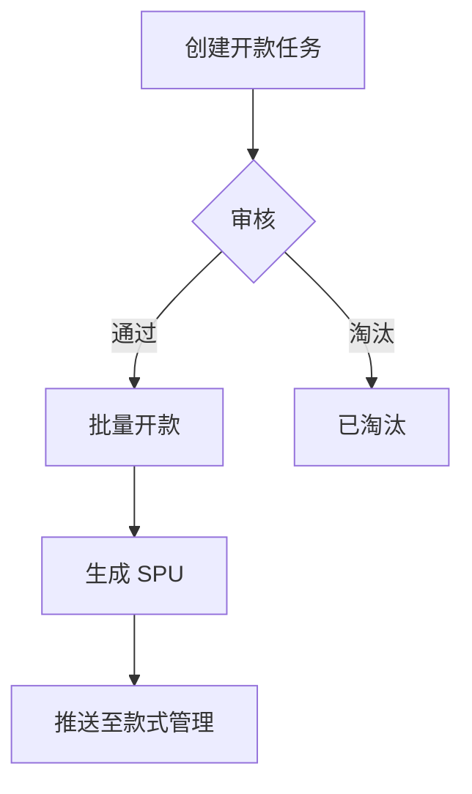

# 模块文档结构模板

## 撰写铁律

以下规则在每个模块文档中**必须遵守**，违反即为不合格：

1. **异常处理不独立成章**：异常处理是每个用例的一部分，必须嵌入到对应页面/用例下方的 `**异常处理**` 表格中，禁止出现独立的 `## 异常处理` 章节。
2. **不出现代码映射**：页面概述表格的列固定为 `页面名称 | 页面类型 | 入口/路径 | 交互形式 | 说明`。禁止出现 `路由名称`、`实际代码入口`、`HTML文件`、`Vue组件路径` 等技术实现列。
3. **业务流程前置**：核心业务流程（mermaid 流程图）放在 Ch1 模块概述中（对接关系之后），不作为独立的后置章节。
4. **更新记录就近标记**：每个页面/模块的变更记录直接写在该页面/模块下方，使用 `**更新记录**` 子章节。版本号统一使用 `(vX.Y.Z 变更类型)` 格式——英文括号、三段式语义化版本。
5. **版本号统一格式**：全文版本号必须为三段式 `vX.Y.Z`（如 `v2.6.0`），禁止 `v2.6` 等简写。在标题或字段旁标注变更来源时使用英文括号 `(v2.6.0 新增)`，禁止中文括号 `（v2.6.0新增）`。
6. **新增字段须完整定义**：数据模型中新增的字段，必须填写完整的属性约束：类型、必填/可选、默认值、长度/精度范围。参照 [数据模型](#5-数据模型) 的扩展列格式。
7. **这是需求规格说明书，不是技术设计**：只描述「系统要做什么」和「约束条件是什么」。不规定数据库选型、ORM 映射、索引策略、API 路径、前端框架、组件库等技术实现细节。
8. **依赖声明只写模块间依赖**：`depends_on` 的 `module` 值必须是其他模块的有效 `module_id`。外部系统（NEST 字典、SSO、Temu 平台、飞书等）放在 `related_features`，不放在 `depends_on`。每个依赖项用一个具体的 `use_case`，不混合多个无关场景。
9. **模块边界单一职责**：一个模块覆盖一个清晰的业务子域。新建或修改模块前，先检查是否有其他模块已覆盖相同内容。发现内容重叠时，应合并而非保留两份。模块文件名必须与 `module_id` 一致（如 `module_id: shop-management` → `shop-management.md`）。

---

## 设计原则

1. 数据从哪里来，到哪里去 —— 以数据流视角拆解模块功能
2. 按页面类型组织内容 —— 列表页、表单页、详情页各有不同的说明需求
3. 用例驱动 —— 以用例为主线，串联前置条件、业务规则、后置输出、异常处理
4. **只说做什么，不说怎么做** —— 描述功能逻辑和业务规则，不规定技术实现

> **边界**: 本文档描述业务需求和功能行为。数据库选型、接口协议、开发语言、框架组件等技术决策由开发团队在技术设计中给出，不写入本文档。

---

## 角色视角检验清单

每个模块文档完成时，从以下三个角色视角逐一检验：

### 前端工程师视角

| 需要知道 | 对应章节 |
|---------|---------|
| 有哪些页面，页面之间的跳转关系 | 2. 页面概述 |
| 每个页面需要哪些数据、触发哪些操作 | 相应页面的用例说明 |
| 页面在无数据/操作失败时显示什么 | 组件状态规范 |
| 表单字段何时校验、校验规则是什么 | 表单字段说明 |
| 字段之间的联动关系（A 选 X 时 B 出现/隐藏） | 字段联动规则 |
| 哪些操作需要二次确认 | 用例说明 |

### 后端工程师视角

| 需要知道 | 对应章节 |
|---------|---------|
| 本模块有哪些数据实体、各自的属性和约束 | 5. 数据模型 |
| 实体有哪些状态、状态之间如何流转 | 4. 状态机 |
| 每个操作需要什么输入、产生什么输出 | 接口契约（用例输入/输出） |
| 业务校验规则（唯一性、必填、长度/范围限制） | 表单字段说明 |
| 并发场景的业务要求（如：防止重复创建） | 用例的业务规则 |
| 数据删除策略（标记删除/物理删除） | 5. 数据模型 |
| 依赖哪些外部模块，对接失败时的业务降级策略 | Frontmatter 依赖声明 |

### 测试工程师视角

| 需要知道 | 对应章节 |
|---------|---------|
| 每个用例的验收标准 | 用例说明 |
| 谁可以做什么操作 | 3. 权限说明 |
| 边界条件（最大/最小长度、空值处理） | 字段规范 |
| 异常场景下系统如何响应 | 异常处理 |
| 修改一个模块影响哪些下游 | Frontmatter 依赖声明 |

---

## YAML Frontmatter 模板

```yaml
---
module_id: "module_key"              # 唯一标识，必须与文件名一致（如 shop-management → shop-management.md）
module_name: "模块名称"              # 面向人类的中文名称
version: "1.0.0"                    # 语义化版本
status: "draft"                     # draft | active | deprecated
owner: "_待填写_"                   # 产品负责人
last_updated: "YYYY-MM-DD"

# 依赖声明（本模块需要从哪些模块获取数据或服务）
# 重要：module 值必须是其他模块的有效 module_id，外部系统放 related_features
depends_on:
  - module: "dependency-module"
    type: "hard"                    # hard: 强依赖，对方不可用时本模块核心功能受阻
    use_case: "使用场景说明"        # 一个依赖项描述一个具体场景，不合并多个无关场景

# 被依赖声明（哪些下游模块依赖本模块的输出）
exposed_api:
  - module: "downstream-module"
    type: "hard"
    use_case: "下游使用场景说明"

# 关联的外部功能（非本模块核心，但需要协作的外部系统）
# NEST 字典、SSO、Temu 平台、飞书 等外部系统统一放这里
related_features:
  - "外部系统/功能描述"
---
```
---

## 正文结构

```
# 模块名称

## 1. 模块概述（含核心业务流程图）
## 2. 页面概述
## 3. 权限说明
## 4. 状态机（核心实体有生命周期时必填）
## 5. 数据模型（逻辑模型 + SQL 级字段约束）
## 6. [页面名称A]（含本页面的异常处理 + 更新记录）
## 7. [页面名称B]（含本页面的异常处理 + 更新记录）
...
```

> **章节规则**：
> - Ch1 必须包含核心业务流程图（mermaid），放在对接关系之后。
> - Ch2 页面概述**禁止包含代码映射列**（路由名称、组件路径、HTML 文件名等）。
> - Ch6+ 每个页面内部必须包含该页面专属的「异常处理」和「更新记录」。
> - 禁止出现独立的 `## 异常处理` / `## 业务流程` / `## API 概览` / `## 字典依赖` / `## 关键业务规则` 等章节——这些内容应分散到对应页面或模块级章节中。

---

## 1. 模块概述

简要说明模块职责、业务背景及对外对接关系。

```markdown
## 1. 模块概述

本模块负责[XX]相关功能。

**业务背景**：[为什么需要这个模块，解决什么业务问题]

**对接关系**：
| 对接系统 | 方向 | 数据/功能 | 说明 |
|---------|------|---------|------|
| PLM 系统 | 输出 | 款式数据 | 审核通过后同步至 PLM |
| Temu 平台 | 双向 | 商品上架、订单回传 | 对接 Temu Seller 平台 |

**核心业务流程**：



> 业务流程图放在 Ch1 对接关系之后，不独立成章。流程图应展示本模块的核心业务流转，不需要包含技术实现细节（如 API 调用、数据库操作等）。
```

---

## 2. 页面概述

列出本模块包含的所有页面，标注页面类型和交互形式。

> **禁止出现代码映射列**。以下列禁止出现在页面概述表格中：路由名称（route name）、实际代码入口（component path）、HTML 文件名、Vue 组件路径。

```markdown
## 2. 页面概述

| 页面名称 | 页面类型 | 入口/路径 | 交互形式 | 说明 |
|---------|---------|---------|---------|------|
| 款式列表 | 列表页 | 主菜单 → 款式管理 | 页面跳转 | 默认着陆页 |
| 新建SPU  | 表单页 | 款式列表 → 点击"新建SPU" | 弹窗 | |
| 款式详情 | 详情页 | 款式列表 → 点击款号 | 页面跳转 | 路径中含款式 ID |
```

---

## 3. 权限说明

统一描述模块的权限模型，避免在用例中重复声明。

```markdown
## 3. 权限说明

### 功能权限
仅说明需要特别逻辑处理的特殊角色，其余菜单权限通过RBAC系统配置，不在文档中单独说明

| 操作 | 特殊角色 | 备注 |
|------|---------|------|
| 查看列表 | 任意登录用户 | |
| 新建SPU | 设计师 | |
| 审核开款 | 审核员 | |
| 删除任务 | 创建人（仅本人） | 非创建人不可见删除按钮 |
| 导出数据 | 设计师、管理员 | |

### 数据权限

| 范围 | 规则 | 适用角色 |
|------|------|---------|
| 全部 | 同一租户下的所有数据 | 管理员 |
| 组内 | 当前用户所属设计组内的数据，不属于任何组时查询为空 | 设计师 |
| 我的 | 创建人 = 当前用户 | 设计师 |
```

---

## 4. 状态机

核心实体的生命周期。每个状态变更需要：触发动作 → 当前状态 → 目标状态。
使用mermaid输出

```markdown
## 4. 状态机

### [实体1]状态机图

（在此粘贴 mermaid 状态图）

### [实体1]状态说明

| 状态 | 可到达的状态 | 触发动作 | 备注 |
|------|------------|---------|------|
| 草稿 | 待审核 | 提交 | |
| 待审核 | 已通过、已驳回 | 审核（通过/驳回） | 驳回必须填写原因 |
| 已通过 | 已上架 | 推送上架 | |
| 已驳回 | 待审核 | 重新提交 | |
| 已上架 | 已下架 | 下架 | |
| 已下架 | 已上架 | 重新上架 | |
```

---

## 5. 数据模型

描述业务数据的逻辑结构：有哪些实体、各自的属性、属性的业务含义和约束。

> **新增字段必须填写完整约束**：类型、必填/可选、默认值、长度/精度范围、字段备注。以下列是数据模型表的**必填列**，不可省略。

使用mermaid输出实体关系图。

```markdown
## 5. 数据模型

### 5.1 实体关系

（在此粘贴 mermaid 实体关系图）

### 5.2 实体说明

#### SPU（标准产品单元）

| 属性 | 类型 | 必填 | 默认值 | 长度/范围 | 说明 |
|------|------|------|--------|----------|------|
| 款号 | 短文本 | 是 | 自动生成 | ≤32字符 | 唯一，规则: SPU + YYMMDD + 4位流水号 |
| 租户 | 引用 | 是 | 当前租户 | — | 所属租户 |
| 品类 | 引用 | 是 | — | — | 关联品类字典 |
| 状态 | 枚举 | 是 | 草稿 | — | 草稿/待审核/已通过/已驳回/已上架/已下架 |
| 设计师 | 引用 | 否 | — | — | 负责人 |
| 面料池使用范围 | 枚举 | 否 | — | — | (v2.4.1 新增) 可选值见 NEST 字典 fabric_pool_scope |
| 创建时间 | 日期时间 | 自动 | NOW() | — | |
| 更新时间 | 日期时间 | 自动 | NOW() | — | ON UPDATE |
| 是否删除 | 布尔 | 自动 | false | — | 标记删除 |

#### SKC（款式颜色规格）

| 属性 | 类型 | 必填 | 默认值 | 长度/范围 | 说明 |
|------|------|------|--------|----------|------|
| 款号 | 短文本 | 是 | 自动生成 | ≤32字符 | 唯一，规则: SPU款号 + 2位颜色序号 |
| 所属SPU | 引用 | 是 | — | — | 关联 SPU |
| 颜色 | 短文本 | 是 | — | ≤20字符 | |
| 波段 | 引用 | 否 | — | — | (v2.4.1 变更) SKC维度，取自 NEST 字典 plm_clothing_band |
| 图片 | 文件引用 | 否 | — | ≤5MB, jpg/png | 支持多张 |

> **"类型"列说明**: 只描述数据的业务形态，不绑定具体技术类型。但必须注明长度/范围约束以便开发实现。
> - `短文本`: 单行文本，注明最大字符数
> - `长文本`: 多行文本，注明最大字符数（如 ≤500字符）
> - `数字`: 整数/小数，标注范围和精度
> - `枚举`: 有限个可选值，**必须列出所有取值**
> - `日期`: 年月日
> - `日期时间`: 年月日时分秒
> - `布尔`: 是/否
> - `文件引用`: 文件的存储地址，注明格式和大小限制
> - `引用`: 关联其他实体，注明关联目标
> - `金额`: 带币种的数值，注明精度（如 DECIMAL(10,2)）

> **新增字段标注规范**：在「说明」列中用英文括号标注 `(vX.Y.Z 新增)` 或 `(vX.Y.Z 变更)`，与字段描述用空格分隔。
```

---

## 6. 列表页模板

结构: 页面说明 → 查询条件 → 显示字段 → 行操作/批量操作 → 组件状态 → 用例

### 6.1 页面说明

```markdown
### [页面名称]

#### 页面说明

**入口**: 主菜单 → 款式管理 → 款式列表

**权限**: 见 [3. 权限说明](#3-权限说明)，本页面权限码 `style:read`

**数据范围**:
  - 全部：同一租户下的所有数据
  - 组内：当前用户所属设计组内的数据
  - 我的：创建人 = 当前用户

**列表行为**:
  - 数据来源：当前租户内所有用户创建的款式数据
  - 默认排序：创建时间降序
  - 分页：默认 20 条/页，可选 20/50/100
  - 刷新方式：手动刷新
```

### 6.2 查询条件

```markdown
#### 查询条件

| 条件名称 | 输入方式 | 说明 | 联动规则 | 更新说明 |
|---------|---------|------|---------|---------|
| 关键字 | 文本输入 | 模糊搜索，支持批量（空格或逗号分隔） | — | |
| 品类 | 级联选择 | 取值来源：NEST字典 clothing_category，支持多选 | — | |
| 设计师 | 搜索选择 | 取值来源：设计组别-设计师 | 先选"设计组"后可搜索 | |
| 创建时间 | 日期范围选择 | 最大跨度 90 天，默认最近 7 天 | — | |
| 状态 | 多选 | 可选项见 [状态机](#4-状态机) | — | |
```

**输入方式可选值**: `文本输入` | `数字输入` | `单选` | `多选` | `级联选择` | `搜索选择` | `日期选择` | `日期范围选择` | `开关`

### 6.3 显示字段

```markdown
#### 显示字段

| 字段名称 | 显示为 | 数据含义 | 说明 | 更新说明 |
|---------|--------|---------|------|---------|
| SPU款号 | 可点击文本 | SPU 唯一标识 | 点击跳转详情页 | |
| 品类名称 | 标签 | 末级品类 | | |
| 设计图片 | 缩略图 | 首张设计图 | 宽高比 1:1，点击查看大图 | |
| 设计师 | 文本 | 负责人姓名 | | |
| 状态 | 状态标签 | SPU 生命周期状态 | 不同状态不同颜色 | |
| 创建时间 | 格式化文本 | 创建日期时间 | 格式 YYYY-MM-DD HH:mm | |
```

**显示类型可选值**: `文本` | `可点击文本` | `格式化文本` | `标签` | `状态标签` | `缩略图` | `可点击图片` | `进度条` | `操作按钮` | `多值列表`

### 6.4 行操作 & 批量操作

```markdown
#### 行操作

| 操作 | 出现条件 | 需要的角色 | 交互形式 | 说明 |
|------|---------|-----------|---------|------|
| 编辑 | 状态=草稿/已驳回 | 设计师 | 弹窗 | 打开编辑表单 |
| 提交审核 | 状态=草稿/已驳回 | 设计师 | 二次确认弹窗 | 确认后状态变为待审核 |
| 删除 | 状态=草稿，且为创建人 | 设计师 | 二次确认弹窗 | 标记删除 |

#### 批量操作

| 操作 | 可选条件 | 最少选中 | 需要的角色 | 说明 |
|------|---------|---------|-----------|------|
| 批量提交 | 所选均为草稿/已驳回 | 1 条 | 设计师 | 批量变更为待审核 |
| 批量导出 | 查询结果 ≤ 1000 条 | 不限 | 设计师、管理员 | 导出查询结果全部数据 |
```

### 6.5 用例说明

```markdown
#### 用例

##### 用例1: 新建SPU
  - **前置条件**：1）用户需具备"新建SPU"权限；2）当前用户角色为设计师
  - **输入**：点击"新建SPU"按钮
  - **业务规则**：
    - 打开【新建SPU】弹窗
    - SPU 款号生成规则：SPU + YYMMDD + 4位流水号
  - **后置输出**：创建成功后 → 关闭弹窗，刷新列表，新记录高亮 3 秒
  - **验收标准**：
    - [ ] 无权限用户看不到"新建SPU"按钮
    - [ ] 点击按钮弹出新建表单
    - [ ] SPU 款号按规则自动生成
    - [ ] 必填项未填时不允许提交，标红提示
  - **异常处理**：

| 异常场景 | 用户看到的表现 |
|---------|-------------|
| 必填项为空 | 对应字段标红，聚焦第一个错误字段，提示具体缺失项 |
| SPU 款号重复 | 提示"款号已存在，请修改" |
| 网络超时 | 提示"操作超时，请重试"，保留已填内容 |

  - **更新记录**

| 关联版本 | 更新内容 | 具体说明 |
|------|------|------|
| v2.6.0 | 款号自动生成 | 规则: SPU + YYMMDD + 4位流水号 |
| v2.4.1 | 项目类型字段 | (v2.4.1 变更) 从SPU维度拆分到SKC维度 |

> **更新记录格式规范**：
> - 版本号统一使用三段式 `vX.Y.Z`（禁止 `v2.6` 简写）
> - 在表格内跨模块引用时用英文括号 `(vX.Y.Z 新增/变更)` 标注变更来源
> - 更新记录就近放置：页面级变更放在对应页面下，模块级变更放在模块末尾
> - 如果同一个页面/表单有多个字段来自不同版本，每条一行，按时间倒序

```

---

## 7. 表单页模板

结构: 显示字段(只读) → 表单字段(可编辑) → 字段联动规则 → 用例 → 提交说明

### 7.1 表单字段说明

```markdown
#### 表单字段

| 字段名称 | 输入方式 | 必填 | 校验规则 | 默认值 | 说明 | 更新说明 |
|---------|---------|------|---------|--------|------|---------|
| 品类 | 级联选择 | 是 | — | — | 取值来源：NEST字典 clothing_category | |
| 款号 | 文本输入 | 是 | 长度 8-32，仅允许字母数字下划线 | 自动生成 | 自动生成，可手动修改 | |
| 设计师 | 搜索选择 | 是 | — | — | 取值来源：设计组别-设计师 | |
| 备注 | 多行文本 | 否 | 最大 200 字符 | — | | |
| 图片 | 图片上传 | 是 | jpg/png，单张 ≤ 5MB，最多 10 张 | — | 支持拖拽 | |
```

**输入方式可选值**: `文本输入` | `多行文本` | `数字输入` | `单选` | `多选` | `级联选择` | `搜索选择` | `日期选择` | `日期时间选择` | `图片上传` | `文件上传` | `开关` | `评分`

### 7.2 字段联动规则

描述字段之间的条件依赖关系。

```markdown
#### 字段联动规则

| 触发字段 | 当值为 | 目标字段 | 行为 | 说明 |
|---------|--------|---------|------|------|
| 供给方式 | 现货 | 供应商、供应商款号 | 显示 + 变为必填 | |
| 供给方式 | 生产 | 供应商、供应商款号 | 隐藏 + 清除已填值 | |
| 店铺 | VC | 价格 | 显示 + 变为必填 | VC 店铺需核价 |
| 款式类型 | 组合商品 | SKC 选择区 | 显示 | 组合商品从已有 SKC 中选取 |
```

### 7.3 提交说明

```markdown
#### 提交说明

**提交时校验**:
1. 所有必填项非空
2. SPU 款号不可与已有款号重复
3. 至少关联 1 个 SKC
4. 图片至少上传 1 张

**防重复提交**:
  - 提交过程中按钮不可再次点击
  - 同一请求内容在短时间内（如 5 分钟）重复提交视为同一次操作

**成功后数据变更**:
  - 生成 1 条 SPU 记录（状态 = 草稿）
  - 生成 N 条关联 SKC 记录
  - 上传图片关联到对应 SPU

**后置交互**:
  - 成功：关闭弹窗 → 提示"创建成功" → 刷新列表 → 新记录短暂高亮
  - 失败：保留用户已填内容 → 错误信息显示在表单顶部
```

---

## 8. 详情页模板

结构: 页面布局 → 信息区块 → 操作按钮 → 用例

```markdown
### [页面名称]

#### 页面说明

**入口**: [从哪里进入此页面]
**路径参数**: [如: 款式 ID]

#### 信息区块

| 区块 | 包含内容 | 说明 |
|------|---------|------|
| 基本信息 | SPU款号、品类、创建时间、设计师 | |
| 图片区 | 设计图、效果图 | 支持切换查看、放大 |
| SKC 列表 | 颜色、尺码、库存 | 表格形式，支持展开查看明细 |
| 操作日志 | 操作人、操作内容、操作时间 | 时间倒序 |

#### 操作按钮

| 操作 | 出现条件 | 需要的角色 | 说明 |
|------|---------|-----------|------|
| 编辑 | 状态=草稿/已驳回 | 设计师 | 跳转编辑表单 |
| 提交审核 | 状态=草稿/已驳回 | 设计师 | 二次确认后提交 |

#### 用例

##### 用例1: 查看详情
  - **前置条件**：用户具备查看权限
  - **输入**：在列表页点击 SPU 款号
  - **业务规则**：加载 SPU 详情及关联 SKC 数据
  - **后置输出**：展示详情页各信息区块
  - **验收标准**：
    - [ ] 各区块数据正确展示
    - [ ] 图片可切换、放大查看
    - [ ] SKC 列表可展开查看明细
  - **异常处理**：
  
  | 异常场景 | 用户看到的表现 |
  |---------|-------------|
  | 数据不存在 | 展示"数据不存在"提示，提供返回列表入口 |
  | 无权限 | 展示"暂无访问权限"提示 |
  | 数据加载超时 | 各区块独立加载，失败的区块显示重试按钮 |
```

---

## 9. 文档完整性检查清单

每个模块文档交付前逐项确认：

### 模块级
- [ ] 模块概述包含业务背景
- [ ] 依赖声明标注了降级方案
- [ ] 状态机覆盖核心实体（如有生命周期）
- [ ] 数据模型包含实体属性和业务约束
- [ ] 没有"待填写"的占位符

### 列表页
- [ ] 入口清晰（从哪个菜单/页面进入）
- [ ] 查询条件含输入方式和联动规则
- [ ] 显示字段含显示类型和数据含义
- [ ] 行操作含出现条件和所需角色
- [ ] 批量操作含可选条件和最少选中数
- [ ] 各状态（加载中/空数据/加载失败/无权限）的展示已描述
- [ ] 每个用例有验收标准 checklist

### 表单页
- [ ] 表单字段含输入方式、校验规则、默认值
- [ ] 字段联动规则已列出
- [ ] 提交说明含校验规则和防重复提交要求
- [ ] 提交成功和失败的后置行为已明确

### 详情页
- [ ] 信息区块划分清晰
- [ ] 操作按钮含出现条件和所需角色

### 通用
- [ ] 所有枚举值有确定来源（字典/数据表/硬编码）
- [ ] 所有"必填"字段有对应校验规则
- [ ] 所有状态流转有明确的触发条件和结果
- [ ] 删除策略（标记删除/物理删除）已标注
- [ ] 所有字段联动规则的目标状态（显示/隐藏/必填/清除）已完整定义

### 撰写铁律检查
- [ ] 无独立的 `## 异常处理` 章节（异常处理嵌入各页面/用例下）
- [ ] 无独立的 `## 业务流程` 章节（业务流程在 Ch1 模块概述中）
- [ ] 无独立的 `## API 概览` / `## 字典依赖` / `## 关键业务规则` 章节
- [ ] 页面概述表格无代码映射列（路由名称、组件路径、HTML 文件名）
- [ ] 版本号全部为三段式 `vX.Y.Z`，无 `vX.Y` 简写
- [ ] 变更标注使用英文括号 `(vX.Y.Z 新增/变更)`
- [ ] 数据模型表包含完整列（属性/类型/必填/默认值/长度范围/说明）
- [ ] 新增字段的说明列标注了 `(vX.Y.Z 新增)` 来源
- [ ] 无技术实现细节（数据库选型、ORM 映射、索引策略、API 路径、前端框架）

### 跨模块依赖检查（模块合并/拆分/重命名时必做）
- [ ] 文件名与 `module_id` 一致
- [ ] `depends_on` 中所有 `module` 值均为有效 module_id（grep 可查到对应文件）
- [ ] 无外部系统（NEST、SSO、Temu、飞书等）出现在 `depends_on` 中
- [ ] 所有活跃模块的 `depends_on` / `exposed_api` 引用已同步更新
- [ ] 无悬空引用（指向已删除模块的 module_id）
