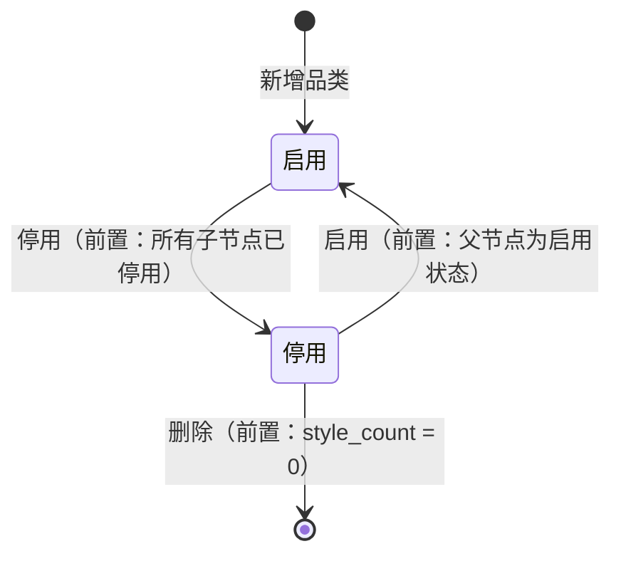
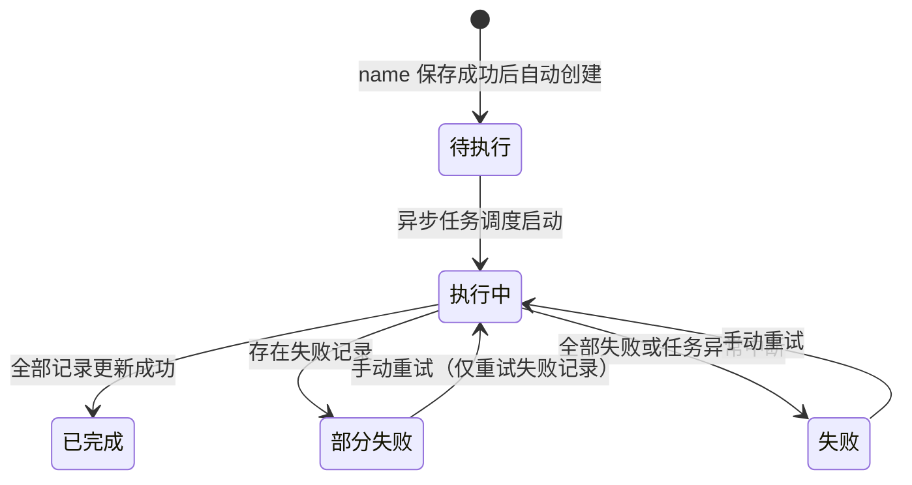

# 规划文档：款式品类管理

| 属性 | 内容 |
|------|------|
| 规划文档编号 | REV-20260521-001 |
| 关联版本 | v2.6.1 |
| 需求提出方 | 商品开发组 |
| 规划人 | 林廷威 |
| 规划日期 | 2026-05-21 |
| 状态 | 规划中 |

---

## 1. 需求背景

### 1.1 问题描述

当前 SDP 系统中，款式品类数据来源于 NEST 字典（`clothing_category`），存在以下问题：

1. **品类体系不受控**：NEST 字典由外部维护，SDP 内部无法自主管理品类的增删改、停用、排序，无法应对业务需要的快速调整
2. **平台品类对接缺失**：内部品类与 Temu 等平台品类没有正式的映射关系维护，依赖人工对应，易出错
3. **品类 name 变更无法联动**：NEST 字典更新后，历史款式数据中的品类名称无法自动同步，造成数据不一致
4. **缺少删除保护和层级约束**：任意级别品类均可被款式引用，无法保证数据颗粒度一致；品类在有关联款式时也未做保护

### 1.2 需求清单

| 序号 | 需求描述 | 需求类型 | 优先级 |
|------|---------|---------|--------|
| 1 | 内部品类 CRUD，多级树状结构，支持排序号配置 | 新增模块 | P0 |
| 2 | 仅叶子节点可被款式/现货/开款任务引用，中间层级仅作目录 | 新增模块 | P0 |
| 3 | 品类停用/启用；无关联数据且已停用才可删除 | 新增模块 | P0 |
| 4 | 平台品类映射配置：一个内部品类对应多个平台，每平台一条映射，预留多平台扩展 | 新增功能 | P0 |
| 5 | 品类 name 变更后，异步批量更新所有依赖方的冗余 name 和 path_names 字段 | 新增功能 | P0 |
| 6 | 批量更新任务进度追踪页面，含失败重试 | 新增功能 | P0 |
| 7 | 品类变更日志：记录 name 历史变更 | 新增功能 | P1 |
| 8 | 款式管理品类来源切换（NEST 字典 → 内部品类管理模块） | 功能优化 | P0 |
| 9 | 现货管理品类来源切换 | 功能优化 | P0 |
| 10 | 开款任务管理品类来源切换 | 功能优化 | P0 |
| 11 | 组合商品品类来源切换（同款式管理） | 功能优化 | P0 |

### 1.3 版本说明

v2.6.1，基于 v2.6.0 商品开发迭代之后的独立品类体系建设。本版本不涉及品类重分类（变更 category_code），仅处理 name 变更的联动同步。

---

## 2. 影响分析

### 2.1 受影响模块

| 模块 | 当前版本 | 影响类型 | 影响说明 |
|------|---------|---------|---------|
| 品类管理 (category-management) | — | 新增模块 | 全新模块，内部品类树 + 平台映射 + 批量更新任务 |
| 款式管理 (style-management) | v2.6.0 | 直接 | 品类选择器来源切换；SPU 新增 category_path 字段；接收 name 批量更新 |
| 现货管理 (spot-goods) | v2.6.0 | 直接 | SPU 品类来源切换；新增 category_path 字段；接收 name 批量更新 |
| 开款任务管理 (design-task) | v2.6.0 | 直接 | 开款表单品类选择器来源切换；接收 name 批量更新 |
| 组合商品 (combo-goods) | — | 直接 | 品类来源切换（同款式管理）；新增 category_path；接收 name 批量更新 |
| AI品类映射 (ai-category) | — | 间接 | 接收品类 name/path 批量更新 |

### 2.2 依赖传播链

```
品类管理 (category-management)  ← 新增模块
  │
  ├─ hard → 款式管理 (style-management)
  │           品类选择器来源 + category_path 字段
  │           name 变更 → CategoryUpdateJob → 批量更新 SPU.category_name / category_path
  │
  ├─ hard → 现货管理 (spot-goods)
  │           同上，SPU 维度
  │
  ├─ hard → 开款任务管理 (design-task)
  │           开款表单品类来源 + name 同步
  │
  ├─ soft → 组合商品 (combo-goods)
  │           同款式管理，来源切换 + name 同步
  │
  └─ soft → AI品类映射 (ai-category)
              接收 name/path 同步
```

### 2.3 冲突分析

| 冲突点 | 涉及模块 | 说明 | 解决方案 |
|--------|---------|------|---------|
| 历史数据 category_code 来自 NEST 字典，切换后需与内部品类 code 对齐 | style-management, spot-goods, design-task, combo-goods | 存量 SPU/开款任务数据的品类 code 须迁移映射至内部品类体系 | 本规划文档标注「需数据迁移」，迁移脚本作为上线前置条件，不在功能规格范围内 |
| 组合商品、AI品类映射无现有模块文档 | category-management | 批量更新的接收方式（API/MQ）需与对应团队对齐 | category-management exposed_api 声明接口契约，各方自行对接 |

---

## 3. 模块变更详情

### 3.1 模块：款式管理 (style-management)  v2.6.0 → v2.6.1

#### 变更概述

品类字段来源从 NEST 字典切换为内部品类管理模块；SPU 新增 `category_path` 全路径冗余字段；`category_name` 和 `category_path` 由 CategoryUpdateJob 异步维护。

#### 页面变更

| 页面名称 | 变更类型 | 具体变更 | 变更原因 |
|---------|---------|---------|---------|
| 款式列表 | 修改 | 品类筛选器来源改为内部品类树，仅展示启用节点，支持多级级联选择 | 品类来源切换 |
| 创建/编辑 SPU | 修改 | 品类字段改为内部品类树选择器，仅叶子节点可选；回显格式改为全路径（如「女装/上装/T恤」） | 品类来源切换 |

#### 数据模型变更

| 实体 | 变更类型 | 变更内容 | 说明 |
|------|---------|---------|------|
| SPU (design_style) | 修改属性 | category_code: 来源从 NEST 字典 `clothing_category` 改为 `category-management` 叶子节点 code | 品类来源切换 |
| SPU (design_style) | 修改属性 | category_name: 仍冗余存储，由 CategoryUpdateJob 异步更新 | |
| SPU (design_style) | 新增属性 | category_path: 短文本, 可选, ≤200字符, 完整品类路径如「女装/上装/T恤」；由 CategoryUpdateJob 异步维护 (v2.6.1 新增) | |

#### 状态机变更

无

#### 依赖变更

| 变更类型 | 目标模块 | 类型 | 说明 |
|---------|---------|------|------|
| 新增依赖 | category-management | hard | 品类选择器数据来源；接收 name/path 批量更新 |

---

### 3.2 模块：现货管理 (spot-goods)  v2.6.0 → v2.6.1

#### 变更概述

SPU 品类字段来源切换；新增 `category_path` 字段及列表显示；由 CategoryUpdateJob 异步维护品类名称。

#### 页面变更

| 页面名称 | 变更类型 | 具体变更 | 变更原因 |
|---------|---------|---------|---------|
| 现货管理-列表 | 修改 | 品类筛选器来源改为内部品类树；列表品类列展示全路径 | 品类来源切换 |
| 创建/编辑款式-SPU信息 | 修改 | 品类字段改为内部品类树级联选择器（仅叶子节点可选）；回显展示全路径 | 品类来源切换 |

#### 数据模型变更

| 实体 | 变更类型 | 变更内容 | 说明 |
|------|---------|---------|------|
| SPU | 修改属性 | 品类: 来源从 NEST 字典改为 category-management 叶子节点 | |
| SPU | 新增属性 | category_path: 短文本, 可选, ≤200字符, 全路径冗余 (v2.6.1 新增) | |

#### 状态机变更

无

#### 依赖变更

| 变更类型 | 目标模块 | 类型 | 说明 |
|---------|---------|------|------|
| 新增依赖 | category-management | hard | SPU 品类选择器数据来源；接收 name/path 批量更新 |

---

### 3.3 模块：开款任务管理 (design-task)  v2.6.0 → v2.6.1

#### 变更概述

开款表单及批量开款中品类选择器来源切换为内部品类模块；新增 `category_path` 字段；接收 name 批量更新。

#### 页面变更

| 页面名称 | 变更类型 | 具体变更 | 变更原因 |
|---------|---------|---------|---------|
| 创建开款任务 | 修改 | 品类字段选择器改为内部品类树（仅叶子节点可选），回显全路径 | 品类来源切换 |
| 批量开款 | 修改 | 同创建开款任务，品类选择器来源切换 | 品类来源切换 |

#### 数据模型变更

| 实体 | 变更类型 | 变更内容 | 说明 |
|------|---------|---------|------|
| 开款任务 | 修改属性 | 品类字段: 来源从 NEST 字典改为 category-management 叶子节点 | |
| 开款任务 | 新增属性 | category_path: 短文本, 可选, ≤200字符, 全路径冗余 (v2.6.1 新增) | |

#### 状态机变更

无

#### 依赖变更

| 变更类型 | 目标模块 | 类型 | 说明 |
|---------|---------|------|------|
| 新增依赖 | category-management | hard | 开款品类选择器数据来源；接收 name/path 批量更新 |

---

### 3.4 模块：组合商品 (combo-goods)  — → v2.6.1

#### 变更概述

品类字段来源切换与款式管理相同；新增 category_path 字段；接收 CategoryUpdateJob 的 name/path 同步。（当前无现有模块文档，此处仅描述变更要求。）

#### 页面变更

| 页面名称 | 变更类型 | 具体变更 | 变更原因 |
|---------|---------|---------|---------|
| 组合商品列表 | 修改 | 品类筛选器来源改为内部品类树；列表品类列展示全路径 | 品类来源切换 |
| 创建/编辑组合商品 | 修改 | 品类字段改为内部品类树选择器（仅叶子节点可选）；回显全路径 | 品类来源切换 |

#### 数据模型变更

| 实体 | 变更类型 | 变更内容 | 说明 |
|------|---------|---------|------|
| 组合商品 | 修改属性 | 品类字段: 来源从 NEST 字典改为 category-management 叶子节点 | |
| 组合商品 | 新增属性 | category_path: 短文本, 可选, ≤200字符, 全路径冗余 (v2.6.1 新增) | |

#### 状态机变更

无

#### 依赖变更

| 变更类型 | 目标模块 | 类型 | 说明 |
|---------|---------|------|------|
| 新增依赖 | category-management | soft | 品类选择器数据来源；接收 name/path 批量更新 |

---

## 4. 新增模块定义

### 4.1 模块：品类管理 (category-management)

#### 模块概述

负责 SDP 系统内部品类体系的全生命周期管理，是款式/现货/开款任务等模块的品类数据来源。包含三个子域：

- **内部品类管理**：维护多级树状品类结构，支持 CRUD、停用/启用、排序号配置；code 创建后不可修改
- **平台品类映射**：维护内部品类与各平台品类的映射关系，一个内部品类对应多个平台，每平台一条映射
- **批量更新任务**：内部品类 name 变更后，异步触发所有依赖方的 name/path 冗余字段更新，并追踪任务进度

#### 对接关系

| 对接系统 | 方向 | 数据/功能 | 说明 |
|---------|------|---------|------|
| NEST 字典 | — | — | 不再依赖 NEST clothing_category，改为自维护 |
| 款式管理 | 输出 | 叶子节点品类列表；name/path 批量更新 | 品类选择器数据来源 |
| 现货管理 | 输出 | 叶子节点品类列表；name/path 批量更新 | |
| 开款任务管理 | 输出 | 叶子节点品类列表；name/path 批量更新 | |
| 组合商品 | 输出 | 叶子节点品类列表；name/path 批量更新 | |
| AI品类映射 | 输出 | name/path 批量更新 | |

#### 依赖声明

```yaml
depends_on: []
exposed_api:
  - module: style-management
    type: hard
    use_case: 款式创建/编辑时提供叶子节点品类选择器；name变更时发起 CategoryUpdateJob 推送更新
  - module: spot-goods
    type: hard
    use_case: SPU创建/编辑时提供叶子节点品类选择器；接收 name/path 批量更新
  - module: design-task
    type: hard
    use_case: 开款表单提供叶子节点品类选择器；接收 name/path 批量更新
  - module: combo-goods
    type: soft
    use_case: 组合商品品类选择器；接收 name/path 批量更新
  - module: ai-category
    type: soft
    use_case: 接收品类 name/path 批量更新
```

#### 页面概述

| 页面名称 | 页面类型 | 入口/路径 | 交互形式 | 说明 |
|---------|---------|---------|---------|------|
| 内部品类管理 | 树形列表页 | 基础配置 → 品类管理 → 内部品类 | 页面跳转 | 多级树形结构，含 CRUD、停用/启用、排序 |
| 新增/编辑品类 | 表单页 | 内部品类管理 → 新增/编辑 | 弹窗 | code（新增时填写，编辑时只读）、name、排序号 |
| 平台品类映射 | 列表页 | 基础配置 → 品类管理 → 平台映射 | 页面跳转 | 展示内部品类与各平台的映射状态，可按平台筛选 |
| 编辑平台品类映射 | 表单页 | 平台品类映射列表 → 编辑 | 弹窗 | 选择平台、填写平台品类 ID 和名称 |
| 批量更新任务列表 | 列表页 | 基础配置 → 品类管理 → 更新任务 | 页面跳转 | 追踪 name 变更触发的异步任务进度，支持失败重试 |

#### 数据模型

**InternalCategory（内部品类）**

| 属性 | 类型 | 必填 | 默认值 | 长度/范围 | 说明 |
|------|------|------|--------|----------|------|
| category_id | 长整型 | 自动 | — | 雪花ID | 主键 |
| code | 短文本 | 是 | — | ≤32字符, 全局唯一 | 创建后不可修改；用于下游冗余存储和跨系统对接 |
| name | 短文本 | 是 | — | ≤50字符 | 可修改；实际变更后自动触发 CategoryUpdateJob |
| parent_id | 引用 | 否 | null | — | 父品类ID；null 表示根节点 |
| level | 整数 | 自动 | — | ≥1 | 层级深度，根节点为1，自动计算 |
| path_codes | 短文本 | 自动 | — | ≤200字符 | 完整 code 路径，如 `001/001001/001001001` |
| path_names | 短文本 | 自动 | — | ≤200字符 | 完整 name 路径，如 `女装/上装/T恤`；name 变更时自动更新本字段及所有后代 |
| is_leaf | 布尔 | 自动 | true | — | 无子节点时为 true；新增子节点时自动变为 false |
| sort_order | 整数 | 否 | 0 | 0-9999 | 同级排序权重，数字越小越靠前 |
| status | 枚举 | 是 | 启用 | 启用/停用 | 停用后不出现在下游选择器中；历史数据保留 |
| style_count | 整数 | 自动 | 0 | ≥0 | 关联款式数量（汇总自 style-management、spot-goods 等），用于删除保护 |
| created_by / updated_by | 引用 | 自动 | — | — | |
| created_at / updated_at | 日期时间 | 自动 | — | — | |

**PlatformCategoryMapping（平台品类映射）**

| 属性 | 类型 | 必填 | 默认值 | 长度/范围 | 说明 |
|------|------|------|--------|----------|------|
| mapping_id | 长整型 | 自动 | — | 雪花ID | |
| internal_category_id | 引用 | 是 | — | — | 关联内部品类 |
| platform | 枚举 | 是 | — | TEMU / … | 平台标识，预留多平台扩展 |
| platform_category_id | 短文本 | 是 | — | ≤64字符 | 平台侧品类 ID |
| platform_category_name | 短文本 | 是 | — | ≤100字符 | 平台侧品类名称（冗余，便于展示） |
| created_by / updated_by | 引用 | 自动 | — | — | |
| created_at / updated_at | 日期时间 | 自动 | — | — | |

> 唯一约束：`(internal_category_id, platform)` 组合唯一，同一平台只能配置一条映射。

**CategoryUpdateJob（品类批量更新任务）**

| 属性 | 类型 | 必填 | 默认值 | 长度/范围 | 说明 |
|------|------|------|--------|----------|------|
| job_id | 长整型 | 自动 | — | 雪花ID | |
| trigger_category_id | 引用 | 是 | — | — | 触发变更的品类 |
| trigger_category_code | 短文本 | 是 | — | ≤32字符 | 快照，保留触发时的 code |
| old_name | 短文本 | 是 | — | ≤50字符 | 变更前 name |
| new_name | 短文本 | 是 | — | ≤50字符 | 变更后 name |
| old_path_names | 短文本 | 是 | — | ≤200字符 | 变更前全路径 |
| new_path_names | 短文本 | 是 | — | ≤200字符 | 变更后全路径 |
| target_modules | JSON | 是 | — | — | 受影响模块列表，如 `["style-management","spot-goods","design-task","combo-goods","ai-category"]` |
| status | 枚举 | 自动 | 待执行 | 待执行/执行中/已完成/部分失败/失败 | |
| total_count | 整数 | 自动 | 0 | ≥0 | 需更新的记录总数（跨所有目标模块汇总） |
| success_count | 整数 | 自动 | 0 | ≥0 | 已成功更新数 |
| failed_count | 整数 | 自动 | 0 | ≥0 | 失败数 |
| created_by | 引用 | 自动 | — | — | 触发变更的操作人 |
| created_at | 日期时间 | 自动 | — | — | |
| started_at | 日期时间 | 自动 | — | — | 异步任务实际启动时间 |
| completed_at | 日期时间 | 自动 | — | — | 任务完成时间 |

#### 状态机

**品类状态**



**CategoryUpdateJob 状态**



#### 核心业务规则

| 规则 | 说明 |
|------|------|
| 仅叶子节点可被引用 | `is_leaf = true` 的品类才出现在款式/现货/开款的品类选择器中；中间节点仅作目录展示 |
| code 不可修改 | 创建后 code 字段在编辑弹窗中为只读（disabled）；禁止通过任何入口修改 |
| 删除条件 | `status = 停用` 且 `style_count = 0` 时才允许删除；否则给出明确提示 |
| 停用级联约束 | 停用父节点前须先停用所有子节点；启用子节点前须父节点为启用状态 |
| name 变更触发更新 | 保存编辑时比对 name 是否实际变化；变化则：① 更新本节点及所有后代的 path_names ② 自动创建 CategoryUpdateJob，异步更新各依赖方的冗余字段 |
| 批量更新幂等 | 同一品类同时只允许存在一个「待执行/执行中」状态的 Job；若已存在则提示等待上一个任务完成 |

---

## 5. 执行记录

| 日期 | 操作 | 操作人 | 结果 |
|------|------|--------|------|
| 2026-05-21 | 创建规划文档 | 林廷威 | — |

---

## 6. 变更汇总

| 模块 | 变更前版本 | 变更后版本 | 变更类型 | 状态 |
|------|----------|----------|---------|------|
| 品类管理 (category-management) | — | v2.6.1 | 新增模块 | pending |
| 款式管理 (style-management) | v2.6.0 | v2.6.1 | 功能优化 | pending |
| 现货管理 (spot-goods) | v2.6.0 | v2.6.1 | 功能优化 | pending |
| 开款任务管理 (design-task) | v2.6.0 | v2.6.1 | 功能优化 | pending |
| 组合商品 (combo-goods) | — | v2.6.1 | 功能优化 | pending |

---

## 附：相关文档索引

| 文档 | 路径 | 说明 |
|------|------|------|
| 通用设计语言规范 | build-prd.skill/references/通用设计语言规范.md | 字段类型、页面类型标准 |
| 文档结构模板 | build-prd.skill/references/文档结构.md | 模块文档结构模板 |
| 规划文档 v2.6.0 | revisions/规划文档_v2.6.0_SDP商品开发迭代.md | 前序版本规划文档 |