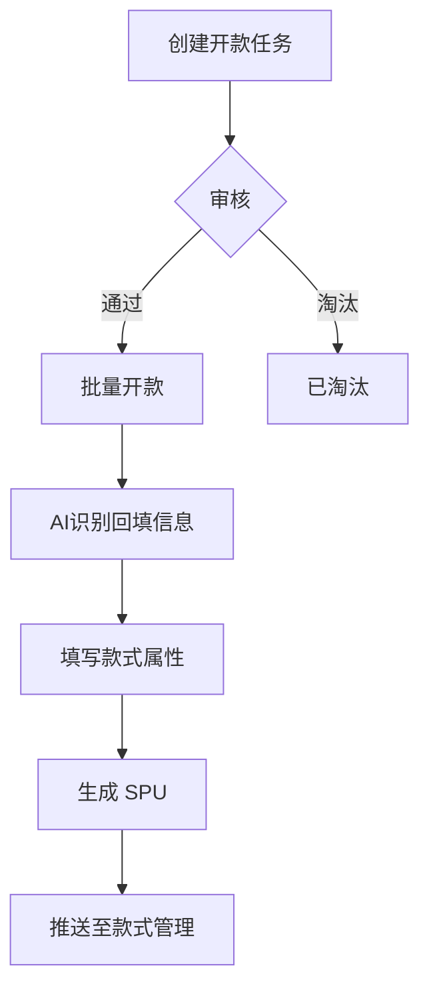
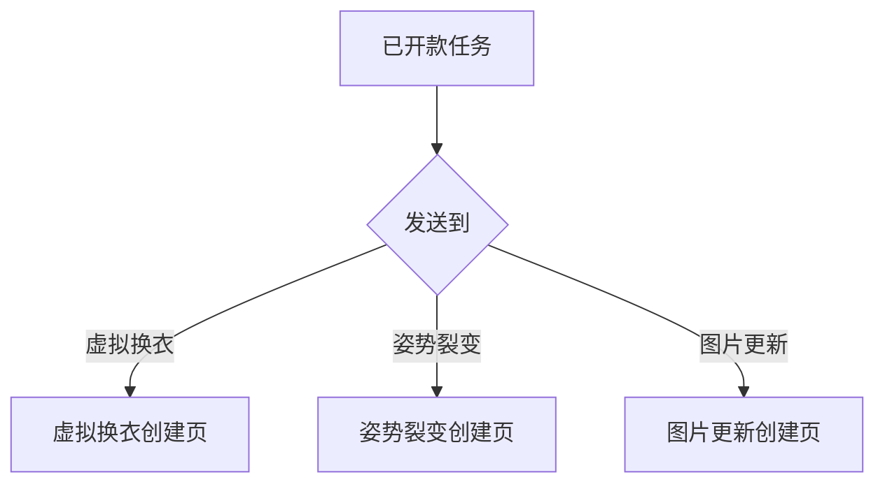
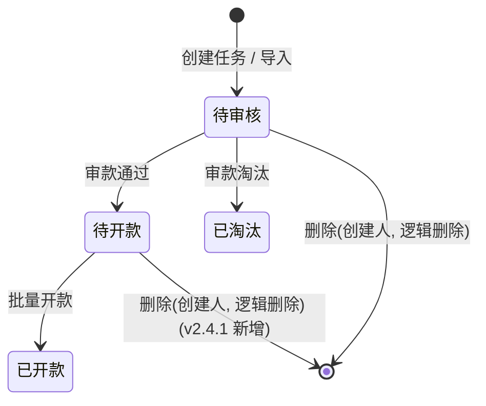
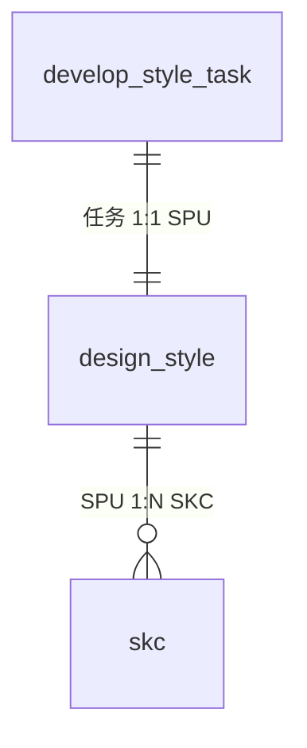

# 开款任务管理

## 1. 模块概述

本模块是 SDP 商品开发流程的入口，负责管理从「选款 / 手动创建 → 审核 → 开款生成 SPU」的完整链路。核心实体为**开款任务 (Develop Style Task)**，一条任务代表一个待开发的款式。

**业务背景**：设计师通过创建开款任务提交新款开发需求，经组长审核通过后，进入批量开款环节生成正式的 SPU 数据。支持手动创建、Excel 导入、AIGC 选款、以料开款等多种来源。

**对接关系**：

| 对接系统 | 方向 | 数据/功能 | 说明 |
|---------|------|---------|------|
| 款式管理 | 输出 | SPU 数据 | 批量开款后生成 SPU |
| 现货管理 | 输入 | 供应商+供应商款号查重 | 创建时校验重复款 |
| AI 识别服务 | 输入 | 款式标签识别 / 款式识别向量匹配 | 图片标签自动识别；完成开款/淘汰后删除向量 (v2.4.1 新增) |
| 虚拟换衣 / 姿势裂变 / 图片更新 | 输出 | 关联任务 | 已开款数据可发送到下游 AI 任务 |

**核心业务流程**：

**发送到下游流程**：

---

## 2. 页面概述

| 页面名称 | 页面类型 | 入口/路径 | 交互形式 | 说明 |
|---------|---------|---------|---------|------|
| 开款任务列表 | 列表页 | 设计中心 → 开款任务管理 | 页面跳转 | 默认着陆页，含状态筛选 + 搜索 + 批量操作 |
| 创建开款任务 | 表单页 | 列表页 → 点击「创建任务」 | 新标签页 | 单品/批量创建开款任务，支持图片上传 + Excel 导入 |
| 审核开款任务 | 表单页 | 列表页 → 点击「审款」 | 新标签页 | 组长审核开款任务：通过/淘汰/暂不处理，查看同款/相似款 |
| 导入开款任务 | 导入导出页 | 创建页面 → 「从模板导入」 | 弹窗 | Excel 批量导入开款任务 |
| 批量开款 | 表单页 | 列表页 → 点击「批量开款」 | 新标签页 | AI 识别后批量填写款式属性并创建 SPU，列表含序号列 |
| 重复款 | 详情页 | 审核/批量开款 → 点击同款/相似款 | 弹窗 | 查看同款/相似款的 SKC 详情列表 |

---

## 3. 权限说明

### 功能权限

权限码前缀：`SDP-SJZX-KKRW-`（SDP-设计中心-开款任务）

| 操作 | 权限码 | 说明 |
|------|-------|------|
| 创建任务 | `CJRW` | 显示「创建任务」按钮，新标签页打开创建页面 |
| 编辑任务 | `BJRW` | 显示「编辑」按钮，**仅 taskStatus = 0（待审核）数据可操作** (v2.6.0 新增) |
| 审款 | `SK` | 显示「审款」按钮，仅待审核数据可操作 |
| 批量开款 | `PLKK` | 显示「批量开款」按钮，仅待开款 + AI 识别已完成/失败的数据可操作 |
| 发送到 | `FS` | 显示「发送到」下拉菜单（虚拟换衣/姿势裂变/图片更新），仅已开款数据 |
| 识别标签 | `SBBQ` | 显示「识别标签」按钮，仅 AI 识别失败的数据可操作 |
| 删除任务 | `SCRW` | 显示「删除任务」按钮，仅待审核/待开款 + 创建人本人可操作 (v2.4.1 变更) |
| 分组-全部 | `QBFZ` | 列表页显示「全部」Tab |
| 分组-组内 | `QBZN` | 列表页显示「组内」Tab |
| 分组-我的 | `QBWD` | 列表页显示「我的」Tab |

### 分组规则

- **全部**: 查看所有开款任务
- **组内**: 当前用户所在组织架构内的任务
- **我的**: 仅查看当前用户创建的任务

---

## 4. 状态机

### 4.1 任务状态 (taskStatus)

| 状态码 | 名称 | 说明 |
|-------|------|------|
| `0` | 待审核 | 创建后初始状态，等待组长审核 |
| `10` | 待开款 | 审核通过，等待执行批量开款 |
| `20` | 已淘汰 | 审核时被淘汰，不再继续流转 |
| `30` | 已开款 | 已完成 SPU 创建 |
| `50` | 失败 | 处理失败 |

**状态流转**:

> **删除说明 (v2.4.1 变更)**: 删除操作为逻辑删除（设置 `deleted = true`），并非物理删除记录。待审核和待开款状态的任务均可由创建人执行删除。

### 4.2 AI 识别状态 (identifyStatus)

| 状态码 | 名称 | 说明 |
|-------|------|------|
| `0` | 排队中 | 已提交识别请求，等待执行 |
| `10` | 识别中 | AI 模型正在处理 |
| `20` | 已中止 | 识别被中止 |
| `30` | 已完成 | AI 识别成功，结果已回填 |
| `50` | 失败 | 识别失败，可重新触发 |
| `60` | 超时失败 | 识别超时，可重新触发 |

### 4.3 审核结果 (checkResult)

| 枚举值 | 名称 | 说明 |
|-------|------|------|
| `PASS` | 通过 | 进入待开款状态 |
| `DISUSE` | 淘汰 | 进入已淘汰状态 |
| `UN_CHECK` | 暂不处理 | 不提交，跳过该条 |

---

## 5. 数据模型

### 5.1 实体关系

### 5.2 DesignStyle（开款任务 → SPU）

| 属性 | 类型 | 必填 | 默认值 | 长度/范围 | 说明 |
|------|------|------|--------|----------|------|
| styleCode | 短文本 | 自动 | — | ≤32字符 | 款号（2年+2月+2日+4流水+2版号） |
| taskSource | 枚举 | 是 | — | — | 来源：USER_UPLOAD / AIGC / STUDIO / AGENT_DEVELOP(智能开款，v2.6.2 将 MATERIAL_DEVELOP 重命名) / UNKNOWN |
| styleType | 枚举 | 是 | — | — | 开款类型：SPOT_STYLE / AI_STYLE / SHARED_LISTING |
| styleStatus | 整数 | 是 | 0 | 见状态机 | 任务状态 |
| categoryCode | 短文本 | 自动 | — | ≤64字符 | 品类编码（code1-code2-code3），取值来源：NEST字典 pims_category |
| categoryName | 短文本 | 自动 | — | ≤128字符 | 品类名（如：女装-上装-T恤） |
| styleLabelCode | 短文本 | 是 | — | ≤64字符 | 款式标签编码，取值来源：NEST字典 product_tag |
| styleLabelName | 短文本 | 是 | — | ≤64字符 | 款式标签名称 |
| styleLevelCode | 短文本 | 是 | — | ≤64字符 | 款式级别编码，取值来源：NEST字典 product_level |
| styleLevelName | 短文本 | 是 | — | ≤64字符 | 款式级别名称 |
| storeId | 引用 | 是 | — | — | 店铺 ID，取值来源：POP-店铺管理 |
| storeName | 短文本 | 是 | — | ≤64字符 | 店铺名称 |
| platformCode | 短文本 | 否 | — | ≤64字符 | 平台编码，取值来源：NEST字典 material_source |
| platformName | 短文本 | 否 | — | ≤64字符 | 平台名称 |
| waveBandCode | 短文本 | 否 | — | ≤64字符 | 波段编码，取值来源：NEST字典 plm_clothing_band |
| waveBandName | 短文本 | 否 | — | ≤64字符 | 波段名称 |
| clothingStyleCode | 短文本 | 是 | — | ≤64字符 | 风格编码，取值来源：NEST字典 product_style |
| clothingStyleName | 短文本 | 是 | — | ≤64字符 | 风格名称 |
| seasonCode | 短文本 | 是 | — | ≤64字符 | 季节编码，取值来源：NEST字典 reference_season |
| seasonName | 短文本 | 是 | — | ≤64字符 | 季节名称 |
| galaCode | 短文本 | 否 | — | ≤64字符 | 节日编码，取值来源：NEST字典 festival |
| galaName | 短文本 | 否 | — | ≤64字符 | 节日名称 |
| sceneCode | 短文本 | 否 | — | ≤64字符 | 面料池使用范围编码，取值来源：NEST字典 scenes |
| sceneName | 短文本 | 否 | — | ≤64字符 | 面料池使用范围名称 |
| visualFormCode | 短文本 | 是 | — | ≤64字符 | 视觉形式编码，取值来源：NEST字典 visual_style |
| visualFormName | 短文本 | 是 | — | ≤64字符 | 视觉形式名称 |
| printingCode | 短文本 | 是 | — | ≤64字符 | 印花类型编码，取值来源：NEST字典 gd_printing |
| printingName | 短文本 | 是 | — | ≤64字符 | 印花类型名称 |
| patternCode | 短文本 | 是 | — | ≤64字符 | 版型编码，取值来源：NEST字典 fit |
| patternName | 短文本 | 是 | — | ≤64字符 | 版型名称 |
| elasticCode | 短文本 | 是 | — | ≤64字符 | 弹性编码，取值来源：NEST字典 plm_elastic_requirement |
| elasticName | 短文本 | 是 | — | ≤64字符 | 弹性名称 |
| sizeStandardCode | 短文本 | 是 | — | ≤64字符 | 尺码组编码，取值来源：NEST字典 plm_standard_size |
| sizeStandardName | 短文本 | 是 | — | ≤64字符 | 尺码组名称 |
| weaveModeCode | 短文本 | 是 | — | ≤64字符 | 织造方式编码，取值来源：NEST字典 aps_category_type |
| weaveModeName | 短文本 | 是 | — | ≤64字符 | 织造方式名称 |
| qualityLevelCode | 短文本 | 是 | — | ≤64字符 | 品质等级编码，取值来源：NEST字典 plm_quality_level |
| qualityLevelName | 短文本 | 是 | — | ≤64字符 | 品质等级名称 |
| skuClassCode | 短文本 | 否 | — | ≤64字符 | SKU 分类编码，取值来源：NEST字典 sku_classification |
| skuClassName | 短文本 | 否 | — | ≤64字符 | SKU 分类名称 |
| suitPiece | 整数 | 否 | — | 1-99 | 套装件数 / 单品数量 |
| designTypeCode | 短文本 | 否 | — | ≤64字符 | 款式类型编码，取值来源：NEST字典 styletype |
| designTypeName | 短文本 | 否 | — | ≤64字符 | 款式类型名称 |
| designerId | 引用 | 否 | — | — | 设计师 ID，取值来源：SSO 系统 |
| designerCode | 短文本 | 否 | — | ≤64字符 | 设计师编码 |
| designerName | 短文本 | 否 | — | ≤64字符 | 设计师名称 |
| commodityLink | 短文本 | 否 | — | ≤500字符 | 商品链接 |
| supplierName | 短文本 | 否 | — | ≤20字符 | 供应商名称 |
| supplierStyleCode | 短文本 | 否 | — | ≤20字符 | 供应商款号 |
| price | 金额 | 否 | — | DECIMAL(10,2), 0-99999999.99, CNY | 价格 |
| mainImgUrl | 文件引用 | 否 | — | jpg/png, ≤20MB | 主图 |
| skcs | 列表 | — | — | — | SKC 列表（颜色+尺码），传输用，非持久化字段 |
| pictures | 列表 | — | — | — | 图片列表，传输用，非持久化字段 |

### 5.3 开款任务 (develop_style_task)

查询列表 / 审核 / 批量开款时的任务维度字段。

| 属性 | 类型 | 必填 | 默认值 | 长度/范围 | 说明 |
|------|------|------|--------|----------|------|
| taskId | 短文本 | 自动 | — | ≤32字符 | 任务唯一标识 |
| taskCode | 短文本 | 自动 | — | ≤32字符 | 任务编号 |
| taskStatus | 枚举 | 是 | 0 | — | 0-待审核 / 10-待开款 / 20-已淘汰 / 30-已开款 / 50-失败 |
| creatorId | 引用 | 是 | 当前用户 | — | 创建人 ID |
| creatorName | 短文本 | 是 | — | ≤64字符 | 创建人名称 |
| createdTime | 日期时间 | 自动 | NOW() | — | 创建时间 |
| styleCheckerId | 引用 | 否 | — | — | 审款人 ID |
| styleCheckerName | 短文本 | 否 | — | ≤64字符 | 审款人名称 |
| checkTime | 日期时间 | 否 | — | — | 审款时间 |
| checkResult | 枚举 | 否 | — | — | 审款结果：PASS / DISUSE / UN_CHECK |
| identifyStatus | 枚举 | 否 | 0 | — | AI 识别状态：见 4.2 |
| sameStyleNum | 整数 | 自动 | 0 | 0-9999 | 同款数量 |
| similarStylesNum | 整数 | 自动 | 0 | 0-9999 | 相似款数量 |
| relaType | 短文本 | 否 | — | ≤32字符 | 关联任务类型 |
| relaId | 引用 | 否 | — | — | 关联任务 ID |
| relaCode | 短文本 | 否 | — | ≤32字符 | 关联任务编号 |
| sameGroup | 布尔 | 自动 | false | — | 是否组内 |
| remark | 列表 | 否 | — | — | 备注记录列表（含时间、创建人） |
| duplicateFlag | 布尔 | 自动 | false | — | 重复款标识，款式识别查重结果标记 (v2.4.1 新增) |
| deleted | 布尔 | 自动 | false | — | 逻辑删除标识，true 表示已删除 (v2.4.1 新增) |

---

## 6. 开款任务列表

### 页面说明

**入口**: 设计中心 → 开款任务管理

**列表行为**:
- 数据来源：当前租户内的开款任务数据
- 默认排序：创建时间降序
- 分页：默认 20 条/页，可选 20/50/100
- 刷新方式：手动刷新

### 分组 Tab

根据权限动态显示「全部」「组内」「我的」Tab，切换 Tab 自动刷新列表和状态统计。无任何分组权限时展示无权限提示。

### 状态筛选 (v2.4.1 变更)

~~Tab 下方的状态标签从后端统计接口获取各状态数量。~~ 状态筛选由单选标签改为**多选下拉**，支持同时筛选多个状态。各状态选项从后端统计接口获取数量。可选状态：全部、待审核(n)、待开款(n)、已开款(n)、已淘汰(n)。

### 查询条件

| 条件名称 | 输入方式 | 说明 |
|---------|---------|------|
| 波段 | 多选 | 取值来源：NEST字典 plm_clothing_band |
| 设计师 | 搜索选择 | 取值来源：SSO 系统 |
| 创建时间 | 日期范围选择 | 起止日期 |
| 店铺 | 多选 | 取值来源：POP-店铺管理 |
| 任务编号 | 文本输入 | 支持批量，空格或逗号分隔 |
| 关联任务 | 多选 | 虚拟换衣/姿势裂变 |
| 款号 | 文本输入 | 支持批量，空格或逗号分隔 |
| 品类 | 级联选择 | 取值来源：NEST字典 pims_category，取末级编码 |
| AI 识别状态 | 单选 | 见 4.2 AI 识别状态 |
| 款式标签 | 单选 | 取值来源：NEST字典 product_tag |
| 审款人 | 搜索选择 | 取值来源：SSO 系统 |
| 审款时间 | 日期范围选择 | 起止日期 |
| 任务来源 | 多选 | 手动创建/AIGC选款/智能开款/… (v2.6.2 新增) |

### 显示字段

| 字段名称 | 显示为 | 说明 |
|---------|--------|------|
| 复选框 | — | 多选 |
| 编号 | 文本 + 标签 | 任务编号 + 来源 + 款式标签 Tag |
| 款式图 | 缩略图 | 主图缩略图，点击放大预览 |
| 开款信息 | 文本 | 品类 / 波段 / 店铺 |
| 状态 | 状态标签 | 待审核 / 待开款 / 已开款 / 已淘汰 |
| AI 识别状态 | 状态标签 | 排队中 / 识别中 / 已中止 / 已完成 / 失败 |
| 重复款标识 (v2.4.1 新增) | 标签 | 显示「重复款」标签，当 duplicateFlag = true 时高亮展示 |
| 款式信息 | 文本 + 格式化文本 | 款号 / 平台 / 价格 |
| 选款信息 | 文本 + 格式化文本 | 设计师 / 创建时间 |
| 关联任务 | 文本 | 任务编号 / 任务类型 |
| 审款时间 | 文本 + 格式化文本 | 审款人 / 审款时间 |
| 操作 | 操作按钮 | 编辑（仅待审核）+ 备注记录 + 操作日志 |

### 用例

**用例1：创建任务**
- **前置条件**：1）需要有 CJRW 权限；2）需要为设计师
- **操作**：点击「创建任务」按钮，新标签页打开「创建开款任务」页面
- **后置输出**：打开新标签页进入创建页面

**用例2：审款**
- **前置条件**：1）需要有 SK 权限；2）至少选中一条数据；3）所有选中数据 taskStatus = 0（待审核）
- **操作**：点击「审款」按钮，新标签页打开「审核开款任务」页面
- **后置输出**：传递选中数据到审核页面

**用例3：识别标签**
- **前置条件**：1）需要有 SBBQ 权限；2）至少选中一条数据；3）仅支持 taskStatus IN (0, 10) 且 identifyStatus = 50（失败）的数据
- **操作**：点击「识别标签」按钮，触发 AI 款式标签识别
- **后置输出**：AI 识别状态更新为排队中

**用例4：批量开款**
- **前置条件**：1）需要有 PLKK 权限；2）至少选中一条数据；3）仅支持 taskStatus = 10（待开款）且 identifyStatus IN (30, 50)（已完成/失败）的数据
- **操作**：点击「批量开款」按钮，新标签页打开「批量开款」页面
- **后置输出**：传递选中数据到批量开款页面

**用例5：删除任务 (v2.4.1 变更)**
- **前置条件**：1）需要有 SCRW 权限；2）至少选中一条数据；3）仅支持 taskStatus = 0（待审核）或 taskStatus = 10（待开款）的数据 (v2.4.1 变更: 新增待开款可删除)；4）仅创建人可操作
- **操作**：点击「删除任务」按钮，弹出二次确认弹窗
- **确认提示**：「确认删除开款任务？删除后不可恢复」
- **后置输出**：确认后逻辑删除对应开款任务（设置 deleted = true）

**用例6：发送到**
- **前置条件**：1）需要有 FS 权限；2）至少选中一条数据；3）仅支持 taskStatus = 30（已开款）的数据
- **操作**：点击「发送到」按钮，出现下拉选项——虚拟换衣、姿势裂变、图片更新任务
- **后置输出**：
  - 虚拟换衣：跳转到虚拟换衣创建页，携带款号
  - 姿势裂变：跳转到姿势裂变创建页，携带款号
  - 图片更新：跳转到图片更新创建页，携带款号

**用例7：查看操作日志**
- **前置条件**：无
- **操作**：点击「操作日志」按钮
- **后置输出**：侧边抽屉展示操作日志（操作人、操作内容、操作时间，时间倒序）

**用例8：款式识别查重 (v2.4.1 新增)**
- **前置条件**：1）需要有对应权限；2）至少选中一条数据；3）仅支持 taskStatus IN (0, 10) 的数据
- **操作**：点击「款式识别查重」按钮，触发 AI 识别服务进行向量匹配查重
- **后置输出**：查重完成后更新 duplicateFlag，列表显示重复款标识

**用例9：编辑任务 (v2.6.0 新增)**
- **前置条件**：1）需要有 BJRW 权限；2）数据 taskStatus = 0（**仅待审核**可编辑）
- **操作**：点击行操作区「编辑」按钮，弹出编辑弹窗
- **弹窗字段**：与创建表单字段一致，包含款式标签、波段、店铺、平台、价格、供应商、供应商款号、商品链接、款式图片；**不包含备注字段**
- **后置输出**：确认保存后更新对应开款任务信息，弹窗关闭，列表刷新当前行

### 异常处理

| 异常场景 | 用户看到的表现 |
|---------|-------------|
| 审核状态不匹配 | 提示"最少选择一条待审核的数据" |
| 批量开款状态不匹配 | 提示"请选择待开款的数据进行此操作" |
| AI 识别状态不匹配 | 提示"请选择AI识别状态为已完成/失败的数据进行此操作" |
| 删除权限不足 | 提示"请勾选当前登录人创建的数据进行删除操作" |
| 删除状态不匹配 | 提示"请勾选待审核或待开款的数据进行删除操作" (v2.4.1 变更) |
| 识别标签状态不匹配 | 提示"请勾选AI识别状态为【失败】进行识别操作" |
| 发送到无图片 | 提示"没有图片的数据不能进行发送操作" |
| 发送到状态不匹配 | 提示"仅支持处理开款任务状态为已开款的数据" |
| 权限不足 | 按钮不显示 |
| 分组权限缺失 | 无任何分组 Tab 权限时展示无权限提示 |
| 请求出错 | 弹出错误对话框，支持复制错误信息 |

### 更新记录

| 关联版本 | 更新内容 | 具体说明 |
|------|------|------|
| v2.4.1 | 状态筛选改为多选 | (v2.4.1 变更) 状态筛选由单选标签改为多选下拉，支持同时筛选多个状态 |
| v2.4.1 | 待开款支持删除 | (v2.4.1 变更) 删除任务支持待开款状态，统一为逻辑删除 |
| v2.4.1 | 款式识别查重 | (v2.4.1 新增) 列表新增重复款标识，支持款式识别向量匹配查重 |
| v2.6.2 | Agent智能编辑接入 | (v2.6.2 新增) 列表新增任务来源多选筛选；taskSource 枚举 MATERIAL_DEVELOP 重命名为 AGENT_DEVELOP(智能开款) |

---

## 7. 创建开款任务

### 页面说明

**入口**: 开款任务列表 → 点击「创建任务」

**交互形式**: 新标签页打开表单页

### 图片上传

- 支持粘贴、拖放图片到上传区域
- 支持「批量导图」：选择一批图片后自动为每张图片创建一条款式行
- 单张图片大小限制 20MB，格式 .jpg/.png/.jpeg
- 每个款式最多 10 张图片，首张默认为主图

### 款式行操作

- 新建款式：增加一行空白行，自动滚动到页面底部
- 删除款式：删除对应数据行，最少保留一条

### 表单字段

| 字段名称 | 输入方式 | 必填 | 校验规则 | 默认值 | 说明 | 更新说明 |
|---------|---------|------|---------|--------|------|------|
| 款式标签 | 单选 | 是 | — | — | 取值来源：NEST字典 product_tag。选择后自动映射 styleType 和 styleLabelName | |
| 波段 | 单选 | 否 | — | — | 取值来源：NEST字典 plm_clothing_band | |
| 店铺 | 单选 | 是 | — | — | 取值来源：POP-店铺管理。选择后自动回填 storeName | |
| 平台 | 单选 | 否 | — | — | 取值来源：NEST字典 material_source | |
| 价格 | 数字输入 | 否 | 0-9999.99，精度2位 | — | 每行独立输入 | |
| 供应商 | 文本输入 | 否 | ≤20字符 | — | 每行独立输入 | |
| 供应商款号 | 文本输入 | 否 | ≤20字符 | — | 每行独立输入 | |
| 商品链接 | 文本输入 | 否 | ≤500字符 | — | 每行独立输入 | |
| 款式图片 | 图片上传 | 是 | jpg/png，单张≤20MB，最多10张 | — | 每行独立上传，首张为主图 | |

### 提交说明

**提交时校验**:
1. 至少需要一条数据才能保存
2. 每个款式至少上传一张图片
3. 单次最多提交 50 个款式
4. 款式标签为必填
5. 店铺为必填

**重复款校验**：当款式标签对应的款式类型为「现货款」(SPOT_STYLE) 时，前端本地校验同一批次中 `[供应商+供应商款号]` 是否存在重复，如有则提示"已有重复款，如需添加SKC请到现货管理界面操作"

**成功后数据变更**：保存后创建【待审核】状态的开款任务，返回列表页

### 异常处理

| 异常场景 | 用户看到的表现 |
|---------|-------------|
| 图片未上传 | 提示"款式{n}最少上传一张图片"，阻止提交 |
| 超出数量上限 | 提示"最多创建50个款式"，阻止新建/导入/批量导图 |
| 款式数不足 | 提示"最少保留一个款式"，阻止删除 |
| 重复款 | 提示"已有重复款，如需添加SKC请到现货管理界面操作"，阻止提交 |
| 图片大小超限 | 上传组件阻止，单张 > 20MB 无法选择 |
| 必填项为空 | 对应字段标红，聚焦第一个错误字段 |

---

## 8. 导入开款任务

### 页面说明

**入口**: 创建开款任务页面 → 「从模板导入」文字按钮

**交互形式**: 弹窗

### 文件校验

- 支持格式：`.xls` `.xlsx`
- 文件大小限制 100MB

### 导入流程

1. 用户上传 Excel 文件并点击「确定」
2. 后端解析 Excel 返回 JSON 数组
3. 前端将解析结果拼接到款式列表头部
4. 字段映射（Excel 列 → 款式行字段）：
   - `commodityLink` → 商品链接（截取 ≤500字符）
   - `supplierName` → 供应商名称（截取 ≤20字符）
   - `supplierStyleCode` → 供应商款号（截取 ≤20字符）
   - `mainImgUrl` → 主图
   - `imageUrl2` ~ `imageUrl10` → 附图
5. 导入后总数不能超过 50 个款式

### 提交说明

**提交时校验**:
- 导入数据 + 已有数据 > 50 时阻止导入

### 异常处理

| 异常场景 | 用户看到的表现 |
|---------|-------------|
| 文件格式不符 | 提示"仅支持 .xls/.xlsx 格式" |
| 文件过大 | 提示"文件大小不能超过 100MB" |
| Excel 导入超限 | 提示"最多创建50个款式"，阻止导入 |

---

## 9. 审核开款任务

### 页面说明

**入口**: 开款任务列表 → 选中待审核数据 → 点击「审款」

**交互形式**: 新标签页打开表单页

**前置条件**:
- 需要有 SK（审款）权限
- 至少选中一条数据
- 所有选中数据 taskStatus = 0（待审核）

### 审核界面

- 卡片形式展示每个待审核款式
- 每张卡片显示：
  - 款式主图（可点击预览大图，支持切换该款式所有图片）
  - 款式类型标签（现货款/AI款/跟卖款），以不同颜色区分 (v2.4.1 变更: 标签文案/颜色修正)
  - 设计师、波段、店铺、平台、价格信息
  - 同款/相似款入口按钮（显示数量，无数据时显示"暂无同款"）
  - 操作区：通过 / 淘汰 / 暂不处理 + 备注
- 查看大图：点击图片进入全屏浏览，可切换查看当前开款任务的所有图片

### 审核操作

| 操作 | 行为 | 提交到后端 |
|------|------|----------|
| 通过 | 设置 checkResult = 'PASS' | 是 |
| 淘汰 | 设置 checkResult = 'DISUSE' | 是 |
| 暂不处理 | 提交时跳过该条数据 | 否 |
| 切换 | 通过 ↔ 淘汰可随时切换；暂不处理可通过/淘汰恢复 | — |

### 备注

- 每个款式可添加备注，弹出文本框
- 提交备注后保存，刷新备注时间线
- 备注数量以红色气泡角标显示在"备注"文字旁
- 悬停备注角标显示备注时间线（步骤条格式：时间 + 创建人 + 内容）

### 同款/相似款查询

- 页面加载时自动查询同款/相似款
- 根据字典 `stylscorerange` 的 `same` 和 `similar` 属性定义分数区间：
  - `score ≤ same阈值` → 同款
  - `same阈值 < score ≤ similar阈值` → 相似款
- 点击同款/相似款按钮弹出重复款弹窗（见第11章）

### 提交说明

**提交时校验**:
- 至少需要处理一条数据（非暂不处理），否则报错"请最少处理一条数据"

### 异常处理

| 异常场景 | 用户看到的表现 |
|---------|-------------|
| 审核状态不匹配 | 提示"最少选择一条待审核的数据" |
| 未处理任何数据 | 提示"请最少处理一条数据" |
| 外部系统超时 | 提示"操作超时，请稍后重试"，提供重试按钮 |

### 更新记录

| 关联版本 | 更新内容 | 具体说明 |
|------|------|------|
| v2.4.1 | 标签修正 | (v2.4.1 变更) 审款界面款式类型标签文案/颜色修正 |

---

## 10. 批量开款

### 页面说明

**入口**: 开款任务列表 → 选中待开款数据 → 点击「批量开款」

**交互形式**: 新标签页打开表单页

### 初始化数据加载

- 接收列表页传递的选中数据
- 加载 AI 已识别的信息（品类、颜色、款式标签等），自动回填到当前界面
- 自动查询同款/相似款并在款式查重列展示数量
- 品类根据属性 `SKU_CLASSIFICATION` 自动设置 SKU 分类
- 品类第一级根据属性 `default_size` 自动设置尺码组默认值
- 品质等级默认选中 `is_default = '1'` 的选项
- 款式类型默认选中 `isDefault` 属性标记的选项
- AI 历史识别的颜色和尺码自动转换回显

### 序号列 (v2.4.1 新增)

批量开款列表每行左侧显示序号（从 1 开始递增），便于定位和沟通具体款式行。

### 表单字段

| 字段名称 | 输入方式 | 必填 | 说明 |
|---------|---------|------|------|
| 品类 | 级联选择 | 是 | 取值来源：NEST字典 pims_category。选择后联动 SKU 分类 + 尺码组 |
| 颜色 | 级联选择 | 是 | 取值来源：NEST字典 clothing_color。最多6种，选择后自动回填颜色缩写/编号/英文名 |
| 波段 | 单选 | 否 | 取值来源：NEST字典 plm_clothing_band |
| 店铺 | 单选 | 是 | 取值来源：POP-店铺管理 |
| 款式类型 | 单选 | 否 | 取值来源：NEST字典 styletype，默认取 isDefault 标记项 |
| 款式标签 | 单选 | 是 | 取值来源：NEST字典 product_tag |
| 款式级别 | 单选 | 是 | 取值来源：NEST字典 product_level |
| 视觉形式 | 单选 | 是 | 取值来源：NEST字典 visual_style |
| 风格 | 单选 | 是 | 取值来源：NEST字典 product_style |
| 季节 | 单选 | 是 | 取值来源：NEST字典 reference_season |
| 节日 | 单选 | 否 | 取值来源：NEST字典 festival |
| 面料池使用范围 | 单选 | 否 | 取值来源：NEST字典 scenes |
| 印花类型 | 单选 | 是 | 取值来源：NEST字典 gd_printing |
| 版型 | 单选 | 是 | 取值来源：NEST字典 fit |
| 弹性 | 单选 | 是 | 取值来源：NEST字典 plm_elastic_requirement |
| SKU 分类 | 单选 | 否 | 取值来源：NEST字典 sku_classification。与套装件数联动 |
| 套装件数/单品数量 | 数字输入 | SKU分类非「单品」时必填 | |
| 尺码组 | 单选 | 是 | 取值来源：NEST字典 plm_standard_size |
| 织造方式 | 单选 | 是 | 取值来源：NEST字典 aps_category_type |
| 品质等级 | 单选 | 是 | 取值来源：NEST字典 plm_quality_level，默认取 is_default 项 |

### 批量填写

批量填写功能通过表头下拉选择器实现，选择后批量覆盖款式行。

**批量填写分组**：

| 分组 | 包含字段 |
|------|---------|
| 企划信息 | 品类、颜色、波段、店铺、款式类型、款式标签、款式级别 |
| 销售属性 | 视觉形式、风格、季节、节日、面料池使用范围、印花类型、版型、弹性 |
| SKU 分类 | SKU 分类、套装件数/单品数量 |
| 生产标签 | 尺码组、织造方式、品质等级 |

### 字段联动规则

| 触发字段 | 当值为 | 目标字段 | 行为 | 说明 |
|---------|--------|---------|------|------|
| 品类 | 选择末级节点 | SKU 分类 | 自动填充 | 根据 SKU_CLASSIFICATION 属性 |
| 品类 | 选择第一级节点 | 尺码组 | 自动填充 | 根据 default_size 属性 |
| SKU 分类 | 单品 | 套装件数 | 清除 | |
| SKU 分类 | 非单品 | 套装件数 | 变为必填 | |

### 款式查重

- 每个款式行展示同款(n) / 相似款(n) 数量
- 点击「查看」弹出重复款弹窗（见第11章）

### 操作列

- 每行有「删除」按钮，最少保留一条数据

### 提交说明

**提交时校验**:
1. 必填项：品类、颜色、店铺、款式标签、款式级别、视觉形式、风格、季节、印花类型、版型、弹性、尺码组、织造方式、品质等级
2. 校验失败时提示"第 X 行数据存在必填项未填写"
3. 现货款 (SPOT_STYLE) 仅取第一个颜色和第一个 SKC 提交

**防重复提交**：提交过程中按钮不可再次点击

**成功后数据变更**：生成 SPU 记录，状态变为已开款

### 异常处理

| 异常场景 | 用户看到的表现 |
|---------|-------------|
| 批量开款状态不匹配 | 提示"请选择待开款的数据进行此操作" |
| AI 识别状态不匹配 | 提示"请选择AI识别状态为已完成/失败的数据进行此操作" |
| 必填项缺失 | 提示"第{n}行数据存在必填项未填写" |
| 颜色超出上限 | 选择 > 6 种颜色时只保留前 6 种，提示"不超过六种颜色" |
| 请求出错 | 弹出错误对话框，支持「复制并下载错误信息」 |

### 更新记录

| 关联版本 | 更新内容 | 具体说明 |
|------|------|------|
| v2.4.1 | 序号列 | (v2.4.1 新增) 批量开款列表每行新增序号显示，从 1 递增 |

---

## 11. 重复款（同款/相似款）

### 页面说明

**入口**: 审核开款任务 / 批量开款页面 → 点击「同款」/「相似款」按钮

**交互形式**: 弹窗

### 展示内容

- 弹窗标题：「同款款式/商品」
- 顶部展示当前款式主图（可预览大图）
- 列表卡片展示重复款信息：
  - 图片（可预览大图）
  - 同款/相似款标签（同款-红色 / 相似款-绿色）
  - 状态标签（已发布-蓝色 / 已下架-红色 / 待发布-灰色 / 待推送-灰色）
  - SKC 编码
  - 店铺名称
  - 设计组-设计师
  - 创建时间

### 数据来源

- 通过字典 `stylscorerange` 的 `same` / `similar` 属性阈值区分同款和相似款
  - `score ≤ same阈值` → 同款
  - `same阈值 < score ≤ similar阈值` → 相似款

### 异常处理

| 异常场景 | 用户看到的表现 |
|---------|-------------|
| 数据加载失败 | 弹窗内展示重试按钮 |
| 无同款/相似款 | 显示"暂无同款" / "暂无相似款" |

---

## 更新记录

| 关联版本 | 更新内容 | 具体说明 |
|------|------|------|
| v2.4.1 | 批量开款序号+待开款删除+多选筛选+重复款标识+审款标签修正+AI识别向量匹配 | 来自规划文档 v2.4.1：批量开款列表新增序号列；待开款状态支持逻辑删除；状态筛选改为多选；列表新增款式识别查重与重复款标识；审款界面标签文案/颜色修正；数据模型新增 duplicateFlag 与 deleted 字段；状态机新增待开款→已删除路径；depends_on 新增 AI识别服务(向量匹配) |
| v2.6.2 | Agent智能编辑接入 | (v2.6.2 变更) taskSource 枚举 MATERIAL_DEVELOP 重命名为 AGENT_DEVELOP；(v2.6.2 新增) 开款任务列表新增任务来源多选筛选 |
