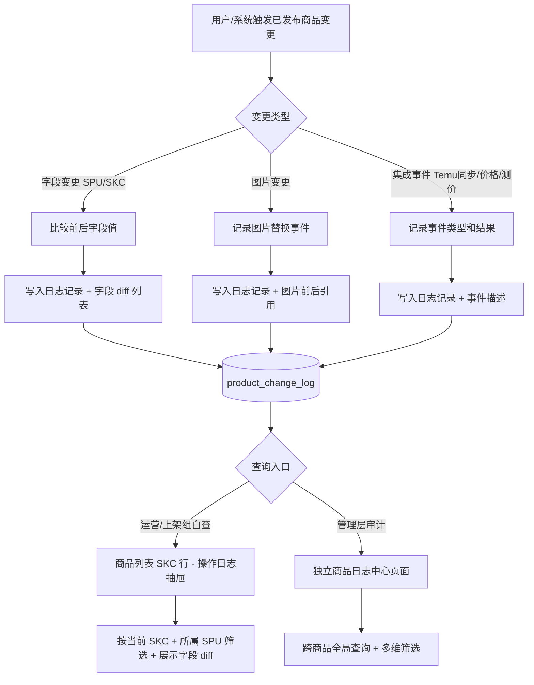
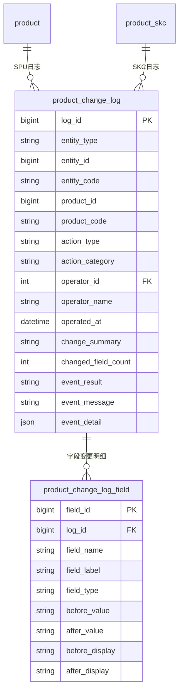

# 商品日志中心

## 1. 模块概述

为已发布商品提供统一的变动追踪能力，支持运营/上架组自查"某商品具体改了什么字段"，以及管理层跨商品的操作审计，实现从问题发生到定位变更根因的闭环。

**职责边界**

做什么：
- 记录已发布商品 SPU 基本信息变更（字段级 before/after）
- 记录商品 SKC 属性变更、状态流转（字段级 before/after）
- 记录商品图片素材替换（前后缩略图/文件信息对比）
- 记录集成事件（Temu平台同步、价格变更、测价操作），事件级粒度
- 提供两级查询入口：商品列表 SKC 行内嵌操作日志抽屉（单商品自查）+ 独立日志中心页（全局审计）

不做什么：
- 不记录待上架（style_on_shelves）流程中的审核/驳回日志（该部分属于上架审核流程，不在已发布商品范围内）
- 不提供日志修改或删除功能（只写，不改）
- 不负责判断变更是否合理（只做记录，不做校验）

**与相邻模块的分工**

| 模块 | 分工 |
|------|------|
| 商品管理 | 业务操作发生方，负责调用日志写入 API；本模块只负责存储和查询 |
| 款式日志中心 | 记录款式管理/现货管理侧的 SPU/SKC 变更；本模块只记录已发布商品侧的变更，两者独立存储 |

**对接关系**

| 关系类型 | 关联模块/系统 | 交互方式 | 关键数据 |
|---------|------------|---------|---------|
| 上游依赖 | 商品管理 | API 调用（写入） | 已发布商品 SPU/SKC 变更事件 |
| 上游依赖 | UACS 权限系统 | API 调用 | 用户数据范围权限 |
| 下游依赖 | 商品管理 | API 提供（查询） | 日志列表、变更详情 |

**核心业务流程**



---

## 2. 页面概述

| 页面名称 | 页面类型 | 入口/路径 | 交互形式 | 说明 |
|---------|---------|---------|---------|------|
| 商品日志中心 | 列表页 | 商品运营平台 → 日志中心 | 页面跳转 | 全局日志查询，支持跨 SPU/SKC 检索，面向管理层审计 |
| 操作日志抽屉 | 抽屉 | 商品列表 → SKC 行 → 「操作日志」 | 抽屉 | 展示当前 SKC 及所属 SPU 的合并变更日志，时间线排列，面向运营/上架组自查 |
| 变更详情 | 详情弹窗 | 日志列表 → 点击「查看详情」 | 弹窗 | 展示单条日志的完整字段级 diff 或图片前后对比 |

---

## 3. 权限说明

### 功能权限

| 操作 | 权限码 | 说明 |
|------|--------|------|
| 查看商品日志中心 | `POP-SPGL-RZGL-CK` | 访问独立商品日志中心页面 |
| 查看变更详情 | `POP-SPGL-RZGL-CKXQ` | 展开单条日志的字段 diff 详情 |

> 商品列表 SKC 行的「操作日志」抽屉复用商品管理模块的 `POP-SPGL-SPLB-BJSPCKXQ`（查看商品详情）权限，无需单独配置。

### 数据范围权限

| 权限码 | 说明 |
|--------|------|
| `POP-SPGL-SPLB-QBFZ` | 查看全部商品日志（管理层/运营） |
| `POP-SPGL-SPLB-QBZN` | 仅查看本组商品日志 |
| `POP-SPGL-SPLB-QBWD` | 仅查看我的商品日志 |

> 数据范围权限复用商品管理模块的现有权限口径，日志查询时按相同口径过滤。

---

## 4. 状态机

本模块为只写日志存储，日志记录一经写入不可修改，无状态流转。

---

## 5. 数据模型

### 5.1 实体关系



### 5.2 日志主表（product_change_log）

#### 系统字段

| 字段名 | 中文名 | 分类 | 类型 | 必填 | 说明 |
|-------|-------|------|------|------|------|
| log_id | 日志 ID | 系统 | 整数 | 自动 | 主键，雪花 ID |
| created_at | 写入时间 | 系统 | 日期时间 | 自动 | 日志写入时间，UTC |
| tenant_id | 租户 ID | 系统 | 整数 | 自动 | 多租户隔离 |

#### 实体标识

| 字段名 | 中文名 | 分类 | 类型 | 必填 | 说明 |
|-------|-------|------|------|------|------|
| entity_type | 实体类型 | 业务 | 枚举 | 是 | PRODUCT / SKC |
| entity_id | 实体 ID | 业务 | 整数 | 是 | product.id 或 product_skc.id |
| entity_code | 实体编码 | 业务 | 短文本 | 是 | 商品编码或 SKC 编码，冗余存储便于查询 |
| product_id | 关联商品 SPU ID | 业务 | 整数 | 是 | 当 entity_type=SKC 时记录所属 product.id；entity_type=PRODUCT 时与 entity_id 相同 |
| product_code | 关联商品 SPU 编码 | 业务 | 短文本 | 是 | 冗余存储，便于跨维度查询 |

#### 操作信息

| 字段名 | 中文名 | 分类 | 类型 | 必填 | 说明 |
|-------|-------|------|------|------|------|
| action_type | 操作类型 | 业务 | 枚举 | 是 | 见操作类型枚举 |
| action_category | 操作大类 | 业务 | 枚举 | 是 | FIELD_CHANGE（字段变更）/ MEDIA_CHANGE（图片变更）/ INTEGRATION_EVENT（集成事件） |
| operator_id | 操作人 ID | 管理 | 引用 | 是 | 人工操作取登录用户 ID；系统自动操作填 0 |
| operator_name | 操作人姓名 | 管理 | 短文本 | 是 | 冗余存储 |
| operated_at | 操作时间 | 管理 | 日期时间 | 是 | 业务操作发生时间（非日志写入时间） |
| source_module | 来源模块 | 管理 | 短文本 | 是 | 写入方标识，固定为 temu-product |
| remark | 备注 | 业务 | 短文本 | 否 | 操作时填写的原因/备注 |

#### 变更内容（冗余存储，便于列表预览）

| 字段名 | 中文名 | 分类 | 类型 | 必填 | 说明 |
|-------|-------|------|------|------|------|
| change_summary | 变更摘要 | 业务 | 短文本 | 是 | 供列表预览，如"修改了 标题、供货价"；集成事件填事件描述 |
| changed_field_count | 变更字段数 | 业务 | 整数 | 否 | FIELD_CHANGE 类型时填写 |
| event_result | 事件结果 | 业务 | 枚举 | 否 | INTEGRATION_EVENT 类型时填写：SUCCESS / FAILED / PENDING |
| event_message | 事件消息 | 业务 | 短文本 | 否 | 失败原因或补充说明 |

---

**操作类型枚举（action_type）**

| 枚举值 | 中文名 | action_category | 适用实体 |
|-------|-------|----------------|---------|
| `PRODUCT_EDIT` | 编辑商品基本信息 | FIELD_CHANGE | PRODUCT |
| `PRODUCT_PRICE_CHANGE` | 商品供货价变更 | FIELD_CHANGE | PRODUCT |
| `SKC_EDIT` | 编辑 SKC 信息 | FIELD_CHANGE | SKC |
| `SKC_STATUS_CHANGE` | SKC 状态流转（Temu侧） | FIELD_CHANGE | SKC |
| `SKC_TAG_CHANGE` | 商品标签变更（动销款/测价通过等） | FIELD_CHANGE | SKC |
| `MEDIA_PIC_EDIT` | 编辑商品图片 | MEDIA_CHANGE | SKC |
| `TEMU_SYNC` | Temu 平台同步 | INTEGRATION_EVENT | PRODUCT |
| `PRICE_CHECK_PASS` | 测价通过 | INTEGRATION_EVENT | SKC |
| `PRICE_CHECK_REVOKE` | 测价撤销 | INTEGRATION_EVENT | SKC |
| `LISTING_PUSH` | 推送上架（二次上架） | INTEGRATION_EVENT | SKC |

---

### 5.3 字段变更明细表（product_change_log_field）

> 仅 `action_category = FIELD_CHANGE` 的日志记录写入明细表；每个变更字段对应一行。

| 字段名 | 中文名 | 分类 | 类型 | 必填 | 说明 |
|-------|-------|------|------|------|------|
| field_id | 明细 ID | 系统 | 整数 | 自动 | 主键，雪花 ID |
| log_id | 日志 ID | 系统 | 引用 | 是 | FK → product_change_log.log_id |
| field_name | 字段名 | 业务 | 短文本 | 是 | 技术字段名，如 supply_price |
| field_label | 字段中文名 | 业务 | 短文本 | 是 | 展示用，如"供货价" |
| field_type | 字段展示类型 | 业务 | 枚举 | 是 | TEXT（文本）/ STATUS（状态）/ MEDIA（素材） |
| before_value | 变更前原始值 | 业务 | 短文本 | 否 | 原始存储值；为空表示新增字段 |
| after_value | 变更后原始值 | 业务 | 短文本 | 否 | 变更后存储值；为空表示字段被清除 |
| before_display | 变更前展示值 | 业务 | 短文本 | 否 | 用于页面展示的可读值，如枚举的中文名 |
| after_display | 变更后展示值 | 业务 | 短文本 | 否 | 用于页面展示的可读值 |

---

### 5.4 图片变更记录规范

> 图片变更（`action_category = MEDIA_CHANGE`）不写入 `product_change_log_field` 明细表，而是在 `product_change_log` 的 `event_detail` JSON 字段中存储以下结构：

```json
{
  "media_type": "PRODUCT_PIC",
  "before": [
    { "file_id": "oss://...", "thumbnail_url": "https://...", "file_name": "pic_01.jpg", "sort": 1 }
  ],
  "after": [
    { "file_id": "oss://...", "thumbnail_url": "https://...", "file_name": "pic_01_new.jpg", "sort": 1 }
  ]
}
```

- `before` 为空数组表示新增图片；`after` 为空数组表示删除图片
- `sort` 记录图片排序位，便于对比排序变化

---

## 6. 商品日志中心页（全局审计入口）

### 页面说明

独立页面，路径为商品运营平台 → 日志中心。展示全部已发布商品的变更日志，支持多维筛选，面向管理层和运营人员做操作审计。

### 筛选条件

| 筛选项 | 类型 | 说明 |
|-------|------|------|
| 商品编码/名称 | 文本搜索 | 模糊匹配 product_code、entity_code |
| 实体类型 | 单选 | 全部 / PRODUCT / SKC |
| 操作大类 | 多选 | 字段变更 / 图片变更 / 集成事件 |
| 操作类型 | 多选 | 根据操作大类联动展示枚举 |
| 操作人 | 下拉搜索 | 按操作人筛选 |
| 操作时间 | 日期范围 | 最大范围 90 天 |
| 品类 | 下拉 | 按 SPU 品类筛选 |

### 列表展示字段

| 列名 | 说明 |
|-----|------|
| 维度标签 | PRODUCT / SKC 彩色标签 |
| 商品/SKC 编码 | 可点击跳转商品列表对应行 |
| 操作时间 | `operated_at`，精确到分钟 |
| 操作人 | `operator_name`；系统自动操作显示"系统" |
| 操作内容 | `change_summary` 预览；集成事件显示事件标签（如"Temu同步"）+ 结果状态 |
| 操作 | 「查看详情」— 打开变更详情弹窗 |

- 默认排序：`operated_at` 降序
- 分页：每页 20 条

### 关键业务规则

- 列表数据按用户数据范围权限过滤（`POP-SPGL-SPLB-QBFZ/QBZN/QBWD`）
- 操作类型下拉选项根据操作大类联动：选择"集成事件"后，操作类型只展示 Temu同步 / 测价通过 / 测价撤销 / 推送上架
- 仅展示 entity_type = PRODUCT 或 SKC 的日志（已发布商品范围）

### 异常处理

| 场景 | 处理方式 |
|-----|---------|
| 无数据 | 展示空状态插图 + "暂无日志记录"提示，不展示操作引导 |
| 查询超时（>10s） | 显示超时提示 + "重新查询"按钮 |
| 权限不足 | 页面显示无权限提示，不展示任何日志数据 |

---

## 7. 操作日志抽屉（商品列表 SKC 入口）

### 页面说明

从商品列表 SKC 行点击「操作日志」触发，以抽屉形式呈现。展示当前 SKC 及其所属商品 SPU 的**合并变更日志**，按 `operated_at` 时间线降序排列，每条记录用「PRODUCT」/「SKC」标签标注维度，面向运营/上架组日常自查，无需切换即可看到该商品所有相关变动。

**查询逻辑**：返回满足以下任一条件的日志记录：
1. `entity_type = SKC` AND `entity_id = 当前 product_skc.id`
2. `entity_type = PRODUCT` AND `entity_id = 当前 SKC 所属 product.id`

### 抽屉内筛选条件

| 筛选项 | 类型 | 说明 |
|-------|------|------|
| 操作大类 | 单选 Tab | 全部 / 字段变更 / 图片变更 / 集成事件 |
| 时间范围 | 日期范围 | 默认最近 30 天 |

### 列表展示字段

同日志中心页列表，去掉"商品/SKC 编码"列（当前上下文已明确），「维度标签」列保留（区分 PRODUCT/SKC 记录）。

### 关键业务规则

- 合并展示当前 SKC 和所属商品 SPU 的日志，不支持跨 SKC 查询
- 抽屉入口复用商品管理模块的 `POP-SPGL-SPLB-BJSPCKXQ` 权限

### 异常处理

| 场景 | 处理方式 |
|-----|---------|
| 无日志记录 | 展示"暂无变更记录"提示 |
| 加载失败 | 展示加载失败提示 + "重试"按钮，不影响商品列表其他操作 |

---

## 8. 变更详情弹窗

### 页面说明

点击日志列表中的「查看详情」后弹出，展示单条日志的完整变更内容。

### 展示规则

**字段变更（FIELD_CHANGE）**

- 展示方式：表格形式，每行一个变更字段
- 列：字段名 | 变更前 | 变更后
- 状态字段（field_type = STATUS）：前后值用颜色区分（红色→绿色）
- 若变更前为空：显示"—"（表示新增字段值）
- 若变更后为空：显示"—"（表示字段被清除）

**图片变更（MEDIA_CHANGE）**

- 左右分栏，左侧"变更前"展示旧图缩略图列表，右侧"变更后"展示新图缩略图列表
- 新增图片：左侧显示"—"；删除图片：右侧显示"—"
- 图片按 `sort` 排序展示

**集成事件（INTEGRATION_EVENT）**

- 展示事件类型、结果状态（成功/失败/处理中）、事件时间
- 失败时展示 `event_message` 原因说明

### 示例

**示例1：编辑 SKC 信息（SKC_EDIT）**

日志主记录：

| 字段 | 值 |
|-----|---|
| entity_type | SKC |
| action_type | SKC_EDIT |
| operator_name | 李运营 |
| operated_at | 2026-07-02 14:32 |
| change_summary | 修改了 波段、颜色名称 |
| changed_field_count | 2 |

字段变更明细（product_change_log_field）：

| field_label | field_type | before_display | after_display |
|------------|-----------|---------------|--------------|
| 波段 | TEXT | 2024春夏 | 2024秋冬 |
| 颜色名称 | TEXT | 浅蓝 | 深蓝 |

页面渲染效果（变更详情弹窗中的表格）：

| 字段 | 变更前 | 变更后 |
|-----|-------|-------|
| 波段 | 2024春夏 | 2024秋冬 |
| 颜色名称 | 浅蓝 | 深蓝 |

---

**示例2：Temu 平台同步失败（TEMU_SYNC）**

日志主记录：

| 字段 | 值 |
|-----|---|
| entity_type | PRODUCT |
| action_type | TEMU_SYNC |
| action_category | INTEGRATION_EVENT |
| operator_name | 系统 |
| operated_at | 2026-07-01 09:15 |
| change_summary | Temu同步失败 |
| event_result | FAILED |
| event_message | Temu平台返回：商品标题含违禁词，请修改后重试 |

页面渲染效果（集成事件详情）：

```
事件类型：Temu 平台同步
结果：❌ 失败
时间：2026-07-01 09:15
原因：Temu平台返回：商品标题含违禁词，请修改后重试
```

---

**示例3：商品图片替换（MEDIA_PIC_EDIT）**

日志主记录：

| 字段 | 值 |
|-----|---|
| entity_type | SKC |
| action_type | MEDIA_PIC_EDIT |
| action_category | MEDIA_CHANGE |
| operator_name | 王上架 |
| operated_at | 2026-06-30 16:45 |
| change_summary | 替换了商品图片（3张→4张） |

event_detail 存储内容：

```json
{
  "media_type": "PRODUCT_PIC",
  "before": [
    { "file_id": "oss://...", "thumbnail_url": "https://cdn.../a1_thumb.jpg", "file_name": "pic_01.jpg", "sort": 1 },
    { "file_id": "oss://...", "thumbnail_url": "https://cdn.../a2_thumb.jpg", "file_name": "pic_02.jpg", "sort": 2 },
    { "file_id": "oss://...", "thumbnail_url": "https://cdn.../a3_thumb.jpg", "file_name": "pic_03.jpg", "sort": 3 }
  ],
  "after": [
    { "file_id": "oss://...", "thumbnail_url": "https://cdn.../b1_thumb.jpg", "file_name": "pic_01_new.jpg", "sort": 1 },
    { "file_id": "oss://...", "thumbnail_url": "https://cdn.../b2_thumb.jpg", "file_name": "pic_02_new.jpg", "sort": 2 },
    { "file_id": "oss://...", "thumbnail_url": "https://cdn.../b3_thumb.jpg", "file_name": "pic_03_new.jpg", "sort": 3 },
    { "file_id": "oss://...", "thumbnail_url": "https://cdn.../b4_thumb.jpg", "file_name": "pic_04_new.jpg", "sort": 4 }
  ]
}
```

页面渲染效果（左右分栏对比）：

```
变更前（3张）          变更后（4张）
[缩略图 a1]           [缩略图 b1]
[缩略图 a2]           [缩略图 b2]
[缩略图 a3]           [缩略图 b3]
                      [缩略图 b4]
```

### 异常处理

| 场景 | 处理方式 |
|-----|---------|
| 详情加载失败 | 弹窗内展示"加载失败，请重试" + 重试按钮 |
| 图片缩略图加载失败 | 图片位置展示灰色占位图 + 文件名文字 |

---

## 更新记录

| 变更时间 | 变更版本 | 变更类型 | 变更内容 | 涉及章节 |
|---------|---------|---------|---------|---------|
| 2026-07-03 | v1.0.0 | 新增 | 商品日志中心模块初始版本，支持已发布商品 PRODUCT/SKC 字段级变更追踪、图片前后对比、集成事件记录；提供独立日志中心页和商品列表 SKC 行内嵌操作日志抽屉两级入口 | 全部 |


