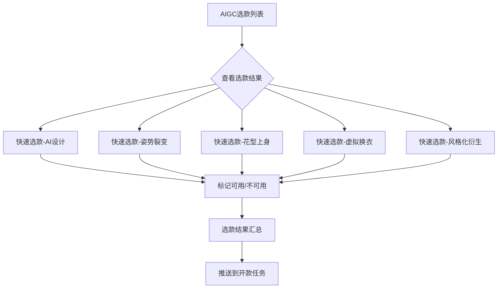

# 选款中心

## 1. 模块概述

本模块负责选款中心相关功能，涵盖 **AIGC选款 → 快速选款标记 → 选款结果管理** 完整链路。共 8 个页面。

**核心业务流程**：

**对接关系**：

| 对接系统 | 方向 | 数据/功能 | 说明 |
|---------|------|---------|------|
| 款式管理 | 输出 | 选款结果、波段、店铺 | 快速选款标记完成后推送结果 |
| 现货管理 | 输出 | 选款结果 | 标记完成后推送 |
| 开款任务管理 | 输出 | 选款结果 | 推送至开款任务 |
| AIGC | 输入 | AI生成任务数据 | 数据来源：当前租户所有用户创建的AI设计任务 |

---

## 2. 页面概述

| 页面名称 | 页面类型 | 入口/路径 | 交互形式 | 说明 |
|---------|---------|---------|---------|------|
| AIGC选款 | 列表页 | 选款中心 → AIGC选款 | 页面跳转 | 选款任务列表，支持筛选、快速标记、导入外部数据 |
| AIGC选款结果 | 列表页 | AIGC选款 → 查看结果 | 页面跳转 | 选款结果汇总，支持导出图片 |
| 详情 | 详情页 | (待补充) | 弹窗/页面跳转 | 图片详情及淘汰原因 |
| 快速选款-AI设计 | 标记页 | AIGC选款 → 快速标记 | 新标签页 | 逐组标记AI设计结果 |
| 快速选款-姿势裂变 | 标记页 | AIGC选款 → 快速标记 | 新标签页 | 逐组标记姿势裂变结果 |
| 快速选款-花型上身 | 标记页 | AIGC选款 → 快速标记 | 新标签页 | 逐组标记花型上身结果 |
| 快速选款-虚拟换衣 | 标记页 | AIGC选款 → 快速标记 | 新标签页 | 逐组标记虚拟换衣结果 |
| 快速选款-风格化衍生 | 标记页 | AIGC选款 → 快速标记 | 新标签页 | 逐组标记风格化衍生结果 |

---

## 3. 权限说明

_[TODO: 请补充权限码信息]_

---

## 4. 数据模型

_[TODO: 需补充完整的数据模型定义]_

| 属性 | 类型 | 必填 | 默认值 | 长度/范围 | 说明 |
|------|------|------|--------|----------|------|
| _待补充_ | — | — | — | — | — |

涉及实体：Task (AIGC选款任务)、Image (商品图片资源)、Category (商品类目)

---

## 5. AIGC选款

### 页面说明

**入口**: 选款中心 → AIGC选款

**数据来源**: 当前租户所有用户创建的AI设计任务数据（关联灵感源）。默认按创建时间降序排列，分页展示（默认20条/页，可选 20/50/100）。

### 查询条件

| 条件名称 | 输入方式 | 说明 |
|---------|---------|------|
| 创建人 | 输入框 | 默认查询当前用户名称 |
| 创建日期 | 日期选择 | 可选当前系统日期往前 |
| 关联SKC (v2.4.1 新增) | 文本输入 | 支持批量查询SKC编号 |
| 店铺 (v2.4.1 新增) | 多选 | 支持按店铺筛选 |
| 选款状态 | 按钮组 | 全部 / 不可用 / 未选择 / 可用 |
| 只看自己 | 开关 | 仅查看当前用户数据 |

### 显示字段

| 字段名称 | 显示为 | 说明 |
|---------|--------|------|
| 主图 | 图片 | 任务主图 |
| 任务编号 | 文本 | AIGC任务编号 |
| 算法品类 | 文本 | 如：小衫 |
| 创建人 | 文本 | 任务创建人 |
| 数据来源 | 文本 | AIGC |
| 任务类型 | 文本 | 姿势裂变 / AI设计 / 花型上身 / 虚拟换衣 / 风格化衍生 |
| 关联款式 | 文本 | SPU编码 |
| 关联SKC (v2.4.1 新增) | 文本 | 关联的SKC编号 |
| 店铺 (v2.4.1 新增) | 文本 | 关联店铺名称 |
| 选图记录 | 操作 | 查看选图记录 |

### 用例

**用例1：快速标记**
- **前置条件**：1）需要有权限；2）当前用户为设计师
- **操作**：点击后出现选项，可选项：AI设计、风格化衍生、花型上身、姿势裂变、虚拟换衣
- **后置输出**：打开新标签页，加载对应【快速选款】界面

**用例2：标记（针对当前任务）**
- **前置条件**：1）需要有权限；2）当前用户为设计师
- **操作**：点击后打开新标签页，同【快速选款】界面，但仅针对当前任务进行标记
- **后置输出**：打开新标签页

**用例3：导入外部数据**
- **前置条件**：需要有权限
- **操作**：点击后打开新标签页
- **后置输出**：打开新标签页

**用例4：查看选图记录**
- **前置条件**：需要有权限
- **操作**：点击「选图记录」
- **后置输出**：展示当前任务标记历史

### 异常处理

| 异常场景 | 用户看到的表现 |
|---------|-------------|
| 无权限 | 对应操作按钮不显示 |
| 非设计师用户 | 快速标记/标记按钮不显示 |

### 更新记录

| 关联版本 | 更新内容 | 具体说明 |
|------|------|------|
| v2.4.1 | 关联SKC+店铺 | AIGC选款增加关联SKC/店铺字段及筛选；支持按SKC批量查询 |

---

## 6. AIGC选款结果

### 页面说明

**入口**: AIGC选款 → 查看结果

### 查询条件

| 条件名称 | 输入方式 | 说明 |
|---------|---------|------|
| 关联SKC (v2.4.1 新增) | 文本输入 | 支持批量查询SKC编号 |

### 显示字段

| 字段名称 | 显示为 | 说明 |
|---------|--------|------|
| 编号 | 文本 | 结果编号 |
| 灵感图 | 图片 | 来源灵感图 |
| 结果图 | 图片 | AI生成结果图 |
| 开款信息 | 文本 | 关联的开款任务信息 |
| 选款信息 | 文本 | 选款标记结果 |
| 关联SKC (v2.4.1 新增) | 文本 | 关联的SKC编号 |

### 用例

**用例1：导出图片**
- **前置条件**：1）需要有权限；2）当前查询结果不超过1000条
- **操作**：点击导出图片，校验查询结果条数
- **后置输出**：
  1. 生成图片导出任务
  2. 生成图片压缩包，所有查询结果在一个文件夹内。文件夹命名：`选款结果_YYMMDD_****`；图片文件命名：`任务编号+款式顺序号+图片顺序号`，如 `2508010002_8_4`（任务2508010002的第八组图片的第四张）
  3. 出现异步下载组件，完成后点击下载

### 异常处理

| 异常场景 | 用户看到的表现 |
|---------|-------------|
| 导出时查询结果超过1000条 | 提示"当前查询结果过多，请控制在1000条以下" |
| 无权限 | 导出按钮不显示 |

### 更新记录

| 关联版本 | 更新内容 | 具体说明 |
|------|------|------|
| v2.4.1 | 关联SKC筛选 | AIGC选款结果增加关联SKC字段及查询项，支持批量查询 |

---

## 7. 快速选款-AI设计

### 页面说明

**入口**: AIGC选款 → 快速标记 → 选择「AI设计」

**列表行为**: 默认查询当前用户最近100条未选择的选款数据，按任务编号降序排列。每屏展示一个任务下的所有生成结果图，可切换上一组/下一组，无需分页。

### 查询条件

| 条件名称 | 输入方式 | 说明 |
|---------|---------|------|
| 只看自己 | 开关 | 仅查看当前用户数据 |
| 创建人 | 多选 | 支持多选，不支持为空 |
| 创建时间 | 日期范围 | 最大支持选择近15天，不支持为空。默认近7天。 |

### 用例

**用例1：选图**
- **前置条件**：—
- **操作**：
  1. 点击图组左侧图标，标记图片组 可用(√) 或 不可用(✗)；同一任务可自由选择，支持多次调整
  2. 点击「下一条」（快捷键 Enter）时批量提交当前任务所有结果，以图组维度保存
  3. 支持重复标记，对同一组图每次更新最新的选款结果
- **后置输出**：保存后切换到下一任务。每次点击「下一条」后禁用操作 3 秒（防误操作）。

**用例2：快捷跳转**
- **操作**：点击快捷跳转，快速定位到第一条未选择的数据，收起弹窗

**用例3：快捷返回**
- **操作**：点击查看当前查询数据列表，点击可快速跳到指定条目

**用例4：同组未选自动设置为不可用**
- **操作**：勾选后同组未标记图片自动归入不可用

**用例5：清空选择**
- **操作**：点击清空选择，清除当前任务所有标记

**用例6：设为主图**
- **操作**：选择一张图片设为主图

### 业务规则

1. 切换到不同图组时，保留店铺、波段字段选项
2. 保存时自动同步选款结果到选款记录及下游的开款任务

### 异常处理

| 异常场景 | 用户看到的表现 |
|---------|-------------|
| 创建人为空 | 不允许查询，提示必填 |
| 创建时间为空 | 不允许查询，提示必填 |
| 创建时间超过15天 | 限制选择范围 |

---

## 8. 快速选款-姿势裂变

### 页面说明

**入口**: AIGC选款 → 快速标记 → 选择「姿势裂变」

**交互形式**: 同「快速选款-AI设计」，共用相同的标记交互模式。

### 用例

同「快速选款-AI设计」：选图、快捷跳转、清空选择、设为主图。

---

## 9. 快速选款-花型上身

### 页面说明

**入口**: AIGC选款 → 快速标记 → 选择「花型上身」

**交互形式**: 同「快速选款-AI设计」。

### 用例

同「快速选款-AI设计」：选图、快捷跳转、清空选择。

---

## 10. 快速选款-虚拟换衣

### 页面说明

**入口**: AIGC选款 → 快速标记 → 选择「虚拟换衣」

**交互形式**: 同「快速选款-AI设计」。

### 用例

同「快速选款-AI设计」：选图、快捷跳转、清空选择、设为主图。

---

## 11. 快速选款-风格化衍生

### 页面说明

**入口**: AIGC选款 → 快速标记 → 选择「风格化衍生」

**交互形式**: 同「快速选款-AI设计」。

### 用例

同「快速选款-AI设计」：选图、快捷跳转、清空选择。

---

## 12. 详情

### 页面说明

**入口**: (待补充)

**交互形式**: 详情展示

### 显示字段

| 字段名称 | 显示为 | 说明 |
|---------|--------|------|
| 场景 | 文本 | 如：日常通勤 / Business casual |
| 淘汰原因 | 文本 | 淘汰原因说明 |

_[TODO: 详情页需完善字段和用例]_
