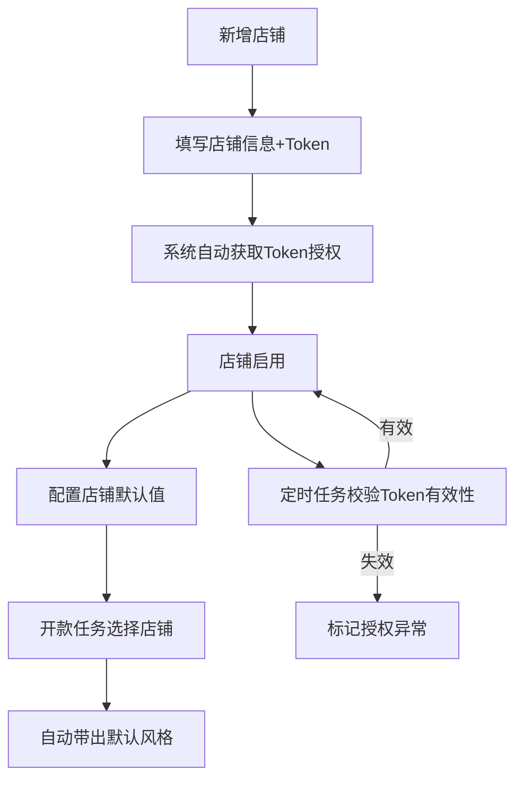
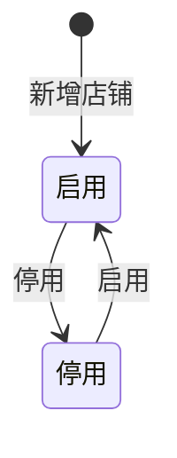
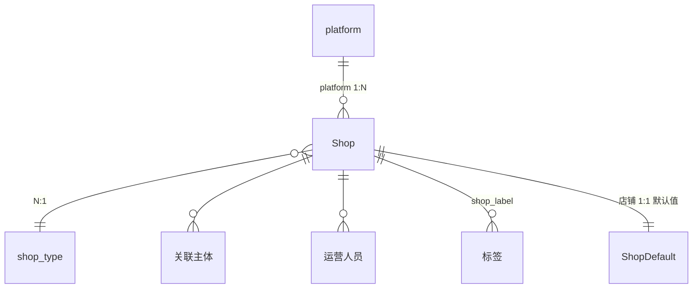

# 店铺管理

## 1. 模块概述

本模块负责 SDP 系统中店铺的全生命周期管理，包含两大子域：**店铺基础信息管理**和**店铺默认值配置**。

**店铺基础信息**：维护 Temu 等平台的店铺基础信息和 API Token，支撑商品同步、订单同步等核心业务流程。

**店铺默认值**：维护店铺维度的默认配置项（首批为「默认风格」），供开款任务选择店铺后自动填充，减少手动填写。

**核心业务流程**：

**对接关系**：

| 对接系统 | 方向 | 数据/功能 | 说明 |
|---------|------|---------|------|
| NEST 字典 | 输入 | 平台枚举、店铺类型、店铺标签、关联主体、风格编码 | 下拉选项数据来源 |
| SSO 系统 | 输入 | 运营人员列表 | 运营人员字段的数据来源 |
| POP-店铺管理 | 输入 | 店铺基础数据 | 店铺数据来源 |
| Temu 平台 | 输入/输出 | Token 鉴权、授权状态回调 | 授权成功后获取 Token 及过期时间 |
| 开款任务管理 | 输出 | 店铺列表、店铺默认风格 | 开款选择店铺后读取并自动填充风格 |
| 现货管理 | 输出 | 店铺列表 | 创建 SPU 时选择店铺 |
| Temu 商品管理 | 输出 | 店铺信息+Token | 商品同步时的 API 鉴权和店铺关联 |
| 款式管理 | 输出 | 店铺列表 | 款式创建时选择所属店铺 |

---

## 2. 页面概述

| 页面名称 | 页面类型 | 入口/路径 | 交互形式 | 说明 |
|---------|---------|---------|---------|------|
| 店铺管理列表 | 列表页 | 商品运营平台 → 基础数据 → 店铺管理 | 页面跳转 | 店铺查询与管理，含授权状态展示 |
| 添加店铺 | 表单页 | 店铺管理列表 → 点击「新增」/「编辑」 | 新标签页 | 新增/编辑店铺信息及 Token |
| 店铺默认值列表 | 列表页 | 主菜单 → 基础配置 → 店铺默认值 | 页面跳转 | 展示所有店铺的默认配置值 |
| 编辑店铺默认值 | 表单页 | 店铺默认值列表 → 点击「编辑」 | 弹窗 | 编辑店铺的默认风格配置 |

---

## 3. 权限说明

### 功能权限

**店铺管理**：

| 操作 | 特殊角色 | 备注 |
|------|---------|------|
| 新增店铺 | 管理员 | 创建新的平台店铺 |
| 编辑店铺 | 管理员 | 修改已有店铺信息 |
| 批量启用店铺 | 管理员 | 批量将店铺状态设为启用 |
| 批量停用店铺 | 管理员 | 批量将店铺状态设为停用 |

**店铺默认值**：

| 操作 | 特殊角色 | 备注 |
|------|---------|------|
| 查看店铺默认值列表 | 任意登录用户 | |
| 编辑店铺默认值 | 管理员 | |

### 数据权限

| 范围 | 规则 | 适用角色 |
|------|------|---------|
| 全部 | 同一租户下的所有数据 | 管理员 |

---

## 4. 状态机

### 店铺状态

### 店铺授权状态

授权状态通过两个字段组合表示：
- `expired`：1=有效，0=无效（Token 失效或未授权）
- `auth_start_time`：最近一次授权成功的时间
- `auth_end_time`：授权到期时间，由 Temu Token 接口返回

系统通过定时任务周期性校验所有店铺的 Token 有效性，过期或调用失败自动标记为无效。

### 状态说明

| 实体 | 状态 | 可到达的状态 | 触发动作 | 备注 |
|------|------|------------|---------|------|
| 店铺 | 启用 | 停用 | 批量停用/单个停用 | 新建店铺默认为启用；停用后商品不可再关联该店铺 |
| 店铺 | 停用 | 启用 | 批量启用/单个启用 | 重新启用后商品可关联 |
| 授权 | 有效 | 无效 | Token 过期或 API 调用失败 | 新建店铺首次授权成功后 `expired`=1；系统定时任务校验 Token 有效性 |
| 授权 | 无效 | 有效 | 重新授权（编辑店铺保存后自动获取 Token） | 编辑店铺保存时同步刷新 Token 和过期时间 |

---

## 5. 数据模型

### 5.1 实体关系

### 5.2 实体说明

#### Shop（店铺）

| 属性 | 类型 | 必填 | 默认值 | 长度/范围 | 说明 |
|------|------|------|--------|----------|------|
| 店铺ID | 长整型(雪花ID) | 自动 | — | — | 唯一标识，由后端生成 |
| 平台 | 引用 | 是 | NEST字典第一个值 | — | 取值来源：NEST字典-platform；如 TEMU；编辑时不可修改 |
| 店铺类型 | 引用 | 是 | NEST字典第一个值 | — | 取值来源：NEST字典-shop_type；如 全托/半托/半托Y2/本土店；编辑时不可修改 |
| 店铺名称 | 短文本 | 是 | — | ≤20字符 | 用户输入，模糊搜索，校验重复 |
| 关联主体 | 引用 | 是 | — | — | 取值来源：NEST字典-related_subject（主体编码+主体名称）；编辑时不可修改 |
| 运营人员 | 引用 | 是 | — | — | 取值来源：SSO人员，支持搜索 |
| 标签 | 引用(多选) | 否 | — | — | 取值来源：NEST字典-shop_label；级联下拉，支持多选 |
| 商品Token | 密文 | 是 | — | ≤256字符 | 用于 Temu 商品 API 鉴权 |
| 美区订单Token | 密文 | 否 | — | ≤256字符 | 用于 Temu 美区订单 API 鉴权 |
| 欧区订单Token | 密文 | 否 | — | ≤256字符 | 用于 Temu 欧区订单 API 鉴权 |
| 全球订单Token | 密文 | 否 | — | ≤256字符 | 用于 Temu 全球订单 API 鉴权 |
| 是否有效 | 枚举 | 自动 | 1 | 1=有效, 0=无效 | Token 过期或未授权时为0 |
| 授权开始时间 | 日期时间 | 自动 | — | — | 最近一次授权成功的时间 |
| 授权结束时间 | 日期时间 | 自动 | — | — | Temu Token 到期时间 |
| 状态 | 枚举 | 是 | 启用 | 启用/停用 | 停用后商品不可再关联该店铺 |
| 创建人 | 引用 | 自动 | — | — | 新建时写入当前用户 |
| 创建时间 | 日期时间 | 自动 | — | — | 新建时写入当前时间 |
| 更新人 | 引用 | 自动 | — | — | 每次修改时更新 |
| 更新时间 | 日期时间 | 自动 | — | — | 每次修改时更新 |

#### ShopDefault（店铺默认值）

每个店铺创建时自动生成一条 ShopDefault 记录（默认值为空），无需手动添加。

| 属性 | 类型 | 必填 | 默认值 | 长度/范围 | 说明 |
|------|------|------|--------|----------|------|
| 店铺ID | 引用 | 是 | — | — | 关联 Shop，取值来源：店铺管理；唯一 |
| 店铺名称 | 短文本 | 自动 | — | ≤100字符 | 冗余店铺名称，方便列表展示 |
| 默认风格编码 | 引用 | 否 | — | — | 取值来源：NEST字典-风格编码；未配置时为空 |
| 默认风格名称 | 短文本 | 自动 | — | ≤50字符 | 冗余风格名称，选择编码后自动填入 |
| 创建人 | 引用 | 自动 | — | — | 新建时写入当前用户 |
| 创建时间 | 日期时间 | 自动 | — | — | 新建时写入当前时间 |
| 更新人 | 引用 | 自动 | — | — | 每次修改时更新 |
| 更新时间 | 日期时间 | 自动 | — | — | 每次修改时更新 |

---

## 6. 店铺管理列表

### 页面说明

**入口**: 商品运营平台 → 基础数据 → 店铺管理

**权限**: 见 [3. 权限说明](#3-权限说明)

**列表行为**:
- 数据来源：当前租户的店铺数据（来自 POP-店铺管理）
- 默认排序：创建时间降序
- 分页：默认 20 条/页，可选 20/50/100
- 刷新方式：手动刷新

### 查询条件

| 条件名称 | 输入方式 | 说明 |
|---------|---------|------|
| 店铺名称 | 文本输入 | 模糊搜索 |
| 店铺类型 | 下拉单选 | 筛选指定类型的店铺 |
| 运营人员 | 下拉选择+搜索 | 搜索运营人员 |
| 店铺状态 | 下拉单选 | 枚举：启用、停用 |
| 授权状态 | 下拉单选 | 枚举：全部、正常、异常 |

### 显示字段

| 字段名称 | 显示为 | 说明 |
|---------|--------|------|
| 平台 | 文本/标签 | 所属平台，如"TEMU" |
| 店铺类型 | 文本/标签 | 如"全托""半托""本土店" |
| 店铺名称 | 可点击文本 | 点击可查看详情 |
| 店铺ID | 文本 | 系统生成的唯一标识 |
| 关联主体 | 文本 | 关联主体名称 |
| 授权状态 | 状态标签 | 有效=绿色，异常=红色；显示授权时间段 |
| 状态 | 状态标签 | 启用=绿色，停用=灰色 |
| 创建信息 | 格式化文本 | 创建人 + 创建时间 |
| 更新信息 | 格式化文本 | 更新人 + 更新时间 |
| 操作 | 操作按钮 | 查看、编辑 |

### 行操作

| 操作 | 出现条件 | 需要的角色 | 交互形式 | 说明 |
|------|---------|-----------|---------|------|
| 新增 | 始终显示 | 管理员 | 新标签页 | 打开「添加店铺」新增页面 |
| 查看 | 始终显示 | 管理员 | 新标签页 | 查看店铺详情 |
| 编辑 | 始终显示 | 管理员 | 新标签页 | 打开「添加店铺」编辑页面，带入已有数据 |

### 批量操作

| 操作 | 可选条件 | 最少选中 | 需要的角色 | 说明 |
|------|---------|---------|-----------|------|
| 批量启用 | 所选数据均为停用状态 | 1 条 | 管理员 | 批量将店铺状态设为启用 |
| 批量停用 | 所选数据均为启用状态 | 1 条 | 管理员 | 批量将店铺状态设为停用 |

### 状态展示

| 状态 | 触发条件 | 展示内容 |
|------|---------|---------|
| 加载中 | 数据请求未完成 | 占位动画 |
| 空数据 | 查询无结果 | 空状态插图 + "暂无数据" |
| 加载失败 | 数据请求失败 | 错误提示 + "重试"按钮 |
| 无权限 | 用户无此页面访问权限 | "暂无访问权限，请联系管理员" |

### 用例

##### 用例1：新增店铺
- **前置条件**：需要有权限
- **输入**：点击「新增」按钮
- **业务规则**：新标签页打开「添加店铺」新增页面
- **后置输出**：打开新标签页
- **验收标准**：
  - [ ] 无权限用户看不到「新增」按钮
  - [ ] 点击按钮新标签页打开新增店铺页面
  - [ ] 创建成功后列表刷新

##### 用例2：编辑店铺
- **前置条件**：需要有权限
- **输入**：点击「编辑」按钮
- **业务规则**：新标签页打开「添加店铺」编辑页面，带入已有店铺数据
- **后置输出**：保存成功后店铺信息更新，列表刷新
- **验收标准**：
  - [ ] 编辑页面正确带入已有数据
  - [ ] 平台和店铺类型在编辑模式下不可修改
  - [ ] 保存后列表刷新
  - [ ] 更新人、更新时间正确记录
- **异常处理**：

| 异常场景 | 用户看到的表现 |
|---------|-------------|
| 店铺被他人删除 | 提示"数据不存在"，返回列表页 |

##### 用例3：批量启用/停用
- **前置条件**：需要有权限
- **输入**：勾选需要操作的店铺，点击「批量启用」或「批量停用」
- **业务规则**：批量将选中店铺状态更新为目标值
- **后置输出**：店铺状态变更，列表刷新
- **验收标准**：
  - [ ] 仅停用状态可批量启用
  - [ ] 仅启用状态可批量停用

---

## 7. 添加店铺

### 页面说明

**入口**: 店铺管理列表 → 点击「新增」/「编辑」

**交互形式**: 新标签页

**权限**: 管理员

**双模式**：
- 新增模式：标题为"新增店铺"，所有字段可编辑
- 编辑模式：标题为"编辑店铺"，平台和店铺类型不可修改（disabled），其余字段回填已有值

### 表单字段

| 字段名称 | 输入方式 | 必填 | 校验规则 | 默认值 | 说明 |
|---------|---------|------|---------|--------|------|
| 平台 | 下拉单选 | 是 | — | 选中第一个值 | 取值来源：NEST字典-platform；编辑时 disabled |
| 店铺类型 | 下拉单选 | 是 | — | 选中第一个值 | 取值来源：NEST字典-shop_type；编辑时 disabled |
| 店铺名称 | 文本输入 | 是 | 最多20字，校验重复 | — | 保存时校验名称是否被其他店铺占用 |
| 关联主体 | 下拉单选 | 是 | — | — | 取值来源：NEST字典-related_subject；编辑时不可修改 |
| 运营人员 | 下拉选择+搜索 | 是 | — | — | 取值来源：SSO人员 |
| 标签 | 级联下拉 | 否 | — | — | 取值来源：NEST字典-shop_label；支持多选 |
| 商品Token | 文本输入 | 是 | 最多256字 | — | 用于 Temu 商品 API 鉴权 |
| 订单Token | 文本输入 | 否 | 最多256字 | — | 用于 Temu 订单 API 鉴权 |

### 业务规则

1. **平台默认选中**：新增时默认选中 NEST 字典 platform 的第一个值
2. **店铺类型默认选中**：新增时默认选中 NEST 字典 shop_type 的第一个值
3. **编辑时不可修改**：编辑模式下，平台、店铺类型、关联主体字段为 disabled 状态
4. **店铺名称唯一性**：保存时校验店铺名称是否已被其他店铺占用，重复则提示
5. **店铺名称长度限制**：最多允许输入 20 字
6. **Token 长度限制**：商品 Token 和订单 Token 最多允许输入 256 字

### 操作

| 操作 | 说明 |
|------|------|
| 确定 | 校验通过后保存店铺信息，保存时自动获取 Temu Token 并记录授权时间/过期时间；返回列表页 |
| 取消 | 放弃当前操作，返回列表页 |

### 用例

##### 用例1：新增店铺
- **前置条件**：需要有权限
- **输入**：选择平台、店铺类型，输入店铺名称，选择关联主体、运营人员，（可选）选择标签，填写商品 Token，（可选）填写订单 Token，点击「确定」
- **业务规则**：校验必填项、店铺名称唯一性、长度限制；保存时自动获取 Temu Token 并记录授权时间/过期时间
- **后置输出**：店铺创建成功，状态=启用，同时自动生成一条 ShopDefault 记录（默认风格为空）；返回列表页
- **验收标准**：
  - [ ] 必填项校验正确
  - [ ] 店铺名称超过 20 字时提示
  - [ ] 创建成功后返回列表页，列表刷新
  - [ ] 平台和店铺类型默认选中第一个值
  - [ ] 新店铺在「店铺默认值列表」中自动出现

##### 用例2：编辑店铺
- **前置条件**：1）需要有权限；2）店铺已存在
- **输入**：修改可编辑字段值，点击「确定」
- **业务规则**：平台、店铺类型、关联主体不可修改（disabled）；编辑保存时同步刷新 Token，更新授权时间和过期时间
- **后置输出**：店铺信息更新，更新人、更新时间正确记录；返回列表页
- **验收标准**：
  - [ ] 已有数据正确回填
  - [ ] 平台、店铺类型、关联主体不可修改（灰色 disabled 状态）
  - [ ] 更新信息正确记录
- **异常处理**：

| 异常场景 | 用户看到的表现 |
|---------|-------------|
| 店铺名称超过20字 | 提示"店铺名称最多输入20字" |
| 店铺名称为空 | 提示"请输入店铺名称" |
| 店铺名称重复 | 提示"店铺名称已经存在【xxx】，请勿重复添加" |
| 未选择平台 | 提示"请选择平台" |
| 未选择店铺类型 | 提示"请选择店铺类型" |
| 未选择关联主体 | 提示"请选择关联主体" |
| 未填写运营人员 | 提示"请填写运营人员" |
| 未填写商品Token | 提示"请填写商品Token" |
| Token超过256字 | 提示"Token最多输入256字" |
| Token 失效 | 提示"店铺【xxx】Token失效" |
| 保存失败 | 提示失败原因，保留已填数据 |

---

## 8. 店铺默认值列表

### 页面说明

**入口**: 主菜单 → 基础配置 → 店铺默认值

**权限**: 见 [3. 权限说明](#3-权限说明)

**数据来源**：加载当前租户下所有启用状态的店铺及其默认值配置。每个店铺在创建时自动生成一条 ShopDefault 记录（默认风格初始为空），无需手动添加。停用的店铺不在此列表展示。

**列表行为**:
- 默认排序：店铺ID升序
- 分页：默认 20 条/页
- 刷新方式：手动刷新

### 查询条件

| 条件名称 | 输入方式 | 说明 |
|---------|---------|------|
| 店铺名称 | 文本输入 | 模糊搜索 |
| 默认风格 | 下拉单选 | 取值来源：NEST字典 |

### 显示字段

| 字段名称 | 显示为 | 说明 |
|---------|--------|------|
| 店铺名称 | 文本 | 店铺名称 |
| 默认风格 | 标签 | 默认风格名称；未配置时显示"未设置" |
| 更新时间 | 格式化文本 | 最近更新时间，格式 YYYY-MM-DD HH:mm |
| 更新人 | 文本 | 最近更新操作人 |
| 操作 | 操作按钮 | 编辑 |

### 行操作

| 操作 | 出现条件 | 需要的角色 | 交互形式 | 说明 |
|------|---------|-----------|---------|------|
| 编辑 | 始终显示 | 管理员 | 弹窗 | 打开编辑店铺默认值弹窗 |

### 状态展示

| 状态 | 触发条件 | 展示内容 |
|------|---------|---------|
| 加载中 | 数据请求未完成 | 占位动画 |
| 空数据 | 无启用状态的店铺 | 空状态插图 + "暂无店铺数据" |
| 加载失败 | 数据请求失败 | 错误提示 + "重试"按钮 |

### 用例

##### 用例1：查询店铺默认值
- **前置条件**：用户已登录
- **输入**：输入店铺名称或选择默认风格筛选
- **业务规则**：按条件筛选店铺默认值列表；仅展示启用状态的店铺
- **后置输出**：列表展示符合条件的店铺默认值
- **验收标准**：
  - [ ] 查询条件正确筛选
  - [ ] 未配置默认风格的店铺显示"未设置"
  - [ ] 新增店铺自动出现在列表中
  - [ ] 停用店铺不出现在列表中
  - [ ] 分页正常

### 更新记录

| 关联版本 | 更新内容 | 具体说明 |
|------|------|------|
| v2.6.0 | 初始创建 | 新增店铺默认风格配置，供开款任务自动填充 |

---

## 9. 编辑店铺默认值

### 页面说明

**入口**: 店铺默认值列表 → 点击「编辑」

**交互形式**: 弹窗

**权限**: 管理员

### 页面布局

| 区域 | 内容 | 说明 |
|------|------|------|
| 店铺信息 | 店铺名称（只读） | 回显当前店铺 |
| 配置区 | 默认风格 | 下拉选择 |
| 底部操作栏 | 确定、取消 | |

### 表单字段

| 字段名称 | 输入方式 | 必填 | 校验规则 | 默认值 | 说明 |
|---------|---------|------|---------|--------|------|
| 默认风格 | 下拉单选 | 否 | — | 回显当前值 | 取值来源：NEST字典-风格编码；允许清空 |

### 业务规则

1. 每个店铺有且仅有一条默认值记录，店铺创建时自动生成
2. 编辑时更新更新人和更新时间

### 操作

| 操作 | 说明 |
|------|------|
| 确定 | 校验通过后保存，更新人/更新时间自动写入 |
| 取消 | 放弃修改，关闭弹窗 |

### 用例

##### 用例1：编辑店铺默认风格
- **前置条件**：需要有管理员权限
- **输入**：选择默认风格，点击「确定」
- **业务规则**：保存店铺对应的默认风格；更新人、更新时间自动写入
- **后置输出**：弹窗关闭，列表刷新
- **验收标准**：
  - [ ] 风格下拉选项正确
  - [ ] 保存后列表正确展示新值
  - [ ] 无管理员权限时不显示编辑按钮
  - [ ] 更新人、更新时间正确记录
- **异常处理**：

| 异常场景 | 用户看到的表现 |
|---------|-------------|
| 店铺数据不存在（店铺已被删除或停用） | 提示"店铺数据不存在"，关闭弹窗 |
| 保存失败 | 提示失败原因，保留已填内容 |

---

## 10. 对外接口说明

### 给开款任务管理的接口

开款任务选择店铺后，调用本模块获取该店铺的默认值。

| 输入 | 输出 | 说明 |
|------|------|------|
| 店铺ID | 默认风格编码+名称 | 该店铺存在默认值配置时返回 |
| 店铺ID | null | 该店铺未配置默认值时返回空，开款页风格字段不自动填充 |

### 给下游模块的店铺查询接口

| 调用方 | 用途 | 返回数据 |
|------|------|---------|
| 现货管理 | 创建SPU时选择店铺 | 启用状态的店铺列表（店铺ID、店铺名称） |
| Temu商品管理 | 商品上架关联店铺 + API鉴权 | 店铺信息 + Token |
| 款式管理 | 款式创建时选择所属店铺 | 启用状态的店铺列表 |
