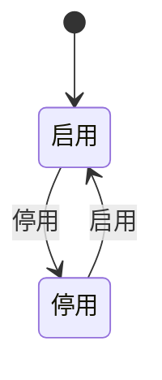
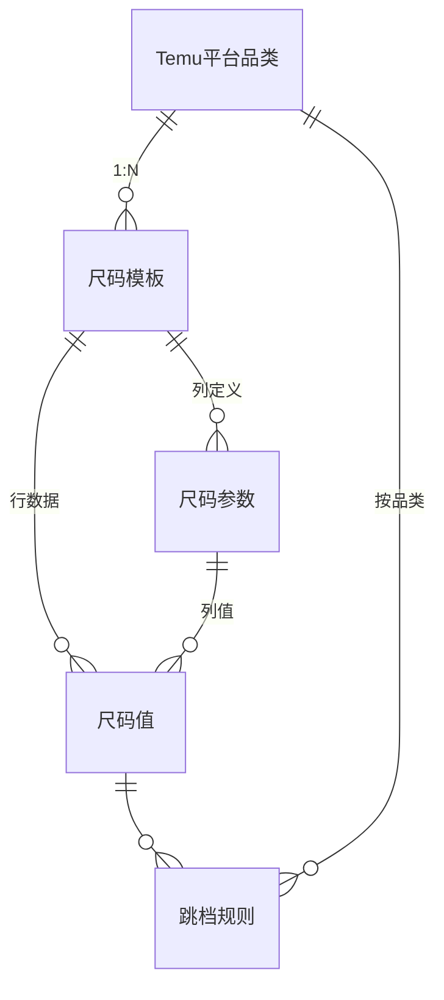

# 尺码表管理

## 1. 模块概述

本模块负责尺码模板的全生命周期管理，是 Temu 商品上架体系中尺码数据的标准化入口。

**业务背景**：Temu 平台要求商品必须关联规范的尺码表。SDP 系统需要维护一套通用的尺码模板体系，支持按平台品类定义尺码参数（列）和尺码值（行），并通过档差规则实现尺码值的自动计算。模板在店铺维度实例化后供商品引用。

**核心业务流程**：

```mermaid
flowchart TD
    A[选择平台品类] --> B[创建/编辑尺码模板]
    B --> C[定义尺码参数 (列)]
    C --> D[选择尺码组 (行)]
    D --> E[填写尺码值 + 档差]
    E --> F{跳档规则}
    F -->|有规则| G[向下计算自动填充]
    F -->|无规则| E
    G --> H[保存模板]
    H --> I[店铺维度实例化]
    I --> J[商品引用]
```

**对接关系**：

| 对接系统 | 方向 | 数据/功能 | 说明 |
|---------|------|---------|------|
| Temu 平台 | 输入 | 平台品类、尺码参数、尺码组 | 拉取 Temu 品类下的尺码要求 |
| NEST 字典 | 输入 | plm_standard_size 尺码组 | 尺码组数据来源 |
| 店铺管理 | 输入 | 店铺列表 | 模板在店铺维度实例化 |
| Temu 商品管理 | 输出 | 尺码模板 | 商品创建/编辑时引用尺码模板 |
| 现货管理 | 输出 | 尺码模板 | 商品创建/编辑时引用尺码模板 |
| 款式管理 | 输出 | 尺码模板 | 款式关联尺码信息时引用 |

---

## 2. 页面概述

| 页面名称 | 页面类型 | 入口/路径 | 交互形式 | 说明 |
|---------|---------|---------|---------|------|
| 尺码表列表 | 列表页 | 主菜单 → 尺码表管理 | 页面跳转 | 默认着陆页，模板查询与管理 |
| 尺码表模板 | 表单页 | 尺码表列表 → 点击「新增」/「编辑」/「复制」 | 新标签页 | 新增/编辑尺码模板 |
| 跳档规则维护 | 列表页 | 尺码表管理 → 跳档规则 | 页面跳转 | 档差计算规则的维护列表 |
| 创建跳档规则 | 表单页 | 跳档规则维护 → 点击「创建」 | 弹窗/新标签页 | 创建一条跳档规则 |
| 品类管理 | 列表页 | 基础数据 → 品类 | 页面跳转 | 品类数据维护（待补充） |

---

## 3. 权限说明

### 功能权限
仅说明需要特别逻辑处理的特殊角色，其余菜单权限通过 RBAC 系统配置。

| 操作 | 特殊角色 | 备注 |
|------|---------|------|
| 新增模板 | 商品运营 | |
| 编辑模板 | 商品运营 | |
| 复制模板 | 商品运营 | 复制已有模板作为新模板的基础 |
| 批量启用 | 商品运营 | 将选中模板状态设为启用 |
| 批量停用 | 商品运营 | 将选中模板状态设为停用 |
| 提交模板 | 商品运营 | 校验通过后保存模板 |

### 数据权限

| 范围 | 规则 | 适用角色 |
|------|------|---------|
| 全部 | 同一租户下的所有数据 | 管理员 |

---

## 4. 状态机

### 尺码模板状态



### 模板状态说明

| 状态 | 可到达的状态 | 触发动作 | 备注 |
|------|------------|---------|------|
| 启用 | 停用 | 停用模板 | 初始状态，新建模板默认为启用；停用后商品不可再引用 |
| 停用 | 启用 | 启用模板 | 重新启用后商品可引用 |

---

## 5. 数据模型

### 5.1 实体关系



### 5.2 实体说明

#### 尺码模板

| 属性 | 类型 | 必填 | 默认值 | 长度/范围 | 说明 |
|------|------|------|--------|----------|------|
| 模板ID | 短文本 | 是 | — | ≤32字符 | 唯一标识 |
| 模板名称 | 短文本 | 是 | — | ≤20字符 | 用于查询模板，校验重复 |
| 关联平台品类 | 引用 | 是 | — | — | 取值来源：Temu 平台品类；一个品类允许关联多个模板 |
| 尺码组 | 引用 | 是 | — | — | 取值来源：NEST 字典 plm_standard_size |
| 状态 | 枚举 | 是 | 启用 | 启用/停用 | 停用后商品不可再引用 |
| 创建人 | 引用 | 自动 | — | — | 新建时写入当前用户 |
| 创建时间 | 日期时间 | 自动 | — | — | 新建时写入当前时间 |
| 更新人 | 引用 | 自动 | — | — | 每次修改时更新 |
| 更新时间 | 日期时间 | 自动 | — | — | 每次修改时更新 |

#### 模板尺码参数（列）

| 属性 | 类型 | 必填 | 默认值 | 长度/范围 | 说明 |
|------|------|------|--------|----------|------|
| 所属模板 | 引用 | 是 | — | — | 关联尺码模板 |
| 参数名称 | 短文本 | 是 | — | — | 如：肩宽、胸围全围、袖长、腰围全围 |
| 是否平台必填 | 布尔 | 是 | — | — | 平台要求必填的参数自动勾选，禁止取消 |
| 排序 | 整数 | 否 | — | — | 参数在模板中的列顺序 |

#### 模板尺码值（单元格）

| 属性 | 类型 | 必填 | 默认值 | 长度/范围 | 说明 |
|------|------|------|--------|----------|------|
| 所属模板 | 引用 | 是 | — | — | 关联尺码模板 |
| 尺码 | 短文本 | 是 | — | — | 如：S、M、L、XL、XXL |
| 参数名称 | 引用 | 是 | — | — | 关联尺码参数 |
| 尺码值 | 小数(1位) | 是 | — | — | 具体某个尺码某个部位的值 |
| 档差 | 小数(1位) | 是 | — | — | 两个相邻尺码之间的差值 |

#### 跳档规则

| 属性 | 类型 | 必填 | 默认值 | 长度/范围 | 说明 |
|------|------|------|--------|----------|------|
| 规则ID | 短文本 | 是 | — | ≤32字符 | 唯一标识 |
| 平台品类 | 引用 | 是 | — | — | 适用品类，取值来源：Temu 平台品类 |
| 尺码参数 | 引用 | 是 | — | — | 适用尺码参数名称 |
| 起始尺码值 | 小数(1位) | 是 | — | — | 起始尺码的基准值 |
| 跳档公式/档差 | 小数(1位) | 是 | — | — | 每跳一档的增量值 |

---

## 6. 尺码表列表

### 页面说明

**入口**: 主菜单 → 商品管理 → 尺码表管理

**权限**: 见 [3. 权限说明](#3-权限说明)

**数据范围**:
- 全部：同一租户下的所有数据

**列表行为**:
- 数据来源：当前租户所有用户创建的尺码模板数据
- 默认排序：创建时间降序
- 分页：默认 20 条/页，可选 20/50/100
- 刷新方式：手动刷新

### 查询条件

| 条件名称 | 输入方式 | 说明 |
|---------|---------|------|
| 模板名称 | 文本输入 | 模糊搜索 |
| 平台品类 | 下拉单选 | 按平台品类筛选 |

### 显示字段

| 字段名称 | 显示为 | 说明 |
|---------|--------|------|
| 模板名称 | 可点击文本 | 如"下装""连衣裙"，点击跳转编辑 |
| 平台品类 | 文本/标签 | 关联的 Temu 平台品类 |
| 状态 | 状态标签 | 启用=绿色，停用=灰色 |
| 创建信息 | 格式化文本 | 创建人 + 创建时间 |
| 更新信息 | 格式化文本 | 更新人 + 更新时间 |
| 操作 | 操作按钮 | 复制、编辑 |

### 行操作

| 操作 | 出现条件 | 需要的角色 | 交互形式 | 说明 |
|------|---------|-----------|---------|------|
| 新增 | 始终显示 | 商品运营 | 新标签页 | 打开「尺码表模板」新增页面 |
| 编辑 | 始终显示 | 商品运营 | 新标签页 | 打开「尺码表模板」编辑页面，带入已有数据 |
| 复制 | 始终显示 | 商品运营 | 新标签页 | 以当前模板为基础复制一个新模板 |

### 批量操作

| 操作 | 可选条件 | 最少选中 | 需要的角色 | 说明 |
|------|---------|---------|-----------|------|
| 批量启用 | 所选数据均为停用状态 | 1 条 | 商品运营 | 批量将模板状态设为启用 |
| 批量停用 | 所选数据均为启用状态 | 1 条 | 商品运营 | 批量将模板状态设为停用 |

### 状态展示

| 状态 | 触发条件 | 展示内容 |
|------|---------|---------|
| 加载中 | 数据请求未完成 | 占位动画 |
| 空数据 | 查询无结果 | 空状态插图 + "暂无数据" |
| 加载失败 | 数据请求失败 | 错误提示 + "重试"按钮 |
| 无权限 | 用户无此页面访问权限 | "暂无访问权限，请联系管理员" |

### 用例

##### 用例1：新增模板
- **前置条件**：1）需要有权限；2）需要为商品运营
- **输入**：点击「新增」按钮
- **业务规则**：新标签页打开「尺码表模板」新增页面
- **后置输出**：打开新标签页
- **验收标准**：
  - [ ] 无权限用户看不到「新增」按钮
  - [ ] 点击按钮新标签页打开新增模板页面
  - [ ] 创建成功后列表刷新

##### 用例2：编辑模板
- **前置条件**：1）需要有权限；2）需要为商品运营
- **输入**：点击「编辑」按钮
- **业务规则**：新标签页打开「尺码表模板」编辑页面，带入已有模板数据
- **后置输出**：
  - 保存成功后模板更新
  - 编辑模板时，需要关联更新所有店铺的模板
- **验收标准**：
  - [ ] 编辑页面正确带入已有数据
  - [ ] 保存后列表刷新
  - [ ] 关联店铺的模板同步更新
- **异常处理**：

| 异常场景 | 用户看到的表现 |
|---------|-------------|
| 模板被他人删除 | 提示"数据不存在"，返回列表页 |

##### 用例3：复制模板
- **前置条件**：1）需要有权限；2）需要为商品运营
- **输入**：点击「复制」按钮
- **业务规则**：以当前模板数据为基础，打开新增页面
- **后置输出**：新模板创建成功，列表刷新
- **验收标准**：
  - [ ] 复制后打开的新增页面已填入原模板数据
  - [ ] 模板名称不重复（建议自动追加后缀）

##### 用例4：批量启用
- **前置条件**：1）需要有权限；2）所选数据均为停用状态
- **输入**：勾选停用模板，点击「批量启用」
- **业务规则**：批量将选中模板状态更新为启用
- **后置输出**：模板状态变更为启用，列表刷新
- **验收标准**：
  - [ ] 仅停用状态可批量启用
  - [ ] 启用后模板可被商品引用

##### 用例5：批量停用
- **前置条件**：1）需要有权限；2）所选数据均为启用状态
- **输入**：勾选启用模板，点击「批量停用」
- **业务规则**：批量将选中模板状态更新为停用
- **后置输出**：模板状态变更为停用，列表刷新
- **验收标准**：
  - [ ] 仅启用状态可批量停用
  - [ ] 停用后模板不可被新增商品引用

---

## 7. 尺码表模板

### 页面说明

**入口**: 尺码表列表 → 点击「新增」/「编辑」/「复制」

**交互形式**: 新标签页

**权限**: 商品运营

### 页面布局

| 区域 | 内容 | 说明 |
|------|------|------|
| 顶部信息区 | 模板名称、关联平台品类 | 基本信息输入 |
| 尺码参数选择区 | 肩宽/胸围全围/袖长/腰围全围等 checkbox | 选择作为尺码表列的参数，平台必填项自动勾选禁止取消 |
| 尺码选择区 | S/M/L/XL/XXL 等 checkbox + 尺码组下拉 | 选择作为尺码表行的尺码 |
| 尺码值编辑区 | 尺码 × 参数 的网格表格 | 填入每个尺码每个参数的具体值和档差 |
| 底部操作栏 | 提交、返回 | 全局操作按钮 |

### 表单字段

| 字段名称 | 输入方式 | 必填 | 校验规则 | 默认值 | 说明 |
|---------|---------|------|---------|--------|------|
| 模板名称 | 文本输入 | 是 | 校验重复值，最多输入 20 字 | — | |
| 关联平台品类 | 单选 | 是 | — | — | 取值来源：Temu 平台品类；同一品类允许关联多个模板 |
| 尺码参数 | 多选(checkbox) | 是 | 平台要求必填的自动勾选，禁止取消 | — | 根据 Temu 平台品类获取尺码参数 |
| 尺码组 | 单选 | 是 | — | — | 取值来源：NEST 字典 plm_standard_size |
| 尺码 | 多选(checkbox) | 是 | 至少需要选中一个 | — | 根据 Temu 尺码组获取尺码 |
| 尺码值 | 数字输入 | 是 | 支持录入 1 位小数 | — | 具体某个尺码某个部位的值 |
| 档差 | 数字输入 | 是 | 支持录入 1 位小数 | — | 两个尺码之间的差值 |

### 尺码值编辑区操作

| 操作 | 说明 |
|------|------|
| 清空 | 清空当前列的尺码值 |
| 向下计算 | 输入档差后自动向下填充：下一个尺码的值 = 当前值 + 档差 |

### 业务规则

1. **模板名称唯一性**：保存时校验名称是否已被占用，重复则提示
2. **平台品类数据加载**：选择关联平台品类后，自动加载该品类下的尺码参数和尺码组
3. **平台必填参数**：平台要求必填的尺码参数自动勾选，不允许取消勾选
4. **尺码至少选一个**：尺码复选框至少需要选中一个
5. **店铺维度逻辑**：
   - SDP 内部模板为通用模板，不区分店铺
   - Temu 平台的尺码为店铺维度，需要：先店铺维度新增一个尺码表，再保存为模板
   - 创建商品时，如用到该尺码表，需要在对应店铺下新增
   - 编辑模板时，需要关联更新所有店铺的模板
6. **档差自动计算**：点击「向下计算」，根据档差自动计算每个尺码的尺码值
7. **保存模板**：点击提交后新增一个尺码模板，默认为启用状态

### 操作

| 操作 | 说明 |
|------|------|
| 提交 | 保存模板，校验通过后新建/更新模板，返回列表页 |
| 返回 | 放弃当前操作，返回列表页 |

### 用例

##### 用例1：新增尺码模板
- **前置条件**：1）需要有权限；2）需要为商品运营
- **输入**：
  - 填写模板名称
  - 选择关联平台品类
  - 勾选尺码参数（平台必填项已默认勾选）
  - 选择尺码组
  - 勾选尺码
  - 填入尺码值和档差
  - 点击「提交」
- **业务规则**：
  - 校验模板名称唯一性和必填项
  - 尺码参数中平台必填项自动勾选，禁止取消
  - 尺码至少选中一个
  - 尺码值和档差支持 1 位小数
- **后置输出**：新模板状态=启用，返回列表页，列表刷新
- **验收标准**：
  - [ ] 必填项校验正确（名称、品类、尺码组、尺码值、档差）
  - [ ] 名称重复时提示
  - [ ] 名称超过 20 字时提示
  - [ ] 平台必填参数不可取消勾选
  - [ ] 档差向下计算功能正常
  - [ ] 创建成功后返回列表页

##### 用例2：编辑尺码模板
- **前置条件**：1）需要有权限；2）模板已存在
- **输入**：修改模板字段值，点击「提交」
- **业务规则**：
  - 校验规则同新增
  - 编辑后需关联更新所有使用该模板的店铺
- **后置输出**：模板更新成功，关联店铺模板同步更新
- **验收标准**：
  - [ ] 已有数据正确回填
  - [ ] 修改后关联店铺模板同步
  - [ ] 更新信息（更新人、更新时间）正确记录
- **异常处理**：

| 异常场景 | 用户看到的表现 |
|---------|-------------|
| 模板名称重复 | 提示"模板名称已存在，请修改" |
| 模板名称超过 20 字 | 提示"模板名称最多输入 20 字" |
| 模板名称为空 | 提示"请输入模板名称" |
| 未选择平台品类 | 提示"请选择关联平台品类" |
| 未勾选任何尺码 | 提示"至少需要选中一个尺码" |
| 尺码值未填 | 对应单元格标红提示 |
| 档差未填 | 对应单元格标红提示 |
| 保存失败 | 提示失败原因，保留已填数据 |

---

## 8. 跳档规则维护

### 页面说明

**入口**: 尺码表管理 → 跳档规则

**交互形式**: 页面跳转

**权限**: 商品运营

> **注意**：本页面暂无对应的 Axure 原型 HTML 文件。以下内容为基于「尺码表模板」中档差功能的推断，需与产品方确认后完善。

**列表行为**:
- 数据来源：当前租户的跳档规则数据
- 默认排序：创建时间降序
- 分页：默认 20 条/页

### 查询条件

_[TODO: 请补充具体的查询条件]_

### 显示字段

| 字段名称 | 显示为 | 说明 |
|---------|--------|------|
| 平台品类 | 文本 | 适用的 Temu 平台品类 |
| 尺码参数 | 文本 | 尺码参数名称（如肩宽、胸围） |
| 起始值 | 格式化文本 | 起始尺码的基准值 |
| 档差 | 格式化文本 | 每跳一档的增量 |
| 创建信息 | 格式化文本 | 创建人 + 创建时间 |
| 操作 | 操作按钮 | 编辑、删除 |

### 行操作

| 操作 | 出现条件 | 需要的角色 | 交互形式 | 说明 |
|------|---------|-----------|---------|------|
| 创建 | 始终显示 | 商品运营 | 弹窗/新标签页 | 打开「创建跳档规则」页面 |
| 编辑 | 始终显示 | 商品运营 | 弹窗/新标签页 | 编辑跳档规则 |
| 删除 | 始终显示 | 商品运营 | 二次确认弹窗 | 删除跳档规则 |

### 用例

##### 用例1：查看跳档规则列表
- **前置条件**：1）需要有权限
- **输入**：进入跳档规则维护页面
- **业务规则**：加载当前租户的跳档规则数据，按创建时间降序排列
- **后置输出**：展示跳档规则列表
- **验收标准**：
  - [ ] 列表正确展示跳档规则数据
  - [ ] 分页功能正常

---

## 9. 创建跳档规则

### 页面说明

**入口**: 跳档规则维护 → 点击「创建」

**交互形式**: 弹窗 / 新标签页

**权限**: 商品运营

> **注意**：本页面暂无对应的 Axure 原型 HTML 文件。以下内容为基于「尺码表模板」中档差计算逻辑的推断，需与产品方确认后完善。

### 表单字段

| 字段名称 | 输入方式 | 必填 | 校验规则 | 说明 |
|---------|---------|------|---------|------|
| 平台品类 | 单选 | 是 | — | 取值来源：Temu 平台品类 |
| 尺码参数 | 单选 | 是 | — | 如：肩宽、胸围、袖长等 |
| 起始尺码值 | 数字输入 | 是 | 支持 1 位小数 | 起始尺码的基准值 |
| 档差 | 数字输入 | 是 | 支持 1 位小数 | 每跳一档的增量值 |

### 业务规则

1. 根据平台品类 + 尺码参数定义跳档规则
2. 跳档规则用于在尺码模板中自动计算尺码值：
   - 给定起始值和档差，点击「向下计算」自动填充后续尺码值
3. 同一品类 + 同一尺码参数是否允许多条规则：_[TODO: 请确认]_

### 用例

##### 用例1：创建跳档规则
- **前置条件**：1）需要有权限；2）需要为商品运营
- **输入**：填写平台品类、尺码参数、起始值、档差，点击提交
- **业务规则**：校验必填项，保存跳档规则
- **后置输出**：跳档规则创建成功，返回列表页
- **验收标准**：
  - [ ] 必填项校验正确
  - [ ] 规则创建成功后列表刷新
- **异常处理**：

| 异常场景 | 用户看到的表现 |
|---------|-------------|
| 必填项为空 | 对应字段标红提示 |
| 同品类+同参数已有规则 | _[TODO: 请确认是否允许重复]_ |

---

## 10. 平台品类管理

_[TODO: 待补充完整的 HTML 原型分析]_
