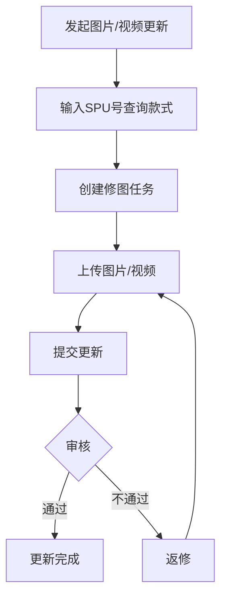
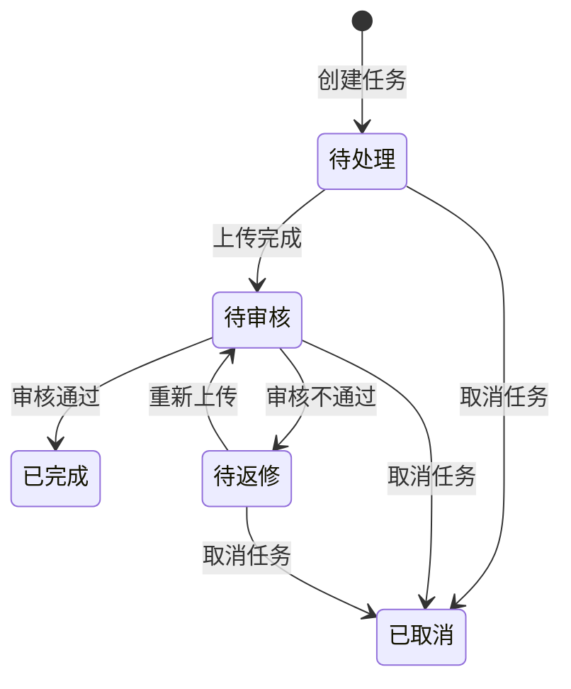

# 图片更新任务

## 1. 模块概述

本模块负责图片更新任务相关功能，涵盖**上传图片 → 创建修图任务 → 审核更新结果**完整链路。共 8 个页面。

**核心业务流程**：

**对接关系**：

| 对接系统 | 方向 | 数据/功能 | 说明 |
|---------|------|---------|------|
| 款式管理 | 输入 | SPU/款式数据、营销图 | 发起更新时查询款式信息 |
| 现货管理 | 输入 | SKC数据、商品图 | 发起更新时查询现货信息 |

---

## 2. 页面概述

| 页面名称 | 页面类型 | 入口/路径 | 交互形式 | 说明 |
|---------|---------|---------|---------|------|
| 图片更新任务列表 | 列表页 | 设计中心 → 图片更新任务 | 页面跳转 | 任务列表主页面，含状态筛选 + 搜索 |
| 发起图片/视频更新 | 表单页 | 列表页 → 点击「创建任务」 | 新标签页 | 输入SPU号发起更新 |
| 创建修图任务 | 表单页 | 发起更新 → 确认 | 页面跳转 | 选择图片并填写修图说明 |
| 编辑修图任务 (v2.6.0 新增) | 表单页 | 图片更新任务列表 → 点击「编辑」 | 页面跳转 | 编辑修图说明和指定美工 |
| 上传图片/视频 | 表单页 | 列表页 → 点击「上传图片」 | 页面跳转 | 上传更新后的图片/视频 |
| 审核更新结果 | 表单页 | 列表页 → 点击「审核」 | 页面跳转 | 审核更新内容，通过/不通过 |
| 上传图片 | 表单页 | (待补充) | 弹窗 | 批量拖入文件夹上传图片 |
| 编辑图片 | 表单页 | (待补充) | 弹窗 | 调整图片尺寸/比例 |
| 选择图片 | 表单页 | (待补充) | 弹窗 | 选择已有图片 |

---

## 3. 权限说明

_[TODO: 请补充权限码信息]_

---

## 4. 状态机

### 任务状态

| 状态码 | 名称 | 说明 |
|-------|------|------|
| `0` | 待处理 | 任务创建后等待上传 |
| `10` | 待审核 | 已上传更新内容，等待审核 |
| `20` | 待返修 | 审核不通过，需重新上传 |
| `30` | 已完成 | 审核通过，更新完成 |
| `50` | 已取消 | 任务被取消（已上传内容保留） |

---

## 5. 数据模型

| 实体 | 字段名 | 类型 | 必填 | 默认值 | 说明 |
|------|--------|------|------|--------|------|
| 图片更新任务 | 任务编号 | string | 是 | 自动生成 | 任务唯一标识 |
| 图片更新任务 | 关联SKC (v2.6.0 变更) | reference | 是 | - | 关联款式管理SKC，v2.6.0从SPU改为SKC维度 |
| 图片更新任务 | 任务类型 | enum | 是 | 图片 | 图片/视频 |
| 图片更新任务 | 任务状态 | enum | 是 | 待处理 | 见状态机定义 |
| 图片更新任务 | 修图备注 | text | 否 | - | 修图需求描述，最大500字 |
| 图片更新任务 | 店铺 (v2.4.1 新增) | reference | 否 | - | 关联店铺，取SKC对应店铺 |
| 图片更新任务 | 指定美工 (v2.6.0 新增) | reference | 否 | - | 指定任务处理美工，用户选择器 |
| 图片更新任务 | 上传图片人 (v2.6.0 新增) | reference | 否 | 当前用户 | 自动记录上传图片的操作人 |
| 图片更新任务 | 修图说明 (v2.6.0 新增) | 长文本 | 否 | - | 修图需求说明，编辑页可修改 |
| 图片更新任务 | 创建人 | string | 是 | 当前用户 | 任务创建者 |
| 图片更新任务 | 创建时间 | datetime | 是 | 当前时间 | 任务创建时间 |
| 图片更新任务 | 处理人 | string | 否 | - | 最后处理人 |
| 图片更新任务 | 处理时间 | datetime | 否 | - | 最后处理时间 |

---

## 6. 图片更新任务列表

### 页面说明

**入口**: 设计中心 → 图片更新任务

**列表行为**: 默认按创建时间降序，分页展示

### 查询条件

| 条件名称 | 输入方式 | 说明 |
|---------|---------|------|
| 任务状态 (v2.4.1 变更) | 多选框组 | 支持同时选择多种状态，显示各状态数量：全部/待处理(n)/待审核(n)/待返修(n)/已完成(n)/已取消(n) |
| 店铺 (v2.4.1 新增) | 多选框组，支持搜索 | 按店铺筛选任务，取任务关联SPU所属店铺 |
| 只看自己 | 开关 | 仅查看当前用户创建的任务 |

### 显示字段

| 字段名称 | 显示为 | 说明 |
|---------|--------|------|
| 任务信息 | 文本 + 标签 | 任务编号 + 任务类型（图片/视频） |
| 关联SKC (v2.6.0 变更) | 文本 | SKC编码 + 设计组 + 设计师，v2.6.0关联维度从SPU改为SKC |
| 店铺名称 (v2.4.1 新增) | 文本 | 任务关联款式所属店铺 |
| SKC (v2.6.0 新增) | 文本 | SKC编码，v2.6.0维度从SPU变更到SKC |
| 上传图片人 (v2.6.0 新增) | 文本 | 上传图片的操作人，自动记录 |
| 任务处理人(美工) (v2.6.0 新增) | 文本 | 指定处理任务的美工 |
| 状态 | 状态标签 | 待处理/待审核/待返修/已完成/已取消 |
| 修图备注 | 文本 | 修图需求描述 |
| 创建信息 | 格式化文本 | 创建人 + 创建时间 |
| 处理信息 | 格式化文本 | 处理人 + 处理时间 |
| 操作 | 操作按钮 | 编辑/上传图片/审核/取消/下载图片 (v2.6.0 新增: 编辑) |

### 用例

**用例1：创建任务**
- **前置条件**：需要有权限
- **操作**：点击按钮，新标签页打开「发起图片/视频更新」页面
- **后置输出**：打开新标签页

**用例2：上传图片**
- **前置条件**：1）需要有权限；2）至少选中一条数据；3）仅任务状态=待处理/待返修可操作
- **操作**：点击后跳转「上传图片/视频」页面
- **后置输出**：进入上传页面

**用例2.1：编辑任务 (v2.6.0 新增)**
- **前置条件**：1）需要有权限；2）选中且仅选中一条数据
- **操作**：点击「编辑」后跳转「编辑修图任务」页面
- **后置输出**：进入编辑页面，可修改修图说明和指定美工

**用例3：下载图片**
- **前置条件**：1）需要有权限；2）选中且仅选中一条数据
- **操作**：下载款式对应的营销图、备注图、更新结果、修图需求说明（.txt）
- **后置输出**：下载 .zip 压缩包（多个款式以文件夹隔离）

**用例4：审核任务 (v2.4.1 变更)**
- **前置条件**：1）需要有权限；2）至少选中一条数据；3）仅任务状态=待审核可操作；4）仅创建人或SPU对应的SKC设计师可操作
- **操作**：点击后跳转「审核更新结果」页面
- **后置输出**：进入审核页面

**用例5：取消任务**
- **前置条件**：1）需要有权限；2）至少选中一条数据；3）仅任务状态=待处理/待审核/待返修可操作；4）仅创建人可操作
- **操作**：点击后出现二次确认弹窗，提示："确认取消所选图片/视频更新任务？"
- **后置输出**：确认后设置任务状态=已取消（已上传的内容保留）

**用例6：查看审核不通过原因**
- **前置条件**：1）需要有权限；2）至少选中一条数据；3）仅任务状态=待返修可操作
- **操作**：点击查看不通过原因及图片

### 异常处理

| 异常场景 | 用户看到的表现 |
|---------|-------------|
| 取消任务状态不匹配 | 按钮不显示或 disabled |
| 审核任务非创建人且非SPU对应SKC设计师 (v2.4.1 变更) | 按钮不显示 |
| 无权限 | 对应按钮不显示 |

---

## 7. 发起图片/视频更新

### 页面说明

**入口**: 图片更新任务列表 → 点击「创建任务」

**交互形式**: 新标签页

### 表单字段

| 字段名称 | 输入方式 | 必填 | 说明 |
|---------|---------|------|------|
| SPU编号 | 文本输入 | 是 | 支持批量输入，确认时查询款式管理及现货管理 |
| 任务类型 | 单选 | 是 | 默认选中「图片」。可选：图片/视频 |

### 业务规则

1. 输入SPU号，确认时查询款式管理及现货管理
2. 校验款式是否存在，全部存在则跳转至创建任务页
3. 如存在不存在的款式，提示："款式不存在"

### 异常处理

| 异常场景 | 用户看到的表现 |
|---------|-------------|
| SPU不存在 | 提示"款式不存在" |

---

## 8. 创建修图任务

### 页面说明

**入口**: 发起图片/视频更新 → 确认后跳转

### 表单字段 (v2.6.0 新增)

| 字段名称 | 输入方式 | 必填 | 说明 |
|---------|---------|------|------|
| 指定美工 (v2.6.0 新增) | 用户选择器 | 否 | 指定任务处理美工，可选 |

### 业务规则

1. (v2.6.0 变更) 左侧显示已选中的SKC信息，点击切换SKC，加载对应的营销图。v2.6.0关联维度从SPU改为SKC
2. 勾选对应图片，出现修图需求说明+编号
3. 支持上传修图说明图片，每个输入框可输入一张图
4. 提交时校验：至少需要输入一个修图说明
5. 修图说明最大输入 500 字
6. 如当前选中的SKC已有进行中的任务，不允许再提交 (v2.6.0 变更: 校验维度从SPU改为SKC)

---

## 8.1 编辑修图任务 (v2.6.0 新增)

### 页面说明

**入口**: 图片更新任务列表 → 点击「编辑」

**页面类型**: 表单页

**交互形式**: 页面跳转

### 表单字段

| 字段名称 | 输入方式 | 必填 | 说明 |
|---------|---------|------|------|
| 修图说明 | 文本输入 | 否 | 修图需求说明，最大500字 |
| 指定美工 | 用户选择器 | 否 | 可选，指定任务处理美工 |

### 业务规则

1. 支持编辑修图说明和指定美工
2. 修图说明最大输入 500 字
3. 指定美工为用户选择器，可选
4. 编辑后保存更新对应字段

---

## 9. 上传图片/视频

### 页面说明

**入口**: 图片更新任务列表 → 点击「上传图片」

### 业务规则

1. 支持粘贴、拖放图片进行上传
2. 左侧显示已选中的款式信息，点击切换款式，加载对应的营销图、更新结果
3. 任务类型=图片：需要上传 1-10 张图片
4. 任务类型=视频：需要上传 1 个视频，最大 50MB
5. 支持点击保留按钮，将当前图片添加至更新内容，更新内容最大支持 10 张图或 1 个视频
6. 提交更新后将覆盖当前图片

### 上传图片（批量拖入文件夹）

1. 图片类型（单选）：商品图 / try on图
2. 匹配方式（单选）：SPU编号 / 供应商款号
   - 勾选供应商款号时，显示「请选择供应商」
   - 勾选SPU编号时，不显示「请选择供应商」
3. 供应商（单选选择器，支持搜索，必填）：取匹配现货SPU关联的全部供应商名称
4. 拖入文件夹校验：
   - 存在未勾选的必填字段 → 提示"请先勾选必填的信息"
   - 文件种类非文件夹 → 提示"请勿拖入非文件夹文件"
   - 文件夹为空 → 自动过滤不处理
5. 拖入后返回匹配结果列表：
   - 匹配方式=SPU编号 → 根据「文件夹名称」匹配 SPU，全量覆盖更新
   - 匹配方式=供应商款号 → 根据「文件夹名称+供应商名称」匹配 SPU，全量覆盖更新
6. (v2.6.0 修复 #159) 修复批量上传多图备注显示异常问题

---

## 10. 审核更新结果

### 页面说明

**入口**: 图片更新任务列表 → 点击「审核」

### 业务规则

1. 左侧显示已选中的款式信息，点击切换款式，加载营销图和更新结果
2. 支持点击保留按钮，将当前图片添加至更新内容
3. 更新内容最大支持 10 张图或 1 个视频
4. 审核通过：更新完成
5. 审核不通过：需要输入返修说明，最大支持 500 字；支持上传图片，最多一张
6. (v2.4.1 变更) 创建图片更新任务时设计师取SPU维度，该SPU对应的SKC设计师允许操作审核

---

## 更新记录

| 关联版本 | 更新内容 | 具体说明 |
|------|------|------|
| v2.4.1 | 状态筛选多选+店铺筛选与显示+审核权限放宽+数据模型新增店铺 | 来自规划文档 v2.4.1：图片更新任务优化——任务状态筛选改为多选框组(支持同时查看多种状态)、新增店铺多选筛选及列表显示字段、审核任务允许创建人或SPU对应的SKC设计师操作(创建任务时设计师取SPU维度)、数据模型新增店铺引用字段(可选) |
| v2.6.0 | SKC维度改造+#159 Bug修复+编辑修图任务 | (v2.6.0 变更 #143) 图片更新任务关联维度从SPU变更为SKC：列表新增SKC/上传图片人/任务处理人(美工)列，创建修图任务改为SKC维度发起并新增指定美工选择器；(v2.6.0 新增) 编辑修图任务页面，支持编辑修图说明和指定美工；(v2.6.0 修复 #159) 上传图片批量上传多图备注显示异常；(v2.6.0 变更) 数据模型：关联SPU→关联SKC；(v2.6.0 新增) 数据模型：指定美工/上传图片人/修图说明字段 |
