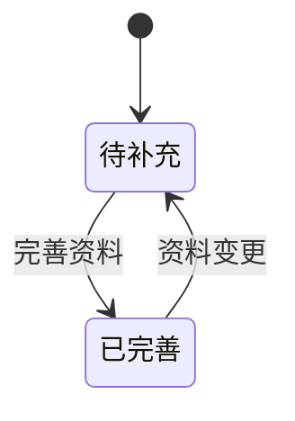
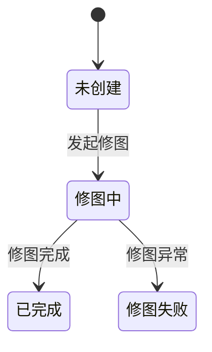
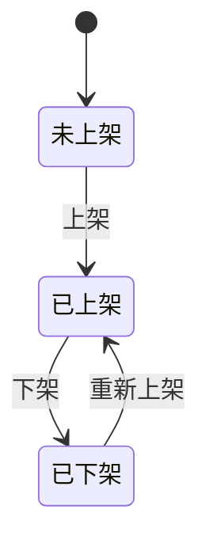
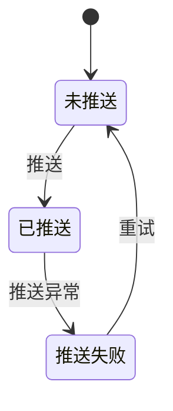

# 现货管理

## 1. 模块概述

本模块负责现货商品的全生命周期管理，是 SDP 系统中商品数据的核心承载模块。涵盖 SPU（标准产品单元）和 SKC（款式颜色规格）的创建、编辑、核价复核、图片管理等环节。

**业务背景**：开款任务审核通过后，设计师在现货管理中创建 SPU 和 SKC，完善商品的基础信息、供应商信息、销售属性、尺码表等，经核价复核后同步至 Temu 平台进行上架销售。

**对接关系**：

| 对接系统 | 方向 | 数据/功能 | 说明 |
|---------|------|---------|------|
| 款式管理 | 输入 | 款式/SPU 基础数据 | 从开款任务流转到现货管理 |
| 供应商管理 | 输入 | 供应商名称、收款人 | 创建 SPU 时关联供应商 |
| 商品管理 | 输入 | 测价通过状态、测价通过时间、平台供货价 | (v2.4.1 新增) 从商品同步测价与供货价数据 |
| NEST 字典 | 输入 | 品类、波段、成分、款式标签等 | 下拉选项数据来源 |
| Temu 平台 | 输出 | SPU/SKC 商品数据 | 核价通过后同步上架 |
| 尺码表管理 | 输入 | 尺码组、尺码模板 | 创建 SPU 时引用 |
| 聚水潭 | 输出 | SKU数据 | SPU已有已发布商品时，新增SKC保存后立即推送SKU |

---

## 2. 页面概述

| 页面名称 | 页面类型 | 入口/路径 | 交互形式 | 说明 |
|---------|---------|---------|---------|------|
| 现货管理-列表 | 列表页 | 主菜单 → 现货管理 | 页面跳转 | 默认着陆页，**SKC 维度**列表，每行一条 SKC 记录 |
| 创建/编辑款式-SPU信息 | 表单页 | 现货管理-列表 → 点击"新增"/"编辑" | 新标签页 | 创建/编辑 SPU 基础信息、供应商信息、企划信息、销售属性、尺码表 |
| 创建款式-SKC信息 | 表单页 | 创建SPU信息 → 点击"下一步" | 同标签页步骤2 | 在 SPU 下创建 SKC（颜色+尺码+波段+商品图） |
| 编辑SKC | 表单页 | 现货管理-列表 → SKC行 → "编辑(SKC)" | 弹窗 | 编辑已有 SKC 的颜色、尺码、波段、商品图 |
| 复色 | 表单页 | 现货管理-列表 → SKC行 → "复色" | 弹窗 | 以已有 SKC 为基础新增一个颜色 SKC |
| 核价复核 | 表单页 | 核价流程入口 | 新标签页 | 核价师核价后，复核人进行复核审批 |
| 上传图片 | 表单页 | 现货管理-列表 → "上传图片" | 弹窗 | 通过拖入文件夹批量上传/更新商品图片 |
| 修改库存 | 表单页 | 现货管理-列表 → "修改库存" | 弹窗 | 修改 SKC 在各发货仓的库存数量 |
| 查询库存 | 列表页 | 现货管理-列表 → "查询库存" | 页面跳转 | 按 SKC/发货仓维度查询库存明细 |
| 查看系统SKU列表 | 列表页 | 现货管理-列表 → "查看系统SKU列表" | 页面跳转 | (v2.4.1 新增) 查看当前 SKC 关联的系统 SKU 明细数据 |

---

## 3. 权限说明

### 功能权限
仅说明需要特别逻辑处理的特殊角色，其余菜单权限通过 RBAC 系统配置。

| 操作 | 特殊角色 | 备注 |
|------|---------|------|
| 新增SPU | 商品运营 | 创建新 SPU 及关联 SKC |
| 编辑SPU | 商品运营 | 修改 SPU 基础信息、供应商信息、属性等 |
| 编辑SKC | 商品运营 | 修改 SKC 颜色、尺码、商品图 |
| 复色 | 商品运营 | 为已有 SPU 新增颜色 SKC |
| 核价复核 | 核价复核员 | 对核价结果进行复核审批 |
| 上传图片 | 商品运营 | 批量上传/更新商品图片 |
| 修改库存 | 商品运营/库存管理员 | 增减 SKC 库存 |
| 删除SPU | 商品运营 | 仅删除未上架的 SPU |
| 查看系统SKU列表 | 商品运营 | (v2.4.1 新增) 查看系统SKU明细 |

### 数据权限

| 范围 | 规则 | 适用角色 |
|------|------|---------|
| 全部 | 同一租户下的所有数据 | 管理员 |
| 本人 | 仅查看自己创建的 SPU/SKC | 设计师 |

---

## 4. 状态机

### SPU 资料状态



### SKC 修图状态



### SKC 上架状态



> **v2.4 聚合规则**：SKC 的上架状态根据该 SKC 关联的所有商品（ProductSkc.skc_status）聚合计算（同款式管理）：
> - 全部关联商品状态 = 下架(13) → 下架
> - 存在任一关联商品状态 ≠ 下架(13) → 已上架
> - 无关联商品时，沿用原上架流程状态

### SKC 推送买手系统状态



### SKC 测价通过状态 (v2.4.1 变更)

| 状态值 | 说明 |
|--------|------|
| 未测价 | 尚未发起测价 |
| 测价通过 | 测价已完成并通过 |
| 测价未通过 | (v2.4.1 新增) 测价已完成但未通过 |

> 测价通过状态由商品管理模块同步写入，现货管理模块只读展示。无需状态机流转。

### SKC 测价状态

测价状态为简单的标记字段：空值表示未测价，`测价通过` 表示已完成测价且通过。无需状态机流转。

| 状态值 | 说明 |
|--------|------|
| (空) | 未测价 |
| 测价通过 | 测价已完成并通过 |

### 状态说明

| 实体 | 状态 | 可到达的状态 | 触发动作 | 备注 |
|------|------|------------|---------|------|
| SPU资料 | 待补充 | 已完善 | 完善必填字段 | 新建 SPU 默认为待补充 |
| SPU资料 | 已完善 | 待补充 | 资料变更 | 必填字段被清空或修改后触发 |
| SKC修图 | 未创建 | 修图中 | 发起修图任务 | 新建 SKC 默认为未创建 |
| SKC修图 | 修图中 | 已完成、修图失败 | 修图完成/失败 | |
| SKC上架 | 未上架 | 已上架 | 上架操作 | (v2.4.0 变更) SKC维度，根据关联商品聚合计算 |
| SKC上架 | 已上架 | 已下架 | 下架操作 | |
| SKC上架 | 已下架 | 已上架 | 重新上架 | |
| SKC推送买手 | 未推送 | 已推送 | 推送操作 | (v2.4.0 新增) SKC维度 |
| SKC推送买手 | 已推送 | 推送失败 | 推送异常 | |
| SKC测价 | (空) | 测价通过 | 测价完成 | (v2.4.0 新增) SKC维度，仅标记是否测价通过 |
| SKC测价通过 | 未测价 | 测价通过、测价未通过 | 商品管理同步 | (v2.4.1 新增) SKC维度，由商品管理模块同步写入 |

---

## 5. 数据模型

### 5.1 实体关系

```mermaid
erDiagram
    Style ||--o{ SPU : "款式 1:N SPU"
    SPU ||--o{ SKC : "SPU 1:N SKC"
    SKC }o--o{ 发货仓 : "SKC N:N 发货仓"
    SKC ||--o{ 商品图 : ""
    SKC ||--o{ 库存批次 : ""
    SPU ||--o{ 供应商信息 : ""
    SPU ||--o{ 尺码表 : ""
    SPU ||--o{ 成分信息 : ""
    SPU ||--o{ 核价记录 : ""
```

### 5.2 实体说明

#### SPU（标准产品单元）

| 属性 | 类型 | 必填 | 说明 |
|------|------|------|------|
| SPU编号 | 短文本(≤32字符) | 是 | 唯一标识，系统自动生成 |
| 品类 | 引用 | 是 | 取值来源：NEST字典-clothing_category；如"女装-下装类-裤子" |
| 店铺 | 引用 | 是 | 取值来源：POP-店铺管理 |
| 款式标签 | 引用 | 是 | 取值来源：NEST字典-product_tag |
| 款式级别 | 引用 | 是 | 枚举值（如：主款、副款等） |
| 织造方式 | 引用 | 是 | 枚举值（如：针织、梭织等） |
| 尺码组 | 引用 | 是 | 取值来源：NEST字典-plm_standard_size |
| 平台 | 引用 | 否 | 取值来源：material_source |
| 商品链接 | URL | 否 | 参考商品链接 |
| 风格 | 引用 | 是 | 枚举值 |
| 季节 | 引用 | 是 | 枚举值（如：春夏、秋冬等） |
| 场景 | 引用 | 否 | 枚举值（如：日常、通勤、运动等） |
| 印花类型 | 引用 | 是 | 枚举值（如：印花、纯色等） |
| 节日 | 引用 | 是 | 枚举值（如：日常、圣诞、情人节等） |
| 弹性 | 引用 | 是 | 枚举值（如：无弹、微弹、高弹等） |
| 版型 | 引用 | 是 | 枚举值（如：修身、宽松等） |
| 视觉形式 | 引用 | 是 | 枚举值（如：平铺、挂拍、模特等） |
| SKU分类 | 枚举 | 是 | 单品/同款多件/混合套装 |
| 套装件数 | 整数 | 条件必填 | SKU分类=混合套装时必填 |
| 单品数量 | 整数 | 条件必填 | SKU分类=同款多件时必填 |
| 成衣毛重 | 小数(2位) | 否 | 单位：g，输入范围 0.01-99999.99 |
| 商品图 | 图片 | 是 | 最多20张，支持 jpg/png/webp |
| 尺码表图片 | 图片 | 是 | 最多3张，支持 jpg/png/webp |
| 资料状态 | 枚举 | 自动 | 待补充/已完善 |
| 创建人 | 引用 | 自动 | |
| 创建时间 | 日期时间 | 自动 | |
| 更新人 | 引用 | 自动 | |
| 更新时间 | 日期时间 | 自动 | |

#### SPU供应商信息

| 属性 | 类型 | 必填 | 说明 |
|------|------|------|------|
| 所属SPU | 引用 | 是 | 关联 SPU |
| 供应商名称 | 引用 | 否 | 取值来源：APS 供应商列表 |
| 收款人 | 引用 | 否 | 取值来源：APS 供应商列表的"供应商名称"字段，单选搜索 |
| 供应商款号 | 短文本 | 否 | 供应商侧的款号 |
| 采购价 | 小数 | 是 | 供应商报价 |

#### SPU成分信息

| 属性 | 类型 | 必填 | 说明 |
|------|------|------|------|
| 所属SPU | 引用 | 是 | 关联 SPU |
| 成分 | 引用 | 是 | 取值来源：NEST字典-plm_element；最多 5 个，不重复 |
| 成分比例 | 整数 | 是 | 单位：%；所有成分比例相加 = 100% |

#### SKC（款式颜色规格）

| 属性 | 类型 | 必填 | 说明 |
|------|------|------|------|
| SKC编号 | 短文本(≤32字符) | 是 | 唯一标识，系统自动生成 |
| 所属SPU | 引用 | 是 | 关联 SPU |
| 颜色 | 引用 | 是 | 级联单选选择器，展示颜色示意图；同一 SPU 下颜色不可重复 |
| 尺码 | 多选 | 是 | 勾选尺码范围：2XS/XS/S/M/L/XL/2XL/3L/4XL/5XL/6XL/F |
| 波段 (v2.4.1 变更) | 引用 | 否 | 取值来源：NEST字典-plm_clothing_band；波段维度从 SPU 迁移至 SKC |
| 商品图 | 图片 | 是 | 最多20张，支持 jpg/png/webp |
| 修图状态 | 枚举 | 自动 | 未创建/修图中/已完成/修图失败 |
| 上架状态 | 枚举 | 自动 | (v2.4.0 变更) SKC维度，根据关联商品聚合：全部下架→下架，存在未下架→已上架，无关联商品沿用原流程 |
| 推送买手系统状态 | 枚举 | 自动 | (v2.4.0 新增) 未推送/已推送/推送失败 |
| 测价状态 | 枚举 | 自动 | (v2.4.0 新增) (空)=未测价 / 测价通过 |
| 测价通过状态 (v2.4.1 新增) | 枚举 | 自动 | 未测价/测价通过/测价未通过；由商品管理模块同步写入，现货管理模块只读展示 |
| 测价通过时间 (v2.4.1 新增) | 日期时间 | 自动 | 测价通过的时间戳，由商品管理模块同步写入 |
| 平台供货价 (v2.4.1 新增) | 金额 | 自动 | 平台侧供货价格，由商品管理模块同步写入 |
| SKC创建时间 (v2.6.0 新增) | 日期时间 | 自动 | SKC创建时间戳 |
| 创建人 | 引用 | 自动 | |
| 创建时间 | 日期时间 | 自动 | |
| 更新人 | 引用 | 自动 | |
| 更新时间 | 日期时间 | 自动 | |

#### 核价记录

| 属性 | 类型 | 必填 | 说明 |
|------|------|------|------|
| 所属SPU | 引用 | 是 | 关联 SPU |
| 供应商 | 引用 | 自动 | 回显 |
| 供应商款号 | 短文本 | 自动 | 回显 |
| 采购价 | 小数 | 自动 | 回显 |
| 核价师 | 引用 | 自动 | 核价人 |
| 核价 | 小数 | 自动 | 核价金额 |
| 复核结果 | 枚举 | 是 | 通过/驳回 |
| 定价类型 | 枚举 | 条件必填 | 复核通过时必填；按返单定价/按不返单定价 |
| 驳回原因 | 长文本(≤100字符) | 条件必填 | 复核驳回时必填 |
| 复核人 | 引用 | 自动 | |
| 复核时间 | 日期时间 | 自动 | |

#### 上传图片记录

| 属性 | 类型 | 必填 | 说明 |
|------|------|------|------|
| 图片类型 | 枚举 | 是 | 商品图/try on图 |
| 匹配方式 | 枚举 | 是 | SPU编号/供应商款号 |
| 供应商 | 引用 | 条件必填 | 匹配方式=供应商款号时必填 |
| 文件夹名称 | 短文本 | 自动 | 拖入的文件夹名称 |
| 上传状态 | 枚举 | 自动 | 上传中/上传成功/上传失败 |
| 失败原因 | 短文本 | 自动 | 如"图片数量超过20张""无法匹配到正确的SPU" |

---

## 6. 现货管理-列表

### 页面说明

**入口**: 主菜单 → 商品管理 → 现货管理

**权限**: 见 [3. 权限说明](#3-权限说明)

**数据范围**:
  - 全部：同一租户下的所有数据

**列表行为**:
  - 数据来源：当前租户所有用户的 SPU/SKC 数据
  - 展示维度：**SKC 维度**（每行一条 SKC 记录，显示所属 SPU 信息）
  - 默认排序：创建时间降序
  - 分页：默认 20 条/页，可选 20/50/100
  - 刷新方式：手动刷新

### 查询条件

| 条件名称 | 输入方式 | 说明 | 联动规则 | 更新说明 |
|---------|---------|------|---------|---------|
| SKC编号 | 文本输入 | 精确/模糊搜索 SKC 编号 | — | |
| SPU编号 | 文本输入 | 精确/模糊搜索 SPU 编号 | — | |
| 品类 | 文本输入/下拉 | 按品类筛选 | — | |
| 波段 (v2.4.1 新增) | 下拉多选 | 按 SKC 波段筛选，取值来源：NEST字典-plm_clothing_band | — | |
| 店铺 (v2.4.1 新增) | 下拉多选 | 按 SPU 店铺筛选，取值来源：POP-店铺管理 | — | |
| 供给方式 | 下拉单选 | 按供给方式筛选 | — | |
| 供应商 | 文本输入/下拉 | 按供应商名称筛选 | — | |
| 供应商款号 | 文本输入 | 按供应商款号筛选 | — | |
| 设计师 | 文本输入/下拉 | 按设计师筛选 | — | |
| 创建时间 | 日期范围 | 按创建时间范围筛选 | — | |
| SPU创建时间 (v2.4.1 新增) | 日期范围 | 按 SPU 创建时间范围筛选 | — | |
| SKC创建时间 (v2.4.1 新增) | 日期范围 | 按 SKC 创建时间范围筛选 | — | |
| 测价通过时间 (v2.4.1 新增) | 日期范围 | 按测价通过时间范围筛选 | — | |
| 识别品类 | 下拉 | AI识别品类筛选 | — | (v1.4.0 新增) |

### 行内筛选条件

| 条件名称 | 输入方式 | 取值 | 更新说明 |
|---------|---------|------|---------|
| 资料状态 | 单选按钮组 | 全部/待补充/已完善 | |
| 修图状态 | 单选按钮组 | 全部/未创建/修图中/已完成/修图失败 | |
| 上架状态 (v2.4.1 变更) | 下拉多选 | 全部/未上架/已上架/已下架 | SKC维度，支持多选 |
| 推送买手状态 (v2.4.1 变更) | 下拉多选 | 全部/未推送/已推送/推送失败 | SKC维度，支持多选 |
| 测价状态 | 单选按钮组 | 全部/未测价/测价通过 | (v2.4.0 新增) |

### 显示字段

| 字段名称 | 显示为 | 数据含义 | 说明 |
|---------|--------|---------|------|
| SKC编号 | 可点击文本 | SKC 编号 | 点击跳转编辑SKC弹窗 |
| SKC信息 | 格式化文本 | 颜色 + 尺码 + 商品图缩略图 | 如"黑色 / S,M,L,XL" |
| SPU编号 | 可点击文本 | 所属 SPU 编号 | 如"250210004601"，点击跳转编辑SPU |
| 品类 | 文本 | SPU 的款式品类 | 如"女装-下装类-裤子" |
| 店铺 | 文本 | SPU 的店铺名称 | |
| 波段 (v2.4.1 新增) | 文本 | SKC 的波段 | 如"春季"；波段维度由 SPU 迁移至 SKC |
| SKC创建时间 (v2.6.0 新增) | 格式化文本 | SKC 的创建时间 | 系统自动记录 (#232) |
| 供应商信息 | 格式化文本 | 供应商名称 + 供应商款号 + 采购价 | 如"供应商名称：千云 供应商款号：8984 采购价：8" |
| 商品图 | 图片缩略图 | SKC 的首张商品图 | |
| 资料状态 | 状态标签 | 待补充/已完善 | 待补充=橙色，已完善=绿色 |
| 设计师 | 文本 | 创建人/设计师名称 | |
| 修图状态 | 状态标签 | 未创建/修图中/已完成/修图失败 | |
| 上架状态 | 状态标签 | 未上架/已上架/已下架 | (v2.4.0 变更) SKC维度，根据关联商品聚合计算（全部下架→下架；存在未下架→已上架） |
| 推送买手系统状态 | 状态标签 | 未推送/已推送/推送失败 | (v2.4.0 新增) SKC维度 |
| 测价状态 | 状态标签 | (空)/测价通过 | (v2.4.0 新增) SKC维度 |
| 测价通过时间 (v2.4.1 新增) | 格式化文本 | SKC 的测价通过时间 | 由商品管理同步 |
| 平台供货价 (v2.4.1 新增) | 格式化文本 | SKC 的平台供货价 | 由商品管理同步 |
| 时间 | 格式化文本 | 创建时间 + 更新时间 | 如"创建时间：2025-02-12 18:50:19 更新时间：2025-02-14 18:50:19" |
| 操作 | 操作按钮 | 编辑(SKC)、复色、操作日志 | |

### 行操作

| 操作 | 出现条件 | 需要的角色 | 交互形式 | 说明 |
|------|---------|-----------|---------|------|
| 新增SPU | 始终显示 | 商品运营 | 新标签页 | 打开【创建/编辑款式-SPU信息】新增页面 |
| 编辑(SPU) | SPU已存在 | 商品运营 | 新标签页 | 打开【创建/编辑款式-SPU信息】编辑页面，带入已有数据 |
| 编辑(SKC) | SKC已存在 | 商品运营 | 弹窗 | 打开【编辑SKC】弹窗，编辑 SKC 颜色、尺码、波段、商品图 |
| 复色 | SKC已存在 | 商品运营 | 弹窗 | 以当前 SKC 为基础创建复色款 |
| 操作日志 | 始终显示 | 商品运营 | 抽屉 | 查看 SKC 维度操作记录：操作人、操作内容、操作时间 |
| 查看系统SKU列表 (v2.4.1 新增) | SKC已存在 | 商品运营 | 页面跳转 | 查看当前 SKC 关联的系统 SKU 明细数据 |
| 导出 | 始终显示 | 商品运营 | 文件下载 | 导出当前查询结果为 Excel |
| 重新识别 | AI识别状态=失败 | 商品运营 | 异步 | 调用模型服务重新识别，更新状态=排队中 | (v1.4.0 新增) |
| 上传图片 | 始终显示 | 商品运营 | 弹窗 | 打开【上传图片】弹窗，批量上传商品图 |

### 状态展示

| 状态 | 触发条件 | 展示内容 |
|------|---------|---------|
| 加载中 | 数据请求未完成 | 占位动画 |
| 空数据 | 查询无结果 | 空状态插图 + "暂无数据" |
| 加载失败 | 数据请求失败 | 错误提示 + "重试"按钮 |
| 无权限 | 用户无此页面访问权限 | "暂无访问权限，请联系管理员" |

### 用例

##### 用例1：查询SKC
  - **前置条件**：1）需要有权限
  - **输入**：输入查询条件（SKC/SPU/品类/波段/店铺/供应商等），使用行内筛选（上架状态/推送买手状态/测价状态等），点击"查询"
  - **业务规则**：根据查询条件筛选数据，列表每行展示一条 SKC 及其所属 SPU 信息
  - **后置输出**：列表展示符合条件的 SKC
  - **验收标准**：
    - [ ] 查询条件正确筛选数据
    - [ ] SKC 维度展示正确（每行一条 SKC）
    - [ ] 波段多选筛选正常工作
    - [ ] 店铺多选筛选正常工作
    - [ ] 行内筛选条件（上架状态/推送买手状态/测价状态）正常工作
    - [ ] 上架状态多选筛选正常工作
    - [ ] 推送买手状态多选筛选正常工作
    - [ ] SPU创建时间、SKC创建时间、测价通过时间范围筛选正常工作
    - [ ] 分页功能正常

##### 用例2：新增SPU
  - **前置条件**：1）需要有权限；2）需要为商品运营
  - **输入**：点击"新增SPU"按钮
  - **业务规则**：新标签页打开【创建/编辑款式-SPU信息】新增页面
  - **后置输出**：打开新标签页，进入 SPU 信息编辑
  - **验收标准**：
    - [ ] 无权限用户看不到"新增SPU"按钮
    - [ ] 新标签页打开新增 SPU 页面
    - [ ] 创建成功后列表刷新

##### 用例3：编辑SPU
  - **前置条件**：1）需要有权限；2）SPU已存在
  - **输入**：点击 SKC 行所属 SPU 的"编辑(SPU)"按钮
  - **业务规则**：新标签页打开编辑页面，回填已有 SPU 数据
  - **后置输出**：保存成功后 SPU 更新，列表刷新
  - **验收标准**：
    - [ ] 编辑页面正确回填已有数据
    - [ ] 修改后列表刷新

  - **异常处理**：

  | 异常场景 | 用户看到的表现 |
  |---------|-------------|
  | SPU被他人删除 | 提示"数据不存在"，返回列表页 |

##### 用例4：编辑SKC
  - **前置条件**：1）需要有权限；2）SKC已存在
  - **输入**：点击 SKC 行的"编辑(SKC)"按钮
  - **业务规则**：弹窗打开【编辑SKC】页面，回填已有 SKC 数据
  - **后置输出**：SKC 信息更新，列表刷新
  - **验收标准**：
    - [ ] 弹窗正确回填已有数据
    - [ ] 修改成功后弹窗关闭，列表刷新

##### 用例5：复色
  - **前置条件**：1）需要有权限；2）SKC已存在
  - **输入**：点击 SKC 行的"复色"按钮
  - **业务规则**：弹窗打开【复色】页面，以当前 SKC 为基础创建新颜色 SKC
  - **后置输出**：新SKC创建成功，列表刷新
  - **验收标准**：
    - [ ] 弹窗正确展示颜色选择器（含颜色示意图）
    - [ ] 尺码多选正常
    - [ ] 波段字段正常回显和选择
    - [ ] 颜色重复时提示"存在颜色重复的SKC"

##### 用例6：查看系统SKU列表 (v2.4.1 新增)
  - **前置条件**：1）需要有权限；2）SKC已存在
  - **输入**：点击 SKC 行的"查看系统SKU列表"按钮
  - **业务规则**：页面跳转至【查看系统SKU列表】页面，展示当前 SKC 关联的系统 SKU 明细
  - **后置输出**：展示系统SKU列表
  - **验收标准**：
    - [ ] 正确展示当前 SKC 关联的系统 SKU 数据
    - [ ] 无关联数据时展示空状态

> **v2.4 变更**：
> - **列表维度调整**：列表以 **SKC 维度**展示，每行一条 SKC，显示所属 SPU 的摘要信息
> - **SKC 上架状态聚合**：同款式管理，根据关联商品状态聚合计算。全部关联商品下架→下架；存在未下架→已上架
> - **新增推送买手系统状态**：SKC 维度，展示推送买手系统的推送进度（未推送/已推送/推送失败）
> - **新增测价状态**：SKC 维度，标记是否测价通过（空=未测价 / 测价通过）
> - **推送上架限制**：SPU 已有已发布商品时，推送上架入口禁用，提示"该SPU已有已发布商品，请在商品列表使用复制商品功能"
> - **删除 SPU/SKC/颜色 三级视图切换**：统一改为 SKC 维度列表，简化交互

> **v2.4.1 变更**：
> - **波段维度迁移**：波段从 SPU 维度迁移至 SKC 维度，列表显示 SKC 的波段
> - **筛选增强**：新增波段多选筛选、店铺多选筛选、SPU创建时间范围筛选、SKC创建时间范围筛选、测价通过时间范围筛选
> - **行内筛选改为多选**：上架状态、推送买手状态由单选按钮组改为下拉多选，支持同时筛选多个状态值
> - **新增查看系统SKU列表入口**：支持从列表行跳转查看系统 SKU 明细
>
> **v2.6.0 变更**：
> - **SKC维度字段扩展 (#232)**：列表新增SKC创建时间显示字段

---

## 7. 创建/编辑款式-SPU信息

### 页面说明

**入口**: 现货管理-列表 → 点击"新增SPU" / "编辑(SPU)"

**交互形式**: 新标签页

**权限**: 商品运营

**流程**: 步骤1（SPU信息） → 步骤2（SKC信息）

**SKC优先原则**：编辑已有 SPU 时，页面顶部优先展示该 SPU 下所有 SKC 的摘要列表（颜色、尺码、波段、修图状态、上架状态、测价状态），下方为 SPU 维度编辑表单。新建 SPU 时不展示 SKC 概览。

### 页面布局

| 区域 | 内容 | 说明 |
|------|------|------|
| SKC概览区（仅编辑模式） | 当前 SPU 下所有 SKC 的摘要列表 | 每行一条 SKC：颜色 + 尺码 + 波段 + 缩略图 + 修图状态 + 上架状态 + 测价状态 |
| 步骤指示器 | ① SPU信息 → ② SKC信息 | 当前步骤高亮 |
| 供应商信息区 | 供应商名称、收款人、供应商款号、采购价 | 支持新增/删除行 |
| 商品图区 | 图片上传区域 | 必填，拖拽上传，最多20张 |
| 基础信息区 | 商品链接、店铺、款式标签等 | 按分组展示 |
| 销售属性区 | 风格、季节、场景、印花类型等 | 按分组展示 |
| 尺码表区 | 成衣毛重、成分、成分比例、尺码表图片 | |
| SKU分类区 | 单品/同款多件/混合套装 | 动态面板切换条件必填字段 |
| 底部操作栏 | 下一步、取消 | |

### 表单字段

#### 供应商信息

| 字段名称 | 输入方式 | 必填 | 校验规则 | 默认值 | 说明 |
|---------|---------|------|---------|--------|------|
| 供应商名称 | 下拉单选+搜索 | 否 | — | — | 取值来源：APS 供应商列表 |
| 收款人 | 下拉单选+搜索 | 否 | — | — | 取值来源：APS 供应商列表的"供应商名称"字段 |
| 供应商款号 | 文本输入 | 否 | — | — | 供应商侧的款号 |
| 采购价 | 数字输入 | 是 | — | — | |

**供应商信息操作**：
- 新增行：增加一行空白供应商信息
- 删除行：删除对应供应商信息；只剩 1 个供应商时隐藏删除按钮

#### 基础信息

| 字段名称 | 输入方式 | 必填 | 校验规则 | 默认值 | 说明 |
|---------|---------|------|---------|--------|------|
| 商品链接 | URL输入 | 否 | — | — | 参考商品链接 |
| 店铺 | 下拉单选 | 是 | — | — | 取值来源：POP-店铺管理 |
| 款式标签 | 下拉单选 | 是 | — | — | 取值来源：NEST字典-product_tag |
| 款式级别 | 下拉单选 | 是 | — | — | |
| 织造方式 | 下拉单选 | 是 | — | — | 如：针织、梭织 |
| 品类 | 下拉单选 | 是 | — | — | 取值来源：NEST字典-clothing_category |
| 尺码组 | 下拉单选 | 是 | — | — | 取值来源：NEST字典-plm_standard_size |
| 平台 | 下拉单选 | 否 | — | — | 取值来源：material_source |

#### 销售属性

| 字段名称 | 输入方式 | 必填 | 校验规则 | 默认值 | 说明 |
|---------|---------|------|---------|--------|------|
| 风格 | 下拉单选 | 是 | — | — | |
| 季节 | 下拉单选 | 是 | — | — | |
| 场景 | 下拉单选 | 否 | — | — | |
| 印花类型 | 下拉单选 | 是 | — | — | |
| 节日 | 下拉单选 | 是 | — | — | |
| 弹性 | 下拉单选 | 是 | — | — | |
| 版型 | 下拉单选 | 是 | — | — | |
| 视觉形式 | 下拉单选 | 是 | — | — | |

#### 尺码表

| 字段名称 | 输入方式 | 必填 | 校验规则 | 默认值 | 说明 |
|---------|---------|------|---------|--------|------|
| 成衣毛重 | 数字输入 | 否 | 范围：0.01-99999.99 | — | 单位：g |
| 成分 | 下拉单选 | 是 | 最多5个，不重复 | — | 取值来源：NEST字典-plm_element |
| 成分比例 | 数字输入 | 是 | 所有成分比例相加 = 100% | — | 单位：% |
| 尺码表图片 | 图片上传 | 是 | 最多3张，支持 jpg/png/webp | — | |

**成分操作**：支持新增、删除成分行；默认需要填写一个成分和一个成分比例。

#### 商品图

| 字段名称 | 输入方式 | 必填 | 校验规则 | 默认值 | 说明 |
|---------|---------|------|---------|--------|------|
| 商品图 | 图片上传 | 是 | 最多20张，支持 jpg/png/webp | — | 拖拽/点击上传 |

#### SKU分类

| 字段名称 | 输入方式 | 必填 | 校验规则 | 默认值 | 说明 |
|---------|---------|------|---------|--------|------|
| SKU分类 | 下拉单选 | 是 | — | 单品 | 单品/同款多件/混合套装 |
| 单品数量 | 数字输入 | 条件必填 | SKU分类=同款多件时必填 | — | |
| 套装件数 | 数字输入 | 条件必填 | SKU分类=混合套装时必填 | — | |

### 业务规则

1. **供应商信息校验（点击"下一步"时）**：
   - 必填字段校验
   - 「供应商名称+收款人+供应商款号」是否在当前页面重复，重复时高亮对应行，并提示：**供应商信息重复**
   - 「供应商名称+供应商款号」是否已存在 SPU，存在时高亮对应行，并提示：**该款号已存在SPU，请勿重复添加**
2. **成分比例校验**：所有成分比例相加必须等于 100%
3. **成分数量限制**：最多允许录入 5 个成分，多个成分之间不允许重复
4. **SKU分类联动**：选择"同款多件"时显示单品数量字段；选择"混合套装"时显示套装件数字段
5. **商品图数量限制**：最多上传 20 张
6. **尺码表图片限制**：最多上传 3 张
7. **删除供应商保护**：只剩 1 个供应商时隐藏删除按钮

### 操作

| 操作 | 说明 |
|------|------|
| 下一步 | 校验通过后跳转到【创建款式-SKC信息】页面 |
| 取消 | 放弃当前操作，返回列表页 |

### 用例

##### 用例1：新增SPU信息
  - **前置条件**：1）需要有权限；2）需要为商品运营
  - **输入**：
    - 填写供应商信息（至少一条）
    - 上传商品图
    - 填写基础信息（店铺、款式标签、品类等必填项）
    - 填写销售属性
    - 填写尺码表信息（成分、成分比例、尺码表图片）
    - 选择 SKU 分类
    - 点击"下一步"
  - **业务规则**：
    - 校验必填项
    - 校验供应商信息不重复、款号+供应商不已有SPU
    - 校验成分比例总和=100%
  - **后置输出**：校验通过，跳转到【创建款式-SKC信息】页面
  - **验收标准**：
    - [ ] 必填项校验正确
    - [ ] 供应商重复时高亮提示
    - [ ] 款号已存在SPU时提示
    - [ ] 成分比例不等于100%时提示
    - [ ] 校验通过后跳转到步骤2

  - **异常处理**：

  | 异常场景 | 用户看到的表现 |
  |---------|-------------|
  | 供应商信息重复 | 高亮对应行，提示"供应商信息重复" |
  | 款号已存在SPU | 高亮对应行，提示"该款号已存在SPU，请勿重复添加" |
  | 成分比例之和不等于100% | 提示"成分比例相加需等于100%" |
  | 成分超过5个 | 限制新增操作 |
  | 必填字段为空 | 对应字段标红提示 |
  | 商品图超过20张 | 提示"最大图片数量20张" |

---

## 8. 创建款式-SKC信息

### 页面说明

**入口**: 创建/编辑SPU信息 → 点击"下一步"

**交互形式**: 继步骤1后的步骤2，同标签页内跳转

**权限**: 商品运营

### 页面布局

| 区域 | 内容 | 说明 |
|------|------|------|
| 步骤指示器 | ① 新建SPU信息 → ② 新建SKC信息 | 当前步骤(2)高亮 |
| SKC信息行(可重复) | 颜色、尺码、波段、商品图 | 一组为一个 SKC |
| 操作栏 | 添加SKC、删除 | 增删 SKC 行 |
| 底部操作栏 | 上一步、保存、取消 | |

### 表单字段

| 字段名称 | 输入方式 | 必填 | 校验规则 | 默认值 | 说明 |
|---------|---------|------|---------|--------|------|
| 颜色 | 级联单选选择器 | 是 | 同一SPU下颜色不可重复 | — | 展示颜色示意图，支持搜索 |
| 尺码 | 多选(checkbox) | 是 | 至少选中一个尺码 | — | 选项：2XS/XS/S/M/L/XL/2XL/3L/4XL/5XL/6XL/F |
| 波段 (v2.4.1 变更) | 下拉单选 | 否 | — | — | 取值来源：NEST字典-plm_clothing_band；波段维度从 SPU 迁移至 SKC |
| 商品图 | 图片上传 | 是 | 最多20张，支持 jpg/png/webp | — | 拖拽/点击上传 |

### 业务规则

1. **SKC颜色唯一性**：同一 SPU 下，SKC 颜色不可重复。保存时校验，重复时提示：**存在颜色重复的SKC，请勿重复创建**
2. **SKC至少保留一个**：删除时至少保留一个 SKC 信息
3. **尺码至少选一个**：每个 SKC 至少需要勾选一个尺码
4. **商品图必填**：每个 SKC 必须上传商品图，最多 20 张
5. **聚水潭推送（v2.6.0 新增）**：保存成功后，若该 SPU 下已存在任一 `product_status=1`（已发布）的商品，则立即将新建 SKC 关联的全部 SKU 推送到聚水潭，不受上架状态限制；推送失败不阻断 SKC 创建流程，异步重试；未填写尺寸时使用默认值（重量0.3kg/长40cm/宽30cm/高1cm）

### 操作

| 操作 | 说明 |
|------|------|
| 添加SKC | 新增一行空白 SKC 信息（颜色、尺码、波段、商品图） |
| 删除 | 删除当前 SKC 行，至少保留一个 SKC |
| 上一步 | 返回【创建/编辑款式-SPU信息】页面 |
| 保存 | 校验通过后创建 SPU + SKC，返回列表页 |
| 取消 | 放弃当前操作，返回列表页 |

### 用例

##### 用例1：创建SKC信息
  - **前置条件**：1）需要有权限；2）已完成步骤1的SPU信息
  - **输入**：
    - 选择颜色
    - 勾选尺码
    - 选择波段（可选）
    - 上传商品图
    - 根据需要添加多个 SKC
    - 点击"保存"
  - **业务规则**：
    - 校验颜色不重复
    - 校验尺码至少选一个
    - 校验商品图必填
  - **后置输出**：SPU + SKC 创建成功，返回列表页，列表刷新
  - **验收标准**：
    - [ ] 颜色重复时提示
    - [ ] 尺码未勾选时提示
    - [ ] 商品图未上传时提示
    - [ ] 波段字段正常选择和保存
    - [ ] 保存成功后返回列表页

  - **异常处理**：

  | 异常场景 | 用户看到的表现 |
  |---------|-------------|
  | SKC颜色重复 | 提示"存在颜色重复的SKC，请勿重复创建" |
  | 未勾选任何尺码 | 对应SKC行标红提示 |
  | 商品图未上传 | 对应SKC行标红提示 |
  | 商品图超过20张 | 提示"最大图片数量20张" |
  | 保存失败 | 提示失败原因，保留已填数据 |

---

## 9. 核价复核

### 页面说明

**入口**: 核价流程 → 核价复核

**交互形式**: 新标签页

**权限**: 核价复核员

### 页面布局

| 区域 | 内容 | 说明 |
|------|------|------|
| 核价信息回显区 | SPU、采购价、供应商、供应商款号、核价师、核价金额 | 只读回显 |
| 复核区 | 复核结果（通过/驳回）、定价类型、驳回原因 | 核心操作区 |
| 底部操作栏 | 提交、取消 | |

### 表单字段

| 字段名称 | 输入方式 | 必填 | 校验规则 | 说明 |
|---------|---------|------|---------|------|
| SPU | 文本(只读) | — | — | 回显被复核的 SPU 编号 |
| 采购价 | 数字(只读) | — | — | 回显供应商采购价 |
| 供应商 | 文本(只读) | — | — | 回显供应商名称 |
| 供应商款号 | 文本(只读) | — | — | 回显供应商款号 |
| 核价师 | 文本(只读) | — | — | 回显核价师名称 |
| 核价 | 小数(只读) | — | — | 回显核价金额，标红显示 |
| 复核结果 | 单选(checkbox) | 是 | 通过/驳回二选一 | 勾选不同值联动显示不同字段 |
| 定价类型 | 单选(checkbox) | 条件必填 | 复核通过时显示；枚举：按返单定价、按不返单定价 | |
| 驳回原因 | 文本域 | 条件必填 | 复核驳回时显示；最多100字符 | |

### 联动规则

| 触发条件 | 联动效果 |
|---------|---------|
| 勾选「通过」 | 显示【定价类型】字段，隐藏【驳回原因】字段 |
| 勾选「驳回」 | 显示【驳回原因】字段，隐藏【定价类型】字段 |

### 业务规则

1. **回显核价信息和供应商信息**：页面打开时自动加载核价相关数据
2. **复核结果必填**：必须勾选"通过"或"驳回"
3. **定价类型联动**：仅勾选"通过"时显示，必填
4. **驳回原因联动**：仅勾选"驳回"时显示，必填，最多 100 字符

### 操作

| 操作 | 说明 |
|------|------|
| 提交 | 校验通过后保存复核结果，更新 SPU 核价状态 |
| 取消 | 放弃当前操作 |

### 用例

##### 用例1：核价复核-通过
  - **前置条件**：1）需要有核价复核权限；2）核价已完成
  - **输入**：
    - 查看回显的核价信息和供应商信息
    - 勾选复核结果「通过」
    - 选择定价类型（按返单定价 / 按不返单定价）
    - 点击"提交"
  - **业务规则**：
    - 复核结果必填
    - 通过时必须选择定价类型
  - **后置输出**：复核通过，SPU 可进入上架流程
  - **验收标准**：
    - [ ] 回显信息正确
    - [ ] 定价类型必选
    - [ ] 提交后复核状态更新

##### 用例2：核价复核-驳回
  - **前置条件**：1）需要有核价复核权限；2）核价已完成
  - **输入**：
    - 勾选复核结果「驳回」
    - 填写驳回原因
    - 点击"提交"
  - **业务规则**：
    - 驳回原因必填，最多 100 字符
  - **后置输出**：复核驳回，核价需重新处理
  - **验收标准**：
    - [ ] 驳回原因必填
    - [ ] 驳回原因字数限制 100 字符
    - [ ] 提交后驳回状态更新

  - **异常处理**：

  | 异常场景 | 用户看到的表现 |
  |---------|-------------|
  | 未选择复核结果 | 提示"请选择复核结果" |
  | 通过时未选择定价类型 | 提示"请选择定价类型" |
  | 驳回时未填写驳回原因 | 提示"请输入驳回原因" |
  | 驳回原因超过100字符 | 提示"驳回原因最多100字符" |
  | 提交失败 | 提示失败原因 |

---

## 10. 编辑SKC

### 页面说明

**入口**: 现货管理-列表 → SKC行 → "编辑(SKC)"

**交互形式**: 弹窗

**权限**: 商品运营

**SKC优先原则**：弹窗顶部展示当前 SKC 的详细信息（含状态标签），SPU 上下文紧随其后，SKC 编辑表单在下方。

### 页面布局

| 区域 | 内容 | 说明 |
|------|------|------|
| SKC信息区 | SKC编号 + 上架状态 + 推送买手状态 + 测价状态 + 修图状态 + 测价通过状态 + 测价通过时间 + 平台供货价 | SKC 维度状态标签，只读回显 |
| SPU上下文区 | SPU编号（蓝色链接）+ 品类 + 店铺 + 供应商信息 | 只读回显，点击 SPU 编号跳转编辑 |
| 表单区 | 颜色、尺码、波段、商品图 | SKC 可编辑字段 |
| 底部操作栏 | 提交、取消 | |

### 表单字段

| 字段名称 | 输入方式 | 必填 | 校验规则 | 说明 |
|---------|---------|------|---------|------|
| SKC编号 | 文本(只读) | — | — | 回显 SKC 编号（蓝色链接样式） |
| 上架状态 | 状态标签(只读) | — | — | (v2.4.0 变更) SKC维度，回显当前聚合状态 |
| 推送买手系统状态 | 状态标签(只读) | — | — | (v2.4.0 新增) 回显推送状态 |
| 测价状态 | 状态标签(只读) | — | — | (v2.4.0 新增) 回显测价标记 |
| 测价通过状态 (v2.4.1 新增) | 状态标签(只读) | — | — | 回显测价通过状态：未测价/测价通过/测价未通过 |
| 测价通过时间 (v2.4.1 新增) | 文本(只读) | — | — | 回显测价通过时间 |
| 平台供货价 (v2.4.1 新增) | 文本(只读) | — | — | 回显平台供货价金额 |
| 颜色 | 单选选择器 | 是 | 同一SPU下颜色不可重复 | 展示颜色示意图，回显当前值 |
| 尺码 | 多选(checkbox) | 是 | 至少选中一个尺码 | 2XS/XS/S/M/L/XL/2XL/3L/4XL/5XL/6XL/F，回显已选 |
| 波段 (v2.4.1 变更) | 下拉单选 | 否 | — | 取值来源：NEST字典-plm_clothing_band；回显当前SKC波段 |
| 商品图 | 图片上传 | 是 | 最多20张，支持 jpg/png/webp | 回显已有商品图 |

### 业务规则

1. **回显SKC完整上下文**：页面打开时自动加载当前 SKC 的颜色、尺码、波段、项目类型、商品图、上架状态、推送买手状态、测价状态、测价通过状态、测价通过时间、平台供货价，以及所属 SPU 摘要信息
2. **颜色唯一性校验**：保存时校验修改后的颜色是否与该 SPU 下的其他 SKC 重复，重复时提示：**存在颜色重复的SKC，请勿重复创建**
3. **尺码至少选一个**：至少需要勾选一个尺码

### 操作

| 操作 | 说明 |
|------|------|
| 提交 | 校验通过后保存修改 |
| 取消 | 放弃当前操作，关闭弹窗 |
| X | 关闭弹窗（同取消） |

### 用例

##### 用例1：编辑SKC
  - **前置条件**：1）需要有权限；2）SKC已存在
  - **输入**：修改颜色、尺码、波段或商品图，点击"提交"
  - **业务规则**：
    - 校验颜色不重复
    - 校验尺码至少选一个
  - **后置输出**：SKC 信息更新，列表刷新
  - **验收标准**：
    - [ ] 已有数据正确回填（含波段、测价通过状态、测价通过时间、平台供货价）
    - [ ] 颜色重复时提示
    - [ ] 修改成功后弹窗关闭，列表刷新

  - **异常处理**：

  | 异常场景 | 用户看到的表现 |
  |---------|-------------|
  | 颜色重复 | 提示"存在颜色重复的SKC，请勿重复创建" |
  | 未勾选任何尺码 | 提示"至少需要选中一个尺码" |
  | 商品图超过20张 | 提示"最大图片数量20张" |

---

## 11. 复色

### 页面说明

**入口**: 现货管理-列表 → SKC行 → "复色"

**交互形式**: 弹窗

**权限**: 商品运营

**SKC优先原则**：弹窗顶部展示源 SKC 信息，SPU 摘要紧随其后，复色表单在下方。

### 页面布局

| 区域 | 内容 | 说明 |
|------|------|------|
| 源SKC信息 | 源 SKC 编号 + 颜色 + 尺码 + 波段 + 商品图缩略图 | 只读回显，展示复色来源 |
| SPU上下文区 | SPU编号（蓝色链接）+ 品类 + 店铺 | 只读回显 |
| 表单区 | 颜色、尺码、波段、商品图 | |
| 底部操作栏 | 提交、取消 | |

### 表单字段

| 字段名称 | 输入方式 | 必填 | 校验规则 | 说明 |
|---------|---------|------|---------|------|
| 源SKC编号 | 文本(只读) | — | — | 回显源 SKC 编号 |
| SPU编号 | 文本(只读) | — | — | 回显所属 SPU 编号 |
| 颜色 | 级联单选选择器 | 是 | 同一SPU下颜色不可重复 | 展示颜色示意图 |
| 尺码 | 多选(checkbox) | 是 | 至少选中一个尺码 | 2XS/XS/S/M/L/XL/2XL/3L/4XL/5XL/6XL/F |
| 波段 (v2.4.1 变更) | 下拉单选 | 否 | — | 取值来源：NEST字典-plm_clothing_band；回显源SKC的波段值 |
| 商品图 | 图片上传 | 是 | 最多20张，支持 jpg/png/webp | |

### 业务规则

1. **源SKC信息回显**：页面打开时回显源 SKC 的颜色、尺码、波段、商品图作为参考
2. **颜色唯一性**：保存时校验 SKC 颜色是否与该 SPU 下的其他 SKC 颜色重复，重复时提示：**存在颜色重复的SKC，请勿重复创建**
3. **尺码至少选一个**：至少需要勾选一个尺码
4. **聚水潭推送（v2.6.0 新增）**：保存成功后，若该 SPU 下已存在任一 `product_status=1`（已发布）的商品，则立即将新 SKC 关联的全部 SKU 推送到聚水潭，不受上架状态限制；推送失败不阻断 SKC 创建流程，异步重试；未填写尺寸时使用默认值（重量0.3kg/长40cm/宽30cm/高1cm）

### 操作

| 操作 | 说明 |
|------|------|
| 提交 | 校验通过后为 SPU 新增一个 SKC |
| 取消 | 放弃当前操作，关闭弹窗 |
| X | 关闭弹窗（同取消） |

### 用例

##### 用例1：复色-新增SKC
  - **前置条件**：1）需要有权限；2）源 SKC 已存在
  - **输入**：查看源 SKC 信息，选择新颜色、勾选尺码、确认波段、上传商品图，点击"提交"
  - **业务规则**：
    - 校验颜色不重复
    - 校验尺码至少选一个
  - **后置输出**：新 SKC 创建成功，弹窗关闭，列表刷新
  - **验收标准**：
    - [ ] 源 SKC 信息和 SPU 信息正确回显（含波段）
    - [ ] 颜色重复时提示
    - [ ] 创建成功后弹窗关闭

  - **异常处理**：

  | 异常场景 | 用户看到的表现 |
  |---------|-------------|
  | 颜色重复 | 提示"存在颜色重复的SKC，请勿重复创建" |
  | 未勾选任何尺码 | 提示"至少需要选中一个尺码" |
  | 商品图未上传 | 对应区域标红提示 |

---

## 12. 上传图片

### 页面说明

**入口**: 现货管理-列表 → "上传图片"

**交互形式**: 弹窗（两阶段：配置→结果）

**权限**: 商品运营

### 页面布局

| 区域 | 内容 | 说明 |
|------|------|------|
| 配置区 | 图片类型、匹配方式、供应商（条件显示） | 上传前配置 |
| 拖拽区 | 文件夹拖拽上传区域 | 提示"请将文件夹拖动到此区域，文件夹请按SPU编号或供应商款号命名" |
| 上传结果区 | 文件夹名称、上传状态 | 结果列表，失败任务排在最前 |

### 表单字段

| 字段名称 | 输入方式 | 必填 | 校验规则 | 说明 |
|---------|---------|------|---------|------|
| 图片类型 | 单选(checkbox) | 是 | — | 枚举：商品图、try on图 |
| 匹配方式 | 单选(checkbox) | 是 | — | 枚举：SPU编号、供应商款号 |
| 供应商 | 下拉单选+搜索 | 条件必填 | 匹配方式=供应商款号时必填 | 枚举：匹配现货SPU关联的全部供应商名称 |

### 联动规则

| 触发条件 | 联动效果 |
|---------|---------|
| 勾选「SPU编号」 | 隐藏【供应商】选择器 |
| 勾选「供应商款号」 | 显示【供应商】选择器，且必填 |

### 拖拽校验规则

| 校验项 | 规则 | 提示信息 |
|--------|------|---------|
| 必填字段 | 存在未勾选的必填字段时 | "请先勾选必填的信息" |
| 文件类型 | 拖入非文件夹文件时 | "请勿拖入非文件夹文件" |
| 空文件夹 | 文件夹为空时 | 自动过滤不处理 |

### 匹配逻辑

| 匹配方式 | 匹配规则 | 更新方式 |
|---------|---------|---------|
| SPU编号 | 根据「文件夹名称」匹配 SPU | 全量覆盖 |
| 供应商款号 | 根据「文件夹名称+供应商名称」匹配 SPU | 全量覆盖 |

### 上传结果列表

| 字段名称 | 显示为 | 说明 |
|---------|--------|------|
| 文件夹名称 | 文本 | 拖入的文件夹名称 |
| 上传状态 | 状态标签 | 上传成功(绿色)/上传失败(红色)+失败原因 |

### 业务规则

1. **失败任务优先**：上传失败的任务排在最前
2. **全量覆盖更新**：匹配成功后以全量覆盖方式更新对应 SPU 的图片
3. **上传失败原因**：
   - 图片数量超过 20 张
   - 无法匹配到正确的 SPU（请检查文件夹命名）

### 操作

| 操作 | 说明 |
|------|------|
| 关闭 | 关闭弹窗 |

### 用例

##### 用例1：通过SPU编号批量上传图片
  - **前置条件**：1）需要有权限
  - **输入**：
    - 勾选图片类型（商品图）
    - 勾选匹配方式「SPU编号」
    - 将按 SPU 编号命名的文件夹拖入上传区域
    - 查看上传结果
  - **业务规则**：
    - 根据文件夹名称匹配 SPU
    - 全量覆盖更新图片
    - 失败任务排在最前
  - **后置输出**：匹配成功的 SPU 图片被更新
  - **验收标准**：
    - [ ] 匹配方式为SPU编号时不显示供应商选择器
    - [ ] 文件夹命名正确的 SPU 图片被更新
    - [ ] 异常情况有明确提示

##### 用例2：通过供应商款号批量上传图片
  - **前置条件**：1）需要有权限
  - **输入**：
    - 勾选图片类型
    - 勾选匹配方式「供应商款号」
    - 选择供应商
    - 拖入文件夹
  - **业务规则**：
    - 根据文件夹名称+供应商名称匹配 SPU
    - 全量覆盖更新图片
  - **后置输出**：匹配成功的 SPU 图片被更新
  - **验收标准**：
    - [ ] 匹配方式为供应商款号时显示供应商选择器且必填
    - [ ] 供应商选择器枚举正确的供应商列表

  - **异常处理**：

  | 异常场景 | 用户看到的表现 |
  |---------|-------------|
  | 未勾选必填字段就拖入文件夹 | 提示"请先勾选必填的信息" |
  | 拖入非文件夹文件 | 提示"请勿拖入非文件夹文件" |
  | 文件夹为空 | 自动过滤，不处理 |
  | 图片数量超过20张 | 上传失败，提示"图片数量超过20张" |
  | 无法匹配到SPU | 上传失败，提示"无法匹配到正确的SPU，请检查文件夹命名" |

---

## 13. 修改库存

_注：本节内容基于已有的原型提取结果，待补充完整的 HTML 原型分析。_

### 页面说明

**入口**: 现货管理-列表 → "修改库存"

**交互形式**: 弹窗

**权限**: 商品运营/库存管理员

### 页面布局

| 区域 | 内容 | 说明 |
|------|------|------|
| 款式信息区 | SPU/SKC 基本信息 | 只读回显 |
| 库存维护区 | 尺码 × 发货模式 × 发货仓 × 当前库存 × 库存增减 × 修改后库存 | 网格表格 |
| 底部操作栏 | 确认、取消、批量填充、新增发货仓 | |

### 业务规则

1. **批量填充**：支持将修改值批量应用到所选行
2. **新增发货仓**：支持为 SKC 新增发货仓
3. **库存增减**：输入正数=增加，输入负数=减少
4. **修改后库存**：当前库存 + 库存增减 = 修改后库存（自动计算）

---

## 14. 查询库存

_注：本节内容基于已有的原型提取结果，待补充完整的 HTML 原型分析。_

### 页面说明

**入口**: 现货管理-列表 → "查询库存"

**交互形式**: 页面跳转

**权限**: 商品运营

**列表行为**:
  - 数据来源：当前租户的 SKC 库存数据
  - 按 SKC + 发货仓维度展示

### 显示字段

| 字段名称 | 显示为 | 说明 |
|---------|--------|------|
| 款式信息 | 文本 | SPU/SKC 基本信息 |
| 平台SKU | 文本 | Temu 平台 SKU ID |
| 内部SKU | 文本 | SDP 内部 SKU 编号 |
| 尺码 | 文本 | SKC 尺码 |
| 发货模式 | 文本 | 卖家自发货/平台物流等 |
| 发货仓 | 文本 | 仓库名称 |
| 当前库存 | 数字 | 该仓当前库存数量 |

---

## 15. 查看系统SKU列表 (v2.4.1 新增)

_注：本节内容基于需求规划，待补充完整的 HTML 原型分析。_

### 页面说明

**入口**: 现货管理-列表 → SKC行 → "查看系统SKU列表"

**交互形式**: 页面跳转

**权限**: 商品运营

**列表行为**:
  - 数据来源：当前 SKC 关联的系统 SKU 数据
  - 按系统 SKU 维度展示

### 显示字段

| 字段名称 | 显示为 | 说明 |
|---------|--------|------|
| 系统SKU编号 | 文本 | 系统 SKU 唯一标识 |
| SKC编号 | 文本 | 关联的 SKC 编号 |
| SKU名称 | 文本 | 系统 SKU 名称 |
| 规格 | 文本 | 颜色 + 尺码 |
| 供货价 | 格式化文本 | 平台供货价金额 |
| 测价状态 | 状态标签 | 测价状态 |
| 测价通过时间 | 格式化文本 | 测价通过的时间 |
| 创建时间 | 格式化文本 | 系统 SKU 创建时间 |

### 用例

##### 用例1：查看系统SKU列表
  - **前置条件**：1）需要有权限；2）SKC已存在
  - **输入**：点击 SKC 行的"查看系统SKU列表"按钮
  - **业务规则**：展示当前 SKC 关联的所有系统 SKU 明细
  - **后置输出**：展示系统SKU列表
  - **验收标准**：
    - [ ] 正确展示关联的系统 SKU 数据
    - [ ] 无关联数据时展示空状态
    - [ ] 支持返回现货列表

  - **异常处理**：

  | 异常场景 | 用户看到的表现 |
  |---------|-------------|
  | SKC无关联系统SKU | 空状态插图 + "暂无关联的系统SKU" |
  | 数据加载失败 | 错误提示 + "重试"按钮 |

---

## 更新记录

| 关联版本 | 更新内容 | 具体说明 |
|------|------|------|
| v2.4.3 | SKC维度调整 | 列表改为SKC维度、上架/推送买手/测价状态SKC化、SKC优先原则 |
| v2.4.1 | 现货列表增强与SKC维度扩展 | 波段/店铺多选筛选、SPU/SKC创建时间筛选、测价通过时间筛选、上架/推送买手状态改为多选；波段维度从SPU迁移至SKC；SKC新增波段/测价通过状态/测价通过时间/平台供货价；新增商品管理依赖（同步测价与供货价）；新增查看系统SKU列表入口 |
| v2.6.0 | SKC维度字段扩展+聚水潭推送补全 | (v2.6.0 新增, #232) SKC实体新增SKC创建时间字段（日期时间，自动）；列表新增SKC创建时间显示字段；聚水潭推送补全：SPU已有已发布商品时，现货管理新增SKC（创建SKC信息步骤保存）及复色保存后立即推送SKU到聚水潭，不受上架状态限制；推送失败不阻断创建流程，异步重试；未填写尺寸时使用默认值（重量0.3kg/长40cm/宽30cm/高1cm） |
