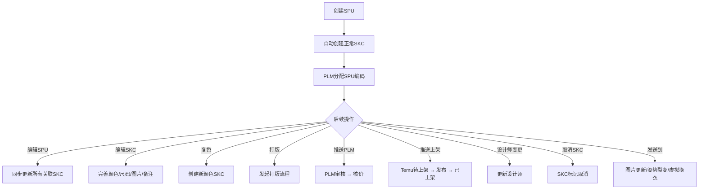
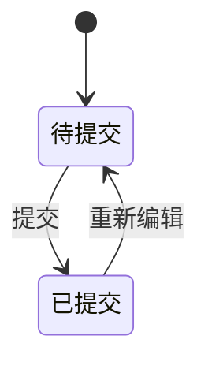
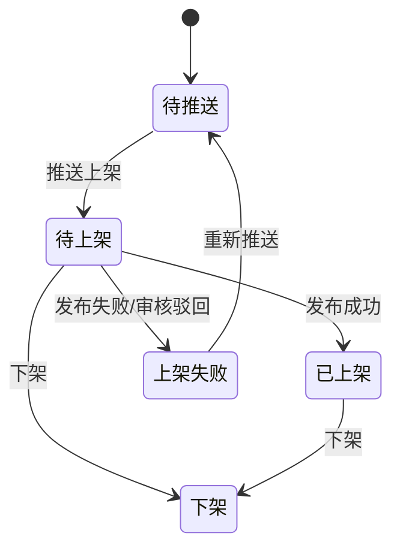
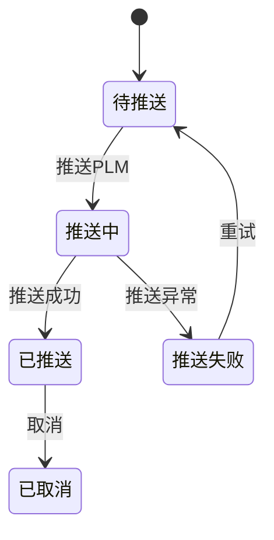
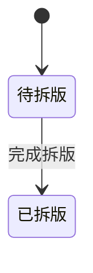
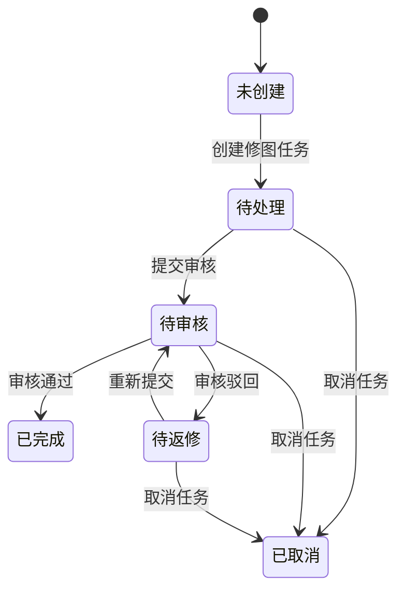
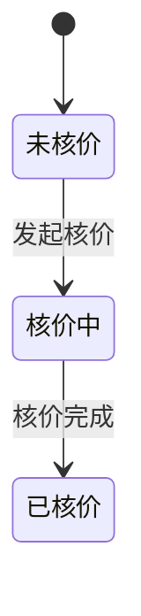
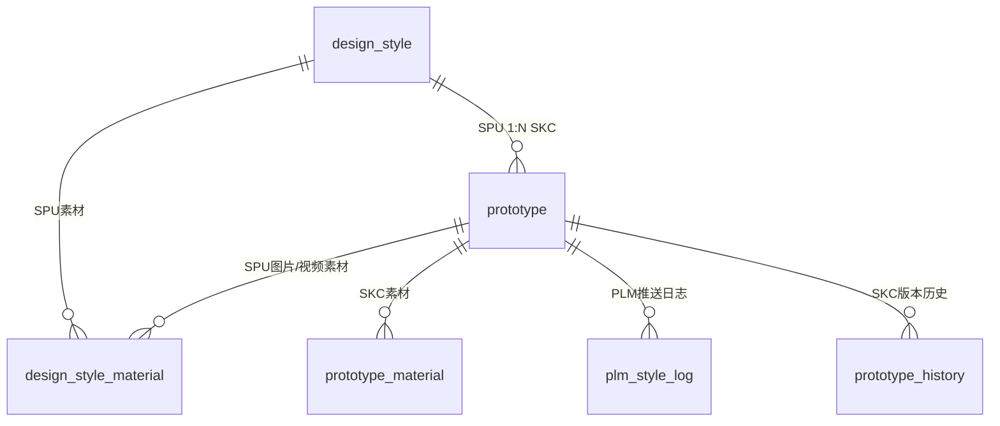

# 款式管理

## 1. 模块概述

本模块负责 SDP 系统的款式管理功能，基于 **SPU（标准产品单元）→ SKC（款式颜色规格）** 两级数据模型。

- **SPU（design_style 表）**：定义款式的企划信息、销售属性、生产标签等基础信息，编码规则为 `2年+2月+2日+4流水+2版号流水`
- **SKC（prototype 表）**：SPU 下的颜色+尺码规格变体，编码规则为 `SPU编码+2位色号流水`，追踪上架状态、打版进度、核价信息、推送到 PLM/Temu 的状态

**对接关系**：

| 对接系统 | 方向 | 数据/功能 | 说明 |
|---------|------|---------|------|
| NEST 字典 | 输入 | 品类、波段、季节、尺码组、款式标签、款式等级、品质等级等 | 下拉选项数据来源 |
| SSO 系统 | 输入 | 设计师/运营人员列表 | 设计师字段的数据来源 |
| PLM 系统 | 双向 | SPU编码（PLM分配）、BOM核价、推送上架审核 | 创建SPU后通过MQ推送获取PLM编码；推送PLM时校验状态 |
| 基础配置 | 输入 | 店铺列表、尺码模板 | 创建SPU时选择店铺和尺码标准 |
| 现货管理 | 输出 | SPU+SKC数据 | 推送上架后供现货商品列表引用 |
| Temu 商品管理 | 输出 | 上架SKC数据 | 商品同步引用款式信息 |

**核心业务流程**：

> **注意**：创建/编辑SPU+SKC 的2步向导页面入口在款式管理列表页，但页面属于现货管理模块范畴。供应商信息、成分信息等属于现货管理范畴，不在本模块范围内。

---

## 2. 页面概述

| 页面名称 | 页面类型 | 入口/路径 | 交互形式 | 说明 |
|---------|---------|---------|---------|------|
| 款式列表 | 列表页 | 设计中心 → 款式管理 | 页面跳转 | SPU/SKC 树形列表，主管理页面 |
| SKC详情 | 详情页 | 款式列表 → 点击SKC编码 | 页面跳转 | 展示SPU信息+SKC信息，支持上传设计图/视频 |
| 操作日志 | 抽屉 | 款式列表 → 点击「操作日志」 | 抽屉 | SKC维度操作日志 |
| 复色 | 弹窗 | 款式列表 → 点击「复色」 | 弹窗 | 以当前SKC为基础创建复色款 |
| 推送上架 | 弹窗 | 款式列表 → 点击「推送上架」 | 弹窗 | 选择发布店铺，推送至待上架列表 |
| 设计师变更 | 弹窗 | 款式列表 → 点击「设计师变更」 | 弹窗 | 批量变更设计师 |
| 取消SKC | 弹窗 | 款式列表 → 点击「取消」 | 弹窗 | 取消SKC并记录原因 |
| 组合商品操作日志 | 抽屉 | 款式列表 → 组合商品行操作 | 抽屉 | SKC维度组合商品日志 |
| 创建/编辑SPU+SKC | 表单页 | 款式列表 → 「新建SPU」/「编辑SPU」 | 页面跳转 | 2步向导，入口由款式列表触发，页面属于现货管理模块 |

---

## 3. 权限说明

### 功能权限

| 操作 | 权限码 | 说明 |
|------|--------|------|
| 复色 | `SDP-SJZX-KSGL-FS` | 以选中SKC为基础创建复色款 |
| 打印版单 | `SDP-SJZX-KSGL-DYBD` | 批量打印版单 |
| 设计师变更 | `SDP-SJZX-KSGL-SJSBG` | 批量变更款式的设计师 |
| 取消SKC | `SDP-SJZX-KSGL-QXSKC` | 取消选中的SKC |
| 新建SPU | `SDP-SJZX-KSGL-XJSPU` | 打开创建SPU页面（入口在款式列表，页面在现货管理模块） |
| 查看详情 | `SDP-SJZX-KSGL-CKXQ` | 查看SKC详情页 |
| 编辑SKC | `SDP-SJZX-KSGL-BJSKC` | 编辑SKC信息 |
| 发起打版 | `SDP-SJZX-KSGL-FQDB` | 发起打版流程 |
| 编辑SPU | `SDP-SJZX-KSGL-BJSPU` | 编辑SPU信息（入口在款式列表，页面在现货管理模块） |
| 导出 | `SDP-SJZX-KSGL-DC` | 导出列表数据 |
| 下载图片 | `SDP-SJZX-KSGL-XZTP` | 下载选中款式的图片 |
| 新建描稿任务 | `SDP-SJZX-KSGL-XJMGRW` | 创建描稿任务 |
| 发送到 | `SDP-SJZX-KSGL-FSD` | 发送款式到图片更新/姿势裂变/虚拟换衣任务 |
| 推送上架 | `SDP-SJZX-KSGL-TSSJ` | 推送款式至待上架列表 |
| 推送PLM | `SDP-SJZX-KSGL-TSPLM` | 推送款式资料到PLM系统 |

### 数据范围权限

| 权限码 | 说明 |
|--------|------|
| `SDP-SJZX-KSGL-QBFZ` | 查看全部款式 |
| `SDP-SJZX-KSGL-QBZN` | 仅查看本组款式 |
| `SDP-SJZX-KSGL-QBWD` | 仅查看我的款式 |

---

## 4. 状态机

### SPU 资料状态

### SKC 上架状态（listing_status）

> **v2.4.0 聚合规则**：SKC 的 `listing_status` 根据该 SKC 关联的所有商品（ProductSkc.skc_status）聚合计算，而非直接由推送流程设置：
> - 全部关联商品状态 = 下架(13) → SKC listing_status = 下架(3)
> - 存在任一关联商品状态 ≠ 下架(13) → SKC listing_status = 已上架(2)
> - 无关联商品时，沿用原推送流程的状态

### SKC 推送PLM状态（push_plm_status）

> **(v2.4.1 新增)** 新增"推送中"状态，用于标识已发起PLM推送但尚未收到回调确认的中间态。

### SKC 打版信息状态（prototype_status）

### 修图任务状态（image_update_status）

### 核价状态（check_price_state）

### 状态汇总

| 实体 | 字段 | 状态值 | 说明 |
|------|------|--------|------|
| SPU | style_status | 1=待提交, 2=已提交 | 款式资料提交状态 |
| SKC | listing_status | 0=待推送, 1=待上架, 2=已上架, 3=下架, 4=上架失败 | 推送到Temu的上架状态 |
| SKC | push_plm_status | 0=待推送, 1=推送中, 2=已推送, 3=推送失败, 4=已取消 | 推送到PLM的状态 (v2.4.1 变更) |
| SKC | prototype_status | 1=待拆版, 2=已拆版 | 打版拆版状态 |
| SKC | image_update_status | -1=未创建, 0=待处理, 10=待审核, 20=待返修, 30=已完成, 50=已取消 | 修图任务状态 |
| SKC | check_price_state | 0=未核价, 1=核价中, 2=已核价 | 核价进度状态 |
| SKC | skc_type | 1=正常款, 2=复色款 | 款式类型 |
| SKC | is_canceled | false=正常, true=已取消 | SKC是否已被取消 |
| SKC | is_on_sale | false=未动销, true=已动销 | SKC是否已产生销售 |

---

## 5. 数据模型

### 5.1 实体关系

### 5.2 SPU（design_style 表）

#### 编码与版本

| 属性 | 类型 | 必填 | 默认值 | 长度/范围 | 说明 |
|------|------|------|--------|----------|------|
| design_style_id | 整数 | 自动 | — | 雪花ID | SPU主键，由后端生成 |
| style_code | 短文本 | 自动 | — | ≤32字符 | SPU编码: 2年+2月+2日+4流水+2版号流水，由PLM异步分配 |
| version_num | 整数 | 自动 | 1 | — | SPU版本号，编辑时递增，用于乐观锁校验 |
| style_status | 整数 | 是 | 1 | — | 款式资料状态: 1=待提交, 2=已提交 |
| task_source | 短文本 | 是 | — | ≤32字符 | SPU来源: upload(用户新建) / develop_style_task(开款任务) |
| style_type | 短文本 | 否 | — | ≤32字符 | 开款类型 |
| source_business_id | 整数 | 否 | — | — | 来源业务ID（如开款任务ID） |
| source_business_code | 短文本 | 否 | — | ≤32字符 | 来源业务编码 |
| latest_submit_time | 日期时间 | 否 | — | — | 最新提交时间 |

#### 企划信息

| 属性 | 类型 | 必填 | 默认值 | 长度/范围 | 说明 |
|------|------|------|--------|----------|------|
| platform_code | 短文本 | 否 | — | ≤64字符 | 平台编码，取值来源：NEST字典 platform |
| platform_name | 短文本 | 否 | — | ≤64字符 | 平台名称 |
| wave_band_code | 短文本 | 否 | — | ≤64字符 | 波段编码，取值来源：NEST字典 plm_clothing_band |
| wave_band_name | 短文本 | 否 | — | ≤64字符 | 波段名称 |
| season_code | 短文本 | 是 | — | ≤64字符 | 季节编码，取值来源：NEST字典 plm_reference_season |
| season_name | 短文本 | 是 | — | ≤64字符 | 季节名称 |
| gala_code | 短文本 | 否 | — | ≤64字符 | 节日编码，取值来源：NEST字典 festival |
| gala_name | 短文本 | 否 | — | ≤64字符 | 节日名称 |
| style_level_code | 短文本 | 是 | — | ≤64字符 | 款式等级编码，取值来源：NEST字典 product_level |
| style_level_name | 短文本 | 是 | — | ≤64字符 | 款式等级名称 |
| quality_level_code | 短文本 | 是 | — | ≤64字符 | 品质等级编码，取值来源：NEST字典 plm_quality_level |
| quality_level_name | 短文本 | 是 | — | ≤64字符 | 品质等级名称 |

#### 销售属性

| 属性 | 类型 | 必填 | 默认值 | 长度/范围 | 说明 |
|------|------|------|--------|----------|------|
| category_code | 短文本 | 是 | — | ≤64字符 | 款式品类编码(款式品类-商品类型-商品末级分类)(code1-code2-code3)，取值来源：NEST字典 clothing_category |
| category_name | 短文本 | 是 | — | ≤128字符 | 款式品类名(三级分类以"-"隔开)（如：女装-上装-T恤） |
| category_labels | 短文本 | 否 | — | ≤128字符 | 开款品类标签 |
| style_label_code | 短文本 | 是 | — | ≤64字符 | 款式标签编码，取值来源：NEST字典 product_tag |
| style_label_name | 短文本 | 是 | — | ≤64字符 | 款式标签名称 |
| store_id | 引用 | 是 | — | — | 店铺ID，取值来源：基础配置-店铺管理 |
| store_name | 短文本 | 是 | — | ≤64字符 | 店铺名称 |
| size_standard_code | 短文本 | 是 | — | ≤64字符 | 尺码标准编号，取值来源：NEST字典 plm_standard_size |
| size_standard_name | 短文本 | 是 | — | ≤64字符 | 尺码标准名称（如 中国码） |
| scene_code | 短文本 | 否 | — | ≤64字符 | 场景编码，取值来源：NEST字典 scenes |
| scene_name | 短文本 | 否 | — | ≤64字符 | 场景名称 |
| design_type_code | 短文本 | 否 | — | ≤64字符 | 款式类型编码 |
| design_type_name | 短文本 | 否 | — | ≤64字符 | 款式类型名称 |
| commodity_link | 短文本 | 否 | — | ≤500字符 | 商品链接 |

#### 生产标签

| 属性 | 类型 | 必填 | 默认值 | 长度/范围 | 说明 |
|------|------|------|--------|----------|------|
| weave_mode_code | 短文本 | 是 | — | ≤64字符 | 织造方式编码，取值来源：NEST字典 aps_category_type (v2.4.1 变更) |
| weave_mode_name | 短文本 | 是 | — | ≤64字符 | 织造方式名称 (v2.4.1 变更) |
| clothing_style_code | 短文本 | 是 | — | ≤64字符 | 款式风格编码，取值来源：NEST字典 product_style |
| clothing_style_name | 短文本 | 是 | — | ≤64字符 | 款式风格名称 |
| printing_code | 短文本 | 是 | — | ≤64字符 | 印花编码，取值来源：NEST字典 fd-printing |
| printing_name | 短文本 | 是 | — | ≤64字符 | 印花名称 |
| pattern_code | 短文本 | 是 | — | ≤64字符 | 版型编码 |
| pattern_name | 短文本 | 是 | — | ≤64字符 | 版型名称 |
| elastic_code | 短文本 | 是 | — | ≤64字符 | 弹性编码，取值来源：NEST字典 plm_elastic_requirement |
| elastic_name | 短文本 | 是 | — | ≤64字符 | 弹性名称 |
| visual_form_code | 短文本 | 是 | — | ≤64字符 | 视觉形式编码，取值来源：NEST字典 visual_style |
| visual_form_name | 短文本 | 是 | — | ≤64字符 | 视觉形式名称 |
| fabric_pool_usage_scope_code | 短文本 | 否 | — | ≤64字符 | 面料池使用范围编码，取值来源：NEST字典 (v2.4.1 新增) |
| fabric_pool_usage_scope_name | 短文本 | 否 | — | ≤64字符 | 面料池使用范围名称 (v2.4.1 新增) |

#### SKU分类

| 属性 | 类型 | 必填 | 默认值 | 长度/范围 | 说明 |
|------|------|------|--------|----------|------|
| sku_class_code | 短文本 | 否 | — | ≤64字符 | SKU类别编码，取值来源：NEST字典 SKU_CLASSIFICATION（如：单品、套装） |
| sku_class_name | 短文本 | 否 | — | ≤64字符 | SKU类别名称 |
| suit_piece | 整数 | 否 | — | 1-99 | 套装件数（仅 sku_class=套装 时填写） |

#### 设计师信息

| 属性 | 类型 | 必填 | 默认值 | 长度/范围 | 说明 |
|------|------|------|--------|----------|------|
| designer_id | 引用 | 是 | — | — | 设计师ID（取值来源：SSO系统） |
| designer_code | 短文本 | 是 | — | ≤64字符 | 设计师编号 |
| designer_name | 短文本 | 是 | — | ≤64字符 | 设计师名称 |

#### 修图任务关联

| 属性 | 类型 | 必填 | 默认值 | 长度/范围 | 说明 |
|------|------|------|--------|----------|------|
| image_update_task_id | 引用 | 否 | — | — | 修图任务ID |
| image_update_task_code | 短文本 | 否 | — | ≤32字符 | 修图任务编号 |
| image_update_status | 整数 | 否 | -1 | — | 修图任务状态：-1=未创建, 0=待处理, 10=待审核, 20=待返修, 30=已完成, 50=已取消 |

#### AIGC关联

| 属性 | 类型 | 必填 | 默认值 | 长度/范围 | 说明 |
|------|------|------|--------|----------|------|
| picking_result_id | 引用 | 否 | — | — | AIGC选款结果ID |
| picking_style_id | 引用 | 否 | — | — | AIGC款式ID |

---

### 5.3 Prototype（SKC）（prototype 表）

#### 标识与关联

| 属性 | 类型 | 必填 | 默认值 | 长度/范围 | 说明 |
|------|------|------|--------|----------|------|
| prototype_id | 整数 | 自动 | — | 雪花ID | SKC主键 |
| design_style_version_id | 引用 | 是 | — | — | 关联 design_style 版本ID |
| design_style_id | 引用 | 是 | — | — | 关联 SPU ID |
| design_code | 短文本 | 自动 | — | ≤32字符 | SKC编码: SPU编码+2位色号流水（如 25101500010101） |
| style_code | 短文本 | 是 | — | ≤32字符 | 关联 SPU 编码 |
| task_source | 短文本 | 是 | — | ≤32字符 | SKC来源（继承自SPU） |
| version | 整数 | 自动 | 1 | — | 版本号 |
| version_num | 整数 | 自动 | 1 | — | 版本号数值 |
| latest_prototype_id | 引用 | 是 | — | — | 最新版本SKC ID |
| latest_version_num | 整数 | 是 | 1 | — | 最新版本号 |

#### 状态字段

| 属性 | 类型 | 必填 | 默认值 | 长度/范围 | 说明 |
|------|------|------|--------|----------|------|
| listing_status | 整数 | 是 | 0 | — | 上架状态: 0=待推送, 1=待上架, 2=已上架, 3=下架, 4=上架失败 |
| listing_fail_reason | 短文本 | 否 | — | ≤200字符 | 上架失败原因 |
| push_plm_status | 整数 | 否 | 0 | — | 推送PLM状态: 0=待推送, 1=推送中, 2=已推送, 3=推送失败, 4=已取消 (v2.4.1 变更) |
| plm_push_result_message | 短文本 | 否 | — | ≤200字符 | PLM推送失败原因 |
| skc_type | 整数 | 是 | 1 | — | 款类型: 1=正常款, 2=复色款 |
| prototype_status | 整数 | 是 | 1 | — | 打版信息状态: 1=待拆版, 2=已拆版 |
| is_canceled | 布尔 | 是 | false | — | 是否取消 |
| cancel_reason | 短文本 | 否 | — | ≤200字符 | 取消原因 |
| cancel_time | 日期时间 | 否 | — | — | 取消时间 |
| cancel_user_id | 引用 | 否 | — | — | 取消操作人ID |
| cancel_user_name | 短文本 | 否 | — | ≤64字符 | 取消操作人名称 |
| cancel_remark | 短文本 | 否 | — | ≤200字符 | 取消备注 |
| is_on_sale | 布尔 | 是 | false | — | 是否动销 |
| is_make_more | 布尔 | 是 | false | — | 是否补做 |
| make_more_latest_time | 日期时间 | 否 | — | — | 最新补做时间 |

#### SKC属性

| 属性 | 类型 | 必填 | 默认值 | 长度/范围 | 说明 |
|------|------|------|--------|----------|------|
| color | 短文本 | 是 | — | ≤64字符 | 颜色名称 |
| color_code | 短文本 | 是 | — | ≤64字符 | 颜色编码，取值来源：NEST字典 clothing_color |
| sample_size | 短文本 | 是 | — | ≤32字符 | 样衣尺码 |
| sample_amount | 短文本 | 否 | — | ≤16字符 | 样衣件数 |
| design_picture | 文件引用 | 否 | — | jpg/png, 多张以英文逗号分隔 | 设计图 |
| is_urgent | 布尔 | 否 | false | — | 是否紧急 (1:紧急, 0:不紧急) |
| wave_band_code | 短文本 | 否 | — | ≤64字符 | 波段编码，取值来源：NEST字典 plm_clothing_band (v2.4.1 新增) |
| wave_band_name | 短文本 | 否 | — | ≤64字符 | 波段名称 (v2.4.1 新增) |
| project_type_code | 短文本 | 是 | — | ≤64字符 | 项目类型编码，取值来源：NEST字典 project_type (v2.4.1 新增, v2.6.0 变更: 从SPU迁移至SKC维度，改为必填) |
| project_type_name | 短文本 | 是 | — | ≤64字符 | 项目类型名称 (v2.4.1 新增, v2.6.0 变更: 从SPU迁移至SKC维度，改为必填) |
| skc_create_time | 日期时间 | 自动 | — | — | SKC创建时间 (v2.6.0 新增) |

#### 打版/开发信息

| 属性 | 类型 | 必填 | 默认值 | 长度/范围 | 说明 |
|------|------|------|--------|----------|------|
| make_clothes_type | 整数 | 否 | — | — | 制作方式: 0=仅纸样, 1=实物样, 2=3D样, 3=3D+实物样 |
| pre_disassembly_state | 整数 | 否 | — | — | 前置拆版: 0=否, 1=是 |
| disassembly_finished | 整数 | 否 | 0 | — | 拆版是否完成: 0=否, 1=是 |
| disassembly_finished_time | 日期时间 | 否 | — | — | 拆版完成时间 |
| is_splicing | 布尔 | 否 | false | — | 是否拼接 |
| sewing_remark | 长文本 | 否 | — | ≤200字符 | 车缝工艺备注 |
| cutting_remark | 长文本 | 否 | — | ≤200字符 | 裁剪工艺备注 |
| type_remark | 长文本 | 否 | — | ≤200字符 | 版型备注 |
| storage_location | 短文本 | 否 | — | ≤32字符 | 库位号 |

#### 核价信息

| 属性 | 类型 | 必填 | 默认值 | 长度/范围 | 说明 |
|------|------|------|--------|----------|------|
| check_price_state | 整数 | 否 | 0 | — | 生产核价状态: 0=未核价, 1=核价中, 2=已核价 |
| predict_check_price_status | 整数 | 否 | 0 | — | 预估核价状态: 0=未核价, 1=核价中, 2=已核价 |
| is_last_bom_check_price | 整数 | 否 | 0 | — | 最新BOM是否已核价: 0=未核价, 1=已核价 |
| check_price_type | 整数 | 否 | — | — | 核价类型: 1=预估核价, 2=生产核价(精确) |
| total_cost | 金额 | 否 | — | DECIMAL(10,2), CNY | 核价总成本（对厂总结算不加成） |
| bulk_cost | 金额 | 否 | — | DECIMAL(10,2), CNY | 大货成本价 |
| check_price_name | 短文本 | 否 | — | ≤64字符 | 核价人名称 |
| check_price_time | 日期时间 | 否 | — | — | 核价时间 |

#### 关联属性

| 属性 | 类型 | 必填 | 默认值 | 长度/范围 | 说明 |
|------|------|------|--------|----------|------|
| designer_id | 引用 | 是 | — | — | 设计师ID（取值来源：SSO系统） |
| designer_code | 短文本 | 是 | — | ≤64字符 | 设计师编号 |
| designer_name | 短文本 | 是 | — | ≤64字符 | 设计师名称 |
| designer_group | 短文本 | 否 | — | ≤64字符 | 设计组 |
| country_site_code | 短文本 | 否 | — | ≤64字符 | 国家站点编码，取值来源：NEST字典 temu_site |
| country_site_name | 短文本 | 否 | — | ≤64字符 | 国家站点名称 |
| design_phone | 短文本 | 否 | — | ≤32字符 | 设计师电话 |
| make_same_design_code | 短文本 | 否 | — | ≤32字符 | 复色款号（从哪个SKC复色而来） |

---

## 6. 款式列表页

### 页面说明

**入口**: 设计中心 → 款式管理

**列表行为**:
- 数据来源：当前租户的 SPU/SKC 数据
- 展示形式：SPU-SKC 树形列表（父行为SPU信息，子行为SKC信息），SPU按创建时间降序
- 分页：默认 20 条/页，可选 10/20/30/50/100/200
- 刷新方式：手动刷新

**营销图功能 (v2.6.0 新增)**：款式列表新增以下营销图相关功能：

- **查看营销图**：支持从列表直接打开查看当前 SKC 的所有营销图
- **营销图数量角标**：列表默认在每个 SKC 行的缩略图右上角显示该 SKC 的营销图数量
- **SPU 首图**：SPU 行新增展示该 SPU 下首个 SKC 的商品图缩略图，便于多色款式识别

### 查询条件

| 条件名称 | 输入方式 | 说明 |
|---------|---------|------|
| SKC编码 | 文本输入 | 支持批量搜索，多个用空格或逗号隔开 |
| SPU编码 | 文本输入 | 支持批量搜索，多个用空格或逗号隔开 |
| 颜色 | 文本输入 | 支持模糊搜索 (v2.4.1 新增) |
| 款式品类 | 级联选择(多选) | 取值来源：NEST字典 clothing_category，三级品类（如 女装-上装-T恤） |
| 波段 | 多选 | 取值来源：NEST字典 plm_clothing_band |
| 设计师 | 搜索选择 | 取值来源：SSO人员 |
| 设计组别 | 多选 | 设计组 |
| 店铺 | 多选 | 取值来源：基础配置-店铺管理 |
| 款式标签 | 多选 | 取值来源：NEST字典 product_tag |
| 款式级别 | 多选 | 取值来源：NEST字典 product_level |
| 项目类型 | 多选 | 取值来源：NEST字典 project_type (v2.4.1 新增, v2.6.0 变更: 筛选SKC维度的项目类型) |
| 面料池使用范围 | 多选 | 取值来源：NEST字典 fabric_pool_usage_scope (v2.4.1 新增) |
| 织造方式 | 多选 | 取值来源：NEST字典 aps_category_type (v2.4.1 新增) |
| SPU生成时间 | 日期范围选择 | 起止日期 |
| SKC生成时间 | 日期范围选择 | 起止日期 |
| 测价通过时间 | 日期范围选择 | 起止日期 (v2.4.1 新增) |
| 修图任务 | 单选 | 全部/未创建/待处理/待审核/待返修/已完成/已取消 |

### 行内筛选条件

| 条件名称 | 输入方式 | 取值 |
|---------|---------|------|
| 商品图 | 单选按钮组 | 全部/有图/无图 |
| 资料状态 | 单选按钮组 | 全部/未提交/已提交 |
| 上架状态 | 多选 | 待推送/待发布/已发布/下架/发布失败 (v2.4.1 变更) |
| 取消状态 | 单选按钮组 | 全部/是/否 |
| 动销 | 单选按钮组 | 全部/是/否 |
| 推送PLM状态 | 多选 | 待推送/推送中/已推送/推送失败/已取消 (v2.4.1 变更) |

**清空快捷键 (v2.6.0 新增)**: SKC SPU编码查询框提供清空快捷键，支持一键清除所有已设置的筛选条件，快速恢复默认视图。

### 显示字段

| 字段名称 | 显示为 | 说明 |
|---------|--------|------|
| SPU信息 | 缩略图 + 可点击文本 + 文本 | 首个SKC商品图缩略图 (v2.6.0 新增) + SPU编码（可复制）+ 品类名 + SPU生成时间 |
| SKC信息 | 缩略图 + 可点击文本 + 文本 | 缩略图（右上角展示营销图数量角标，v2.6.0 新增）+ SKC编码（可复制）+ 颜色 + 尺码 + SKC生成时间 + SKC创建时间 (v2.6.0 新增) |
| 款式类型 | 标签 | 正常款/复色款 |
| 款式资料 | 状态标签 | 未提交/已提交 |
| 项目类型 | 文本 | 项目类型名称 (v2.6.0 变更: 从SPU迁移至SKC维度，改为必填) |
| 面料池使用范围 | 文本 | 面料池使用范围名称 (v2.4.1 新增) |
| 织造方式 | 文本 | 织造方式名称 (v2.4.1 新增) |
| 修图任务 | 状态标签 | 未创建/待处理/待审核/已返修/已完成/已取消，点击跳转任务详情 |
| 上架状态 | 状态标签 | 待推送/待发布/已发布/下架/发布失败 (v2.4.0 变更) 根据关联商品聚合计算 |
| 推送PLM状态 | 状态标签 | 待推送/推送中/已推送/推送失败/已取消 (v2.4.1 变更) |
| 开发BOM | 文本 | BOM相关状态 |
| 打版进度 | 文本 | 打版环节节点描述 + 是否完成 |
| 核价 | 格式化文本 + 文本 | 大货成本价 + 核价时间 + 测价通过状态 |
| 操作 | 操作按钮 | 操作日志、备注、启动打版等 |

### 行操作

| 操作 | 权限码 | 交互形式 | 说明 |
|------|--------|---------|------|
| 新建SPU | `XJSPU` | 页面跳转 | 跳转到现货管理模块的【创建款式】2步向导页 |
| 设计师变更 | `SJSBG` | 弹窗 | 至少选中1条SPU，输入新设计师后批量更新 |
| 下载图片 | `XZTP` | — | 下载选中款式的商品图 |
| 上传图片 | — | 弹窗 | 批量上传图片 |
| 导出 | `DC` | — | 导出列表数据 |
| 发送到 | `FSD` | 下拉菜单 | 图片更新任务/姿势裂变/虚拟换衣 |
| 推送PLM | `TSPLM` | 弹窗 | 推送选中款式到PLM |
| 取消 | `QXSKC` | 弹窗 | 取消选中的SKC（仅支持单选），从NEST字典选择取消原因并填写备注 |
| 推送上架 | `TSSJ` | 弹窗 | 选择发布店铺，推送到待上架列表 |
| 复色 | `FS` | — | 选中1条SKC，生成一条新的复色SKC |
| 打印版单 | `DYBD` | — | 批量打印版单 |
| 查看详情 | `CKXQ` | 页面跳转 | 跳转到SKC详情页 |
| 编辑SKC | `BJSKC` | 页面跳转 | 跳转到编辑SKC页面 |
| 编辑SPU | `BJSPU` | 页面跳转 | 跳转到现货管理模块的【编辑款式】2步向导页 |
| 操作日志 | — | 抽屉 | 打开SKC操作日志抽屉 |
| 添加备注 | — | 行内编辑 | 添加/编辑SPU备注 |
| 查看系统SKU列表 | — | 页面跳转 | 查看SKU维度系统列表 (v2.4.1 新增) |
| 查看营销图 | — | 弹窗 | 查看当前 SKC 的全部营销图 (v2.6.0 新增) |

### 批量操作

| 操作 | 可选条件 | 最少选中 | 权限码 | 说明 |
|------|---------|---------|--------|------|
| 设计师变更 | 至少选中1条（仅SPU行） | 1 | `SJSBG` | 批量更新设计师 |
| 推送上架 | 至少选中1条 | 1 | `TSSJ` | 批量推送至待上架列表 |
| 下载图片 | 至少选中1条 | 1 | `XZTP` | 批量下载商品图 |

### 关键业务规则

**创建SPU**:
1. 创建SPU时，系统自动创建一个 `skc_type=1`（正常款）的SKC
2. SPU编码由PLM系统通过MQ异步分配，创建后发送MQ消息给PLM获取编码
3. 首次创建不生成styleCode，待PLM回调后更新
4. 新建SPU默认状态：`style_status=1`（待提交）, `version_num=1`

**编辑SPU**:
1. 版本号乐观锁：编辑时校验 versionNum 是否与数据库一致；不一致则提示"当前SPU已更新, 请刷新获取最新版本SPU信息后再编辑!"
2. 编辑SPU不更新设计师（由"设计师变更"功能专门处理）
3. 每次编辑 versionNum 递增1
4. 编辑SPU后，将所有关联SKC的SPU维度信息同步更新

**尺码标准变更阻断**:
编辑SPU时，以下任一条件成立则不允许修改尺码标准：

| 条件 | 错误提示 |
|------|---------|
| SKC已推送商品（listing_status=1/2，即待上架/已上架） | "SKC: {skcCodes} 已推送商品/PLM，不能编辑尺码组" |
| SKC已推送PLM（push_plm_status=2，即已推送） | "SKC: {skcCodes} 已推送商品/PLM，不能编辑尺码组" |
| SKC已动销（is_on_sale=true） | "SKC: {skcCodes} 已动销，不能编辑尺码组" |

**SKC上架流程**:
SKC上架为独立维度推送（不依赖SPU维度）：
1. 未发布前新增SKC → SKC维度推送 → 待上架 → 审核 → 发布成功 → 已上架
2. 已发布后新增SKC → SKC维度推送 → 待推送 → 待上架 → 商品列表出现"待更新"标识
3. 未上架SKC无法被推送上架：已取消、未拆版的SKC不能推送

**上架状态聚合 (v2.4.0)**:
SKC 的 `listing_status` 根据所有关联商品的状态聚合计算：
- 全部关联商品的 `ProductSkc.skc_status` = 下架(13) → SKC `listing_status` = 下架(3)
- 存在任一关联商品的 `ProductSkc.skc_status` ≠ 下架(13) → SKC `listing_status` = 已上架(2)
- 无关联商品时，沿用原推送流程的状态

**推送上架入口限制 (v2.4.0)**:
当 SPU 已有已发布商品时，禁止从款式管理侧发起推送上架：
- 限制条件：SPU 下存在任一 `product_status=1`（已发布）的商品
- UI 表现："推送上架"按钮 disabled/灰显，hover 提示"该SPU已有已发布商品，请在商品列表使用复制商品功能"

**店铺字段 (v2.4.0)**: 款式列表的"店铺"字段始终取建款时的店铺，不随商品发布到其他店铺而变化。

**测价通过 (v2.4.0)**: 取值来源改为关联商品。任一关联商品标记"测价通过"时回传至款式列表；多个商品更新时以最后一次更新为准。

**取消SKC**:

| 项目 | 说明 |
|------|------|
| 操作入口 | 款式列表 → 选中一条SKC → 点击「取消」按钮 |
| 权限码 | `SDP-SJZX-KSGL-QXSKC` |
| 交互形式 | 弹窗 |
| 前置条件 | 1）已选中一条且仅一条SKC；2）该SKC的 is_canceled = false（未取消） |

**取消弹窗**:

- 标题：「取消款号」
- 取消原因：下拉选择，选项来源于 NEST 字典 `skc_cancel_reason`
- 取消原因校验：必填，非空
- 确认提示：「SKC取消后将不可恢复，是否确认取消？」
- 确认后调用后端 `/sdp-curation/web/v1/prototype-manage/cancel` 接口

**取消后数据变更**:

| 变更对象 | 变更内容 |
|---------|---------|
| prototype（SKC主表） | is_canceled = true, cancel_time = now(), cancel_user_id/name/code 记录当前操作人 |
| prototype_detail（SKC详情） | 写入 cancel_reason、cancel_remark、cancel_user_id/name/code |
| prototype_history（SKC版本历史） | 已取消标识同步更新为 is_canceled = true, cancel_time = now() |
| 操作日志 | 新增一条操作日志，内容：「取消SKC：{取消原因}」 |

**PLM取消通知**:

- 取消后自动判断是否需通知PLM：仅当 SKC 的 `push_plm_status` 为已推送(2) 或 推送失败(3)，且 `operator_done = 是` 时，向PLM系统推送取消日志
- PLM侧也可发起取消：通过 `plmBatchCancel` 接口，将 SKC 的 `push_plm_status` 设为已取消(3)，并记录 `plm_cancel_reason` / `plm_cancel_remark`

**校验规则**:

| 场景 | 处理 |
|------|------|
| 已取消的SKC再次取消 | 提示"该设计款已取消!"，阻止操作 |
| 选中的SKC超过1条 | 按钮 disable（界面限制：仅支持单选取消） |
| 未选中任何SKC | 按钮 disable |

### 异常处理

| 异常场景 | 用户看到的表现 |
|---------|-------------|
| SPU版本过期（并发编辑） | 提示"当前SPU已更新, 请刷新获取最新版本SPU信息后再编辑!" |
| 尺码标准变更被阻止（SKC已推送商品/PLM） | 提示"SKC: {skcCodes} 已推送商品/PLM，不能编辑尺码组" |
| 尺码标准变更被阻止（SKC已动销） | 提示"SKC: {skcCodes} 已动销，不能编辑尺码组" |
| SPU不存在（引用历史款式） | 提示"SPU不存在，请重新输入" |
| SPU编码引用为空 | 提示"没有spu编号不能进行发送操作" |
| 必填字段为空 | 对应字段标红提示 |
| 数据请求失败 | 错误提示 + "重试"按钮 |
| 无权限 | "暂无访问权限，请联系管理员" |
| 取消SKC：已取消的SKC再次取消 | 提示"该设计款已取消!"，阻止操作 |
| 取消SKC：取消原因未填写 | 弹窗校验提示"请选择取消原因"，阻止提交 |

### 更新记录

| 关联版本 | 更新内容 | 具体说明 |
|------|------|------|
| v2.4.0 | 一款多商品+SKC维度调整 | (v2.4.0 变更) 上架状态聚合、推送买手/测价状态、推送上架限制、店铺字段取值 |
| v2.4.1 | 列表筛选扩展+SKC维度字段 | (v2.4.1 新增) 项目类型/面料池使用范围/织造方式筛选与显示、颜色模糊搜索、测价通过时间筛选、查看系统SKU列表入口 (v2.4.1 变更) 上架状态/推送PLM状态筛选改为多选、推送PLM状态新增推送中 |
| v2.6.0 | 营销图预览+清空快捷键+SKC维度拆分 | (v2.6.0 新增) 营销图预览模式 (#164)、筛选栏清空快捷键 (#169) (v2.6.0 变更) 项目类型从SPU迁移至SKC维度并改为必填 (#232)、SKC新增SKC创建时间字段 (#232) |

---

## 7. SKC详情页

### 页面说明

**入口**: 款式列表 → 点击SKC编码链接（需 `CKXQ` 权限）

**交互形式**: 页面跳转

**页面布局**:

| 区域 | 内容 | 说明 |
|------|------|------|
| 顶部信息区 | SKC编码、供给方式标签、取消/动销标签 | 显示SKC关键状态 |
| SPU信息面板 | 设计师、设计组、品类、SPU编码、款式标签、款式级别、店铺、尺码组、织造方式、季节、印花、视觉形式、版型、风格、弹性、场景、SKU分类、套装件数、项目类型、商品链接 | 继承自SPU的完整信息 (v2.4.1 变更) 波段移至SKC维度 |
| 标签页-基础信息 | 波段、营销图、设计图、视频、开发信息（颜色、尺码、是否拼接、制作方式、前置拆版、备注） | 可编辑 (v2.4.1 变更) 波段从SPU维度移至SKC维度 |
| 标签页-修图任务 | 修图任务状态与详情 | — |
| 标签页-BOM物料 | BOM物料图片信息 | — |
| 底部操作栏 | 提交、取消 | 全局操作按钮 |

### 可编辑字段

| 字段名称 | 输入方式 | 必填 | 校验规则 | 说明 |
|---------|---------|------|---------|------|
| 波段 | 多选 | 否 | — | 取值来源：NEST字典 plm_clothing_band (v2.4.1 变更) SKC维度，独立于SPU波段 |
| 颜色 | 级联选择（支持搜索） | 是 | 同一SPU下不可重复 | 取值来源：NEST字典 clothing_color，展示颜色示意图 |
| 尺码 | 单选 | 是 | — | 取值来源：NEST字典 plm_standard_size |
| 是否拼接 | 单选按钮 | 否 | — | 是/否 |
| 制作方式 | 单选按钮 | 否 | — | 实物样(1)/3D样(2) |
| 前置拆版 | 单选按钮 | 否 | — | 是(1)/否(0) |
| 车缝备注 | 多行文本 | 否 | ≤200字符 | |
| 裁剪工艺备注 | 多行文本 | 否 | ≤200字符 | |
| 版型备注 | 多行文本 | 否 | ≤200字符 | |

### 图片上传限制

| 类型 | 限制 |
|------|------|
| 营销图 | .png/.jpg/.jpeg，最大20MB，单次最多10张 |
| 设计图 | .png/.jpg/.jpeg，最大20MB，单次最多10张 |
| 视频 | .mp4/.mov/.avi，最大50MB，单次最多1个 |

### 关键业务规则

**SKC颜色校验**:
- 保存SKC时校验同一SPU下颜色是否重复 → 提示"存在颜色重复的SKC，请勿重复创建"
- 复色时校验颜色是否与该SPU下其他SKC颜色重复 → 提示"存在颜色重复的SKC，请勿重复创建"

### 异常处理

| 异常场景 | 用户看到的表现 |
|---------|-------------|
| 颜色重复 | 提示"存在颜色重复的SKC，请勿重复创建" |
| 模板被他人删除 | 提示"数据不存在"，返回列表页 |
| 数据加载失败 | 各区块独立加载，失败的区块显示重试按钮 |

---

## 更新记录

| 关联版本 | 更新内容 | 具体说明 |
|------|------|------|
| v2.4.0 | 一款多商品+SKC维度调整 | 上架状态聚合、推送买手/测价状态、推送上架限制 |
| v2.4.1 | 列表筛选扩展+SKC维度字段+PLM推送中状态 | (v2.4.1 新增) 款式列表新增项目类型/面料池使用范围/织造方式字段与筛选、颜色模糊搜索、测价通过时间筛选、系统SKU列表入口；数据模型 SKC 新增波段/项目类型、SPU 新增面料池使用范围 (v2.4.1 变更) 上架状态/推送PLM状态筛选改为多选、PLM状态机新增推送中、SKC详情波段从SPU移至SKC维度 |
| v2.6.0 | 营销图功能+清空快捷键+SKC维度拆分 | (v2.6.0 新增) 营销图功能 (#164)：支持从列表直接查看SKC全部营销图；SKC缩略图右上角默认显示营销图数量角标；SPU行新增展示首个SKC商品图缩略图；筛选栏清空快捷键 (#169)；SKC实体新增SKC创建时间字段 (#232) (v2.6.0 变更) 项目类型从SPU迁移至SKC维度并改为必填 (#232) |
