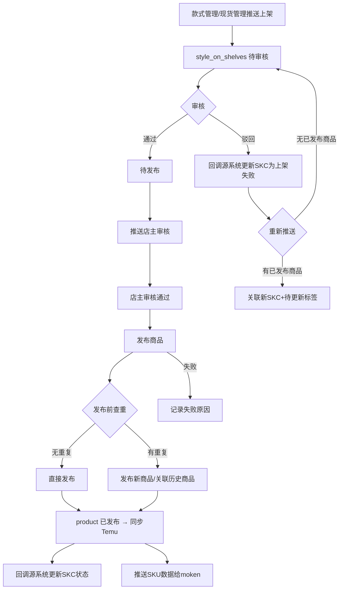
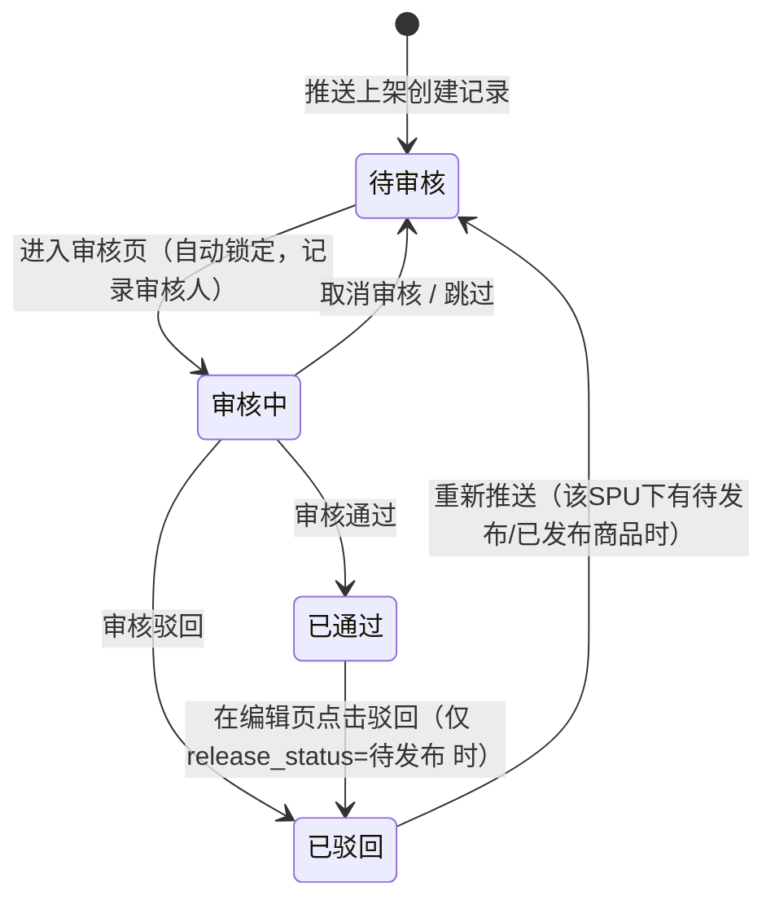
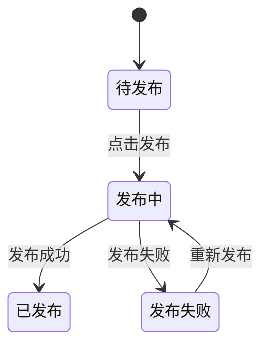
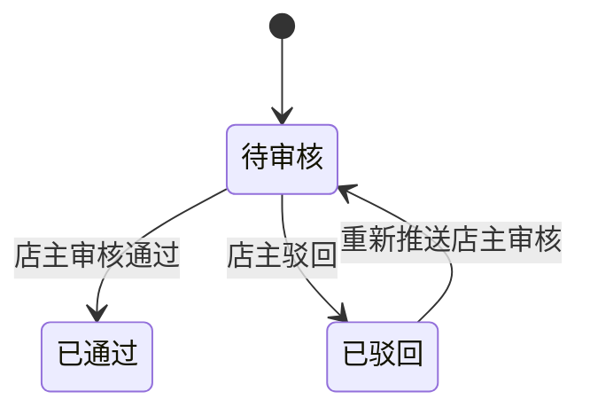
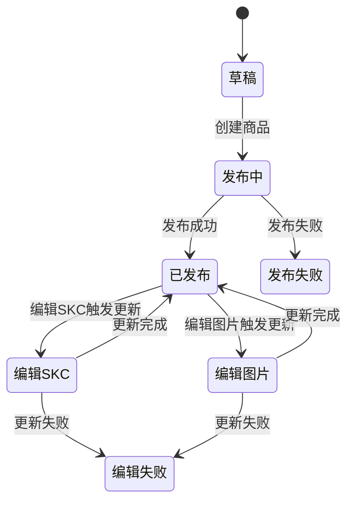
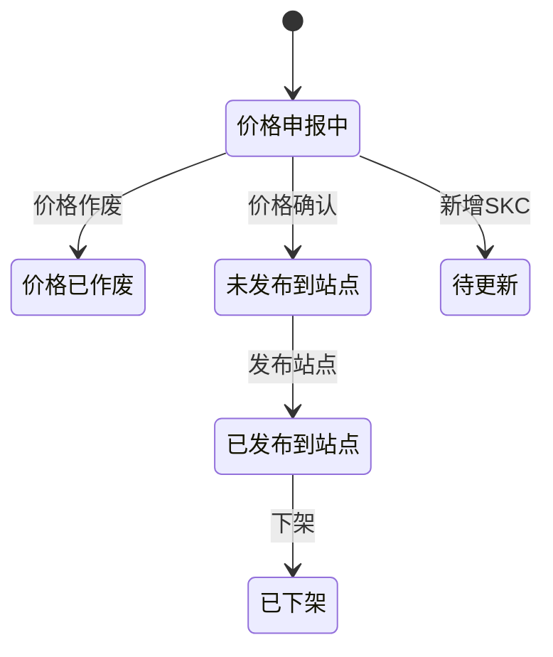
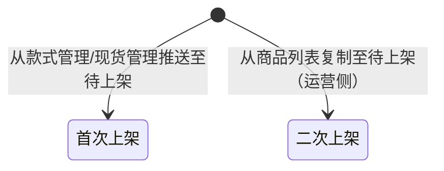
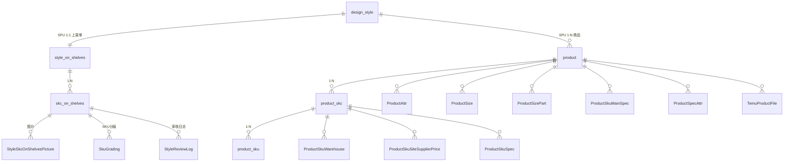

# 商品管理

## 1. 模块概述

本模块负责 SDP 系统的商品管理功能，覆盖**待上架审核 → 发布商品 → 商品列表管理**全流程。

- **待上架列表**：款式管理/现货管理推送的待审核 SPU+SKC，经过内部审核 → 店主审核 → 发布到 Temu 的完整链路
- **商品列表**：已发布的商品管理，包括 SKC/SKU 级别的状态追踪、平台 ID 关联、待更新标识、测价管理等

**核心数据流**：
```
款式管理/现货管理 → 推送上架 → style_on_shelves (待上架)
  → 审核通过 → 发布 → product (商品) → 同步到 Temu 平台
  → 发布成功后推送 SKU 至 moken (v2.4.1 新增)
```

**对接关系**：

| 对接系统 | 方向 | 数据/功能 | 说明 |
|---------|------|---------|------|
| 款式管理 | 输入 | SPU+SKC 推送 | 设计款推送上架后写入 style_on_shelves |
| 现货管理 | 输入 | SPU+SKC 推送 | 现货款推送上架后写入 style_on_shelves |
| 基础配置 | 输入 | 店铺信息+Token、尺码模板 | 商品同步时的 API 鉴权和尺码表引用 |
| NEST 字典 | 输入 | 品类、波段、款式标签等 | 下拉选项数据来源 |
| SSO 系统 | 输入 | 设计师/运营人员/审核人 | 人员字段数据来源 |
| Temu 平台 | 输出 | 商品发布、价格同步 | 通过 Temu Seller API 同步商品数据 |
| moken 系统 | 输出 | SKU 数据推送 | (v2.4.1 新增) 发布商品成功后推送SKU数据给moken |

**核心业务流程**：



> **注意**：前端模块名为 `goods-manage`（商品管理）。组合商品管理、商品同步、确认平台价格等页面本次未在分析范围内，后续补充。

---

## 2. 页面概述

| 页面名称 | 页面类型 | 入口/路径 | 交互形式 | 说明 |
|---------|---------|---------|---------|------|
| 待上架列表 | 列表页 | 商品运营平台 → 待上架 | 页面跳转 | 待审核/待发布款式列表，支持批量操作 |
| 审核上架 | 表单页 | 待上架列表 → 点击「审核」 | 页面跳转 | 审核款式并填写商品上架信息 |
| 编辑待上架 | 表单页 | 待上架列表 → 点击「编辑」 | 页面跳转 | 审核通过后编辑待上架数据 |
| 查看待上架详情 | 详情页 | 待上架列表 → 点击「查看」 | 页面跳转 | 只读查看待上架数据 |
| 商品列表 | 列表页 | 商品运营平台 → 商品管理 → 商品列表 | 页面跳转 | SPU-SKC 合并表格，商品状态管理 |
| 编辑SKC | 表单页 | 商品列表 → 点击「编辑SKC」 | 页面跳转 | 编辑商品 SKC 信息 |
| 编辑图片 | 表单页 | 商品列表 → 点击「编辑图片」 | 页面跳转 | 编辑商品图片素材 |
| 查看商品详情 | 详情页 | 商品列表 → 点击「查看」 | 页面跳转 | 查看商品完整信息 |
| 新增组合商品 | 表单页 | (待补充) | 页面跳转 | 创建组合商品 |
| 组合商品列表 | 列表页 | (待补充) | 页面跳转 | 组合商品管理列表 |
| 商品同步 | 列表页 | (待补充) | 页面跳转 | Temu 商品同步管理 |
| 价格记录 | 详情页 | (待补充) | 页面跳转 | SKC 维度价格记录 |

---

## 3. 权限说明

### 功能权限

**待上架列表**：

| 操作 | 权限码 | 说明 |
|------|--------|------|
| 发布商品 | `POP-SPGL-DSJ-FBSP` | 批量发布选中款式到 Temu |
| 审核 | `POP-SPGL-DSJ-SH` | 对待审核款式进行审核（通过/驳回） |
| 编辑 | `POP-SPGL-DSJ-BJ` | 编辑审核通过、待发布/发布失败的款式 |
| 查看 | `POP-SPGL-SPLB-BJSPXQ` | 查看待上架详情 |

**商品列表**：

| 操作 | 权限码 | 说明 |
|------|--------|------|
| 编辑商品 | `POP-SPGL-SPLB-BJSP` | 编辑商品详情 |
| 测价 | `POP-SPGL-SPLB-CJ` | 批量标记测价通过 |
| 编辑SKC | `POP-SPGL-SPLB-BJSPSKC` | 编辑商品 SKC 信息 |
| 编辑图片 | `POP-SPGL-SPLB-BJSPIMG` | 编辑商品图片素材 |
| 查看详情 | `POP-SPGL-SPLB-BJSPCKXQ` | 查看商品详情 |

---

## 4. 状态机

### 待上架审核状态（review_status）



> **(v2.7.0 变更)** 新增「审核中(4)」状态：审核员进入审核页时自动将记录锁定为审核中，`review_user_id` 记录当前操作人。新增「已通过→已驳回」逆向路径：仅在 `release_status=待发布` 时可在编辑页执行驳回。

| 状态码 | 名称 | 说明 |
|-------|------|------|
| `0` | 待审核 | 初始状态，等待审核员领取 |
| `1` | 已通过 | 审核通过，进入待发布流程 |
| `2` | 已驳回 | 审核驳回或编辑页驳回，回写源系统 |
| `4` | 审核中 | (v2.7.0 新增) 审核员已进入审核页，记录锁定中 |

### 待上架发布状态（release_status）



### 店主审核状态（shop_review_status）



### 商品状态（product_status）



### SKC 商品状态（skc_status，Temu 侧状态）



### 上架类型 (v2.4.0 新增)



| 上架类型 | listing_type | 触发来源 | 条件 | 备注 |
|---------|-------------|---------|------|------|
| 首次上架 | 1 | 款式管理/现货管理 → 推送上架 | SPU 尚未有已发布商品 | SPU已有已发布商品时，推送上架入口禁用 |
| 二次上架 | 2 | 商品列表 → 复制商品 | 运营/上架组发起 | 统一算二次上架；不支持审核驳回；发布成功不更新源系统SKC状态 |

### 状态汇总

| 实体 | 字段 | 状态值 | 说明 |
|------|------|--------|------|
| StyleOnShelves | review_status | 0=待审核, 1=已通过, 2=已驳回, 4=审核中 | (v2.7.0 变更) 内部审核状态，新增审核中(4) |
| StyleOnShelves | release_status | 0=待发布, 1=发布中, 2=已发布, 3=发布失败 | 发布到Temu的状态 |
| StyleOnShelves | shop_review_status | 0=待审核, 1=已通过, 2=已驳回 | 店主审核状态 |
| StyleOnShelves | listing_type | 1=首次上架, 2=二次上架 | 上架类型 |
| Product | product_status | -1=草稿, 0=发布中, 1=已发布, 9=发布失败, 10=编辑SKC, 11=编辑图片, 19=编辑失败 | 商品操作状态 |
| ProductSkc | skc_status | 7=价格申报中, 9=价格已作废, 10=未发布到站点, 12=已发布到站点, 13=已下架/终止, 100=待更新 | Temu侧SKC状态 |
| Product | product_tag[] | 动销款/待更新/已拆版/测价通过 | 商品标签（JSON数组） |
| StyleOnShelves | source_type | design(款式管理) / spot(现货管理) | 数据来源 |

---

## 5. 数据模型

### 5.1 实体关系



### 5.2 StyleOnShelves（style_on_shelves 表）

#### 标识与关联

| 属性 | 类型 | 必填 | 默认值 | 长度/范围 | 说明 |
|------|------|------|--------|----------|------|
| style_id | 整数 | 是 | — | 雪花ID | SPU主键（同时也是待上架记录主键，与 design_style 一一对应） |
| style_code | 短文本 | 是 | — | ≤32字符 | SPU编码 |
| style_type | 短文本 | 是 | — | ≤32字符 | 开款类型 |
| source_type | 短文本 | 是 | — | ≤16字符 | 数据来源: design(款式管理) / spot(现货管理) |

#### 审核与发布状态

| 属性 | 类型 | 必填 | 默认值 | 长度/范围 | 说明 |
|------|------|------|--------|----------|------|
| review_status | 整数 | 是 | 0 | — | 审核状态: 0=待审核, 1=已通过, 2=已驳回 |
| review_user_id | 引用 | 否 | — | — | 审核人ID |
| review_user_name | 短文本 | 否 | — | ≤64字符 | 审核人名称 |
| review_time | 日期时间 | 否 | — | — | 审核时间 |
| review_fail_reason | 短文本 | 否 | — | ≤200字符 | 审核驳回原因 |
| release_status | 整数 | 是 | 0 | — | 发布状态: 0=待发布, 1=发布中, 2=已发布, 3=发布失败 |
| release_fail_reason | 短文本 | 否 | — | ≤200字符 | 发布失败原因 |
| latest_push_time | 日期时间 | 否 | — | — | 最近一次操作发布时间 |
| shop_review_status | 整数 | 否 | 0 | — | 店主审核状态: 0=待审核, 1=已通过, 2=已驳回 |
| shop_review_user_id | 引用 | 否 | — | — | 店主审核人ID |
| shop_review_user_name | 短文本 | 否 | — | ≤64字符 | 店主审核人名称 |
| shop_review_time | 日期时间 | 否 | — | — | 店主审核时间 |
| shop_review_fail_reason | 短文本 | 否 | — | ≤200字符 | 店主审核驳回原因 |
| listing_type | 整数 | 是 | 1 | — | (v2.4.0 新增) 上架类型: 1=首次上架, 2=二次上架 |
| repeated_listing_reason | 短文本 | 否 | — | ≤100字符 | (v2.4.0 新增) 二次上架原因，取值来源：NEST字典 repeated_listing_reason（仅 listing_type=2 时填写） |
| listing_count | 整数 | 自动 | 1 | — | (v2.4.0 新增) 同款上架次数，SPU×店铺维度，按创建时间排序 |

#### 运营分类字段 (v2.4.1 新增)

| 属性 | 类型 | 必填 | 默认值 | 长度/范围 | 说明 |
|------|------|------|--------|----------|------|
| design_group_id | 引用 | 否 | — | — | (v2.4.1 新增) 设计组ID，取值来源：SSO人员-设计组 |
| design_group_name | 短文本 | 否 | — | ≤64字符 | (v2.4.1 新增) 设计组名称 |
| fashion_type_code | 短文本 | 否 | — | ≤64字符 | (v2.4.1 新增) 款式类型编码，取值来源：NEST字典 |
| fashion_type_name | 短文本 | 否 | — | ≤64字符 | (v2.4.1 新增) 款式类型名称 |
| season_code | 短文本 | 否 | — | ≤64字符 | (v2.4.1 新增) 季节编码（运营填写，可多选），取值来源：NEST字典 |
| season_name | 短文本 | 否 | — | ≤128字符 | (v2.4.1 新增) 季节名称（多个以逗号分隔） |
| custom_color | 短文本 | 否 | — | ≤10字符 | (v2.4.1 新增) 自定义颜色，弹窗输入，创建颜色规格后保存规格ID |
| inner_category_code | 短文本 | 否 | — | ≤64字符 | (v2.4.1 新增) 内部品类编码，取值来源：NEST字典 clothing_category |
| inner_category_name | 短文本 | 否 | — | ≤128字符 | (v2.4.1 新增) 内部品类名称 |

#### SPU快照信息（推送时从 design_style 复制）

| 属性 | 类型 | 必填 | 默认值 | 长度/范围 | 说明 |
|------|------|------|--------|----------|------|
| designer_id | 引用 | 是 | — | — | 设计师ID |
| designer_name | 短文本 | 是 | — | ≤64字符 | 设计师名称 |
| suit_piece | 整数 | 否 | — | 1-99 | 套装件数 |
| main_img_url | 文件引用 | 否 | — | — | 主图URL |
| supply_mode_code | 短文本 | 否 | — | ≤64字符 | 供给方式编码 |
| supply_mode_name | 短文本 | 否 | — | ≤64字符 | 供给方式名称 |
| store_id | 引用 | 是 | — | — | 店铺ID |
| store_name | 短文本 | 是 | — | ≤64字符 | 店铺名称 |
| scene_code | 短文本 | 否 | — | ≤64字符 | 场景编码 |
| scene_name | 短文本 | 否 | — | ≤64字符 | 场景名称 |
| quality_level_code | 短文本 | 是 | — | ≤64字符 | 品质等级编码 |
| quality_level_name | 短文本 | 是 | — | ≤64字符 | 品质等级名称 |
| style_level_code | 短文本 | 是 | — | ≤64字符 | 款式等级编码 |
| style_level_name | 短文本 | 是 | — | ≤64字符 | 款式等级名称 |
| weave_mode_code | 短文本 | 是 | — | ≤64字符 | 织造方式编码 |
| weave_mode_name | 短文本 | 是 | — | ≤64字符 | 织造方式名称 |
| wave_band_code | 短文本 | 否 | — | ≤64字符 | 波段编码（v2.4.1 变更: 波段改为SKC维度，此快照字段保留用于兼容） |
| wave_band_name | 短文本 | 否 | — | ≤64字符 | 波段名称（v2.4.1 变更: 波段改为SKC维度） |
| category_code | 短文本 | 是 | — | ≤64字符 | 款式品类编码（三级以"-"分隔） |
| category_name | 短文本 | 是 | — | ≤128字符 | 款式品类名 |
| size_standard_code | 短文本 | 是 | — | ≤64字符 | 尺码标准编码 |
| size_standard_name | 短文本 | 是 | — | ≤64字符 | 尺码标准名称 |
| clothing_style_code | 短文本 | 是 | — | ≤64字符 | 款式风格编码 |
| clothing_style_name | 短文本 | 是 | — | ≤64字符 | 款式风格名称 |
| spot_style_type_code | 短文本 | 否 | — | ≤64字符 | 现货类型编码 |
| spot_style_type_name | 短文本 | 否 | — | ≤64字符 | 现货类型名称 |
| pallet_type_code | 短文本 | 否 | — | ≤64字符 | 货盘类型编码 |
| pallet_type_name | 短文本 | 否 | — | ≤64字符 | 货盘类型名称 |
| platform_code | 短文本 | 否 | — | ≤64字符 | 平台编码 |
| platform_name | 短文本 | 否 | — | ≤64字符 | 平台名称 |
| printing_code | 短文本 | 是 | — | ≤64字符 | 印花编码 |
| printing_name | 短文本 | 是 | — | ≤64字符 | 印花名称 |
| pattern_code | 短文本 | 是 | — | ≤64字符 | 版型编码 |
| pattern_name | 短文本 | 是 | — | ≤64字符 | 版型名称 |
| elastic_code | 短文本 | 是 | — | ≤64字符 | 弹性编码 |
| elastic_name | 短文本 | 是 | — | ≤64字符 | 弹性名称 |
| gala_code | 短文本 | 否 | — | ≤64字符 | 节日编码 |
| gala_name | 短文本 | 否 | — | ≤64字符 | 节日名称 |
| visual_form_code | 短文本 | 是 | — | ≤64字符 | 视觉形式编码 |
| visual_form_name | 短文本 | 是 | — | ≤64字符 | 视觉形式名称 |
| sku_class_code | 短文本 | 否 | — | ≤64字符 | SKU类别编码 |
| sku_class_name | 短文本 | 否 | — | ≤64字符 | SKU类别名称 |
| style_label_code | 短文本 | 是 | — | ≤64字符 | 款式标签编码 |
| style_label_name | 短文本 | 是 | — | ≤64字符 | 款式标签名称 |
| commodity_link | 短文本 | 否 | — | ≤500字符 | 商品链接 |
| developer_id | 引用 | 否 | — | — | 开发人ID |
| developer_name | 短文本 | 否 | — | ≤64字符 | 开发人名称 |
| cloth_gross_weight | 小数 | 否 | — | 0.00-9999.99 | 成衣毛重 |

#### Temu 上架专用字段

| 属性 | 类型 | 必填 | 默认值 | 长度/范围 | 说明 |
|------|------|------|--------|----------|------|
| title_data | 长文本 | 否 | — | — | 标题数据（JSON） |
| details | 长文本 | 否 | — | — | 标题详情 |
| chinese_title | 短文本 | 否 | — | ≤200字符 | 中文标题 |
| english_title | 短文本 | 否 | — | ≤200字符 | 英文标题 |
| usable_labels | 长文本 | 否 | — | — | 可用的标签（JSON数组） |
| fabric_material | 短文本 | 否 | — | ≤64字符 | 面料材质 |
| fabric_style | 短文本 | 否 | — | ≤64字符 | 面料风格 |
| fabric_texture | 短文本 | 否 | — | ≤64字符 | 面料纹理 |
| pattern | 短文本 | 否 | — | ≤64字符 | 面料图案 |
| style_ingredient | 长文本 | 否 | — | — | 成分信息 |
| attachment | 长文本 | 否 | — | — | 附件（JSON数组） |
| size_attachment | 长文本 | 否 | — | — | 尺码附件（JSON数组） |
| transparency | 短文本 | 否 | — | ≤32字符 | 透明度 |

> StyleOnShelves 继承 `BaseMessageEntity`（含 tenant_id, creator, reviser, deleted, message 字段）

### 5.3 skc_on_shelves（SKC 子表）

#### (v2.4.1 新增) SKC 维度属性

| 属性 | 类型 | 必填 | 默认值 | 长度/范围 | 说明 |
|------|------|------|--------|----------|------|
| wave_band_code | 短文本 | 否 | — | ≤64字符 | (v2.4.1 新增) 波段编码（SKC维度），取值来源：NEST字典 plm_clothing_band |
| wave_band_name | 短文本 | 否 | — | ≤64字符 | (v2.4.1 新增) 波段名称 |

> (v2.4.1 变更) 波段从 SPU 维度改为 SKC 维度传递，每个 SKC 可独立设置波段。

### 5.4 Product（product 表）

#### 标识与关联

| 属性 | 类型 | 必填 | 默认值 | 长度/范围 | 说明 |
|------|------|------|--------|----------|------|
| product_id | 整数 | 自动 | — | 雪花ID | 商品主键 |
| platform_product_id | 整数 | 否 | — | — | Temu 平台商品 ID |
| version | 整数 | 自动 | 1 | — | 版本号 |
| shop_id | 引用 | 是 | — | — | 店铺ID |
| style_id | 引用 | 是 | — | — | 关联 SPU ID |
| style_code | 短文本 | 是 | — | ≤32字符 | SPU编码 |
| group_id | 引用 | 否 | — | — | 尺码组ID |

#### 状态与名称

| 属性 | 类型 | 必填 | 默认值 | 长度/范围 | 说明 |
|------|------|------|--------|----------|------|
| product_status | 整数 | 是 | -1 | — | 商品状态: -1=草稿, 0=发布中, 1=已发布, 9=发布失败, 10=编辑SKC, 11=编辑图片, 19=编辑失败 |
| product_name | 短文本 | 否 | — | ≤200字符 | 商品名称 |
| product_en_name | 短文本 | 否 | — | ≤200字符 | 商品英文名称 |
| product_tag | 长文本 | 否 | — | — | 商品标签（JSON数组）：动销款/待更新/已拆版/测价通过。测价通过支持加入站点后由系统自动标记 (v2.4.1 变更) |
| fail_message | 短文本 | 否 | — | ≤200字符 | 失败提示信息 |
| hidden | 整数 | 是 | 0 | — | 是否隐藏: 0=否, 1=是 |

#### 运营分类字段 (v2.4.1 新增)

| 属性 | 类型 | 必填 | 默认值 | 长度/范围 | 说明 |
|------|------|------|--------|----------|------|
| fashion_type_code | 短文本 | 否 | — | ≤64字符 | (v2.4.1 新增) 款式类型编码，取值来源：NEST字典 |
| fashion_type_name | 短文本 | 否 | — | ≤64字符 | (v2.4.1 新增) 款式类型名称 |
| inner_category_code | 短文本 | 否 | — | ≤64字符 | (v2.4.1 新增) 内部品类编码，取值来源：NEST字典 clothing_category |
| inner_category_name | 短文本 | 否 | — | ≤128字符 | (v2.4.1 新增) 内部品类名称 |
| platform_category_code | 短文本 | 否 | — | ≤64字符 | (v2.4.1 新增) 平台品类编码，取值来源：Temu平台品类 |
| platform_category_name | 短文本 | 否 | — | ≤128字符 | (v2.4.1 新增) 平台品类名称 |

#### Temu 平台关联

| 属性 | 类型 | 必填 | 默认值 | 长度/范围 | 说明 |
|------|------|------|--------|----------|------|
| site_id | 短文本 | 否 | — | ≤32字符 | 站点ID |
| size_template_id | 长文本 | 否 | — | — | 尺码模板ID列表（JSON数组） |
| show_size_template_id | 长文本 | 否 | — | — | 重点展示尺码模板ID列表（JSON数组） |
| freight_template_id | 短文本 | 否 | — | ≤32字符 | 运费模板ID |
| promised_delivery_day | 整数 | 否 | — | 1-99 | 承诺发货天数 |

#### 素材

| 属性 | 类型 | 必填 | 默认值 | 长度/范围 | 说明 |
|------|------|------|--------|----------|------|
| material_img_url | 文件引用 | 否 | — | — | 素材图（自动从SKC第一张图裁剪） |
| style_img_url | 文件引用 | 否 | — | — | 款式图 |
| video_url | 文件引用 | 否 | — | — | 视频地址 |
| size_url | 文件引用 | 否 | — | — | 尺码图 |

#### 快照字段

| 属性 | 类型 | 必填 | 默认值 | 长度/范围 | 说明 |
|------|------|------|--------|----------|------|
| style_label_code | 短文本 | 否 | — | ≤64字符 | 款式标签编码 |
| style_label_name | 短文本 | 否 | — | ≤64字符 | 款式标签名称 |
| waveband_code | 短文本 | 否 | — | ≤64字符 | 波段编码（v2.4.1 变更: 波段改为SKC维度，product_skc表承载） |
| waveband_name | 短文本 | 否 | — | ≤64字符 | 波段名称（v2.4.1 变更: 波段改为SKC维度） |
| designer_id | 引用 | 否 | — | — | 设计师ID |
| designer_name | 短文本 | 否 | — | ≤64字符 | 设计师名称 |
| on_shelver_id | 引用 | 否 | — | — | 上架人ID |
| on_shelver_name | 短文本 | 否 | — | ≤64字符 | 上架人名称 |
| on_shelves_time | 日期时间 | 否 | — | — | 上架时间 |
| style_type | 短文本 | 否 | — | ≤32字符 | 开款类型 |
| size | 长文本 | 否 | — | — | 尺码（JSON数组） |
| part | 长文本 | 否 | — | — | 部位（JSON数组） |

### 5.5 product_skc（商品 SKC 子表）

#### (v2.4.1 新增) SKC 维度属性

| 属性 | 类型 | 必填 | 默认值 | 长度/范围 | 说明 |
|------|------|------|--------|----------|------|
| wave_band_code | 短文本 | 否 | — | ≤64字符 | (v2.4.1 新增) 波段编码（SKC维度），取值来源：NEST字典 plm_clothing_band |
| wave_band_name | 短文本 | 否 | — | ≤64字符 | (v2.4.1 新增) 波段名称 |

> (v2.4.1 变更) 波段从 SPU 维度改为 SKC 维度传递，每个 SKC 可独立设置波段。

---

## 6. 待上架列表

### 页面说明

**入口**: 商品运营平台 → 待上架

**列表行为**:
- 数据来源：当前租户推送至待上架的 SPU/SKC 数据
- 展示形式：SPU 下挂 SKC 列表的平铺表格
- 分页：默认 20 条/页，可选 20/50/100
- 刷新方式：进入页面时自动刷新

### 查询条件

| 条件名称 | 输入方式 | 说明 |
|---------|---------|------|
| SPU/SKC编码 | 文本输入 | 切换搜索类型，支持批量（逗号、空格、换行分隔） |
| 设计师 | 搜索选择 | 取值来源：SSO人员 |
| 设计组 | 多选（搜索选择） | (v2.4.1 新增) 取值来源：SSO人员-设计组 |
| 创建时间 | 日期范围选择 | 起止日期，不可选未来日期 |
| 店铺 | 多选（可搜索） | (v2.4.1 变更) 取值来源：基础配置-店铺管理 |
| 前置拆版 | 单选 | 是/否 |
| 审核人 | 搜索选择 | 取值来源：SSO人员 |
| 审核时间 | 日期范围选择 | 起止日期，不可选未来日期 |
| 波段 | 多选（可搜索） | (v2.4.1 变更: 改为SKC维度；v2.4.1 变更: 改为多选) 取值来源：NEST字典 plm_clothing_band |
| 项目类型 | 多选（可搜索） | (v2.4.1 新增) 取值来源：NEST字典 |
| 款式类型 | 多选（可搜索） | (v2.4.1 新增) 取值来源：NEST字典 fashion_type |
| 季节 | 多选（可搜索） | (v2.4.1 新增) 取值来源：NEST字典 season |
| 品类 | 多选（可搜索） | (v2.4.1 新增) 取值来源：NEST字典 clothing_category |
| 款式标签 | 单选 | 取值来源：NEST字典 product_tag |

### 行内筛选条件

| 条件名称 | 输入方式 | 取值 |
|---------|---------|------|
| 审核状态 | 多选 | (v2.4.1 变更: 改为多选) 全部/待审核(N)/已通过(N)/已驳回(N)，含各状态计数 |
| 发布状态 | 多选 | (v2.4.1 变更: 改为多选) 全部/待发布(N)/发布中(N)/已发布(N)/发布失败(N)，含各状态计数 |

> 状态计数通过统计接口实时获取，与当前查询条件联动

### 显示字段

| 字段名称 | 显示为 | 说明 |
|---------|--------|------|
| 款式信息 | 缩略图 + 可点击文本 + 标签 | SPU编码（可复制）+ 品类名 + 款式标签/项目类型 |
| 运营信息 | 文本 | 平台名 + 店铺名 + 运营人员 |
| 设计组 | 文本 | (v2.4.1 新增) 设计组名称 |
| 款式类型 | 文本 | (v2.4.1 新增) 款式类型名称 |
| 季节 | 文本 | (v2.4.1 新增) 季节名称（多个逗号分隔） |
| 品类 | 文本 | (v2.4.1 新增) 内部品类名称 |
| 上架类型 | 标签 | (v2.4.0 新增) 首次上架 / 二次上架（含二次上架原因） |
| 同款上架次数 | 数字 | (v2.4.0 新增) 当前SPU在当前店铺的第N次上架 |
| 审核状态 | 状态标签 | 待审核/已通过/已驳回；驳回可查看原因 |
| SKC | 文本 | SKC编码 + 颜色 + 波段(SKC维度，v2.4.1 变更)（含"前置拆版"标记） |
| 自定义颜色 | 文本 | (v2.4.1 新增) 自定义颜色值（≤10字符） |
| 发布状态 | 状态标签 | 待发布/发布中/已发布/发布失败；发布失败可查看原因 |
| 创建信息 | 格式化文本 + 文本 | 创建时间 + 创建人 |
| 审核信息 | 格式化文本 + 文本 | 审核时间 + 审核人 |
| 操作 | 操作按钮 | 查看/审核/编辑 |

### 行操作

| 操作 | 权限码 | 出现条件 | 交互形式 | 说明 |
|------|--------|---------|---------|------|
| 查看 | `BJSPCKXQ` | 始终显示 | 页面跳转 | 跳转到待上架详情页（只读模式） |
| 审核 | `SH` | review_status=待审核(0) 且 listing_type=1（首次上架） | 页面跳转 | 跳转到审核上架页面；进入后自动将状态更新为审核中(4)；(v2.7.0 变更) 若记录已为审核中且操作人非当前用户，则展示只读视图 |
| 编辑 | `BJ` | (review_status=已通过(1) 且 release_status=待发布/发布失败) 或 (review_status=已驳回(2)) | 页面跳转 | 跳转到编辑待上架页面；(v2.7.0 变更) 已通过且待发布时页面增加「驳回」按钮 |

### 批量操作

| 操作 | 可选条件 | 权限码 | 说明 |
|------|---------|--------|------|
| 批量审核 | (v2.4.0) 所选数据均为待审核状态 + listing_type=1 | `SH` | 跳转审核页，携带所有选中 SPU 编码 |
| 批量取消审核 (v2.7.0 新增) | 所选数据均为 review_status=4（审核中）且当前用户为各记录的 review_user_id | `SH` | 将选中记录状态回退为待审核(0)，保留已填写的审核暂存信息 |
| 复制SPU | 至少选中1条 | — | 复制选中行的 SPU 编码（空格分隔） |
| 复制SKC | 至少选中1条 | — | 复制选中行所有 SKC 编码（空格分隔） |
| 推送店主审核 | 所选数据均有店主已驳回状态 | `FBSP` | 二次确认后批量推送 |
| 发布商品 | review_status=已通过 且 shop_review_status=已通过 且 release_status=待发布/发布失败 | `FBSP` | (v2.4.0) 首次上架：发布成功回调源系统更新SKC状态；二次上架：发布成功不回调源系统；(v2.4.1) 发布成功后推送SKU数据给moken |

### 自定义颜色 (v2.4.1 新增)

**入口**: 待上架列表 → SKC 行 → 颜色列「自定义」按钮

**交互**: 点击触发弹窗

**弹窗表单**:

| 字段 | 输入方式 | 校验规则 | 说明 |
|------|---------|---------|------|
| 自定义颜色 | 文本输入 | 必填，≤10字符 | 输入自定义颜色名称 |

**提交流程**:
1. 前端校验字符长度 ≤10
2. 提交后后端创建颜色规格记录，返回规格 ID
3. 将规格 ID 关联到当前 SKC 记录
4. 列表颜色列显示自定义颜色值

### 关键业务规则

**推送上架**:
1. 首次推送：新建 style_on_shelves 记录，listing_type=1（首次上架），review_status=待审核，release_status=待发布
2. (v2.4.0) 推送限制：SPU 已有已发布商品时，款式管理/现货管理的"推送上架"入口禁用，提示"该SPU已有已发布商品，请在商品列表使用复制商品功能"
3. 重新推送（SPU 维度，仅限无已发布商品时）：
   - 如果原记录处于待发布/发布中状态，或有未发布的 product → review_status 重置为待审核
   - 如果原记录已发布成功 → 新 SKC 自动关联到已有商品，商品列表出现"待更新"标签
4. 图片处理：推送时自动触发 AIGC 图片裁剪任务（MQ异步），将营销图裁剪为 1:1 素材图

**店主审核**:
- 仅 `shop_review_status=已驳回` 的数据可重新推送店主审核
- 批量更新店主审核状态为待审核

**发布时限**:
- `latest_push_time` 记录最近一次发布时间
- 两次发布时间间隔 < 5 分钟时触发提醒（防止重复发布）

### 异常处理

| 异常场景 | 用户看到的表现 |
|---------|-------------|
| 审核时 SPU 不存在 | 提示"上架款信息不存在!" |
| 发布商品时 SPU 不存在 | 提示"上架款信息不存在!" |
| 推送店主审核时含非驳回数据 | 提示"仅店主已驳回状态才能推送店主审核!" |
| 平台已有同款号商品 | 弹窗选择"发布新商品"或"关联历史商品" |
| 数据请求失败 | 错误提示 + "重试"按钮 |
| 无权限 | 对应按钮不显示 |
| 图片裁剪任务失败 | MQ 消费者重试，失败日志记录 |
| 自定义颜色超长 | (v2.4.1 新增) 提示"自定义颜色不能超过10个字符" |

---

## 7. 审核上架

### 页面说明

**入口**: 待上架列表 → 点击「审核」（待审核状态款式）

**权限**: `POP-SPGL-DSJ-SH`

### 审核中锁定机制 (v2.7.0 新增)

进入审核页时，系统自动将当前记录 `review_status` 由「待审核(0)」更新为「审核中(4)」，并记录 `review_user_id` 为当前操作人。

同一条记录已为「审核中」时，其他用户进入该页面仅展示只读视图，页面顶部提示"当前记录正在被 {审核人姓名} 审核中"，无法执行审核操作。

### 审核操作

- 审核通过：`review_status` 由 审核中(4) → 已通过(1)，`release_status` 设为 待发布(0)
- 审核驳回：`review_status` 由 审核中(4) → 已驳回(2)，填写驳回原因；根据 `source_type` 回调款式管理或现货管理，将 SKC 上架状态更新为"上架失败"
- **跳过 (v2.7.0 新增)**：点击「跳过」后不对当前记录做任何状态变更，将 `review_status` 回退为「待审核(0)」，直接加载下一条待审核记录；若已无下一条则提示"已没有待审核数据"

### 图片处理工具 (v2.7.0 新增)

审核上架页新增图片处理工具栏，支持对商品主图执行「3:4 扩图/补白」操作：

选中主图后点击「扩图」，系统调用图片处理服务按 3:4 比例在图片四周补白（白色填充），处理完成后在页面内预览效果。用户确认后替换原主图；取消则保留原图不变。

批量模式下可对当前审核批次内所有商品主图一键触发，逐条预览或点击「全部确认」批量替换。

### 关键业务规则

**首次上架（listing_type=1）**:
- 审核通过 → review_status=已通过, release_status=待发布
- 审核驳回 → review_status=已驳回
  - 现货款 → 回调现货管理，更新 SKC 上架状态为"上架失败"
  - 设计款 → 回调款式管理，更新 SKC 上架状态为"上架失败"
  - (v2.4.0) 驳回不校验重复商品

**二次上架（listing_type=2）(v2.4.0 新增)**:
- 仅支持审核通过，不支持审核驳回（无"审核不通过"按钮）
- 审核通过后流程同首次上架

**发布商品**:
1. 发布前置条件：review_status=已通过 且 shop_review_status=已通过 且 release_status=待发布/发布失败
2. 发布前查重：查询平台上是否已有相同天工 SKC 编码的商品
   - 无重复 + 距上次发布 ≥ 5 分钟 → 直接发布
   - 无重复 + 距上次发布 < 5 分钟 → 提示用户
   - 有重复 → 弹窗选择：发布新商品 / 关联历史商品
3. 关联历史商品：查询平台商品 ID 是否已加入商品列表，已加入不可再关联
4. 发布成功：
   - release_status=已发布
   - 首次上架（listing_type=1）：回调源系统更新 SKC 状态
   - 二次上架（listing_type=2）(v2.4.0 新增)：不回调源系统
   - (v2.4.1 新增) 推送SKU数据给moken系统：发布成功后，将本次发布的SKU数据（SKC编码、SKU信息、关联商品ID等）推送至moken，用于下游运营流程
5. 发布失败：release_status=发布失败，记录失败原因

### moken SKU 推送 (v2.4.1 新增)

**触发时机**: 发布商品成功后（release_status=已发布）

**推送内容**:
- SKC编码及SKU明细
- 关联商品ID（product_id）
- 平台商品ID（platform_product_id）
- 店铺信息

**异常处理**:
- moken推送失败不影响商品发布主流程（soft依赖）
- 推送失败记录日志，支持人工补偿重推

### 异常处理

| 异常场景 | 用户看到的表现 |
|---------|-------------|
| 发布中状态重复发布 | 按钮 disabled |
| 已发布状态重复发布 | 后端直接返回成功（幂等） |
| 平台已有同款号商品 | 弹窗选择"发布新商品"或"关联历史商品" |
| 审核时 pass 为 null | 编辑模式下前端不传审核结果 |
| moken推送失败 | (v2.4.1 新增) 商品发布成功但moken同步失败，记录日志，后台可手动重推 |

---

## 8. 商品列表

### 页面说明

**入口**: 商品运营平台 → 商品管理 → 商品列表

**列表行为**:
- 数据来源：已发布的商品数据（product 表）
- 展示形式：SPU-SKC 合并单元格表格（SPU 维度的前几列和最后操作列做 rowspan 合并，SKC 维度列独立展示）
- 分页：默认 20 条/页，可选 20/50/100
- 刷新方式：进入页面时自动刷新

### 查询条件

| 条件名称 | 输入方式 | 说明 |
|---------|---------|------|
| SPU/SKC/SKU/平台SPU/平台SKC/平台SKU | 文本输入 | 切换编码类型搜索；SPU/SKC 支持批量 |
| 店铺 | 多选（可搜索） | (v2.4.1 变更) 取值来源：基础配置-店铺管理 |
| 经营站点 | 多选（可搜索） | (v2.4.1 新增) 取值来源：站点字典 |
| 商品标签 | 多选 | 动销款/待更新/已拆版/测价通过 |
| 设计师/运营人/上架人 | 搜索选择 | 切换人员类型搜索 |
| 前置拆版 | 单选 | 是/否 |
| 波段 | 多选（可搜索） | (v2.4.1 变更: 改为SKC维度；v2.4.1 变更: 改为多选) 取值来源：NEST字典 plm_clothing_band |
| 项目类型 | 多选（可搜索） | (v2.4.1 新增) 取值来源：NEST字典 |
| 款式类型 | 多选（可搜索） | (v2.4.1 新增) 取值来源：NEST字典 fashion_type |
| 内部品类 | 多选（可搜索） | (v2.4.1 新增) 取值来源：NEST字典 clothing_category |
| 平台品类 | 多选（可搜索） | (v2.4.1 新增) 取值来源：Temu平台品类 |
| 创建时间 | 日期范围选择 | 起止日期，不可选未来日期 |
| 款式标签 | 单选 | 取值来源：NEST字典 product_tag |

### 行内筛选条件

| 条件名称 | 输入方式 | 取值 |
|---------|---------|------|
| 商品状态 | 多选 | (v2.4.1 变更: 改为多选) 全部/价格申报中(N)/价格已作废(N)/未发布到站点(N)/已发布到站点(N)/已下架/终止(N)，含各状态计数 |
| 商品标签 | 复选框 | 待更新(N)，含待更新计数 |

### 显示字段

| 字段名称 | 显示为 | 说明 |
|---------|--------|------|
| 款式信息 | 缩略图 + 可点击文本 + 标签 | SPU编码（可复制）+ 品类名 + 款式标签/项目类型 + 平台SPU |
| 运营信息 | 文本 | 店铺名 + 运营人员 |
| 款式类型 | 文本 | (v2.4.1 新增) 款式类型名称 |
| 商品标签 | 标签列表 | 动销款(蓝)/待更新(红)/已拆版(蓝)/测价通过(蓝) |
| SKC | 文本 | SKC编码 + 颜色 + 波段(SKC维度，v2.4.1 变更) + 平台SKC + 前置拆版标记 |
| SKU | 数字 | SKU数量 |
| 商品状态 | 状态标签 | 价格申报中/价格已作废/未发布到站点/已发布到站点/已下架；编辑失败时显示"更新失败"含原因 |
| 设计师 | 文本 | 设计组 + 设计师名称 |
| 上架人员 | 格式化文本 + 文本 | 上架时间 + 上架人 |
| 创建信息 | 格式化文本 + 文本 | 创建时间 + 创建人 |
| 操作 | 操作按钮 | 查看/编辑SKC/编辑图片 |

### 行操作

| 操作 | 权限码 | 出现条件 | 交互形式 | 说明 |
|------|--------|---------|---------|------|
| 查看 | `BJSPCKXQ` | 始终显示 | 页面跳转 | 跳转到商品详情页（只读模式） |
| 编辑SKC | `BJSPSKC` | 始终显示 | 页面跳转 | 跳转到编辑SKC页面 |
| 编辑图片 | `BJSPIMG` | 始终显示 | 页面跳转 | 跳转到编辑图片页面 |

### 批量操作

| 操作 | 可选条件 | 权限码 | 说明 |
|------|---------|--------|------|
| 复制商品 | (v2.4.0 新增) 选中1条或多条；所选商品均已关联款式；关联款式SPU未被取消 | — | 弹窗选目标店铺+二次上架原因（取值NEST字典 repeated_listing_reason，默认第一个值）→ 复制至待上架列表。复制内容：款式信息（所有非取消SKC）+ 商品信息（SKC/SKU/图片）。新增记录 listing_type=2（二次上架），review_status=待审核 |
| 复制SPU | 至少选中1条 | — | 复制选中行的 SPU 编码 |
| 复制SKC | 至少选中1条 | — | 复制选中行所有 SKC 编码 |
| 复制SKU | 至少选中1条 | — | 复制选中行所有 SKU 编码 |
| 复制平台SPU | 至少选中1条 | — | 复制平台 SPU ID |
| 复制平台SKC | 至少选中1条 | — | 复制平台 SKC ID |
| 复制平台SKU | 至少选中1条 | — | 复制平台 SKU ID |
| 测价通过 | 所选数据均未包含"测价通过"标签 | `CJ` | 批量标记为测价通过 |

### 关键业务规则

**复制商品 (v2.4.0 新增)**:
1. 前置条件：选中1条或多条商品；所选商品均已关联款式；关联款式的 SPU 未被取消
2. 弹窗表单：选择店铺（支持模糊搜索）、二次上架原因（单选下拉，取值NEST字典 repeated_listing_reason，默认第一个值）
3. 复制内容：当前商品关联款式的所有 SKC（不包含已取消的SKC）+ 商品信息（SKC/SKU/图片）
4. 后置输出：待上架列表新增一条记录，listing_type=2（二次上架），review_status=待审核；listing_count 自动计算（SPU×店铺维度）

**自动测价通过 (v2.4.1 新增)**:
1. 触发条件：商品加入站点后（site_id 从空变为有值）
2. 自动操作：系统自动标记该商品为"测价通过"，在 product_tag 中添加"测价通过"标签
3. 操作人：系统操作时记录操作人为"系统"
4. 后续：商品列表中该商品自动显示"测价通过"标签（蓝色）
5. 注意：手动"批量标记测价通过"功能保持不变，仅作为补充手段

**商品更新**:
1. 款式管理更新图片 → 对应商品出现"待更新"标签
2. 商品编辑提交 → 清除"待更新"标签
3. 编辑SKC：product_status=10（编辑SKC），更新完成后恢复
4. 编辑图片：product_status=11（编辑图片），更新完成后恢复

### 异常处理

| 异常场景 | 用户看到的表现 |
|---------|-------------|
| 商品新增SKC失败（无对应商品） | 日志记录，不阻塞流程 |
| 数据请求失败 | 错误提示 + "重试"按钮 |
| 无权限 | 对应按钮不显示 |

---

## 9. 商品详情 (v2.4.1 补充)

### 关键业务规则

**加入站点自动测价通过 (v2.7.0 废弃)**: 原 v2.4.1 逻辑「商品首次加入站点时系统自动在 product_tag 写入测价通过标签」已在 v2.7.0 废弃。测价通过改为 SKC 维度，由 `prototype.price_test_passed` 字段承载，商品列表侧的测价通过标签改为从该字段聚合展示。旧数据字段值保留不清除，仅停止新的自动写入。

---

## 10. 从Temu同步商品 (v2.7.0 新增)

### 页面说明

**入口**: 商品管理（待上架列表或商品列表）→ 点击「从Temu同步商品」按钮（需对应权限）

**交互形式**: 弹窗

### 操作说明

选择目标店铺（必填），点击「开始同步」后触发后台同步任务，将该店铺在 Temu 平台上的商品数据拉取并写入 SDP 商品列表。

### 并发控制

同一店铺同时只能有一个同步任务：若已有进行中的任务，提示"该店铺已有同步任务正在执行，请等待完成后再操作"，禁止再次发起。

### 任务状态展示

弹窗内展示最近一次同步任务的状态：同步中 / 同步完成 / 同步失败。同步完成后显示本次同步数量（新增N条 / 更新N条 / 失败N条），支持查看失败明细。

### 数据模型

| 实体 | 字段 | 类型 | 必填 | 默认值 | 说明 |
|------|------|------|------|--------|------|
| temu_sync_task | task_id | 整数 | 自动 | — | (v2.7.0 新增) 任务主键，雪花ID |
| temu_sync_task | shop_id | 引用 | 是 | — | (v2.7.0 新增) 目标店铺ID |
| temu_sync_task | status | 短文本 | 是 | syncing | (v2.7.0 新增) 任务状态：syncing=同步中, success=完成, failed=失败 |
| temu_sync_task | created_time | 日期时间 | 自动 | NOW() | (v2.7.0 新增) 任务创建时间 |
| temu_sync_task | finished_time | 日期时间 | 否 | — | (v2.7.0 新增) 任务完成时间 |
| temu_sync_task | result_summary | 长文本 | 否 | — | (v2.7.0 新增) 同步结果摘要（JSON，含新增/更新/失败数量及失败明细） |

### 异常处理

| 异常场景 | 用户看到的表现 |
|---------|-------------|
| 已有进行中任务 | 提示"该店铺已有同步任务正在执行，请等待完成后再操作" |
| 店铺未选择 | 提示"请选择目标店铺" |
| Temu API 超时 | 任务状态标记为失败，提示"同步失败，请稍后重试" |
| 同步部分失败 | 展示失败明细，成功部分正常写入 |

---

## 更新记录

| 关联版本 | 更新内容 | 具体说明 |
|------|------|------|
| v2.4.0 | 一款多商品 | (v2.4.0 新增) 上架类型(首次/二次)、同款上架次数、复制商品、店主审核、推送限制 |
| v2.4.1 | 待上架列表增强 + 商品列表增强 + moken对接 | (v2.4.1 新增) 待上架列表：设计组/款式类型/季节/品类/自定义颜色字段与筛选，多选筛选器升级；(v2.4.1 变更) 波段改为SKC维度；(v2.4.1 新增) 商品列表：款式类型/内部品类/平台品类/经营站点筛选，多选筛选器升级；(v2.4.1 新增) 发布商品后推送SKU给moken；(v2.4.1 新增) 加入站点后系统自动测价通过 |
| v2.7.0 | 审核中状态+取消审核+跳过+扩图补白+驳回逆向路径+Temu同步+测价通过重构 | 来自规划文档 规划文档_v2.7.0_SDP商品开发迭代.md：(v2.7.0 新增) review_status 新增审核中(4)状态；批量取消审核操作；审核页跳过操作；审核页3:4扩图/补白工具；编辑待上架页驳回操作(已通过→已驳回)；从Temu同步商品功能(temu_sync_task实体)；StyleOnShelves新增review_cancel_time字段；(v2.7.0 变更) 废弃加入站点自动测价通过逻辑，改从prototype.price_test_passed聚合 |
