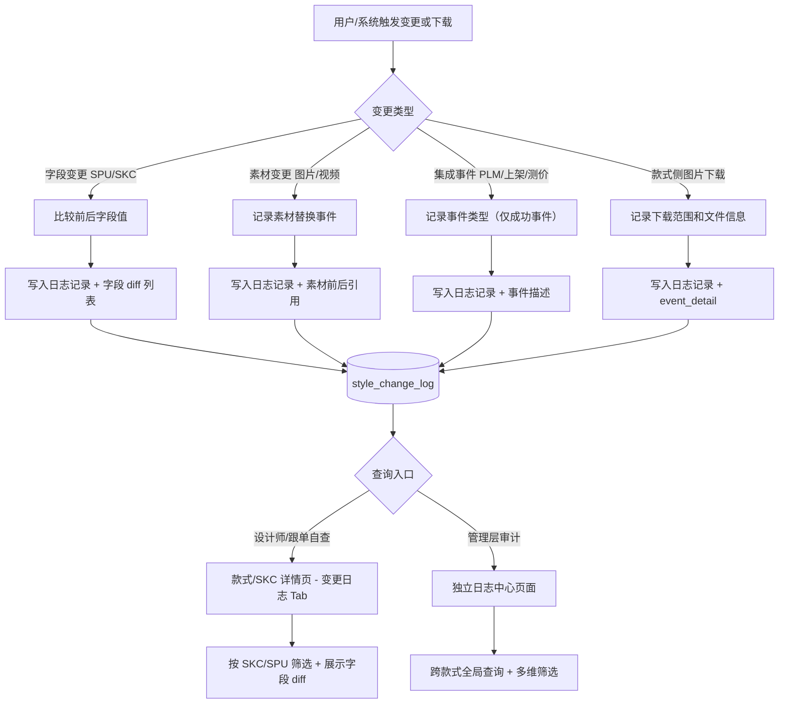
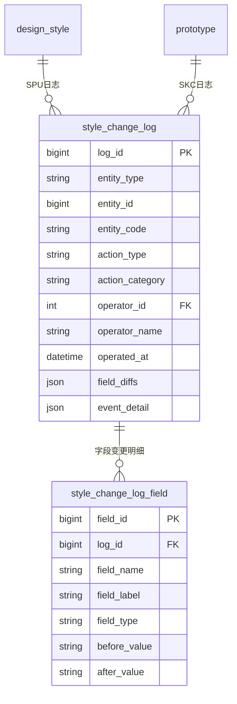

# 款式日志中心

## 1. 模块概述

为款式/商品模块提供统一的变动追踪能力，支持设计师/跟单自查"某款式具体改了什么字段"、以及管理层跨款式的操作审计，实现从问题发生到定位变更根因的闭环。

**v1.3.0 扩展**：统一收口款式侧图片下载日志，新增 `MEDIA_DOWNLOAD` 操作类型，扩展 `event_detail` 支持 `download_scope` 标识下载来源区域。

**职责边界**

做什么：

- 记录 SPU 基本信息变更（字段级 before/after）
- 记录 SKC 属性变更、状态流转（字段级 before/after）
- 记录 SPU/SKC 的图片/视频素材替换（前后缩略图/文件信息对比）
- 记录集成事件（PLM 推送、上架推送、测价通过/撤销），事件级粒度
- 记录款式侧图片下载操作（ACCESS 大类）(v1.3.0 新增)
- 提供两级查询入口：款式/SKC 详情页内嵌 Tab（单条记录自查）+ 独立日志中心页（全局审计）

不做什么：

- 不记录商品管理（temu-product）侧的操作日志，商品侧日志由商品日志中心（product-log-center）独立管理

**与相邻模块的分工**

| 模块 | 分工 |
|------|------|
| 款式管理 | 业务操作发生方，负责调用日志写入 API；本模块只负责存储和查询 |
| 现货管理 | 同上 |
| 商品日志中心 | 记录已发布商品侧的操作日志（含图片下载）；本模块只记录款式/SKC 侧，两者独立存储 |
| 操作日志（原有抽屉） | 原有 SKC 操作日志抽屉由本模块日志 Tab 统一替代，原表数据迁移由研发确认 |

**对接关系**

| 关系类型 | 关联模块/系统 | 交互方式 | 关键数据 |
|---------|------------|---------|---------|
| 上游依赖 | 款式管理 | API 调用（写入） | SPU/SKC 变更事件 |
| 上游依赖 | 现货管理 | API 调用（写入） | SPU/SKC 变更事件 |
| 上游依赖 | UACS 权限系统 | API 调用 | 用户数据范围权限 |
| 下游依赖 | 款式管理 | API 提供（查询） | 日志列表、变更详情 |
| 下游依赖 | 现货管理 | API 提供（查询） | 日志列表、变更详情 |
| 旁路系统 | PLM 系统 | 事件记录（只写） | 推送状态、结果消息 |

**核心业务流程**



---

## 2. 页面概述

无变更，原样保留。

| 页面名称 | 页面类型 | 入口/路径 | 交互形式 | 说明 |
|---------|---------|---------|---------|------|
| 日志中心 | 列表页 | 设计中心 → 日志中心 | 页面跳转 | 全局日志查询，支持跨 SPU/SKC 检索，适合管理层审计 |
| 操作日志抽屉 | 抽屉 | 款式列表 → 「操作日志」 | 抽屉 | 展示当前 SKC + 所属 SPU 的合并变更日志，时间线排列，用标签区分维度 |
| 变更日志 Tab（款式详情） | Tab 页 | SKC 详情页 → 「变更日志」Tab | Tab 切换 | 同操作日志抽屉内容，嵌入 SKC 详情页 Tab |
| 变更详情 | 详情弹窗 | 日志列表 → 点击「查看详情」 | 弹窗 | 展示单条日志的完整字段级 diff 或素材前后对比 |

---

## 3. 权限说明

无变更，原样保留。

### 功能权限

| 操作 | 权限码 | 说明 |
|------|--------|------|
| 查看日志中心 | `SDP-SJZX-RZGL-CK` | 访问独立日志中心页面 |
| 查看变更详情 | `SDP-SJZX-RZGL-CKXQ` | 展开单条日志的字段 diff 详情 |

> SKC 详情页内嵌的「变更日志 Tab」复用款式管理模块的 `SDP-SJZX-KSGL-CKXQ`（查看详情）权限，无需单独配置。

### 数据范围权限

| 权限码 | 说明 |
|--------|------|
| `SDP-SJZX-KSGL-QBFZ` | 查看全部款式日志（管理层/运营） |
| `SDP-SJZX-KSGL-QBZN` | 仅查看本组款式日志 |
| `SDP-SJZX-KSGL-QBWD` | 仅查看我的款式日志 |

> 数据范围权限复用款式管理模块的现有权限码，日志查询时按相同口径过滤。

---

## 4. 状态机

本模块为只写日志存储，日志记录一经写入不可修改，无状态流转。

---

## 5. 数据模型

### 5.1 实体关系

无变更，原样保留。



### 5.2 日志主表（style_change_log）

#### 系统字段

无变更，原样保留。

| 字段名 | 中文名 | 分类 | 类型 | 必填 | 说明 |
|-------|-------|------|------|------|------|
| log_id | 日志 ID | 系统 | 整数 | 自动 | 主键，雪花 ID |
| created_at | 写入时间 | 系统 | 日期时间 | 自动 | 日志写入时间，UTC |
| tenant_id | 租户 ID | 系统 | 整数 | 自动 | 多租户隔离 |

#### 实体标识

| 字段名 | 中文名 | 分类 | 类型 | 必填 | 说明 |
|-------|-------|------|------|------|------|
| entity_type | 实体类型 | 业务 | 枚举 | 是 | SPU / SKC |
| entity_id | 实体 ID | 业务 | 整数 | 是 | design_style_id 或 prototype_id |
| entity_code | 实体编码 | 业务 | 短文本 | 是 | style_code 或 design_code，冗余存储便于查询 |
| spu_id | 关联 SPU ID | 业务 | 整数 | 是 | 当 entity_type=SKC 时，记录所属 SPU ID；entity_type=SPU 时与 entity_id 相同 |
| spu_code | 关联 SPU 编码 | 业务 | 短文本 | 是 | 冗余存储，便于跨维度查询 |

#### 操作信息

无变更，原样保留。

| 字段名 | 中文名 | 分类 | 类型 | 必填 | 说明 |
|-------|-------|------|------|------|------|
| action_type | 操作类型 | 业务 | 枚举 | 是 | 见操作类型枚举 |
| action_category | 操作大类 | 业务 | 枚举 | 是 | FIELD_CHANGE（字段变更）/ MEDIA_CHANGE（素材变更）/ INTEGRATION_EVENT（集成事件）/ ACCESS（访问操作） |
| operator_id | 操作人 ID | 管理 | 引用 | 是 | 人工操作取登录用户 ID；系统自动操作填 0 |
| operator_name | 操作人姓名 | 管理 | 短文本 | 是 | 冗余存储 |
| operated_at | 操作时间 | 管理 | 日期时间 | 是 | 业务操作发生时间（非日志写入时间） |
| source_module | 来源模块 | 管理 | 短文本 | 是 | 写入方标识，如 style-management / spot-goods |
| remark | 备注 | 业务 | 短文本 | 否 | 操作时填写的原因/备注 |

#### 变更内容

无变更，原样保留。

| 字段名 | 中文名 | 分类 | 类型 | 必填 | 说明 |
|-------|-------|------|------|------|------|
| changed_field_count | 变更字段数 | 业务 | 整数 | 否 | FIELD_CHANGE 类型时填写 |

---

**操作类型枚举（action_type）**

| 枚举值 | 中文名 | action_category | 适用实体 | 说明 |
|-------|-------|----------------|---------|------|
| `SPU_EDIT` | 编辑 SPU 基本信息 | FIELD_CHANGE | SPU | — |
| `SPU_DESIGNER_CHANGE` | 设计师变更 | FIELD_CHANGE | SKC | — |
| `SKC_EDIT` | 编辑 SKC 信息 | FIELD_CHANGE | SKC | — |
| `SKC_CANCEL` | 取消 SKC | FIELD_CHANGE | SKC | — |
| `LISTING_DELIST` | 下架 | FIELD_CHANGE | SKC | — |
| `MEDIA_MARKETING_PIC` | 营销图变更 | MEDIA_CHANGE | SKC | — |
| `MEDIA_VIDEO` | 视频变更 | MEDIA_CHANGE | SPU | — |
| ✨ `MEDIA_DOWNLOAD` | 图片下载 | ACCESS | SKC | (v1.3.0 新增) 记录款式侧图片下载操作 |
| `PLM_PUSH` | 推送 PLM | INTEGRATION_EVENT | SKC | — |
| `LISTING_PUSH` | 推送上架 | INTEGRATION_EVENT | SKC | — |
| `LISTING_REJECT` | 上架驳回 | INTEGRATION_EVENT | SKC | — |
| `PRICE_CHECK` | 核价（PLM回传） | INTEGRATION_EVENT | SKC | — |
| `PROTO_DISASSEMBLE` | 拆版完成 | INTEGRATION_EVENT | SKC | — |
| `PRICE_APPROVE` | 测价通过 | INTEGRATION_EVENT | SKC | — |
| `PRICE_REVOKE` | 测价撤销 | INTEGRATION_EVENT | SKC | — |
| `SAMPLE_REVIEW` | 样衣审版 | INTEGRATION_EVENT | SKC | — |

---

### 5.3 字段变更明细表（style_change_log_field）

无变更，原样保留。

> 仅 `action_category = FIELD_CHANGE` 的日志记录写入明细表；每个变更字段对应一行。

| 字段名 | 中文名 | 分类 | 类型 | 必填 | 说明 |
|-------|-------|------|------|------|------|
| field_id | 明细 ID | 系统 | 整数 | 自动 | 主键，雪花 ID |
| log_id | 日志 ID | 系统 | 引用 | 是 | FK → style_change_log.log_id |
| field_name | 字段名 | 业务 | 短文本 | 是 | 技术字段名，如 season_name |
| field_label | 字段中文名 | 业务 | 短文本 | 是 | 展示用，如"销售季" |
| before_value | 变更前原始值 | 业务 | 短文本 | 否 | 原始存储值，为空表示新增字段 |
| after_value | 变更后原始值 | 业务 | 短文本 | 否 | 变更后存储值，为空表示字段被清除 |

---

### 5.4 素材变更记录规范

无变更，原样保留。

> 素材变更（`action_category = MEDIA_CHANGE`）不写入 `style_change_log_field` 明细表，而是在 `style_change_log` 的 `event_detail` JSON 字段中存储：

```json
{
  "media_type": "MARKETING_PIC",
  "before": [
    { "file_id": "oss://...", "thumbnail_url": "https://...", "file_name": "marketing_01.jpg" }
  ],
  "after": [
    { "file_id": "oss://...", "thumbnail_url": "https://...", "file_name": "marketing_02.jpg" }
  ]
}
```

### ✨ 5.5 图片下载记录规范（v1.3.0 新增）

> 图片下载（`action_type = MEDIA_DOWNLOAD`，`action_category = ACCESS`）不写入 `style_change_log_field` 明细表，在 `event_detail` 中存储以下结构：

```json
{
  "download_scope": "STYLE_BOM_PIC",
  "file_count": 3,
  "files": [
    { "file_id": "oss://...", "file_name": "fabric_a.jpg" }
  ]
}
```

**download_scope 枚举值**

| 枚举值 | 说明 | 适用 entity_type |
|-------|------|----------------|
| `STYLE_MARKETING_PIC` | 款式营销图下载 | SKC |
| `STYLE_DESIGN_PIC` | 款式设计图下载 | SKC |
| `STYLE_BOM_PIC` | 款式 BOM 物料图下载 | SKC |
| `STYLE_RECOMMEND_PIC` | 款式推荐面料/花型图下载 | SKC |

**写入规则**：

- 每次用户点击下载按钮（单张或批量）写入一条日志
- `file_count` 记录本次下载的文件数量
- `files` 列表记录各文件 id 和文件名，便于审计
- 日志写入失败不阻断下载主流程，后台异步补偿

---

## 6. 日志中心页（全局审计入口）

无变更，原样保留。

### 页面说明

独立页面，路径为设计中心 → 日志中心。展示全部款式/SKC 的变更日志，支持多维筛选，面向管理层和运营人员做操作审计。

### 筛选条件

| 筛选项 | 类型 | 说明 |
|-------|------|------|
| 款式编号/名称 | 文本搜索 | 模糊匹配 style_code、entity_code |
| 实体类型 | 单选 | 全部 / SPU / SKC |
| 操作大类 | 多选 | 字段变更 / 素材变更 / 集成事件 / 访问操作（含图片下载） |
| 操作类型 | 多选 | 根据操作大类联动展示枚举 |
| 操作人 | 下拉搜索 | 按操作人筛选 |
| 操作时间 | 日期范围 | 最大范围 90 天 |
| 品类 | 下拉 | 按 SPU 品类筛选 |

### 列表展示字段

| 列名 | 说明 |
|-----|------|
| 维度标签 | SPU / SKC 彩色标签 |
| 款式/SKC/商品编码 | 可点击跳转详情页 |
| 操作时间 | `operated_at`，精确到分钟 |
| 操作人 | `operator_name`；系统自动操作显示"系统" |
| 操作内容 | 前端拼接：字段变更显示"修改了 X、Y 等 N 个字段"；下载操作显示"下载了 N 张图片（{scope_label}）" |
| 操作 | 「查看详情」— 打开变更详情弹窗 |

- 默认排序：`operated_at` 降序
- 分页：每页 20 条

### 关键业务规则

无变更，原样保留。

### 异常处理

无变更，原样保留。

---

## 7. 操作日志抽屉 / 变更日志 Tab

无变更，原样保留。

---

## 8. 变更详情弹窗

**图片下载（ACCESS）（v1.3.0 新增展示规则）**：

- 展示方式：列表，每行一个下载文件
- 列：文件名 | 文件 ID
- 顶部显示"本次下载共 N 张图片（{scope_label}）"

其余规则无变更，原样保留。

---

## 更新记录

| 变更时间 | 变更版本 | 变更类型 | 变更内容 | 涉及章节 |
|---------|---------|---------|---------|---------|
| 2026-06-29 | v1.0.0 | 新增 | 款式日志中心模块初始版本，支持 SPU/SKC 字段级变更追踪、素材前后对比、集成事件记录；提供独立日志中心页和详情页内嵌 Tab 两级入口 | 全部 |
| 2026-07-08 | v1.1.0 | 变更 | 移除 change_summary 冗余字段，改由前端根据 field_label 拼接展示；移除 event_result / event_message 字段，集成事件只记录推送成功的事件 | 5.2、6、8 |
| 2026-07-20 | v1.2.0 | 变更 | 删除 SPU_SUBMIT（提交款式资料）和 SKC_CREATE（创建 SKC）操作类型；图片下载（MEDIA_DOWNLOAD）适用实体收窄为 SKC | 5.2 |
| 2026-07-22 | v1.3.0 | 扩展 | 图片安全需求：新增款式侧图片下载日志记录（MEDIA_DOWNLOAD，action_category=ACCESS）；新增 download_scope 字段和图片下载 event_detail 规范（5.5），覆盖营销图/设计图/BOM图/推荐图四类场景；日志中心页新增访问操作大类筛选 | 1、5.2、5.5、6 |
