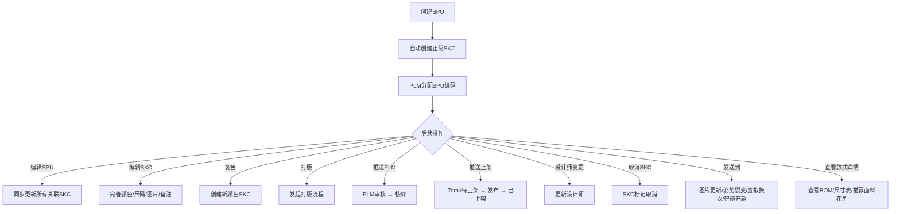
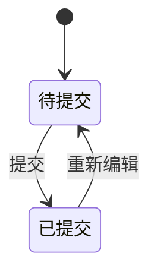
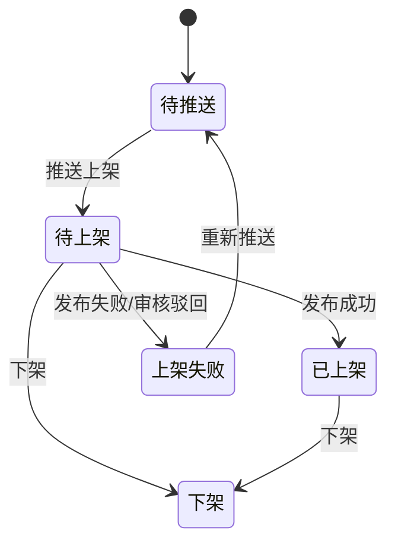
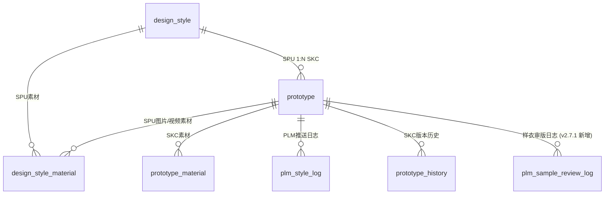

# 款式管理

## 1. 模块概述

本模块负责 SDP 系统的款式管理功能，基于 **SPU（标准产品单元）→ SKC（款式颜色规格）** 两级数据模型。

- **SPU（design_style 表）**：定义款式的企划信息、销售属性、生产标签等基础信息，编码规则为 `2年+2月+2日+4流水+2版号流水`
- **SKC（prototype 表）**：SPU 下的颜色+尺码规格变体，编码规则为 `SPU编码+2位色号流水`，追踪上架状态、打版进度、核价信息、推送到 PLM/Temu 的状态

**对接关系**：

| 对接系统 | 方向 | 数据/功能 | 说明 |
|---------|------|---------|------|
| NEST 字典 | 输入 | 品类、波段、季节、尺码组、款式标签、款式等级、品质等级等 | 下拉选项数据来源 |
| SSO 系统 | 输入 | 设计师/运营人员列表 | 设计师字段的数据来源 |
| PLM 系统 | 双向 | SPU编码（PLM分配）、BOM核价、推送上架审核；款式详情 BOM/尺寸表实时查询 | 创建SPU后通过MQ推送获取PLM编码；v2.8.1 起新增款式详情实时查询 BOM/尺寸表 |
| 基础配置 | 输入 | 店铺列表、尺码模板 | 创建SPU时选择店铺和尺码标准 |
| 现货管理 | 输出 | SPU+SKC数据 | 推送上架后供现货商品列表引用 |
| Temu 商品管理 | 输出 | 上架SKC数据 | 商品同步引用款式信息 |
| 聚水潭 | 输出 | SKU数据 | 商品发布通过后推送SKU；SPU已有已发布商品时新增SKC立即推送 |
| 算法服务 | 输入 | 推荐面料/花型推送 | (v2.8.1 新增) 算法服务异步推送推荐结果到款式详情 |
| 款式日志中心 | 输出 | 图片下载日志 | (v2.8.1 新增) 图片下载操作写入 style-log-center |

**核心业务流程**：

> **注意**：创建/编辑SPU+SKC 的2步向导页面入口在款式管理列表页，但页面属于现货管理模块范畴。供应商信息、成分信息等属于现货管理范畴，不在本模块范围内。

---

## 2. 页面概述

| 页面名称 | 页面类型 | 入口/路径 | 交互形式 | 说明 |
|---------|---------|---------|---------|------|
| 款式列表 | 列表页 | 设计中心 → 款式管理 | 页面跳转 | SPU/SKC 树形列表，主管理页面 |
| SKC详情 | 详情页 | 款式列表 → 点击SKC编码 | 页面跳转 | 展示SPU信息+SKC信息，支持上传设计图/视频；v2.8.1 新增 BOM/尺寸表/推荐面料花型展示区 |
| 操作日志 | 抽屉 | 款式列表 → 点击「操作日志」 | 抽屉 | SKC维度操作日志 |
| 复色 | 弹窗 | 款式列表 → 点击「复色」 | 弹窗 | 以当前SKC为基础创建复色款 |
| 推送上架 | 弹窗 | 款式列表 → 点击「推送上架」 | 弹窗 | 选择发布店铺，推送至待上架列表 |
| 设计师变更 | 弹窗 | 款式列表 → 点击「设计师变更」 | 弹窗 | 批量变更设计师 |
| 取消SKC | 弹窗 | 款式列表 → 点击「取消」 | 弹窗 | 取消SKC并记录原因 |
| 组合商品操作日志 | 抽屉 | 款式列表 → 组合商品行操作 | 抽屉 | SKC维度组合商品日志 |
| 创建/编辑SPU+SKC | 表单页 | 款式列表 → 「新建SPU」/「编辑SPU」 | 页面跳转 | 2步向导，入口由款式列表触发，页面属于现货管理模块 |
| 发送到智能开款 | 弹窗 | 款式列表 → 「发送到」→「智能开款」 | 弹窗 | (v2.6.2 新增) 展示选中 SKC 列表（SKC id + 营销图 list），提交后保存 skc_id + agent任务ID + 任务渠道，成功后刷新列表并停留当前位置 |

---

## 3. 权限说明

### 功能权限

| 操作 | 权限码 | 说明 |
|------|--------|------|
| 复色 | `SDP-SJZX-KSGL-FS` | 以选中SKC为基础创建复色款 |
| 打印版单 | `SDP-SJZX-KSGL-DYBD` | 批量打印版单 |
| 设计师变更 | `SDP-SJZX-KSGL-SJSBG` | 批量变更款式的设计师 |
| 取消SKC | `SDP-SJZX-KSGL-QXSKC` | 取消选中的SKC |
| 新建SPU | `SDP-SJZX-KSGL-XJSPU` | 打开创建SPU页面（入口在款式列表，页面在现货管理模块） |
| 查看详情 | `SDP-SJZX-KSGL-CKXQ` | 查看SKC详情页 |
| 编辑SKC | `SDP-SJZX-KSGL-BJSKC` | 编辑SKC信息 |
| 发起打版 | `SDP-SJZX-KSGL-FQDB` | 发起打版流程 |
| 编辑SPU | `SDP-SJZX-KSGL-BJSPU` | 编辑SPU信息（入口在款式列表，页面在现货管理模块） |
| 导出 | `SDP-SJZX-KSGL-DC` | 导出列表数据 |
| 下载图片 | `SDP-SJZX-KSGL-XZTP` | 下载选中款式的图片（v2.8.1 变更：扩展为全局图片下载权限，覆盖款式列表、SKC详情、BOM/推荐图等所有区域） |
| 新建描稿任务 | `SDP-SJZX-KSGL-XJMGRW` | 创建描稿任务 |
| 发送到 | `SDP-SJZX-KSGL-FSD` | 发送款式到图片更新/姿势裂变/虚拟换衣任务 |
| 推送上架 | `SDP-SJZX-KSGL-TSSJ` | 推送款式至待上架列表 |
| 推送PLM | `SDP-SJZX-KSGL-TSPLM` | 推送款式资料到PLM系统 |

### 数据范围权限

无变更，原样保留。

| 权限码 | 说明 |
|--------|------|
| `SDP-SJZX-KSGL-QBFZ` | 查看全部款式 |
| `SDP-SJZX-KSGL-QBZN` | 仅查看本组款式 |
| `SDP-SJZX-KSGL-QBWD` | 仅查看我的款式 |

---

## 4. 状态机

无变更，原样保留。

### SPU 资料状态

### SKC 上架状态（listing_status）

### SKC 推送PLM状态（push_plm_status）

无变更，原样保留。

### SKC 打版信息状态（prototype_status）

无变更，原样保留。

### 修图任务状态（image_update_status）

无变更，原样保留。

### 核价状态（check_price_state）

无变更，原样保留。

### 状态汇总

无变更，原样保留。

---

## 5. 数据模型

### 5.1 实体关系

### 5.2 SPU（design_style 表）

无变更，原样保留。

### 5.3 Prototype（SKC）（prototype 表）

#### 标识与关联 / 状态字段 / SKC属性 / 打版开发信息 / 核价信息 / 关联属性

以下字段在 v2.8.1 中无变更，原样保留。具体字段内容见主线文档 `modules/style-management.md` 5.3 节。

#### ✨ 新增字段（v2.8.1）

| 属性 | 类型 | 必填 | 默认值 | 长度/范围 | 说明 |
|------|------|------|--------|----------|------|
| ✨ has_recommended_fabric | 布尔 | 是 | false | — | (v2.8.1 新增) 是否已有算法推荐面料；算法服务推送后置为 true |
| ✨ has_recommended_pattern | 布尔 | 是 | false | — | (v2.8.1 新增) 是否已有算法推荐花型；算法服务推送后置为 true |

**写入规则**：

- 由算法服务异步推送时更新，不支持前端手动修改
- 推荐数据为空时保持 false；重新推送新结果时置为 true（不清零）

### 5.4 SKC与Agent任务关联（skc_agent_task 表）

无变更，原样保留。

### 5.5 plm_sample_review_log（样衣审版日志）

无变更，原样保留。

---

## 6. 款式列表

### 查询条件

在原有筛选基础上，v2.8.1 新增以下筛选项：

| 条件名称 | 输入方式 | 说明 |
|---------|---------|------|
| ✨ 推荐面料 | 单选 | (v2.8.1 新增) 全部 / 有推荐 / 无推荐；过滤 has_recommended_fabric 字段 |
| ✨ 推荐花型 | 单选 | (v2.8.1 新增) 全部 / 有推荐 / 无推荐；过滤 has_recommended_pattern 字段 |

其余查询条件无变更，原样保留（见主线文档 6 节）。

### 显示字段

在原有字段基础上，v2.8.1 新增以下列：

| 字段名称 | 显示为 | 说明 |
|---------|--------|------|
| ✨ 推荐面料 | 布尔标签 | (v2.8.1 新增) 有推荐时显示绿色「已推荐」标签，否则不显示 |
| ✨ 推荐花型 | 布尔标签 | (v2.8.1 新增) 有推荐时显示绿色「已推荐」标签，否则不显示 |

其余显示字段无变更，原样保留。

### 行操作

**下载图片（`XZTP`）变更（v2.8.1）**：

- 原行为：点击「下载图片」直接触发浏览器下载
- v2.8.1 变更：**禁用右键保存**，改为统一下载按钮；点击后触发系统受控下载，同时写入 style-log-center 的 `MEDIA_DOWNLOAD` 日志

其余行操作无变更，原样保留。

### 批量操作

**下载图片（批量）变更（v2.8.1）**：

- 原行为：批量下载直接触发
- v2.8.1 变更：批量下载通过系统下载接口打包，写入 style-log-center 的 `MEDIA_DOWNLOAD` 日志

### 图片安全规范（v2.8.1 新增）

款式列表中的缩略图：

- 禁用 `contextmenu` 事件，不显示浏览器原生右键菜单
- 鼠标悬浮时显示下载 icon，点击触发单张下载（需 `XZTP` 权限）

---

## 7. SKC详情页

### 页面说明

**入口**: 款式列表 → 点击SKC编码链接（需 `CKXQ` 权限）

**交互形式**: 页面跳转

**页面布局（v2.8.1 变更）**：

| 区域 | 内容 | 说明 |
|------|------|------|
| 顶部信息区 | SKC编码、供给方式标签、取消/动销标签 | 显示SKC关键状态 |
| SPU信息面板 | 设计师、品类、SPU编码等基础信息 | 继承自SPU的完整信息 |
| 标签页-基础信息 | 波段、营销图、设计图、视频、开发信息 | 可编辑 |
| 标签页-修图任务 | 修图任务状态与详情 | — |
| 标签页-BOM物料 | BOM物料图片信息（原有） | — |
| ✨ 标签页-PLM BOM | (v2.8.1 新增) 实时查询 PLM 的 BOM 版本列表与明细 | 只读，实时查询 |
| ✨ 标签页-尺寸表 | (v2.8.1 新增) 实时查询 PLM 的尺寸表版本列表与明细 | 只读，实时查询 |
| ✨ 标签页-推荐面料/花型 | (v2.8.1 新增) 算法服务推送的推荐面料和花型 | 只读，异步推送 |
| 底部操作栏 | 提交、取消 | 全局操作按钮 |

### ✨ 标签页：PLM BOM（v2.8.1 新增）

**数据来源**：按 SKC 实时查询 PLM 接口，不缓存。

**展示逻辑**：

- 默认显示最新版本 BOM
- 顶部版本下拉支持切换，版本列表按版本号倒序排列

**BOM 头信息**

| 字段 | 说明 |
|------|------|
| SKC | 款式编码 |
| BOM 版本号 | 如 `PB26060084290101-2`，默认显示最新版本，下拉切换 |
| 创建时间 | 如 `2026-7-7 11:19:27` |

**面料明细**

| 字段 | 说明 |
|------|------|
| 物料项目 | 面料 A / 面料 B … |
| 图片 | 物料图片（✨ 禁用右键；悬浮显示下载按钮，需 `XZTP` 权限） |
| 物料 SPU/SKU | — |
| 货号 | — |
| 商品类型 | 花型 / 净色 |
| 成分 | 中英文成分描述 |
| 使用部位 | — |
| 单件用量 | — |
| 单件损耗用量 | — |
| 单位 | 米 / 码 / 条… |
| 损耗率 (%) | — |
| 备注 | — |

**辅料明细 / 特殊辅料明细**：字段结构见规划文档 3.1 节，图片列同样禁用右键并提供悬浮下载按钮。

**批量下载**：Tab 顶部提供「批量下载 BOM 图片」按钮，打包本版本所有物料图；需 `XZTP` 权限；写入 `MEDIA_DOWNLOAD` 日志（download_scope: `STYLE_BOM_PIC`）。

### ✨ 标签页：尺寸表（v2.8.1 新增）

**数据来源**：按 SKC 实时查询 PLM 接口，不缓存。

**展示逻辑**：

- 默认显示最新版本
- 顶部版本下拉支持切换，版本列表按版本号倒序排列

**尺寸表头信息**

| 字段 | 说明 |
|------|------|
| 版本号 | 如 `SZ260405087301-4`，默认最新，下拉切换 |
| 提交时间 | 如 `2026-7-7 11:18:35` |

**尺寸表明细**（每行对应一个量体部位）

| 字段 | 说明 |
|------|------|
| 部位 | 后中长 / 胸围 / 腰围 … |
| 尺寸/精度 | 如 X1 |
| 量法 | 测量方式描述 |
| 样衣尺寸 | 对应尺码的样衣数值 |
| 纸样尺寸 | — |
| 跳码 | — |
| 大货尺寸（各码） | 2XS / XS / S / M / L / XL … |
| 允差范围 | 如 ± 1.5 |

> BOM 版本与尺寸表版本相互独立，分开展示，均支持多版本切换。尺寸表无图片，不涉及图片安全规范。

### ✨ 标签页：推荐面料/花型（v2.8.1 新增）

**数据来源**：算法服务异步推送，存储在本地。

**触发时机**（以下任一事件触发后，算法更新推荐结果并推送至对应款式）：

- 开款任务正常流转
- 智能开款的其他算法任务执行完成（v2.8.1 新增触发时机）

**展示内容**：

- 推荐面料列表：面料图片（✨ 禁用右键；悬浮显示下载按钮）、货号、商品类型等基础信息
- 推荐花型列表：花型图片（✨ 禁用右键；悬浮显示下载按钮）、编号等基础信息

**批量下载**：列表顶部提供「批量下载推荐图片」按钮；需 `XZTP` 权限；写入 `MEDIA_DOWNLOAD` 日志（download_scope: `STYLE_RECOMMEND_PIC`）。

> 本期推荐面料/花型与 BOM **分开展示**，不做关联。

### SKC详情页 · 图片安全规范汇总（v2.8.1 新增）

| 图片区域 | 禁用右键 | 下载入口 | 权限码 | 日志 download_scope |
|---------|---------|---------|--------|-------------------|
| 营销图 | 是 | 每张图悬浮下载 icon + 批量下载按钮 | `XZTP` | `STYLE_MARKETING_PIC` |
| 设计图 | 是 | 每张图悬浮下载 icon + 批量下载按钮 | `XZTP` | `STYLE_DESIGN_PIC` |
| PLM BOM 物料图 | 是 | 每张图悬浮下载 icon + Tab 级批量下载 | `XZTP` | `STYLE_BOM_PIC` |
| 推荐面料/花型图 | 是 | 每张图悬浮下载 icon + 列表级批量下载 | `XZTP` | `STYLE_RECOMMEND_PIC` |

### 异常处理（v2.8.1 新增场景）

| 异常场景 | 处理方式 |
|---------|---------|
| SKC 未关联 PLM | PLM BOM Tab 和尺寸表 Tab 显示"暂无关联 PLM 款式" |
| PLM 接口超时或返回错误 | Tab 内显示"资料加载失败，请稍后重试" |
| SKC 在 PLM 中不存在 | Tab 内显示"PLM 中未查询到该款式的 BOM 资料" / "未查询到尺寸表" |
| BOM/尺寸表版本列表为空 | Tab 内显示"暂无 BOM 资料" / "暂无尺寸表" |
| 算法推荐数据为空 | 推荐面料/花型 Tab 显示"暂无推荐数据，等待算法推送" |
| 无下载权限（缺少 `XZTP`） | 下载按钮不渲染 |
| 批量下载打包失败 | 提示"下载失败，请稍后重试" |
| 日志写入失败 | 不阻断下载主流程，后台补偿 |

原有异常场景（颜色重复、版本过期、数据加载失败等）无变更，原样保留。

---

## 更新记录

| 关联版本 | 更新内容 | 具体说明 |
|------|------|------|
| v2.4.0 | 一款多商品+SKC维度调整 | 上架状态聚合、推送买手/测价状态、推送上架限制、店铺字段取值 |
| v2.4.1 | 列表筛选扩展+SKC维度字段 | (v2.4.1 新增) 项目类型/面料池使用范围/织造方式筛选与显示、颜色模糊搜索、测价通过时间筛选、查看系统SKU列表入口；(v2.4.1 变更) 上架状态/推送PLM状态筛选改为多选、推送PLM状态新增推送中 |
| v2.6.0 | 聚水潭推送补全 | (v2.6.0 新增) SPU已有已发布商品时，款式管理/现货管理新增SKC（含复色）保存后立即推送SKU到聚水潭，不受上架状态限制 |
| v2.6.2 | Agent智能编辑接入 | (v2.6.2 新增) 「发送到」新增智能开款；列表新增智能编辑任务筛选、开款标签筛选与展示、关联任务列；SKC新增 develop_tags 字段；新增 skc_agent_task 实体 |
| v2.7.1 | PLM 样衣审版对接 | (v2.7.1 新增) 接收 PLM webhook 推送样衣审版通过事件；prototype 表新增 plm_sample_approved_at / plm_sample_approved_by 字段；新增 plm_sample_review_log 日志表；款式列表新增样衣审版只读展示列 |
| v2.8.1 | 款式资料同步 + 图片安全 | (v2.8.1 新增) SKC详情页新增 PLM BOM Tab（多版本切换）、尺寸表 Tab（多版本切换）、推荐面料/花型 Tab（算法推送，触发时机扩展至智能开款算法任务完成）；款式列表新增推荐面料/推荐花型布尔标签及筛选；prototype 表新增 has_recommended_fabric / has_recommended_pattern 字段；全局图片禁用右键，统一受控下载（权限码 XZTP），下载写入 style-log-center（MEDIA_DOWNLOAD，覆盖营销图/设计图/BOM图/推荐图） |
