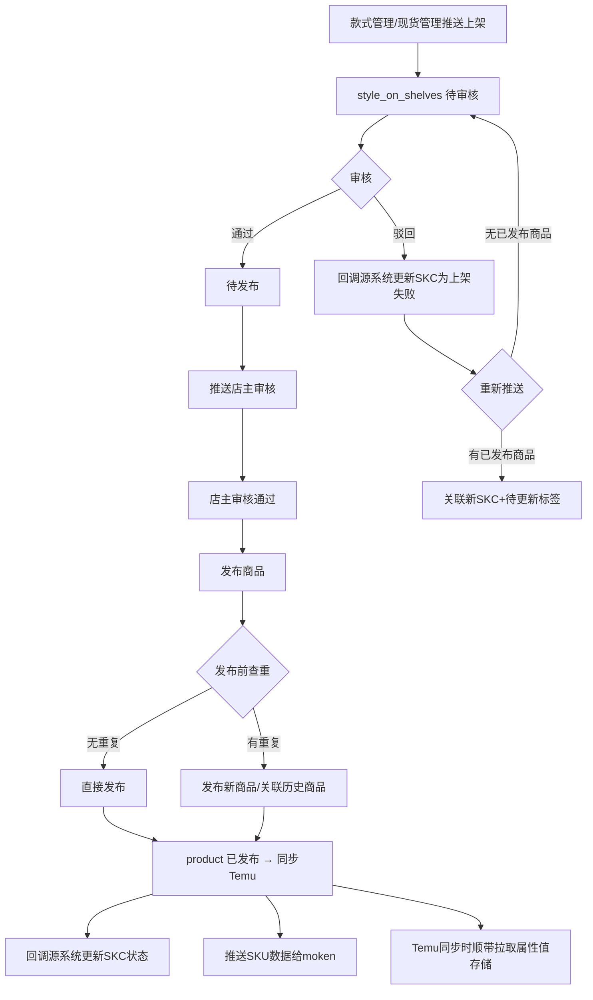
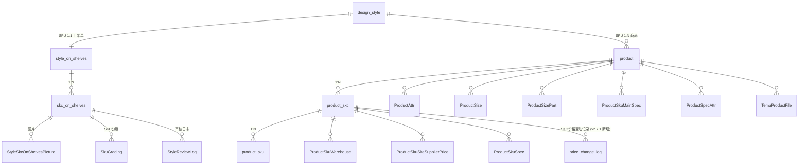

# 商品管理 &nbsp; [](https://htmlpreview.github.io/?https://github.com/lin15622159201-arch/sdp-prd/blob/main/mockups/product-detail-bom-size.html)

## 1. 模块概述

本模块负责 SDP 系统的商品管理功能，覆盖**待上架审核 → 发布商品 → 商品列表管理**全流程。

**v2.8.1 扩展**：商品详情新增 PLM BOM 弹窗（完整版/成分简版）和尺寸表弹窗；Temu 同步任务顺带采集平台属性值；新增主动回写 Temu 属性值功能；全局图片禁用右键保存，统一受控下载。

**核心数据流**：

```
款式管理/现货管理 → 推送上架 → style_on_shelves (待上架)
  → 审核通过 → 发布 → product (商品) → 同步到 Temu 平台
  → 发布成功后推送 SKU 至 moken (v2.4.1 新增)
  → Temu 同步时顺带拉取属性值存储到 temu_attributes (v2.8.1 新增)
```

**对接关系**：

| 对接系统 | 方向 | 数据/功能 | 说明 |
|---------|------|---------|------|
| 款式管理 | 输入 | SPU+SKC 推送 | 设计款推送上架后写入 style_on_shelves |
| 现货管理 | 输入 | SPU+SKC 推送 | 现货款推送上架后写入 style_on_shelves |
| 基础配置 | 输入 | 店铺信息+Token、尺码模板 | 商品同步时的 API 鉴权和尺码表引用 |
| NEST 字典 | 输入 | 品类、波段、款式标签等 | 下拉选项数据来源 |
| SSO 系统 | 输入 | 设计师/运营人员/审核人 | 人员字段数据来源 |
| Temu 平台 | 双向 | 商品发布、价格同步、属性值同步/回写 | (v2.8.1 扩展) 同步时顺带拉取属性值；新增主动回写属性值 |
| moken 系统 | 输出 | SKU 数据推送 | (v2.4.1 新增) 发布商品成功后推送SKU数据给moken |
| PLM 系统 | 输入 | BOM/尺寸表实时查询 | (v2.8.1 新增) 商品详情弹窗实时查询 PLM |

**核心业务流程**：



---

## 2. 页面概述

| 页面名称 | 页面类型 | 入口/路径 | 交互形式 | 说明 |
|---------|---------|---------|---------|------|
| 待上架列表 | 列表页 | 商品运营平台 → 待上架 | 页面跳转 | 待审核/待发布款式列表，支持批量操作 |
| 审核上架 | 表单页 | 待上架列表 → 点击「审核」 | 页面跳转 | 审核款式并填写商品上架信息 |
| 编辑待上架 | 表单页 | 待上架列表 → 点击「编辑」 | 页面跳转 | 审核通过后编辑待上架数据 |
| 查看待上架详情 | 详情页 | 待上架列表 → 点击「查看」 | 页面跳转 | 只读查看待上架数据 |
| 商品列表 | 列表页 | 商品运营平台 → 商品管理 → 商品列表 | 页面跳转 | SPU-SKC 合并表格，商品状态管理 |
| 编辑SKC | 表单页 | 商品列表 → 点击「编辑SKC」 | 页面跳转 | 编辑商品 SKC 信息 |
| 编辑图片 | 表单页 | 商品列表 → 点击「编辑图片」 | 页面跳转 | 编辑商品图片素材 |
| 查看商品详情 | 详情页 | 商品列表 → 点击「查看」 | 页面跳转 | 查看商品完整信息；v2.8.1 新增 BOM 弹窗/尺寸表弹窗入口 |
| 新增组合商品 | 表单页 | (待补充) | 页面跳转 | 创建组合商品 |
| 组合商品列表 | 列表页 | (待补充) | 页面跳转 | 组合商品管理列表 |
| 商品同步 | 列表页 | (待补充) | 页面跳转 | Temu 商品同步管理 |
| 价格记录 | 详情页 | (待补充) | 页面跳转 | SKC 维度价格记录 |
| ✨ 价格变动历史 | 详情页 | 商品列表 → SKC 行 → 点击「价格变动历史」 | 侧弹窗（Drawer） | (v2.7.1 新增) 展示该 SKC 的平台价格变动记录，只读，按变动时间倒序 |
| ✨ BOM 资料弹窗（完整版） | 弹窗 | 商品详情 → 产品属性 → 面料成分行「查看 BOM」 | 弹窗 | (v2.8.1 新增) 实时查询 PLM，展示完整 BOM（面料/辅料/特殊辅料） |
| ✨ BOM 资料弹窗（成分简版） | 弹窗 | 商品详情 → 产品属性 → 面料成分行「查看成分」 | 弹窗 | (v2.8.1 新增) 精简版，仅展示面料明细的物料项目/图片/成分/使用部位 |
| ✨ 尺寸表弹窗 | 弹窗 | 商品详情 → 尺寸表区域 → 「查看尺寸」 | 弹窗 | (v2.8.1 新增) 实时查询 PLM，展示尺寸表多版本明细 |

---

## 3. 权限说明

### 功能权限

**待上架列表**：

| 操作 | 权限码 | 说明 |
|------|--------|------|
| 发布商品 | `POP-SPGL-DSJ-FBSP` | 批量发布选中款式到 Temu |
| 审核 | `POP-SPGL-DSJ-SH` | 对待审核款式进行审核（通过/驳回） |
| 编辑 | `POP-SPGL-DSJ-BJ` | 编辑审核通过、待发布/发布失败的款式 |
| 查看 | `POP-SPGL-SPLB-BJSPXQ` | 查看待上架详情 |
| ✨ 删除 | `POP-SPGL-DSJ-SC` | (v2.8.0 新增) 删除待上架列表中的二次上架记录 |

**商品列表**：

| 操作 | 权限码 | 说明 |
|------|--------|------|
| 编辑商品 | `POP-SPGL-SPLB-BJSP` | 编辑商品详情 |
| 测价 | `POP-SPGL-SPLB-CJ` | 批量标记测价通过 |
| 编辑SKC | `POP-SPGL-SPLB-BJSPSKC` | 编辑商品 SKC 信息 |
| 编辑图片 | `POP-SPGL-SPLB-BJSPIMG` | 编辑商品图片素材 |
| 查看详情 | `POP-SPGL-SPLB-BJSPCKXQ` | 查看商品详情 |
| ✨ 下载图片 | `SDP-SJZX-KSGL-XZTP` | (v2.8.1 新增) 商品图片下载，复用款式管理权限码，全局统一 |

---

## 4. 状态机

无变更，原样保留（见主线文档 4 节）。

---

## 5. 数据模型

### 5.1 实体关系



### 5.2 ~ 5.7

StyleOnShelves、skc_on_shelves、Product、product_skc、price_change_log、product_skc 只读展示字段等章节无变更，原样保留（见主线文档 5.2 ~ 5.7 节）。

### ✨ 5.8 Product 新增字段（v2.8.1）

| 属性 | 类型 | 必填 | 默认值 | 长度/范围 | 说明 |
|------|------|------|--------|----------|------|
| ✨ temu_attributes | JSON数组 | 否 | — | — | (v2.8.1 新增) 从 Temu 平台同步的商品属性值列表，每项含 attr_id / attr_name / attr_value；Temu 同步任务执行时全量覆盖写入 |
| ✨ temu_attributes_synced_at | 日期时间 | 否 | — | — | (v2.8.1 新增) Temu 属性值最后同步时间 |

**temu_attributes 字段结构示例**：

```json
[
  { "attr_id": "101", "attr_name": "面料成分", "attr_value": "100%棉" },
  { "attr_id": "102", "attr_name": "材质", "attr_value": "纯棉" }
]
```

---

## 6. 待上架列表

无变更，原样保留（见主线文档 6 节）。

---

## 7. 审核上架

无变更，原样保留（见主线文档 7 节）。

---

## 8. 商品列表

### 图片安全规范（v2.8.1 新增）

商品列表中的缩略图和商品详情中所有图片：

- 禁用 `contextmenu` 事件，不显示浏览器原生右键菜单
- 鼠标悬浮时显示下载 icon，点击触发单张受控下载
- 批量下载通过系统接口打包
- 所有下载操作需 `SDP-SJZX-KSGL-XZTP` 权限，写入商品日志表（MEDIA_DOWNLOAD，entity_type=PRODUCT）

| 图片区域 | 下载入口 | 日志 download_scope |
|---------|---------|-------------------|
| 商品列表缩略图 | 悬浮下载 icon | `PRODUCT_MATERIAL_PIC` |
| 商品详情素材图/款式图 | 每张图悬浮下载 icon + 批量下载按钮 | `PRODUCT_MATERIAL_PIC` |
| BOM 弹窗物料图 | 每张图悬浮下载 icon + 弹窗级批量下载 | `PRODUCT_BOM_PIC` |

其余商品列表内容无变更，原样保留（见主线文档 8 节）。

---

## 9. 字段同步策略

无变更，原样保留（见主线文档 9 节）。

---

## 10. 商品详情

### 可编辑字段 / 关键业务规则

无变更，原样保留（见主线文档 10 节）。

### ✨ BOM 资料弹窗（完整版）（v2.8.1 新增）

**入口**：商品详情 → 产品属性模块 → 面料成分行「查看 BOM」链接

**默认传入**：第一个 SKC（正常款）的货号

**关联路径**：SKC 货号 → 实时查询 PLM 接口（不缓存）

**弹窗内容**：

- BOM 头信息（SKC、BOM 版本号下拉切换、创建时间）
- 面料明细 / 辅料明细 / 特殊辅料明细，三类纵向连续展示，各自带小标题，不分 Tab
- 图片列：✨ 禁用右键；悬浮显示下载按钮（需 `XZTP`）；弹窗级批量下载按钮
- 只读展示，不支持编辑

**版本切换**：顶部 BOM 版本号下拉，默认最新版本，版本列表按版本号倒序。

### ✨ BOM 资料弹窗（成分简版）（v2.8.1 新增）

**入口**：产品属性模块 → 面料成分行「查看成分 ›」链接

**弹窗内容（精简）**：

- BOM 头信息（SKC、BOM 版本号下拉切换、创建时间）
- 仅展示面料明细，且只保留：物料项目、图片、成分、使用部位 四列
- 图片列：✨ 禁用右键；悬浮显示下载按钮（需 `XZTP`）
- 底部提供「查看完整 BOM ›」跳转到完整版弹窗
- 只读展示，不支持编辑

### ✨ 尺寸表弹窗（v2.8.1 新增）

**入口**：商品详情 → 尺寸表区域 → 「查看尺寸」链接

**关联路径**：SKC 货号 → 实时查询 PLM 接口（不缓存）

**弹窗内容**：

- 尺寸表头信息（版本号下拉切换、提交时间）
- 各量体部位数据（部位/尺寸精度/量法/样衣尺寸/纸样尺寸/跳码/大货尺寸各码/允差范围）
- 只读展示，不支持编辑

> 尺寸表无图片，不涉及图片安全规范。

### 异常处理（v2.8.1 新增场景）

| 异常场景 | 处理方式 |
|---------|---------|
| SKC 未关联 PLM | 禁用「查看 BOM」/「查看成分」/「查看尺寸」链接，hover 提示"暂无关联 PLM 款式" |
| PLM 接口超时或返回错误 | 弹窗内显示"资料加载失败，请稍后重试" |
| SKC 在 PLM 中不存在 | 弹窗内显示"PLM 中未查询到该款式的 BOM 资料" / "未查询到尺寸表" |
| BOM/尺寸表版本列表为空 | 弹窗内显示"暂无 BOM 资料" / "暂无尺寸表" |
| 无下载权限（缺少 `XZTP`） | 弹窗内下载按钮不渲染 |
| 批量下载打包失败 | 提示"下载失败，请稍后重试" |
| 日志写入失败 | 不阻断下载主流程，后台补偿 |

---

## 11. 价格变动历史（侧弹窗）

无变更，原样保留（见主线文档 11 节）。

---

## ✨ 12. Temu 属性同步（v2.8.1 新增）

### 功能说明

在现有 Temu 同步商品任务中，顺带拉取并存储 Temu 平台的商品属性值（含面料成分、材质描述等 Temu 平台定义的属性字段），不新增单独触发入口。

### 触发方式

在现有 Temu 同步商品任务中顺带执行，同步时全量覆盖写入 `product.temu_attributes`。

### 关键业务规则

- 属性字段范围：[TBD] 是否全量属性或指定 attr_id 列表，需与 Temu 对接确认
- 写入时机：Temu 商品同步任务执行完成后写入，同步时全量覆盖 `temu_attributes` 和 `temu_attributes_synced_at`
- 同步失败不阻断主同步流程，记录失败日志

---

## ✨ 13. 属性值回写 Temu（v2.8.1 新增）

### 功能说明

编辑商品属性保存后，由系统自动将 `temu_attributes` 中的成分相关字段推送回 Temu 平台。

### 触发方式

编辑商品属性保存后系统自动推送（不需要手动触发）。

### 执行逻辑

1. 取当前商品的 `temu_attributes` 中的成分相关字段
2. 调用 Temu 平台属性更新接口，将成分值写回对应商品
3. 记录回写结果（成功/失败/部分失败），展示给操作人

### 异常处理

| 场景 | 处理方式 |
|------|---------|
| 商品无成分数据（`temu_attributes` 为空） | 不发起回写，静默跳过 |
| Temu 接口返回错误 | 提示"成分回写失败：{错误原因}"，支持重试 |

> [TBD] Temu 属性更新接口的字段映射规则（attr_id 与 Temu 平台字段的对应关系）需与 Temu 对接确认。

---

## 更新记录

| 关联版本 | 更新内容 | 具体说明 |
|------|------|------|
| v2.4.0 | 一款多商品 | (v2.4.0 新增) 上架类型(首次/二次)、同款上架次数、复制商品、店主审核、推送限制 |
| v2.4.1 | 待上架列表增强 + 商品列表增强 + moken对接 | (v2.4.1 新增) 设计组/款式类型/季节/品类/自定义颜色；波段改为SKC维度；商品列表增强；发布后推送SKU给moken；加入站点自动测价通过 |
| v2.7.1 | 价格变动记录 + 样衣审版展示 + 款式难度查询 | (v2.7.1 新增) price_change_log 实体；商品列表新增价格变动历史侧弹窗、款式难度列、样衣审版只读字段 |
| v2.8.0 | 二次上架删除 + 字段同步策略 | (v2.8.0 新增) 待上架列表支持删除二次上架待发布记录；新增字段同步策略章节 |
| v2.8.1 | 款式资料同步 + Temu 属性同步 + 图片安全 | (v2.8.1 新增) 商品详情新增 BOM 弹窗（完整版/成分简版）和尺寸表弹窗，实时查询 PLM；Temu 同步任务顺带采集属性值存储到 product.temu_attributes；新增属性值主动回写 Temu 功能；product 表新增 temu_attributes / temu_attributes_synced_at 字段；全局图片禁用右键，统一受控下载（权限码 SDP-SJZX-KSGL-XZTP），下载写入商品日志表（MEDIA_DOWNLOAD，entity_type=PRODUCT） |
