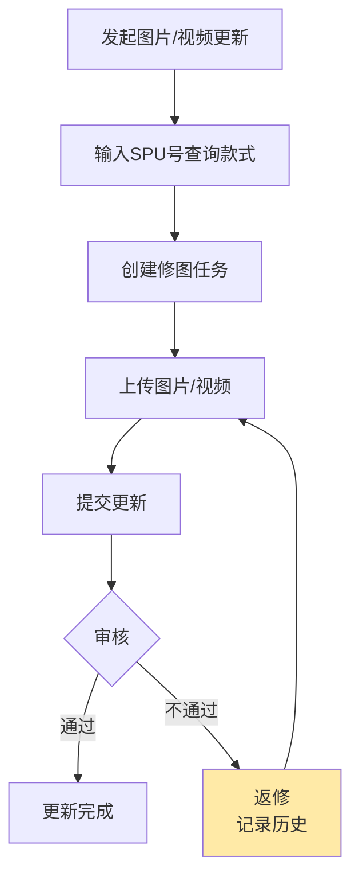
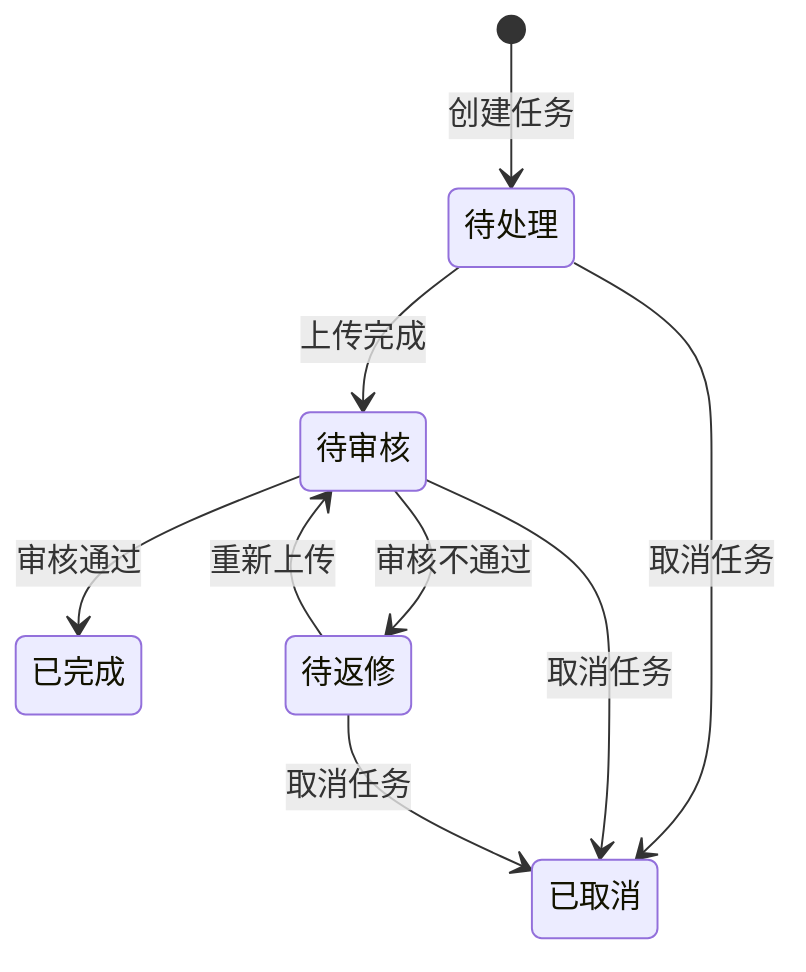

# 图片更新任务

## 1. 模块概述

本模块负责图片更新任务相关功能，涵盖**上传图片/视频 → 创建修图任务 → 审核更新结果**完整链路。共 8 个页面。

**核心业务流程**：

**对接关系**：

| 对接系统 | 方向 | 数据/功能 | 说明 |
|---------|------|---------|------|
| 款式管理 | 输入 | SPU/款式数据、营销图 | 发起更新时查询款式信息 |
| 款式管理 | 输出 | SKC 营销视频字段 | (v2.8.2 新增) 视频审核通过后写入 SKC 营销视频字段 |
| 现货管理 | 输入 | SKC数据、商品图 | 发起更新时查询现货信息 |

---

## 2. 页面概述

| 页面名称 | 页面类型 | 入口/路径 | 交互形式 | 说明 |
|---------|---------|---------|---------|------|
| 图片更新任务列表 | 列表页 | 设计中心 → 图片更新任务 | 页面跳转 | 任务列表主页面，含状态筛选 + 搜索 |
| 发起图片/视频更新 | 表单页 | 列表页 → 点击「创建任务」 | 新标签页 | 输入SPU号发起更新，支持同时选择图片和视频 |
| 创建修图任务 | 表单页 | 发起更新 → 确认 | 页面跳转 | 选择图片并填写修图说明，分区展示图片/视频 |
| 上传图片/视频 | 表单页 | 列表页 → 点击「上传图片」 | 页面跳转 | 分区上传图片和视频，含全部删除和美工备注 |
| 审核更新结果 | 表单页 | 列表页 → 点击「审核」 | 页面跳转 | 审核更新内容，通过/不通过，展示返修历史记录 |
| 上传图片 | 表单页 | (待补充) | 弹窗 | 批量拖入文件夹上传图片 |
| 编辑图片 | 表单页 | (待补充) | 弹窗 | 调整图片尺寸/比例 |
| 选择图片 | 表单页 | (待补充) | 弹窗 | 选择已有图片 |

---

## 3. 权限说明

_[TODO: 请补充权限码信息]_

---

## 4. 状态机

### 任务状态

| 状态码 | 名称 | 说明 |
|-------|------|------|
| `0` | 待处理 | 任务创建后等待上传 |
| `10` | 待审核 | 已上传更新内容，等待审核 |
| `20` | 待返修 | 审核不通过，需重新上传 |
| `30` | 已完成 | 审核通过，更新完成 |
| `50` | 已取消 | 任务被取消（已上传内容保留） |

> 状态机无变更，返修历史记录为独立实体，不影响主状态流转。

---

## 5. 数据模型

### 图片更新任务

| 字段名 | 类型 | 必填 | 默认值 | 说明 |
|--------|------|------|--------|------|
| 任务编号 | 短文本 | 自动 | 自动生成 | 任务唯一标识 |
| 关联SPU | 引用 | 是 | - | 关联款式管理SPU |
| 关联SKC列表 (v2.8.2 新增) | JSON数组 | 自动 | - | 任务关联的 SKC 列表，从 SPU 展开，用于按 SKC 查询 |
| 任务类型 (v2.8.2 变更) | JSON数组 | 是 | ["image"] | 存储 ["image"] / ["video"] / ["image","video"]，支持同时包含图片和视频 |
| 任务状态 | 枚举 | 是 | 待处理 | 见状态机定义 |
| 修图备注 | 长文本 | 否 | - | 修图需求描述，最大500字 |
| 美工备注 (v2.8.2 新增) | 长文本 | 否 | - | 美工处理说明，上传时填写，最大 200 字 |
| 店铺 (v2.4.1 新增) | 引用 | 否 | - | 关联店铺，取SPU对应店铺 |
| 目标店铺ID (v2.8.2 新增，需求8) | 引用 | 否 | - | 任务目标店铺ID；审核通过后图片写入该店铺维度的营销图组；为空则写入通用营销图 |
| 目标店铺名称 (v2.8.2 新增，需求8) | 短文本 | 否 | - | 目标店铺名称，冗余存储，最大 64 字符 |
| ✨ 写入模式 (v2.8.2 新增，需求9) | 枚举 | 否 | append | append=增加（追加到图组末尾）；overwrite=覆盖（替换整组图片）；每次上传时选择，可覆盖上次选择 |
| 加急 (v2.8.0 新增) | 布尔 | 否 | false | 是否加急；创建时由设计师填写，默认不加急 |
| 创建人 | 短文本 | 自动 | 当前用户 | 任务创建者 |
| 创建时间 | 日期时间 | 自动 | 当前时间 | 任务创建时间 |
| 处理人 | 短文本 | 否 | - | 最后处理人 |
| 处理时间 | 日期时间 | 否 | - | 最后处理时间 |

### 修图需求明细

| 字段名 | 类型 | 必填 | 默认值 | 说明 |
|--------|------|------|--------|------|
| 明细ID | 整数 | 自动 | 自动生成 | 主键 |
| 任务ID | 引用 | 是 | - | 关联图片更新任务 |
| 图片编号 | 整数 | 是 | - | 对应营销图的编号 |
| 需求说明 | 长文本 | 否 | - | 修图需求描述（v2.8.2 变更：原必填改为非必填），最大 500 字 |
| 说明参考图 (v2.8.2 变更) | JSON数组 | 否 | - | 修图说明参考图列表（v2.8.2 变更：原单张改为最多 5 张） |

### ✨ 返修历史记录（v2.8.2 新增）

| 字段名 | 类型 | 必填 | 默认值 | 说明 |
|--------|------|------|--------|------|
| 记录ID | 整数 | 自动 | 自动生成 | 主键 |
| 任务ID | 引用 | 是 | - | 关联图片更新任务 |
| 返修批次 | 整数 | 是 | - | 第几次返修，从 1 开始递增 |
| 返修类型 | 枚举 | 是 | - | IMAGE（图片返修）/ VIDEO（视频返修） |
| 返修说明 | 长文本 | 是 | - | 审核不通过时填写的返修说明，最大 500 字 |
| 返修说明图片 | 文件引用 | 否 | - | 审核不通过时上传的说明图片，最多一张 |
| 提交内容快照 | JSON数组 | 是 | - | 该次提交时的更新内容图片/视频 URL 列表 |
| 美工备注 | 长文本 | 否 | - | 该次上传时填写的美工备注 |
| 处理人 | 短文本 | 是 | - | 该次上传操作人 |
| 处理时间 | 日期时间 | 自动 | 当前时间 | 该次上传时间 |
| 创建时间 | 日期时间 | 自动 | 当前时间 | 记录创建时间 |

---

## 6. 图片更新任务列表

### 页面说明

**入口**: 设计中心 → 图片更新任务

**列表行为**: 默认按创建时间降序，分页展示

### 查询条件

| 条件名称 | 输入方式 | 说明 |
|---------|---------|------|
| 任务状态 (v2.4.1 变更) | 多选框组 | 支持同时选择多种状态，显示各状态数量：全部/待处理(n)/待审核(n)/待返修(n)/已完成(n)/已取消(n) |
| ✨ SKC 编号 (v2.8.2 新增) | 文本输入，支持批量 | 按 SKC 精确查询；支持输入多个 SKC，逗号分隔；查询结果为关联 SKC 列表中任一匹配的任务 |
| 店铺 (v2.4.1 新增) | 多选框组，支持搜索 | 按店铺筛选任务，取任务关联SPU所属店铺 |
| 加急 (v2.8.0 新增) | 单选 | 全部 / 仅加急 |
| 只看自己 | 开关 | 仅查看当前用户创建的任务 |

### 显示字段

| 字段名称 | 显示为 | 说明 |
|---------|--------|------|
| 任务信息 | 文本 + 标签 | 任务编号 + 任务类型（图片/视频/图片+视频）+ 加急标签（v2.8.0 新增，仅加急任务显示红色「加急」标签） |
| 关联款式 | 文本 | SPU编码 + 设计组 + 设计师 |
| 店铺名称 (v2.4.1 新增) | 文本 | 任务关联款式所属店铺 |
| 状态 | 状态标签 | 待处理/待审核/待返修/已完成/已取消 |
| 修图备注 | 文本 | 修图需求描述 |
| 创建信息 | 格式化文本 | 创建人 + 创建时间 |
| 处理信息 | 格式化文本 | 处理人 + 处理时间 |
| 操作 | 操作按钮 | 上传图片/审核/取消/下载图片 |

### 用例

**用例1：创建任务**
- **前置条件**：需要有权限
- **操作**：点击按钮，新标签页打开「发起图片/视频更新」页面
- **后置输出**：打开新标签页

**用例2：上传图片**
- **前置条件**：1）需要有权限；2）至少选中一条数据；3）仅任务状态=待处理/待返修可操作
- **操作**：点击后跳转「上传图片/视频」页面
- **后置输出**：进入上传页面

**用例3：下载图片**
- **前置条件**：1）需要有权限；2）选中且仅选中一条数据
- **操作**：下载款式对应的营销图、备注图、更新结果、修图需求说明（.txt）
- **后置输出**：下载 .zip 压缩包（多个款式以文件夹隔离）

**用例4：审核任务 (v2.4.1 变更)**
- **前置条件**：1）需要有权限；2）至少选中一条数据；3）仅任务状态=待审核可操作；4）仅创建人或SPU对应的SKC设计师可操作
- **操作**：点击后跳转「审核更新结果」页面
- **后置输出**：进入审核页面

**用例5：取消任务**
- **前置条件**：1）需要有权限；2）至少选中一条数据；3）仅任务状态=待处理/待审核/待返修可操作；4）仅创建人可操作
- **操作**：点击后出现二次确认弹窗，提示："确认取消所选图片/视频更新任务？"
- **后置输出**：确认后设置任务状态=已取消（已上传的内容保留）

**用例6：查看审核不通过原因**
- **前置条件**：1）需要有权限；2）至少选中一条数据；3）仅任务状态=待返修可操作
- **操作**：点击查看不通过原因及图片

### 异常处理

| 异常场景 | 用户看到的表现 |
|---------|-------------|
| 取消任务状态不匹配 | 按钮不显示或 disabled |
| 审核任务非创建人且非SPU对应SKC设计师 (v2.4.1 变更) | 按钮不显示 |
| 无权限 | 对应按钮不显示 |

---

## 7. 发起图片/视频更新

### 页面说明

**入口**: 图片更新任务列表 → 点击「创建任务」

**交互形式**: 新标签页

### 表单字段

| 字段名称 | 输入方式 | 必填 | 说明 |
|---------|---------|------|------|
| SPU编号 | 文本输入 | 是 | 支持批量输入，确认时查询款式管理及现货管理 |
| ✨ 更新内容类型 (v2.8.2 变更) | 多选框组 | 是 | 默认选中「图片」。可选：图片 / 视频，支持同时勾选。视频为 SKC 维度，更新到款式管理营销视频字段 |
| ✨ 目标店铺 (v2.8.2 新增，需求8) | 单选下拉，支持搜索 | 否 | 从任务关联 SPU 所属店铺中选择；审核通过后图片写入该店铺维度的营销图组；不填则写入通用营销图 |
| 加急 (v2.8.0 新增) | 开关 | 否 | 默认关闭；开启后任务列表显示「加急」标签 |

### 业务规则

1. 输入SPU号，确认时查询款式管理及现货管理
2. 校验款式是否存在，全部存在则跳转至创建任务页
3. 如存在不存在的款式，提示："款式不存在"
4. (v2.8.2 新增) 至少需要勾选一种更新内容类型（图片或视频）
5. (v2.8.2 新增) 同时勾选图片+视频时，后续创建修图任务和上传页面均分区展示
6. (v2.8.2 新增，需求8) 目标店铺为可选字段；不填则审核通过后写入通用营销图；填写后从任务关联 SPU 所属店铺列表中选择；如任务包含多个 SPU 且店铺不同，显示所有涉及店铺的并集

### 异常处理

| 异常场景 | 用户看到的表现 |
|---------|-------------|
| SPU不存在 | 提示"款式不存在" |
| 未勾选任何更新类型 (v2.8.2 新增) | 提交时提示"请至少选择一种更新内容类型" |

---

## 8. 创建修图任务

### 页面说明

**入口**: 发起图片/视频更新 → 确认后跳转

### 业务规则

1. 左侧显示已选中的款式信息，点击切换款式，加载对应的营销图（图片区域）/ 营销视频（视频区域）
2. **图片区域**（任务类型包含图片时显示）：
   - 勾选对应图片，出现修图需求说明+编号
   - 说明参考图：每个说明最多上传 5 张参考图（v2.8.2 变更，原限制 1 张）
3. **视频区域**（v2.8.2 新增，任务类型包含视频时显示）：
   - 显示当前 SKC 的营销视频（如有）
   - 填写视频更新需求说明，最大 500 字，非必填
   - 支持上传视频需求说明参考图，最多 5 张
4. 修图/视频说明均为**非必填**（v2.8.2 变更，原图片说明必填）
5. 修图说明最大输入 500 字
6. 如当前选中的款式已有进行中的任务，不允许再提交

### 异常处理

| 异常场景 | 用户看到的表现 |
|---------|-------------|
| 款式已有进行中的任务 | 提交按钮 disabled，提示"该款式已有进行中的更新任务" |
| 说明参考图超过5张 (v2.8.2 新增) | 上传时提示"每个说明最多上传5张参考图" |

---

## 9. 上传图片/视频

### 页面说明

**入口**: 图片更新任务列表 → 点击「上传图片」

### 业务规则

1. 支持粘贴、拖放图片/视频进行上传
2. 左侧显示已选中的款式信息，点击切换款式，加载对应的营销图/营销视频、更新结果
3. **图片上传区域**（任务类型包含图片时显示）：
   - 需要上传 1-10 张图片
   - 支持点击保留按钮，将当前营销图添加至更新内容，更新内容最大支持 10 张图
   - ✨ **「全部删除」按钮**（v2.8.2 新增）：点击后清空更新内容区域所有已添加的图片，需二次确认
   - ✨ **美工备注**（v2.8.2 新增）：长文本输入框，最大 200 字，非必填，记录美工处理说明
   - ✨ **写入模式**（v2.8.2 新增，需求9）：单选「增加」/「覆盖」，默认增加；「增加」= 追加到目标图组末尾；「覆盖」= 替换目标图组全部图片；选择结果写入任务 `write_mode` 字段
4. ✨ **视频上传区域**（v2.8.2 新增，任务类型包含视频时显示）：
   - 需要上传 1 个视频，最大 100MB，支持格式：mp4 / mov / avi
   - 支持拖放、粘贴上传
   - 显示当前 SKC 营销视频预览（如有）作为参考
   - 更新内容区域展示已上传视频，支持删除重新上传
   - **美工备注**（v2.8.2 新增）：长文本输入框，最大 200 字，非必填
5. 提交更新后将根据 `write_mode` 写入图片（v2.8.2 变更，需求9）：
   - write_mode=append（增加）：追加到目标图组末尾，原有图片保留
   - write_mode=overwrite（覆盖）：替换目标图组全部图片
6. 提交时将美工备注和上传内容快照记录到返修历史表（v2.8.2 新增）
7. (v2.8.2 新增，需求8) 图片写入目标：
   - 任务有目标店铺 → 写入 `skc_store_material` 表对应 SKC + 店铺记录的 `marketing_images` 字段（覆盖）
   - 任务无目标店铺 → 写入原 `prototype_material`（通用营销图，兼容存量）

### 上传图片（批量拖入文件夹）

1. 图片类型（单选）：商品图 / try on图
2. 匹配方式（单选）：SPU编号 / 供应商款号
   - 勾选供应商款号时，显示「请选择供应商」
   - 勾选SPU编号时，不显示「请选择供应商」
3. 供应商（单选选择器，支持搜索，必填）：取匹配现货SPU关联的全部供应商名称
4. 拖入文件夹校验：
   - 存在未勾选的必填字段 → 提示"请先勾选必填的信息"
   - 文件种类非文件夹 → 提示"请勿拖入非文件夹文件"
   - 文件夹为空 → 自动过滤不处理
5. 拖入后返回匹配结果列表：
   - 匹配方式=SPU编号 → 根据「文件夹名称」匹配 SPU，全量覆盖更新
   - 匹配方式=供应商款号 → 根据「文件夹名称+供应商名称」匹配 SPU，全量覆盖更新

### 异常处理

| 异常场景 | 用户看到的表现 |
|---------|-------------|
| 图片超过10张 | 提示"最多上传10张图片" |
| 视频超过100MB (v2.8.2 新增) | 上传时提示"视频文件不能超过100MB" |
| 视频格式不支持 (v2.8.2 新增) | 提示"请上传mp4/mov/avi格式的视频" |
| 点击全部删除 (v2.8.2 新增) | 弹出二次确认："确认删除所有已添加的图片？"，确认后清空 |

---

## 10. 审核更新结果

### 页面说明

**入口**: 图片更新任务列表 → 点击「审核」

### 业务规则

1. 左侧显示已选中的款式信息，点击切换款式，加载营销图/营销视频和更新结果
2. **图片审核区域**（任务类型包含图片时显示）：
   - 支持点击保留按钮，将当前营销图添加至更新内容
   - 更新内容最大支持 10 张图
3. **视频审核区域**（v2.8.2 新增，任务类型包含视频时显示）：
   - 展示更新内容视频，支持预览播放
   - 更新内容支持 1 个视频
4. ✨ **返修历史记录**（v2.8.2 新增）：
   - 审核页右上角显示「查看返修记录 (n)」链接，n 为历史返修次数
   - 点击后展开折叠面板，按时间倒序展示每次返修记录
   - 无返修记录时，链接显示「暂无返修记录」，不可点击
   - 每条返修记录展示：返修批次 / 返修类型 / 返修说明 / 返修说明图片 / 提交时图片快照 / 美工备注 / 处理人 / 处理时间
5. 审核通过：图片/视频写入款式管理对应字段，根据任务 `write_mode` 执行增加或覆盖（v2.8.2 变更，需求9）；更新完成
6. 审核不通过：需要输入返修说明，最大支持 500 字；支持上传说明图片，最多一张；**同时保存本次返修记录到历史表**（v2.8.2 新增）
7. (v2.8.2 变更，需求8) **审核权限调整**：仅创建人可审核，不再包含"该SPU对应的SKC设计师"
8. (v2.8.2 新增，需求8) 审核通过后图片写入目标：
   - 任务有目标店铺 → 图片写入 SKC 在该店铺维度的营销图组（`skc_store_material` 表）
   - 任务无目标店铺 → 图片写入通用营销图（`prototype_material` 表，兼容存量）

### 异常处理

| 异常场景 | 用户看到的表现 |
|---------|-------------|
| 审核不通过未填写返修说明 | 提交时提示"请填写返修说明" |
| 款式管理写入失败 (v2.8.2 新增) | 提示"图片/视频更新成功，但写入款式管理失败，请联系管理员" |

---

## 更新记录

| 关联版本 | 更新内容 | 具体说明 |
|------|------|------|
| v2.4.1 | 状态筛选多选+店铺筛选与显示+审核权限放宽+数据模型新增店铺 | 来自规划文档 v2.4.1：图片更新任务优化——任务状态筛选改为多选框组(支持同时查看多种状态)、新增店铺多选筛选及列表显示字段、审核任务允许创建人或SPU对应的SKC设计师操作(创建任务时设计师取SPU维度)、数据模型新增店铺引用字段(可选) |
| v2.8.0 | 加急标签支持 | (v2.8.0 新增) 创建任务时支持设置加急（开关，默认关闭）；列表对加急任务展示红色「加急」标签；支持按加急筛选；数据模型新增 is_urgent 布尔字段 |
| v2.8.2 | 图片更新任务八项优化 + 写入模式 | (v2.8.2) 1. 任务类型支持同时选择图片+视频（视频为SKC维度，写入款式管理营销视频字段）；2. 新增返修历史记录表，保留完整修改链路；3. 上传页更新内容区域新增「全部删除」按钮；4. 列表新增 SKC 查询条件；5. 上传页新增美工备注字段；6. 修图需求说明改为非必填；7. 修图说明参考图支持多张（最多5张）；8. 营销图改为店铺维度多组：新增目标店铺字段（可选），审核通过后图片写入该店铺维度的营销图组（不影响其他店铺），不填则写入通用营销图兼容存量；审核权限调整为仅创建人可审核；9. (需求9) 上传图片时新增写入模式选择（增加/覆盖，默认增加）：增加=追加到图组末尾，覆盖=替换整组；任务数据模型新增 write_mode 字段 |
