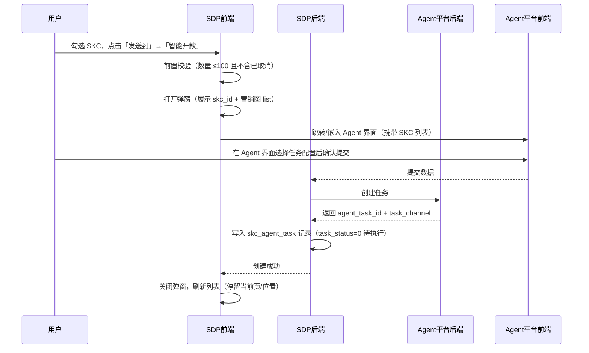
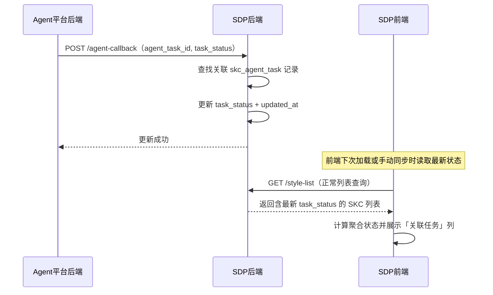
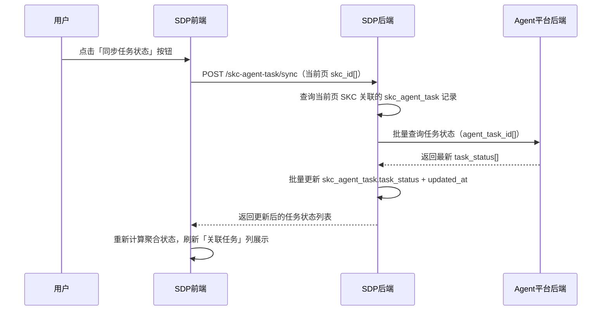
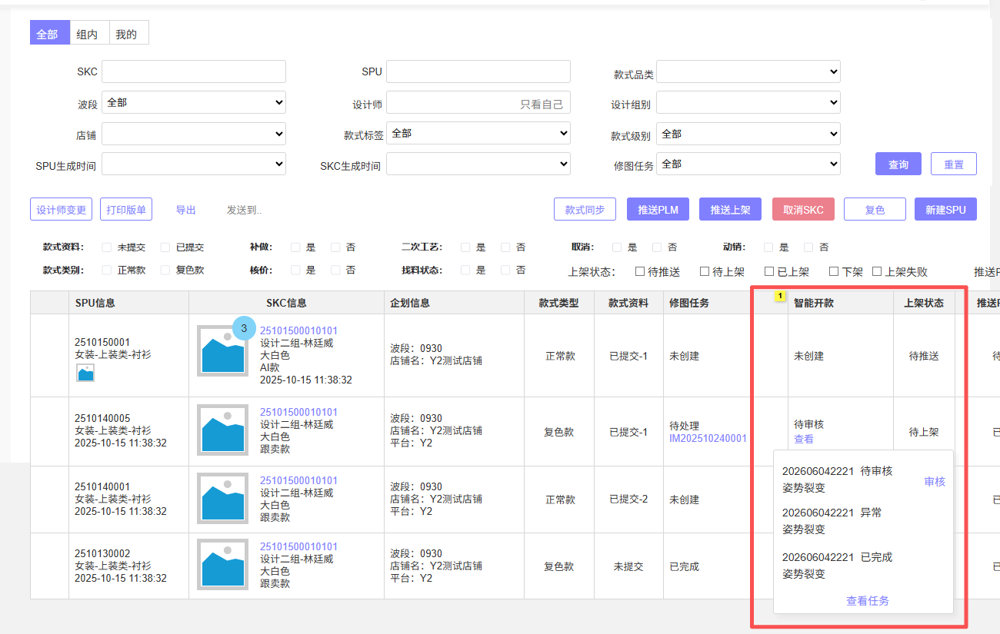

# 规划文档：Agent 智能编辑接入

| 属性 | 内容 |
|------|------|
| 规划文档编号 | REV-20260603-001 |
| 关联版本 | v2.6.2 |
| 需求提出方 | 商品开发组 |
| 规划人 | 林廷威 |
| 规划日期 | 2026-06-03 |
| 状态 | 开发中 |

---

## 1. 需求背景

### 1.1 问题描述

SDP 款式管理/现货管理模块接入 Agent 系统后，需要调用智能编辑功能。当前存在以下缺口：

1. **缺少任务发起入口**：款式管理/现货管理无法直接发起智能开款任务，用户需要切换到 Agent 系统手动操作，流程割裂
2. **任务状态不可见**：SKC 关联的 Agent 任务状态无法在款式/现货列表直观感知，需要跳出 SDP 查询，效率低
3. **开款来源无法区分**：开款任务管理中「以料开款」来源已不准确，Agent 推送的开款任务无专属来源标识，数据统计混乱
4. **开款标签缺失**：Agent 推送开款任务时携带的开款标签在 SDP 侧没有对应字段承接，导致来源信息丢失

### 1.2 需求清单

| 序号 | 需求描述 | 需求类型 | 优先级 |
|------|---------|---------|--------|
| 1 | 款式管理/现货管理「发送到」新增【智能开款】选项，携带 SKC id + 营销图 list 打开弹窗，提交后 SDP 保存 skc_id + agent任务ID + 任务渠道 | 新增功能 | P0 |
| 2 | 款式管理/现货管理列表新增「智能编辑任务」多选筛选（未发起/进行中/待审核/已完成/异常），按 SKC 维度聚合计算 | 新增功能 | P0 |
| 3 | 款式管理/现货管理列表 SKC 行新增「关联任务」列：聚合状态标签 + 悬浮任务列表（任务编号/类型/状态）+ 【审核】跳转 + 任务编号跳转任务中心 | 新增功能 | P0 |
| 4 | 款式管理/现货管理列表新增「同步任务状态」按钮，手动触发当前页 SKC 关联 Agent 任务状态刷新 | 新增功能 | P1 |
| 5 | 开款任务管理：来源枚举「以料开款」改为「智能开款」；列表新增任务来源筛选 | 功能优化 | P1 |
| 6 | 款式管理 SKC 新增「开款标签」字段（由 Agent 推送开款任务时写入，支持多个标签）；列表新增开款标签筛选与显示 | 新增功能 | P1 |
| 7 | 款式管理：创建开款任务时，将关联 SKC 的开款标签列表推送给 PLM；单个 SKC 可携带多个开款标签，需全量推送 | 新增功能 | P1 |

### 1.3 版本说明

本版本聚焦 Agent 系统对接，引入 `skc_agent_task` 新实体，变更款式管理、现货管理、开款任务管理三个模块。

---

## 2. 影响分析

### 2.1 受影响模块

| 模块 | 当前版本 | 影响类型 | 影响说明 |
|------|---------|---------|---------|
| 款式管理 (style-management) | v2.6.0 | 直接 | 「发送到」新增智能开款；新增智能编辑任务筛选+关联任务列+同步按钮；SKC新增开款标签字段；数据模型新增 skc_agent_task 实体 |
| 现货管理 (spot-goods) | v2.6.0 | 直接 | 「发送到」新增智能开款；新增智能编辑任务筛选+关联任务列+同步按钮；共享 skc_agent_task 数据层 |
| 开款任务管理 (design-task) | v2.6.0 | 直接 | taskSource 枚举变更（以料开款→智能开款）；列表新增任务来源筛选 |

### 2.2 依赖传播链

```
Agent 平台（外部系统，新增）
  │
  ├─ hard → 款式管理 (style-management)
  │           发起智能开款弹窗 → SDP后端封装接口调用 Agent
  │           保存 skc_id + agent任务ID + 任务渠道到 skc_agent_task
  │           Agent 回调 → 更新 skc_agent_task.task_status
  │           创建开款任务时推送 SKC 开款标签列表给 PLM（外部系统）
  │
  ├─ hard → 现货管理 (spot-goods)
  │           同上，共享 skc_agent_task 数据层（主定义在 style-management）
  │
  └─ soft → 开款任务管理 (design-task)
              Agent推送开款任务时写入 prototype.develop_tags（数组）
              taskSource 枚举新增 AGENT_DEVELOP
```

> Agent 平台为外部系统，放入 `related_features`，不放入 `depends_on`。

### 2.3 冲突分析

| 冲突点 | 涉及模块 | 说明 | 解决方案 |
|--------|---------|------|---------|
| skc_agent_task 归属 | style-management / spot-goods | 两模块共用同一关联表 | 实体主定义在 style-management，现货管理通过 SKC id 查询，不重复定义 |
| 开款标签写入方 | style-management / design-task | Agent 推送开款任务时写入 develop_tags 字段（数组，可多个） | 字段定义在 style-management SKC 数据模型；style-management 负责创建开款任务时将标签列表推送 PLM；design-task 的 exposed_api 补充写入路径说明 |
| 虚拟换衣/姿势裂变停用 | style-management / spot-goods | 本期在 agent 分支停用，但「发送到」下拉已有这两项 | 不修改现有停用逻辑；智能开款作为新选项独立追加 |

### 2.4 核心调用时序

#### Flow 1：发起智能开款



#### Flow 2：Agent 任务状态回调



#### Flow 3：手动同步任务状态



---

## 3. 模块变更详情

### 3.1 模块：款式管理 (style-management)

#### 变更概述

「发送到」新增智能开款入口；列表新增智能编辑任务筛选、同步任务状态按钮、关联任务悬浮列、开款标签字段与筛选；数据模型新增 `skc_agent_task` 关联实体及 `prototype.develop_tags` 字段；创建开款任务时负责将 SKC 开款标签列表推送给 PLM。

#### 页面变更

1. **款式列表** `修改` — 查询条件新增「智能编辑任务」多选下拉（未发起/进行中/待审核/已完成/异常）；支持按 Agent 任务状态过滤 SKC
2. **款式列表** `修改` — 查询条件新增「开款标签」多选筛选；按 Agent 推送的开款标签过滤款式
3. **款式列表** `修改` — SKC 行显示列新增「关联任务」列：聚合状态标签 + 悬浮展示最新的10个任务（任务编号/状态），默认待审核任务置顶；含【审核】按钮（存在待审核任务时可操作，跳转对应任务审核界面）；任务编号可点击跳转任务中心列表并筛选对应任务

4. **款式列表** `修改` — SKC 行显示列新增「开款标签」标签展示；展示 Agent 推送的开款标签
5. **款式列表** `修改` — 工具栏新增「同步任务状态」按钮，点击触发当前页所有 SKC 关联 Agent 任务状态的手动同步；弥补 Agent 回调延迟
6. **款式列表** `修改` — 「发送到」下拉新增【智能开款】选项；前置条件：选中数量 ≤50 条，且所选数据不包含已取消状态
7. **发送到智能开款** `新增` — 新增弹窗页面：展示选中 SKC 列表（SKC id + 营销图 list）；用户在 Agent 界面选择对应任务后提交至 SDP 后端；SDP 保存 skc_id + agent任务ID + 任务渠道；提交成功后刷新列表并停留在当前页/位置

#### 数据模型变更

| 实体 | 变更类型 | 变更内容 | 说明 |
|------|---------|---------|------|
| prototype (SKC) | 新增属性 | `develop_tags`: JSON数组, 可选, 默认值 `[]`, 单个标签 ≤50字符, 最多20个 | 开款标签列表，由 Agent 推送开款任务时写入，支持多个标签 (v2.6.2 新增) |
| skc_agent_task | 新增实体 | 见下方完整定义 | SKC 与 Agent 任务关联表 (v2.6.2 新增) |

**skc_agent_task（新增实体）**

| 属性 | 类型 | 必填 | 默认值 | 长度/范围 | 说明 |
|------|------|------|--------|----------|------|
| id | 整数 | 自动 | — | 雪花ID | 主键 |
| skc_id | 引用 | 是 | — | — | 关联 prototype 主键 |
| skc_code | 短文本 | 是 | — | ≤32字符 | SKC 编码，冗余存储 |
| agent_task_id | 短文本 | 是 | — | ≤64字符 | Agent 平台任务 ID |
| agent_task_code | 短文本 | 是 | — | ≤64字符 | Agent 任务编号，用于列表展示和跳转 |
| task_type | 枚举 | 是 | — | — | 任务类型：INTELLIGENT_DESIGN(智能开款) / INTELLIGENT_EDIT(智能编辑) / INTELLIGENT_SPLIT(智能拆版) |
| task_channel | 短文本 | 是 | — | ≤32字符 | 任务渠道标识，记录来源系统 |
| task_status | 整数 | 是 | 0 | 0-8 | Agent任务状态：0待执行/1执行中/2待审核/3暂停/4已完成/5已失败/6已取消/7无结果/8未定义 |
| created_at | 日期时间 | 自动 | NOW() | — | 关联创建时间 |
| updated_at | 日期时间 | 自动 | NOW() | — | 最后同步时间 |
| created_by | 引用 | 自动 | — | — | 发起人 ID |

**SKC 智能编辑任务聚合状态规则（展示态，不持久化）**

| 展示状态 | 判断条件 | 优先级（高→低） |
|---------|---------|--------------|
| 未发起 | 无关联任务记录 | 1 |
| 待审核 | 至少1条记录 task_status=2 | 2 |
| 异常 | 至少1条记录 task_status∈{3,5,6,7,8} | 3 |
| 进行中 | 全部记录 task_status∈{0,1} | 4 |
| 已完成 | 全部记录 task_status=4 | 5 |

#### 状态机变更

无新增持久化状态机。SKC 智能编辑任务聚合状态为前端实时计算的展示态，见上表。

#### 业务规则变更

| 规则 | 变更内容 |
| ---- | -------- |
| 创建开款任务 PLM 推送 | 创建开款任务时，若关联 SKC 存在 `develop_tags`，则将标签列表全量推送至 PLM；单个 SKC 可有多个开款标签，逐一推送或批量推送（由对接方接口决定）；推送失败不阻断任务创建流程，记录推送日志并支持重试 |

#### 依赖变更

| 变更类型 | 目标模块 | 类型 | 说明 |
| -------- | -------- | ---- | ---- |
| 新增 related_feature | Agent 平台（外部系统） | — | 智能开款/智能编辑任务发起与状态回调；不放入 depends_on |
| 新增 related_feature | PLM（外部系统） | — | 创建开款任务时推送 SKC 开款标签列表；推送失败不阻断主流程 |

---

### 3.2 模块：现货管理 (spot-goods)

#### 变更概述

与款式管理同步：列表「发送到」新增智能开款；新增智能编辑任务筛选、同步任务状态按钮、关联任务悬浮列；共享 skc_agent_task 数据层（数据模型主定义在 style-management）。

#### 页面变更

1. **现货管理-列表** `修改` — 查询条件新增「智能编辑任务」多选下拉（未发起/进行中/待审核/已完成/异常）；同款式管理
2. **现货管理-列表** `修改` — SKC 行新增「关联任务」列：聚合状态标签 + 悬浮任务列表，默认待审核置顶；含【审核】跳转按钮和任务编号跳转链接；同款式管理
3. **现货管理-列表** `修改` — 工具栏新增「同步任务状态」按钮；同款式管理
4. **现货管理-列表** `修改` — 批量操作「发送到」新增【智能开款】选项；前置条件：选中 ≤50 条且不含已取消状态
5. **发送到智能开款** `新增` — 弹窗交互规格同款式管理，复用相同弹窗规格

#### 数据模型变更

无新增实体。skc_agent_task 主定义在 style-management；现货管理通过 SKC id 查询，不重复定义。

#### 状态机变更

无。SKC 智能编辑任务聚合状态规则与款式管理一致。

#### 依赖变更

| 变更类型 | 目标模块 | 类型 | 说明 |
|---------|---------|------|------|
| 新增 related_feature | Agent 平台（外部系统） | — | 智能开款/智能编辑任务发起与状态回调 |

---

### 3.3 模块：开款任务管理 (design-task)

#### 变更概述

任务来源枚举「以料开款」修改为「智能开款」；列表新增任务来源多选筛选条件；开款任务增加从agent获取开款标签。

#### 页面变更

1. **开款任务列表** `修改` — 查询条件新增「任务来源」多选筛选（手动创建/AIGC选款/智能开款/…）；区分 Agent 推送的开款任务与其他来源

#### 数据模型变更

| 实体 | 变更类型 | 变更内容 | 说明 |
|------|---------|---------|------|
| develop_style_task | 修改属性 | taskSource 枚举：`MATERIAL_DEVELOP`(以料开款) 重命名为 `AGENT_DEVELOP`(智能开款) | (v2.6.2 变更) |

#### 状态机变更

无。

#### 依赖变更

无新增模块间依赖。

---

## 4. 新增模块定义

无新增模块（skc_agent_task 为新增实体，归属于 style-management 模块范畴）。

---

## 5. 执行记录

| 日期 | 操作 | 操作人 | 结果 |
|------|------|--------|------|
| 2026-06-03 | 创建规划文档 | 林廷威 | — |
| 2026-06-03 | 确认修改方案 | 林廷威 | — |
| 2026-06-03 | 执行模块更新 | Kiro | 进行中 |

---

## 6. 变更汇总

| 模块 | 变更前版本 | 变更后版本 | 变更类型 | 状态 |
|------|----------|----------|---------|------|
| 款式管理 (style-management) | v2.6.0 | v2.6.2 | 新增功能 | pending |
| 现货管理 (spot-goods) | v2.6.0 | v2.6.2 | 新增功能 | pending |
| 开款任务管理 (design-task) | v2.6.0 | v2.6.2 | 功能优化 | pending |

---

## 附：相关文档索引

| 文档 | 路径 | 说明 |
|------|------|------|
| 通用设计语言规范 | build-prd.skill/references/通用设计语言规范.md | 字段类型、页面类型标准 |
| 文档结构模板 | build-prd.skill/references/文档结构.md | 模块文档结构模板 |
| 规划文档 v2.6.1 品类管理 | revisions/规划文档_v2.6.1_款式品类管理.md | 同版本前序规划文档 |
| 规划文档 v2.6.0 | revisions/规划文档_v2.6.0_SDP商品开发迭代.md | 前序版本规划文档 |
