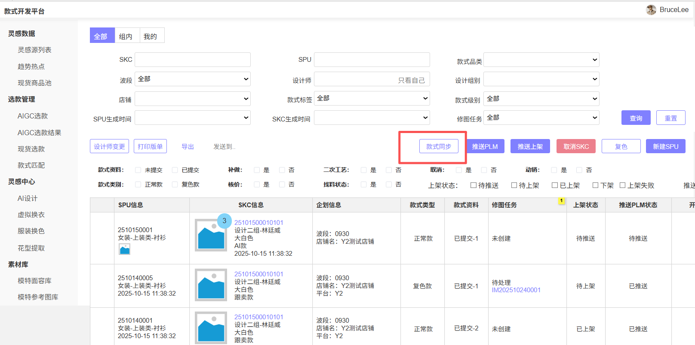
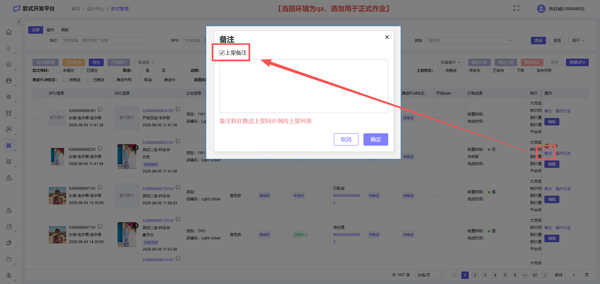
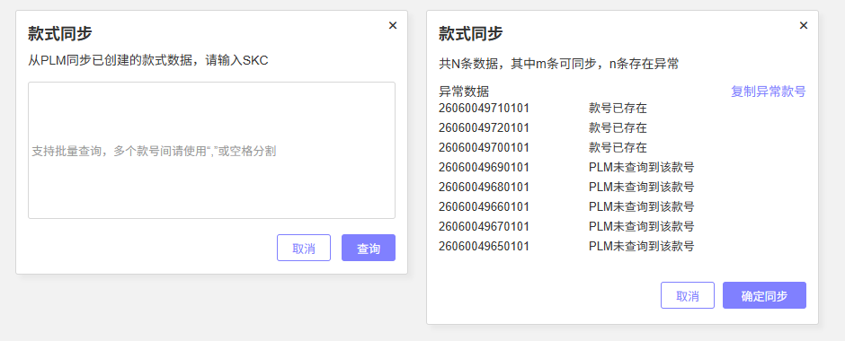
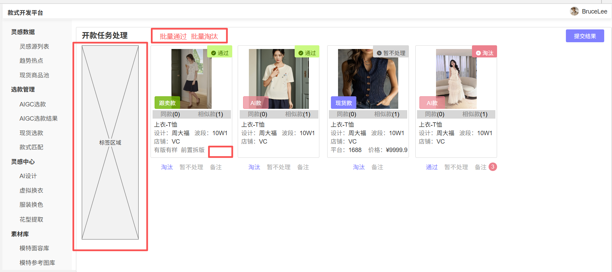
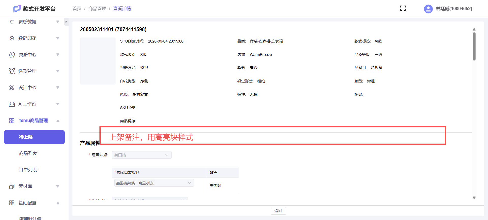
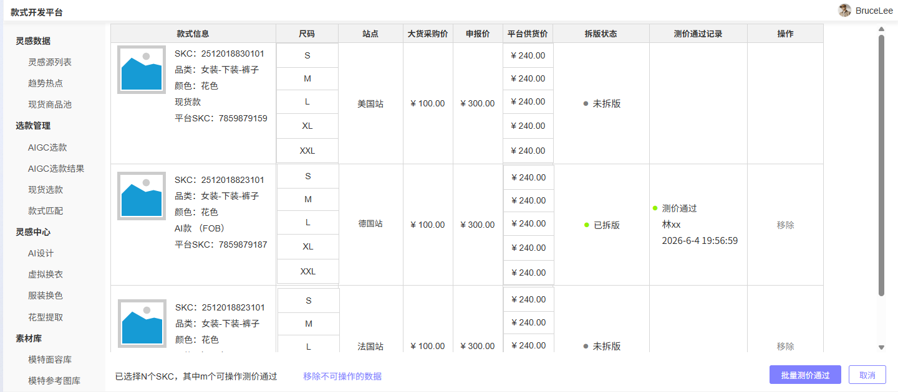
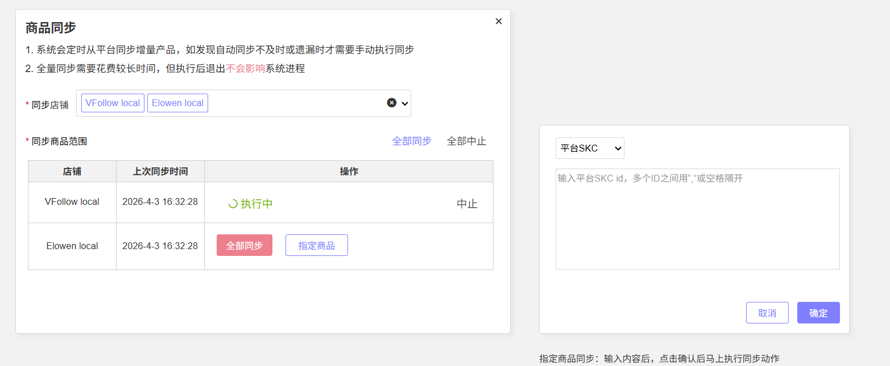
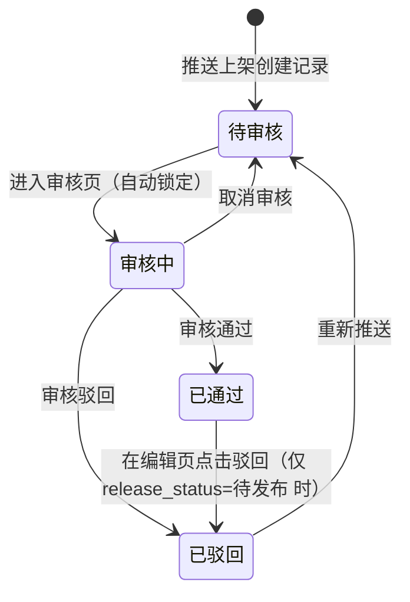
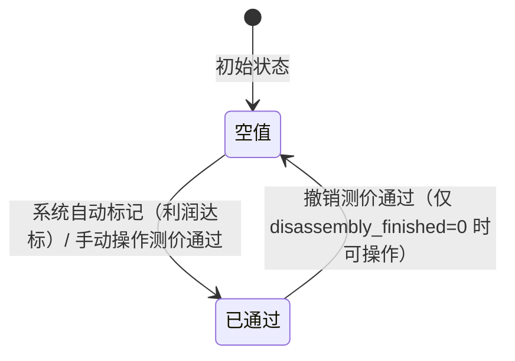

# 规划文档：SDP v2.7.0 日常迭代

| 属性 | 内容 |
|------|------|
| 规划文档编号 | REV-20260603-001 |
| 关联版本 | v2.7.0 |
| 需求提出方 | 商品开发部 / 运营部 |
| 规划人 | 林廷威 |
| 规划日期 | 2026-06-03 |
| 状态 | 开发中 |

---

## 1. 需求背景

### 1.1 问题描述

v2.7.0 是 SDP 商品开发链路的综合优化版本，集中解决三类问题：

1. **流程规范问题**：前置拆版款式被运营手动推送PLM导致BOM顺序混乱；测价通过停留在SPU维度无法精确到SKC颜色，运营无法在必要时撤销已通过的测价；
2. **交互体验问题**：款式管理编辑SPU时刷新丢失SKC未保存数据；审款批量处理效率低，无法按查重标签快速筛选；待上架审核缺少任务领取机制导致多人重复操作；
3. **数据补全问题**：SDP缺少从PLM/Temu手动拉取存量数据的能力，历史款式需手动录入。

### 1.2 需求清单

| 序号 | 需求描述 | 需求类型 | 优先级 |
|------|---------|---------|--------|
| 1 | 款式管理推送PLM增加校验：前置拆版=是且PLM为待推送时禁止手动推送 | 功能优化 | P2 |
| 2 | 开款任务/款式管理：项目类型选"无版无样"时自动联动制作方式为3D样 | 功能优化 | P2 |
| 3 | 款式管理编辑SPU时增加SKC数据保存确认弹窗 | 功能优化 | P2 |
| 4 | 待上架审核增加"审核中"状态及批量取消审核操作 | 功能优化 | P2 |
| 5 | 待上架审核界面增加"跳过"操作 | 功能优化 | P2 |
| 6 | 款式管理款号点击改为新标签页打开 | 功能优化 | P2 |
| 7 | 审款页面增加尺码组显示、标签筛选、批量同意/淘汰 | 功能优化 | P2 |
| 8 | 待上架审核界面新增3:4扩图/补白功能 | 功能优化 | P2 |
| 9 | 测价通过改为SKC维度；商品管理操作列新增「撤销测价通过」；利润结果由agent写入；飞书通知 | 功能优化 | P1 |
| 10 | 款式管理新增「从PLM手动同步款式」功能 | 新增功能 | P2 |
| 11 | 商品管理新增「从Temu手动同步商品」功能 | 新增功能 | P2 |
| 12 | 待上架审核通过后在编辑页增加驳回操作 | 功能优化 | P2 |

### 1.3 版本说明

本版本基于 v2.6.0 迭代，不依赖前序未上线版本。涉及模块：款式管理 (style-management)、开款任务管理 (design-task)、商品管理 (temu-product)。

---

## 2. 影响分析

### 2.1 受影响模块

| 模块 | 当前版本 | 影响类型 | 影响说明 |
|------|---------|---------|---------|
| 款式管理 (style-management) | v2.4.1 | 直接 | 需求1/2/3/6/9/10：推送PLM校验、字段联动、编辑SPU交互、跳转方式、测价通过SKC维度重构、PLM同步入口 |
| 开款任务管理 (design-task) | v2.6.0 | 直接 | 需求2/7：字段联动规则、审款页面批量操作与查重显示优化 |
| 商品管理 (temu-product) | v2.4.1 | 直接 | 需求4/5/8/9/11/12：审核状态机重构、跳过操作、扩图功能、测价SKC维度联动、Temu同步、驳回逆向路径 |

### 2.2 依赖传播链

```
款式管理 (style-management)
  │ 需求9：测价通过改为SKC维度
  │ → prototype 表新增 price_test_passed 字段
  ▼
商品管理 (temu-product)
  │ 原「加入站点自动测价通过→回写款式」链路废弃
  │ → 改由 agent 平台写入利润 → 系统判断后标记测价通过
  ▼
通知中心 / 飞书
  │ 测价通过/撤销时通知关联设计师
```

### 2.3 冲突分析

| 冲突点 | 涉及模块 | 说明 | 解决方案 |
|--------|---------|------|---------|
| review_status 状态机同时被需求4、需求12修改 | 商品管理 | 需求4新增审核中(4)状态；需求12新增已通过→已驳回逆向路径 | 合并处理，统一在 review_status 状态机中体现，无逻辑冲突 |
| 测价通过旧逻辑（加入站点自动触发）与需求9冲突 | 款式管理、商品管理 | v2.4.1 的「加入站点自动测价通过」逻辑需整体废弃 | **B方案**：替换为 SKC 维度、agent 写入利润后系统判断自动标记；运营可手动撤销。移除 site_id 变更触发测价通过的逻辑 |

---

## 3. 模块变更详情

### 3.1 模块：款式管理 (style-management)

#### 变更概述

新增推送PLM前置拆版校验、项目类型→制作方式字段联动、编辑SPU时SKC数据保存确认、款号新标签页跳转、测价通过重构为SKC维度（含撤销+飞书通知+agent利润接口）、以及从PLM手动同步款式新功能。

#### 页面变更

**款式列表页 — 修改**

1. ~~推送PLM操作新增前置校验：当选中SKC的 `pre_disassembly_state=1`（前置拆版=是）且 `push_plm_status=0`（待推送）时，禁止手动推送，提示"前置拆版款式不支持手动推送PLM，动销后系统将自动推送"。推送失败状态（`push_plm_status=3`）不受此限制，仍可手动重试。~~动销功能暂时仍有风险，暂不控制
2. 款式列表 SKC 行中 SKC编码（款号）点击跳转方式由「当前页跳转」改为「新标签页打开」。
3. 测价通过状态展示改为 SKC 维度。
4. 新增「从PLM同步款式」按钮（需对应权限码），点击后打开同步款式弹窗。



**SKC详情页 — 修改**

1. 制作方式字段新增联动规则：当 `project_type_code` 对应 NEST 字典值为「无版无样」时，`make_clothes_type` 自动设为 `3D样`（字典值 `makestyle=3D`，字段值 `2`），并对用户可见提示已自动填充。
2. 编辑SPU按钮点击前新增弹窗确认：检测当前页面 SKC 是否存在未保存的改动，如有则弹出确认弹窗"当前SKC有未保存的内容，是否先保存？"，选项为【保存后继续】和【直接打开（不保存）】。无未保存内容时直接打开编辑SPU弹窗，交互不变。
3. **备注** 增加勾选项：“上架备注”；推送待上架时，将上架备注同步到待上架列表（支持推送多条）
4. **备注** 增加删除功能，支持删除已发布的备注，仅提交人可删除



**从PLM同步款式弹窗 — 新增**

1. 弹窗支持支持批量粘贴（逗号、空格、换行分隔）。
2. 提交时依次执行两层校验：
   - 校验1：款号是否已存在款式管理列表 → 已存在则高亮报错"款式已存在"，不阻断其余条目继续校验。
   - 校验2：通过PLM接口查询款式是否存在 → 不存在则报错"PLM中未查询到该款式"。
3. 校验结果以明细列表展示：成功N条、失败N条，失败条目显示原因。
4. 校验全部通过的条目，确认后从PLM获取款式数据，添加到款式管理列表。同步后的数据款式标签默认为空，SKC为资料待提交状态



可同步字段：

| 类别 | PLM字段 | 反查取值方式 | 映射回SDP字段 |
|------|---------|------------|-------------|
| 款式信息  | SPU | 直接取值 |  SPU |
| 款式信息  | SKC | 直接取值 |  SKC |
| 款式信息  | SKC设计师 | 根据员工编码直接取值（需要注意A项目的转换） |  SKC设计师 |
| 款式信息 | 季节 | 通过 NEST-plm_value 反查映射 key，存在多个时取返回的第一个 |  季节 |
| 款式信息 | 品质等级 | 直接取值（文本透传） |  品质等级 |
| 款式信息 | 廓形 | 直接取值（文本透传） |  版型 |
| 款式信息 | 织造方式 | 通过 NEST-plm_value 反查映射 key |  织造方式 |
| 款式信息 | 款式等级 | 直接取值 |  款式等级 |
| 款式信息 | 项目类型 | 通过 plm_value 反查映射 key |  款式类型 |
| SKC | 尺码标准 | 通过映射反查尺码组编号 |  尺码组 |
| SKC | 是否拼接 | 直接取值 |  是否拼接 |
| SKC | 制作方式 | 直接取值 |  制作方式 |
| SKC | 设计图 | 直接取图片 URL |  设计图 |
| SKC | 营销图 | 直接取图片 URL |  营销图 |


#### 数据模型变更

| 实体 | 变更类型 | 变更内容 | 说明 |
|------|---------|---------|------|
| prototype（SKC） | 新增属性 | `price_test_passed`: 布尔, 可选, 默认 false | (v2.7.0 新增) SKC维度测价通过标识，替代原商品标签维度 |
| prototype（SKC） | 新增属性 | `price_test_passed_time`: 日期时间, 可选 | (v2.7.0 新增) 测价通过时间 |
| prototype（SKC） | 新增属性 | `price_test_passed_by`: 短文本, 可选, ≤64字符 | (v2.7.0 新增) 测价通过操作人（系统/人工） |

> 原 `product.product_tag` 中「测价通过」标签的写入逻辑（加入站点自动触发）在 v2.7.0 废弃，商品列表侧测价通过标签改为从 `prototype.price_test_passed` 展示。


#### 依赖变更

| 变更类型 | 目标模块 | 类型 | 说明 |
|---------|---------|------|------|
| 新增依赖 | temu-product | soft | 测价通过标签展示需从 prototype 聚合，原 product_tag 回写链路废弃 |

---

### 3.2 模块：开款任务管理 (design-task)

#### 变更概述

批量开款页新增项目类型→制作方式联动规则；审款页面新增查重卡片尺码组显示、按标签筛选功能、批量同意/淘汰操作。

#### 页面变更

**批量开款页 — 修改**

1. 字段联动规则新增：当 `project_type_code` 对应「无版无样」时，`make_clothes_type` 自动设为 `3D样`（`makestyle=3D`），与款式管理 SKC详情页联动规则一致。联动在用户选择项目类型时实时触发，自动填充后用户仍可手动修改。

**审核开款任务页 — 修改**

1. 查重结果卡片（同款/相似款弹窗）新增「尺码组」字段展示，区分标码同款/相似款与大码同款/相似款。
2. 审款页面新增筛选区域，支持按以下标签筛选待审款卡片：同款检测：全部、有同款、有相似款，单选；筛选为实时过滤，不触发后端请求。
3. 审款操作区新增批量操作：点击「批量同意」或「批量淘汰」后，对**当前筛选条件下的全部数据**一次性提交（无需逐条勾选），操作逻辑同逐条操作，提交前弹出确认弹窗显示本次操作影响的数据数量。



#### 数据模型变更

无新增字段，查重卡片尺码组信息来自已有 `sizeStandardCode/sizeStandardName` 字段，通过接口返回时附带。

#### 状态机变更

无变更。

#### 依赖变更

无变更。

---

### 3.3 模块：商品管理 (temu-product)

#### 变更概述

待上架审核状态机新增「审核中」状态与「取消审核」操作；审核界面新增「跳过」按钮；审核上架页新增3:4扩图/补白功能；驳回逆向路径（已通过→已驳回）补全；新增从Temu手动同步商品功能；移除加入站点自动测价通过逻辑，改从 prototype.price_test_passed 读取。

#### 页面变更

**待上架列表页 — 修改**

1. 审核状态新增「审核中(4)」枚举值，列表行内筛选条件和显示字段同步更新。
2. 批量操作新增「批量取消审核」：可选条件为所选数据均为 `review_status=4`（审核中）且当前登录用户为该记录的审核人（`review_user_id`），操作后状态回退至「待审核」，原已填写的审核暂存信息保留。
3. 新增「删除商品」按钮，批量勾选数据，二次确认后操作逻辑删除
* 需要二次上架商品，且未发布才能操作


**审核上架页 — 修改**

1. 进入审核页时，系统将当前记录的 `review_status` 由「待审核(0)」更新为「审核中(4)」，

- `review_user_id` 记录为当前操作人。
- 同一条记录已为「审核中」时，非该审核人进入页面仅展示只读视图，提示"当前记录正在被 {审核人} 审核中"。

2. 新增「跳过」按钮：点击后不对当前记录做任何状态变更，直接加载下一条待审核记录；若已无下一条则提示"已没有待审核数据"。

3. 新增图片处理工具栏，支持对当前商品主图执行「3:4扩图/补白」

* 操作：选中主图后点击「扩图」，系统调用图片处理服务按 3:4 比例在图片四周补白（白色填充），处理完成后预览效果，用户确认后替换原主图。
* 批量模式下可对列表中所有商品主图一键执行，逐条预览或全部确认。

4. 新增“上架备注”栏，显示所有上架备注；显示多条，根据创建时间降序，显示内容：备注内容，备注人，备注时间



**编辑待上架页 — 修改**

1. `review_status=1`（已通过）且 `release_status=0`（待发布）时，页面底部增加「驳回」操作按钮（与「保存」并列）。
2. 点击「驳回」：弹出输入框填写驳回原因（必填，≤200字符）

  * 确认后执行：`review_status` 更新为「已驳回(2)」
  * 根据 `source_type` 回调款式管理或现货管理将对应 SKC 上架状态更新为「上架失败」，逻辑与审核驳回一致。

**商品列表页 — 测价通过 — 修改**

1. 勾选商品（SPU维度），校验至少选中一条数据，点击「测价通过」按钮
2. 打开弹窗，默认加载所选SPU下所有已完成同步的SKC；

    * 完成同步：同时有平台SKC号和天工款号，已完成新增流程
    * **禁用**已测价通过的SKC，支持一键移除所有已操作过测价通过的数据
    * 支持移除部分SKC，当前弹窗至少需要保留1条SKC；


3. 点击「测价通过」，校验当前所有数据的测价通过值。

   * 包含测价通过值为空时通过校验
   * 若提交时发现部分SKC已被系统自动标记为通过，自动从本批次移除，对剩余SKC继续执行批量更新


4. 记录测价通过操作日志——操作人、操作时间

    * `price_test_passed=true`
     * `price_test_passed_time=当前时间`
     * `price_test_passed_by=当前操作人`

5. 通知款式管理/现货管理/组合商品（测价通过操作人、操作时间；如有平台供货价，带至款式管理）
6. 触发飞书通知-测价通过


**商品列表页 — 撤销测价通过 — 修改**

1. 勾选商品（SPU维度），校验至少选中一条数据，点击「撤销测价通过」按钮

2. 打开弹窗，默认加载所选SPU下所有已完成同步的SKC；

* **禁用**未标记测价通过（`price_test_passed=false`）的SKC
* **禁用**已完成拆版（`disassembly_finished=1`）的SKC，并注明"已完成拆版，不可撤销"；
* 支持一键移除所有禁用的数据
* 支持移除部分可操作SKC，当前弹窗至少需要保留1条SKC

3. 点击「撤销测价通过」，进行校验

* 校验当前所选数据至少包含一条满足 `price_test_passed=true` 且 `disassembly_finished=0`（未完成拆版）的SKC
* 若提交时发现部分SKC已拆版或已撤销，自动从本批次移除，对剩余SKC继续执行批量更新

4. 记录撤销测价通过操作日志——撤销操作人、撤销操作时间
    * `price_test_passed=false` 
    * `price_test_passed_time=当前时间`
    * `price_test_passed_by=当前操作人`

5. 通知款式管理/现货管理/组合商品（撤销测价通过操作人、操作时间；若原测价通过操作已带入平台供货价至款式管理，本次撤销同步清除该供货价）
6. 触发飞书通知-撤销测价通过


**商品列表页 — 从Temu同步商品弹窗 — 新增**

弹窗分两步操作：

##### 第一步：选择店铺范围

- 支持多选店铺，至少选择一个。

##### 第二步：选择同步方式（每个店铺独立设置）

- **全部同步**：对该店铺下全量商品进行同步。
- **指定商品同步**：用户输入商品 ID 后查询，支持以下维度：
  - 平台 SPU / 平台 SKC  / SKC 货号
  - 文本框支持批量粘贴（逗号、空格、换行分隔）



##### 同步处理逻辑

| 情况 | 处理方式 |
|------|---------|
| 商品 ID 已存在商品列表 | 更新商品信息 |
| 商品 ID 不存在商品列表 | 新增商品；同时根据 SKC 货号关联款式管理，若对应款式的 `push_plm_status=0`（待推送），自动更新为「已发布」 |

##### 执行限制

1. 以店铺为维度进行并发控制：每个店铺同时只允许一个执行中的同步任务。
2. 若该店铺已有进行中的任务，提示"该店铺已有同步任务正在执行，请等待完成后再操作"，不允许再次发起。

##### 同步进度

1. 任务状态展示：排队中 / 同步中 / 同步完成 / 同步失败。
- 排队中：线程未开始
- 同步中：线程已经开始
- 同步完成：执行任务结束
- 同步失败：接口报错或者其他情况导致未完成


#### 数据模型变更

| 实体 | 变更类型 | 变更内容 | 说明 |
|------|---------|---------|------|
| StyleOnShelves | 修改属性 | `review_status`: 新增枚举值 `4=审核中` | (v2.7.0 新增) 记录任务被领取但尚未完成审核的中间态 |
| StyleOnShelves | 新增属性 | `review_user_id`: 短文本, 可选, ≤64字符 | (v2.7.0 新增) 当前审核人 ID，进入审核页时写入，取消审核后清空 |
| StyleOnShelves | 新增属性 | `review_cancel_time`: 日期时间, 可选 | (v2.7.0 新增) 取消审核时间 |
| Product | 删除逻辑 | `product_tag` 中「测价通过」由 site_id 变更自动写入的逻辑废弃 | (v2.7.0 变更) 测价通过来源改为 prototype.price_test_passed 聚合；旧字段值保留不清除，仅停止新的自动写入 |
| Product | 新增属性 | `profit_margin`: 小数, 可选, DECIMAL(10,4) | (v2.7.0 新增) 利润率，由 agent 平台通过接口写入；用于展示和自动标记 SKC 测价通过的判断依据 |
| Product | 新增属性 | `profit_updated_time`: 日期时间, 可选 | (v2.7.0 新增) 利润数据最后更新时间 |
| temu_sync_task（新实体） | 新增实体 | `task_id`, `shop_id`, `sync_mode`(全部/指定), `input_ids`(指定模式下的输入 ID 列表), `status`(同步中/完成/失败), `total_count`(总条数), `processed_count`(已处理条数), `created_time`, `finished_time`, `result_summary` | (v2.7.0 新增) 记录从Temu手动同步商品的任务状态，用于并发控制（同一店铺唯一任务约束）；`total_count/processed_count` 用于进度展示 |

#### 状态机变更

##### 待上架审核状态（`review_status`）
完整状态机（含本次新增路径）：



| 状态码 | 名称 | 说明 |
|-------|------|------|
| `0` | 待审核 | 初始状态，等待审核员领取 |
| `1` | 已通过 | 审核通过，进入待发布流程 |
| `2` | 已驳回 | 审核驳回或编辑页驳回，回写源系统 |
| `4` | 审核中 | 审核员已进入审核页，记录锁定中 |

##### 测价状态

测价通过改为 SKC 维度独立字段，状态如下：



触发「已通过」的两条路径：
1. **自动**：agent 平台写入利润后，系统根据利润判断条件自动将 `price_test_passed` 置为 true，记录操作人="系统"。
2. **手动**：运营在商品列表手动操作「测价通过」，无论是否有利润数据均可操作。

撤销条件：`price_test_passed=true` 且 `disassembly_finished=0`（未完成拆版）。撤销后触发飞书通知关联设计师。

#### 依赖变更

| 变更类型 | 目标模块 | 类型 | 说明 |
|---------|---------|------|------|
| 修改依赖 | style-management | hard | 原「加入站点→自动测价通过→回写款式」链路废弃；改为从 prototype.price_test_passed 读取展示 |

---

## 4. 新增模块定义

本次无新增模块，需求10（从PLM同步款式）和需求11（从Temu同步商品）作为新增功能分别归入现有的款式管理和商品管理模块。

---

## 5. 执行记录

| 日期 | 操作 | 操作人 | 结果 |
|------|------|--------|------|
| 2026-06-03 | 创建规划文档 | 林廷威 | — |
| 2026-06-03 | 确认修改方案 | 林廷威 | 用户确认通过 |
| 2026-06-03 | 执行模块文档更新 | Kiro | — |

---

## 6. 变更汇总

> **viewer 数据源**：此表格是 prd-viewer 判断模块变更类型的唯一权威来源。

| 模块 | 变更前版本 | 变更后版本 | 变更类型 | 状态 |
|------|----------|----------|---------|------|
| 款式管理 (style-management) | v2.4.1 | v2.7.0 | 功能优化 | pending |
| 开款任务管理 (design-task) | v2.6.0 | v2.7.0 | 功能优化 | pending |
| 商品管理 (temu-product) | v2.4.1 | v2.7.0 | 功能优化 | pending |

---

## 附：相关文档索引

| 文档 | 路径 | 说明 |
|------|------|------|
| 通用设计语言规范 | references/通用设计语言规范.md | 字段类型、页面类型标准 |
| 文档结构模板 | references/文档结构.md | 模块文档结构模板 |
| 前序版本 | revisions/v2.6.0/规划文档_v2.6.0_SDP商品开发迭代.md | v2.6.0 规划文档 |
