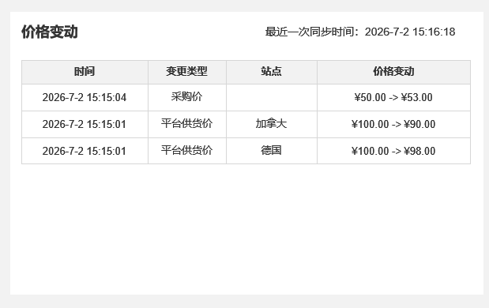

# 规划文档：价格追踪与 PLM 审版联动

| 属性 | 内容 |
|------|------|
| 规划文档编号 | REV-20260702-001 |
| 关联版本 | v2.7.1 |
| 需求提出方 | 运营部 / 商品开发部 |
| 规划人 | _待填写_ |
| 规划日期 | 2026-07-02 |
| 状态 | 开发中 |

---

## 1. 需求背景

### 1.1 问题描述

v2.7.1 是 SDP 商品管理链路的数据能力补全版本，集中解决三类问题：

1. **价格变动感知缺失**：核价模块缺少价格历史追踪，运营无法感知 SKC 在 Temu 平台上的价格波动，决策依赖人工对账；
2. **审版数据断链**：PLM 完成样衣审版后数据未回流 SDP，商品列表无法展示审版状态，导致运营需在两套系统间切换核查；
3. **待上架通知缺失**：有版有样项目在满足「审版完成 + 核价获取 + 商品状态就绪」的关键节点后，缺少主动飞书提醒，运营依赖手动巡检。


### 1.2 需求清单

| 序号 | 需求描述 | 需求类型 | 优先级 |
|------|---------|---------|--------|
| 1 | 记录 SKC 采购价与平台供货价的变动历史（平台供货价小时级定时同步；采购价更新、价格确认时同步写入） | 新增功能 | P1 |
| 2 | 商品列表 SKC 行新增「价格变动历史」行操作，侧弹窗展示采购价/平台供货价变动记录及最近一次同步时间 | 新增功能 | P1 |
| 3 | 商品列表新增「样衣审版通过时间」「审版操作人」只读展示（实时关联 prototype 表） | 新增功能 | P2 |
| 4 | 商品列表新增「款式难度」展示列和筛选项（来自 prototype.style_difficulty） | 新增功能 | P2 |
| 5 | 接收 PLM 推送的样衣审版通过事件，写入 prototype 表并追加日志 | 新增功能 | P1 |
| 6 | 款式列表新增「样衣审版」只读列（审版通过时间 + 操作人） | 新增功能 | P2 |
| 7 | 新增「有版有样待上架」飞书通知，SKC 维度去重，实时触发 | 新增功能 | P1 |
| 8 | 图片更新任务新增加急功能（创建表单新增加急开关、列表加急标签与筛选） | 新增功能 | P2 |

### 1.3 版本说明

本版本基于 v2.7.0 迭代。涉及模块：商品管理 (temu-product)、款式管理 (style-management)、通知中心 (notification-center)、图片更新任务 (image-update)。

---

## 2. 影响分析

### 2.1 受影响模块

| 模块 | 当前版本 | 影响类型 | 影响说明 |
|------|---------|---------|---------|
| 商品管理 (temu-product) | v2.7.0 | 直接 | 需求1/2/3/4：新增 price_change_log 实体（采购价/平台供货价双价格，三种触发来源）；商品列表新增价格变动历史侧弹窗、款式难度筛选/展示、样衣审版只读展示 |
| 款式管理 (style-management) | v2.6.2 | 直接 | 需求5/6：接收 PLM webhook，prototype 表新增 2 字段，审版日志写入已有款式日志中心，款式列表新增审版展示列 |
| 通知中心 (notification-center) | v2.6.0 | 直接 | 需求7：新增「有版有样待上架」通知类型，新增 notification_dedup_log 去重实体 |
| 图片更新任务 (image-update) | v2.4.1 | 直接 | 需求8：新增加急字段；创建表单新增加急开关；列表显示加急标签；支持按加急筛选 |

### 2.2 依赖传播链

```
PLM System
    │ webhook 推送（样衣审版通过）
    ▼
款式管理 (style-management)
    │ prototype.plm_sample_approved_at/by（覆盖写）
    │ 款式日志中心（审版日志追加写）
    │
    ├─── 实时关联查询 ──────────────────────► 商品管理 (temu-product)
    │   （样衣审版信息、款式难度供商品列表只读展示）  │
    │                                              │ SKC 状态变更事件
    │                                              ▼
    └─── 审版状态/核价状态/项目类型查询 ──► 通知中心 (notification-center)
                                                   │
                                                   ▼
                                          飞书（店铺运营）

采购价更新 / 价格确认
    │ 事件触发（实时）
    ├──────────────────────────────┐
Temu 平台价格接口                   │
    │ 定时拉取（小时级）              │
    ▼                               ▼
商品管理 (temu-product) → price_change_log 写入（trigger_source 区分来源）
    │
    ▼
商品列表 → 价格变动历史侧弹窗（运营查看）
```

### 2.3 冲突分析

| 冲突点 | 涉及模块 | 说明 | 解决方案 |
|--------|---------|------|---------|
| notification-center 跨模块实时查询 | notification-center、style-management、temu-product | 触发通知时需跨两个模块查询条件，存在查询时序和性能风险 | 明确查询顺序：先查 style-management，再校验 temu-product SKC 状态；单次查询加超时保护，失败不阻塞主业务 |

---

## 3. 模块变更详情

### 3.1 模块：商品管理 (temu-product)

#### 变更概述

新增 `price_change_log` 价格变动记录实体，支持三种触发来源（采购价更新、平台供货价定时同步、价格确认）；商品列表 SKC 行新增「价格变动历史」侧弹窗行操作；新增「样衣审版通过时间」「审版操作人」只读展示列（实时关联 prototype 表）；新增「款式难度」展示列与筛选项。

#### 页面变更

**商品列表页 — 修改**

1. SKC 行价格列新增「价格变动历史」按钮，点击打开侧弹窗（Drawer）。
   - 弹窗顶部显示最近一次同步时间，如「最近一次同步时间：2026-07-02 15:10:36」。
   - 列表按 `changed_at` 倒序展示，字段：时间 / 变动类型/ 站点 / 价格变动。
   - 变更类型=采购价和平台供货价，显示「变动前 → 变动后」价格，无变动时不需要展示。
   - 采购价变动时，不需要记录站点。



2. SKC 行新增「样衣审版通过时间」只读列，数据实时关联 `prototype.plm_sample_approved_at`，未审版显示「—」。
3. SKC 行新增「审版操作人」只读列，数据实时关联 `prototype.plm_sample_approved_by`，未审版显示「—」。
4. SKC 行新增「款式难度」只读展示列，值来自 `prototype.style_difficulty`（简单 / 普通 / 复杂），不支持排序，不支持显隐配置（固定展示）。
5. 筛选区新增「款式难度」单选筛选项：全部 / 简单 / 普通 / 复杂。

#### 数据模型变更

新增实体：**`price_change_log`（价格变动记录）**

| 字段名 | 类型 | 必填 | 说明 |
|--------|------|------|------|
| id | 整数 | 自动 | 雪花ID主键 |
| product_skc_id | 引用 | 自动 | 关联 product_skc 主键 |
| skc_code | 短文本 | 自动 | SKC编码，冗余存储 |
| site | 短文本 | 自动 | 站点，冗余存储 |
| changed_type | 枚举 | 自动 | 变动类型 |
| purchase_price_before | 金额 | 自动 | 采购价变动前；无变动时为 NULL |
| purchase_price_after | 金额 | 自动 | 采购价变动后；无变动时为 NULL |
| platform_price_before | 金额 | 自动 | 平台供货价变动前；无变动时为 NULL |
| platform_price_after | 金额 | 自动 | 平台供货价变动后；无变动时为 NULL |
| trigger_source | 枚举 | 自动 | 触发来源：`PURCHASE_UPDATE`（采购价更新）/ `PLATFORM_SYNC`（平台供货价定时同步）/ `PRICE_CONFIRM`（价格确认） |
| changed_at | 日期时间 | 自动 | 本次变动时间 |
| created_at | 日期时间 | 自动 | 记录写入时间 |

> 最近一次同步时间 = 该 SKC 下 `price_change_log` 最新一条记录的 `changed_at`，三种 `trigger_source` 均计入。

定时任务规格（平台供货价同步）：

| 属性 | 值 |
|------|-----|
| 执行频率 | 小时级（每小时一次） |
| 数据来源 | Temu 平台价格接口 |
| 比对逻辑 | 与该 SKC 最新一条记录的 `platform_price_after` 比对，不同则写入新记录，相同则跳过 |
| 保留策略 | 永久保留，不清理 |
| 触发通知 | 否 |

#### 依赖变更

| 变更类型 | 目标模块 | 类型 | 说明 |
|---------|---------|------|------|
| 新增依赖 | style-management | soft | v2.7.1 起实时关联 prototype 表展示样衣审版信息（plm_sample_approved_at/by）和款式难度（style_difficulty） |

---

### 3.2 模块：款式管理 (style-management)

#### 变更概述

新增外部系统依赖（PLM webhook）；`prototype` 表新增 2 个审版字段（覆盖写）；审版日志写入已有款式日志中心；款式列表新增「样衣审版」只读展示列。

#### PLM 对接规格

| 属性 | 值 |
|------|-----|
| 对接方式 | Webhook 推送（PLM → style-management） |
| 触发事件 | 样衣审版通过 |
| 多次审版处理 | prototype 表字段覆盖写（保留最新值），日志写入款式日志中心（保留全部历史） |
| 幂等键 | (prototype_id, approved_at) |

#### 页面变更

**款式列表页 — 修改**

1. SKC 行新增「样衣审版」只读列，展示审版通过时间 + 操作人，未审版显示「—」。

#### 数据模型变更

`prototype` 表新增字段：

| 字段名 | 类型 | 默认值 | 说明 |
|--------|------|--------|------|
| plm_sample_approved_at | 日期时间 | NULL | 最新一次样衣审版通过时间（覆盖写）(v2.7.1 新增) |
| plm_sample_approved_by | 短文本 | NULL | 最新一次审版操作人（覆盖写）(v2.7.1 新增) |

款式日志中心新增操作类型：`PLM_SAMPLE_APPROVED`（样衣审版通过），写入字段：审版通过时间、审版操作人、PLM 原始 payload（便于排查）。

#### 依赖变更

| 变更类型 | 目标模块 | 类型 | 说明 |
|---------|---------|------|------|
| 新增外部依赖 | PLM 系统 | hard | 样衣审版通过 webhook 回调（v2.7.1 新增） |

---

### 3.3 模块：通知中心 (notification-center)

#### 变更概述

新增「有版有样待上架」通知类型；新增 `notification_dedup_log` SKC 维度去重实体；通知实时触发，飞书推送给店铺运营。

#### 触发条件（全部满足）

| 条件 | 判断逻辑 | 数据来源 |
|------|---------|---------|
| 项目类型 = 有版有样 | prototype.project_type_name = '有版有样' | style-management |
| 样衣审版已完成 | prototype.plm_sample_approved_at IS NOT NULL | style-management |
| FOB 核价已获取 | prototype.check_price_state = 2（已核价） | style-management |
| 商品状态就绪 | ProductSkc.skc_status = 7（价格申报中）或 = 10（未发布到站点） | temu-product |

#### 通知规格

| 属性 | 值 |
|------|-----|
| 通知渠道 | 飞书机器人，发送到店铺运营人员飞书会话 |
| 触发方式 | 实时（监听 temu-product SKC 状态变更事件） |
| 接收人 | SKC 关联款式所属店铺的店铺运营人员 |
| 通知内容 | 款号（SPU/SKC）、当前商品状态、样衣审版通过时间、通知时间 |
| 通知记录 | 不持久化展示 |
| 已读状态 | 不维护 |

#### 去重规则

| 场景 | 处理 |
|------|------|
| 同一 商品SKC 在触发状态间反复切换 | 仅通知一次（查 notification_dedup_log，reset_at IS NULL 则跳过） |
| SKC 状态离开触发范围 | 写入 reset_at，重置去重 |
| SKC 状态再次进入触发范围 | 视为新事件，重新通知 |

#### 数据模型变更

新增实体：**`notification_dedup_log`（通知去重记录）**

| 字段名 | 类型 | 必填 | 说明 |
|--------|------|------|------|
| id | 整数 | 自动 | 雪花ID主键 |
| notification_type | 短文本 | 是 | 通知类型标识，如 `pending_listing_notify` |
| biz_key | 短文本 | 是 | 业务去重键，此场景为 skc_code |
| notified_at | 日期时间 | 自动 | 最近一次通知发送时间 |
| reset_at | 日期时间 | 否 | 去重重置时间（SKC 离开触发状态时写入） |

#### 依赖变更

| 变更类型 | 目标模块 | 类型 | 说明 |
|---------|---------|------|------|
| 新增依赖 | style-management | soft | v2.7.1 起新增查询样衣审版状态（plm_sample_approved_at）和核价状态（check_price_state） |
| 新增依赖 | temu-product | soft | v2.7.1 起新增监听商品 SKC 状态变更事件（skc_status） |

---

### 3.4 模块：图片更新任务 (image-update)

#### 变更概述

新增加急功能：创建表单新增「加急」开关，任务列表新增加急标签展示与加急筛选。

#### 页面变更

**创建任务表单 — 修改**

1. 新增「加急」开关，默认关闭。

**任务列表页 — 修改**

1. 加急任务行显示红色「加急」标签。
2. 筛选区新增「加急」单选筛选项：全部 / 仅加急。

#### 数据模型变更

`image_update_task` 表新增字段：

| 字段名 | 类型 | 默认值 | 说明 |
|--------|------|--------|------|
| is_urgent | 布尔 | false | 是否加急，创建时设置，不影响队列排序，不记录操作日志 (v2.7.1 新增) |

#### 依赖变更

无变更。

---

## 4. 新增模块定义

本版本无新建模块，均为现有模块扩展。

---

## 5. 风险评估

| 风险项 | 等级 | 说明 |
|--------|------|------|
| PLM webhook 稳定性 | 中 | 需确认 PLM 侧的重试机制和幂等性保障；建议要求 PLM 提供幂等键和重试上限 |
| 通知中心跨模块查询时序 | 低 | 触发通知时需跨 style-management / temu-product 查询，明确查询顺序并加超时保护 |
| price_change_log 数据量增长 | 低 | 仅在价格有变动时写入，无变动不记录，预计增长可控 |
| 飞书通知发送失败降级 | 低 | 已设计为不影响主业务流程，仅记录日志 + 支持手动重推 |

---

## 6. 待决事项

| # | 问题 | 负责方 | 优先级 | 状态 |
|---|------|--------|--------|------|
| 1 | PLM webhook payload 字段结构确认（操作人字段名、审版事件类型枚举） | 研发 / PLM 对接方 | 高 | 待确认 |
| 2 | 飞书通知消息体内容格式（字段布局、是否含跳转链接） | 产品 | 中 | 待确认 |
| 3 | price_change_log 货币单位（美分还是平台最小单位） | 研发 | 中 | 待确认 |

---

## 7. 执行记录

| 日期 | 操作 | 操作人 | 结果 |
|------|------|--------|------|
| 2026-07-02 | 创建规划文档 | _待填写_ | — |
| 2026-07-02 | 更新价格变动历史设计（采购价+平台供货价双价格、三种触发来源）；审版日志合并至款式日志中心；移除容量风险项 | Kiro | — |

---

## 8. 变更汇总

> **viewer 数据源**：此表格是 prd-viewer 判断模块变更类型的唯一权威来源。

| 模块 | 变更前版本 | 变更后版本 | 变更类型 | 状态 |
|------|----------|----------|---------|------|
| 商品管理 (temu-product) | v2.7.0 | v2.7.1 | 功能新增 | pending |
| 款式管理 (style-management) | v2.6.2 | v2.7.1 | 功能新增 | pending |
| 通知中心 (notification-center) | v2.6.0 | v2.7.1 | 功能新增 | pending |
| 图片更新任务 (image-update) | v2.4.1 | v2.7.1 | 功能新增 | pending |

---

## 附：相关文档索引

| 文档 | 路径 | 说明 |
|------|------|------|
| 通用设计语言规范 | references/通用设计语言规范.md | 字段类型、页面类型标准 |
| 文档结构模板 | references/文档结构.md | 模块文档结构模板 |
| 前序版本 | revisions/v2.7.0/规划文档_v2.7.0_SDP商品开发迭代.md | v2.7.0 规划文档 |
