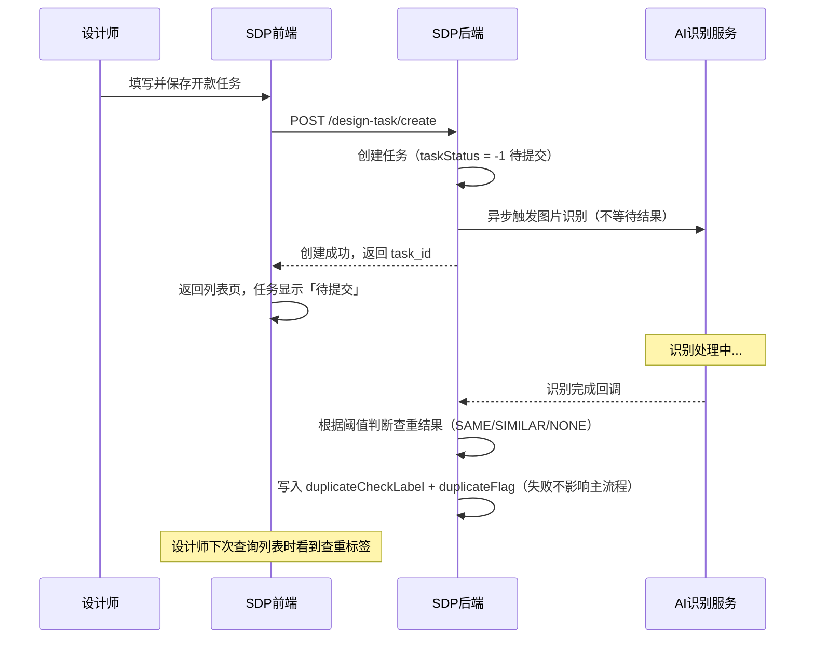
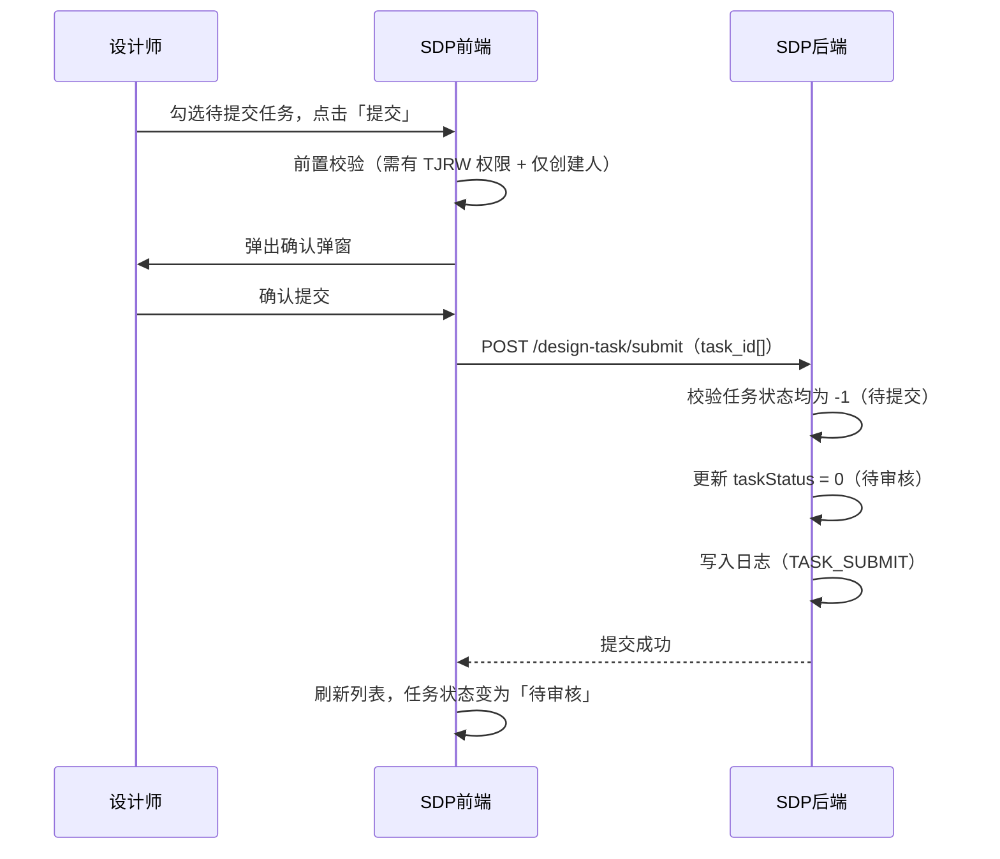

# 规划文档：开款流程优化

| 属性 | 内容 |
|------|------|
| 规划文档编号 | REV-20260701-001 |
| 关联版本 | v2.8.0 |
| 需求提出方 | 商品开发组 |
| 规划人 | _待填写_ |
| 规划日期 | 2026-07-01 |
| 状态 | 开发中 |

---

## 1. 需求背景

### 1.1 问题描述

#### 开款流程（design-task）

当前开款任务创建后直接进入「待审核」状态，设计师无法在提交前自行判断是否存在同款/相似款

#### 款式日志中心（style-log-center）

款式/商品模块当前缺乏统一的字段级变动追踪能力：设计师无法自查某款式具体改了哪些字段、改成了什么值；管理层也没有跨款式的操作审计入口；出现数据异常后，定位变更根因依赖人工排查，效率低且容易遗漏。本版本新增独立的日志中心模块，从源头补齐这一能力。

#### 商品管理 — 二次上架删除（temu-product）

1. **待发布记录无法删除**：二次上架「待发布」状态的记录一旦创建，当前列表和编辑页均无删除入口，运营无法清理错误或多余的待上架数据，导致脏数据积压
2. **编辑页缺少 SKC 粒度删除**：编辑待上架页面无法单独删除某个 SKC，只能整体删除或重新操作，灵活性不足


### 1.2 需求清单

#### 开款任务管理（design-task）

| 序号 | 需求描述 | 需求类型 | 优先级 |
|------|---------|---------|--------|
| 1 | 任务创建后初始状态变更为「待提交」 | 功能变更 | P0 |
| 2 | 待提交任务完成图片识别后触发查重，判断是否存在同款/相似款，写入查重标签 | 新增功能 | P0 |
| 3 | 列表显示查重标签（有同款 / 有相似款 / 无同款相似款），同步写入，失败不影响主流程 | 新增功能 | P0 |
| 4 | 支持按查重标签筛选任务 | 新增功能 | P1 |
| 5 | 待提交状态的任务可由创建人删除（软删除） | 新增功能 | P0 |
| 6 | 待提交任务由创建人提交后变为「待审核」状态 | 新增功能 | P0 |

#### 款式管理（style-management）
| 序号 | 需求描述 | 需求类型 | 优先级 |
|------|---------|---------|--------|
| 7 | 完善日志记录 | 功能变更 | P1 |

#### 商品管理需求（temu-product）

| 序号 | 需求描述 | 需求类型 | 优先级 |
|------|---------|---------|--------|
| 8 | 待上架列表新增「删除」操作，仅对二次上架（listing_type=2）且待发布（release_status=0）的记录显示，整行软删除，不回调源系统 | 新增功能 | P0 |
| 9 | 编辑待上架页面 SKC 列表新增「删除」操作，条件同上，至少保留 1 个 SKC，复用现有编辑权限码 | 新增功能 | P0 |

### 1.3 版本说明

本版本包含两个方向的优化：

1. **开款流程前置优化**：在现有流程头部插入「待提交」状态，让设计师在正式提交审核前拥有查看查重结果、决定是否提交的窗口期；不影响审核及后续流程。
2. **二次上架数据清理**：在待上架列表和编辑页新增针对「二次上架 + 待发布」记录的删除能力，解决运营无法清理脏数据的问题。

---

## 2. 影响分析

### 2.1 受影响模块

| 模块 | 当前版本 | 影响类型 | 影响说明 |
|------|---------|---------|---------|
| 开款任务管理 (design-task) | v2.6.2 | 直接 | 新增待提交状态；新增提交操作；查重标签字段；列表筛选/显示变更；创建页初始状态变更 |
| 款式日志中心 (style-log-center) | — | 新增 | 全新模块，为款式/商品模块提供统一的字段级变动追踪和操作审计能力；本版本首次上线 |
| 商品管理 (temu-product) | v2.4.1 | 直接 | 新增二次上架待发布整行删除操作；新增编辑页 SKC 级别删除操作 |

### 2.2 依赖传播链

```
开款任务管理 (design-task)
  │
  ├─ 变更：任务初始状态 0(待审核) → -1(待提交)
  │         创建人提交后 → 0(待审核)
  │
  ├─ 新增：duplicateCheckLabel 字段（SAME/SIMILAR/NONE）
  │         图片识别完成后异步写入，失败不影响主流程

商品管理 (temu-product)
  │
  ├─ 新增：待上架列表二次上架记录整行删除（软删除，不回调源系统）
  │         触发条件：listing_type=2 且 release_status=待发布
  │
  └─ 新增：编辑待上架页面 SKC 级删除
            触发条件：listing_type=2 且 release_status=待发布
            约束：至少保留 1 个 SKC，不可删除最后一个 SKC
            入口：编辑操作内，不新增独立权限码
```

### 2.3 冲突分析

| 冲突点 | 涉及模块 | 说明 | 解决方案 |
|--------|---------|------|---------|
| duplicateFlag 与 duplicateCheckLabel 并存 | design-task | 原有 duplicateFlag 布尔字段与新增细粒度标签字段语义重叠 | 两字段并存，写入时保持同步：duplicateCheckLabel IN (SAME, SIMILAR) 时 duplicateFlag = true；NONE 时 duplicateFlag = false |
| 查重写入时机 | design-task | 图片识别为异步，写入时任务可能已被提交或删除 | 写入前检查任务是否存在且未被删除；若任务已提交（taskStatus = 0）仍写入，不影响后续流程；若任务已删除则丢弃写入结果 |

### 2.4 核心调用时序

#### Flow 1：任务创建到查重写入



#### Flow 2：设计师提交任务



---

## 3. 模块变更详情

### 3.1 模块：开款任务管理 (design-task)

#### 变更概述

任务初始状态由「待审核」改为「待提交」，设计师在提交前可查看查重标签并决定是否提交；图片识别完成后自动写入细粒度查重标签；新增提交操作和权限码；待提交状态支持删除。

#### 页面变更

1. **开款任务列表** `修改` — 状态筛选新增「待提交」选项
2. **开款任务列表** `修改` — 显示字段新增「查重标签」列（有同款/有相似款/无同款相似款，识别未完成时不显示）
3. **开款任务列表** `修改` — 查询条件新增「查重标签」单选筛选
4. **开款任务列表** `修改` — 新增「提交」批量操作按钮，仅待提交状态 + 创建人可操作；勾选+点击后，进入提交页面（同审核界面，按钮及标签修改）

5. **开款任务列表** `修改` — 删除操作新增支持待提交状态（原支持待审核/待开款）
6. **创建开款任务** `修改` — 保存成功后初始状态由「待审核」改为「待提交」


#### 数据模型变更

| 实体 | 变更类型 | 变更内容 | 说明 |
|------|---------|---------|------|
| develop_style_task | 修改属性 | taskStatus 默认值由 `0` 改为 `-1`；枚举新增 `-1`（待提交） | (v2.8.0 变更) |
| develop_style_task | 新增属性 | `duplicateCheckLabel`: 枚举, 可选, 默认值 null；SAME（有同款）/ SIMILAR（有相似款）/ NONE（无同款相似款）| 图片识别完成后写入，失败不影响主流程 (v2.8.0 新增) |

#### 权限变更

| 权限码 | 变更类型 | 说明 |
|--------|---------|------|
| `SDP-SJZX-KKRW-TJRW` | 新增 | 提交开款任务，仅待提交状态 + 创建人可操作 |
| `SDP-SJZX-KKRW-SCRW` | 变更 | 删除范围新增待提交状态（原：待审核/待开款；变更后：待提交/待审核/待开款） |

#### 状态机变更

| 变更类型 | 内容 |
|---------|------|
| 新增状态 | `-1`（待提交）：任务创建后初始状态 |
| 新增流转 | 待提交 → 待审核（创建人提交） |
| 新增流转 | 待提交 → 已删除（创建人删除，逻辑删除） |
| 变更 | 创建入口（[*] → 待提交），原为 [*] → 待审核 |

#### 依赖变更

无新增模块间依赖。

---

### 3.2 模块：款式日志中心 (style-log-center)【新增模块】

#### 模块概述

原本的日志模块重大升级，为款式/商品模块提供统一的字段级变动追踪和操作审计能力，支持设计师/跟单自查"某款式具体改了什么字段"，以及管理层跨款式的操作审计，实现从问题发生到定位变更根因的闭环。

详细模块文档见：`modules/v2.8.0/style-log-center.md`

#### 首批页面

| 页面名称 | 类型 | 说明 |
|---------|------|------|
| 日志中心 | 列表页 | 全局日志查询，支持跨 SPU/SKC 检索，面向管理层审计 |
| 操作日志抽屉 | 抽屉 | 款式列表入口，展示当前 SKC + 所属 SPU 合并变更日志 |
| 变更日志 Tab | Tab 页 | 嵌入 SKC 详情页，与操作日志抽屉共用同一套数据 |
| 变更详情 | 详情弹窗 | 展示单条日志完整字段级 diff 或素材前后对比 |

#### 数据模型（新增实体）

| 实体 | 说明 |
|------|------|
| `style_change_log` | 日志主表，记录操作类型、操作人、操作时间、变更摘要 |
| `style_change_log_field` | 字段变更明细表，每个变更字段一行，含 before/after 原始值和展示值 |

#### 权限（新增权限码）

| 权限码 | 说明 |
|--------|------|
| `SDP-SJZX-RZGL-CK` | 访问独立日志中心页面 |
| `SDP-SJZX-RZGL-CKXQ` | 展开单条日志的字段 diff 详情 |

> 操作日志抽屉和变更日志 Tab 复用款式管理模块现有权限码 `SDP-SJZX-KSGL-CKXQ`。

#### 依赖关系（新增）

| 上游写入方 | 交互方式 | 说明 |
|-----------|---------|------|
| 款式管理 (style-management) | API 调用（写入） | 调用 record_change 写入 SPU/SKC 变更日志 |
| 现货管理 (spot-goods) | API 调用（写入） | 同上 |
| UACS 权限系统 | API 调用 | 查询时校验用户数据范围权限 |

---

### 3.3 模块：商品管理 (temu-product) — 二次上架删除

#### 变更概述

待上架列表新增对「二次上架 + 待发布」状态记录的整行删除操作；编辑待上架页面同步支持对单个 SKC 的删除操作，最少保留 1 个 SKC。两个入口均不回调款式管理/现货管理源系统。

#### 页面变更

1. **待上架列表** `修改` — 行操作新增「删除」按钮，仅对 listing_type=2（二次上架）且 release_status=0（待发布）的记录显示；整行软删除
2. **编辑待上架** `修改` — 编辑页面，SKC 列表每行新增「删除」操作，仅对 listing_type=2 且 release_status=0 的记录生效；至少保留 1 个 SKC，仅剩 1 个时该操作 disabled

#### 数据模型变更

| 实体 | 变更类型 | 变更内容 | 说明 |
|------|---------|---------|------|
| style_on_shelves | 新增操作 | 整行软删除（`deleted=1`） | 已有 deleted 字段，本次新增前端入口和后端删除接口；(v2.8.0 新增) |
| skc_on_shelves | 新增操作 | 单行物理删除或逻辑删除（确认后从 style_on_shelves 的 SKC 子集中移除） | 在编辑页操作，至少保留 1 个 SKC；(v2.8.0 新增) |

#### 权限变更

| 权限码 | 变更类型 | 说明 |
|--------|---------|------|
| `POP-SPGL-DSJ-SC` | 新增 | 删除二次上架待发布整行记录（列表入口） |
| `POP-SPGL-DSJ-BJ` | 复用 | SKC 级别删除在编辑操作内完成，复用现有编辑权限码，无需新增 |

#### 关键业务规则

**整行删除（列表入口）**

- 触发条件：listing_type=2 且 release_status=0（待发布）；其他状态不显示按钮
- 删除方式：style_on_shelves 软删除（`deleted=1`），数据保留
- 前端二次确认弹窗：「确认删除该待上架记录？删除后不可恢复。」
- 不回调款式管理/现货管理源系统

**SKC 级别删除（编辑页入口）**

- 触发条件：listing_type=2 且 release_status=0（待发布）时，编辑页 SKC 行显示「删除」操作
- 约束：至少保留 1 个 SKC；仅剩 1 个时「删除」按钮 disabled，提示"至少保留一个SKC，如需删除请使用列表删除整条记录"
- 前端二次确认弹窗：「确认删除该 SKC？」
- 不回调款式管理/现货管理源系统

#### 依赖变更

无新增模块间依赖。

---

无新增模块。

---

## 5. 数据迁移说明

| 变更点 | 影响 | 处理方案 |
|--------|------|---------|
| taskStatus 默认值 0 → -1 | 仅影响新任务；历史存量任务 taskStatus 不变 | 无需回填；前端、接口调用方需适配新枚举值 `-1` |
| duplicateCheckLabel 新增字段 | 历史任务该字段为 null | 不做历史回填；前端处理 null 时不显示查重标签，等同于「未查重」 |

---

## 6. 执行记录

| 日期 | 操作 | 操作人 | 结果 |
|------|------|--------|------|
| 2026-07-01 | 创建规划文档 | Kiro | — |
| 2026-07-01 | 执行模块更新（开款流程优化 + 日志中心） | Kiro | 已完成 |
| 2026-07-01 | 执行模块更新（二次上架删除 + 字段同步） | Kiro | 已完成 |
| 2026-07-02 | 补充 SKC 级别删除需求，移除 image-update 内容（已移入其他版本） | Kiro | 已完成 |
| 2026-07-03 | 将 3.4 字段同步策略优化拆分至 v2.8.1 | Kiro | 已完成 |

---

## 7. 变更汇总

| 模块 | 变更前版本 | 变更后版本 | 变更类型 | 状态 |
|------|----------|----------|---------|------|
| 开款任务管理 (design-task) | v2.6.2 | v2.8.0 | 功能优化 | 已完成 |
| 款式日志中心 (style-log-center) | v1.0.0 | v1.0.0 | 功能优化 | 已完成 |
| 商品管理 (temu-product) | v2.4.1 | v2.8.0 | 功能优化 | 已完成 |

---

## 附：相关文档索引

| 文档 | 路径 | 说明 |
|------|------|------|
| 开款任务管理模块文档 | modules/design-task.md | 本次主要更新模块 |
| 款式日志中心模块文档 | modules/style-log-center.md | 间接影响模块 |
| 规划文档 v2.6.2 Agent智能编辑接入 | revisions/v2.6.2/规划文档_v2.6.2_Agent智能编辑接入.md | 前序版本规划文档 |
| 规划文档 v2.8.1 商品字段同步策略优化 | revisions/v2.8.1/规划文档_v2.8.1_商品字段同步策略优化.md | 从本版本拆出的字段同步需求 |