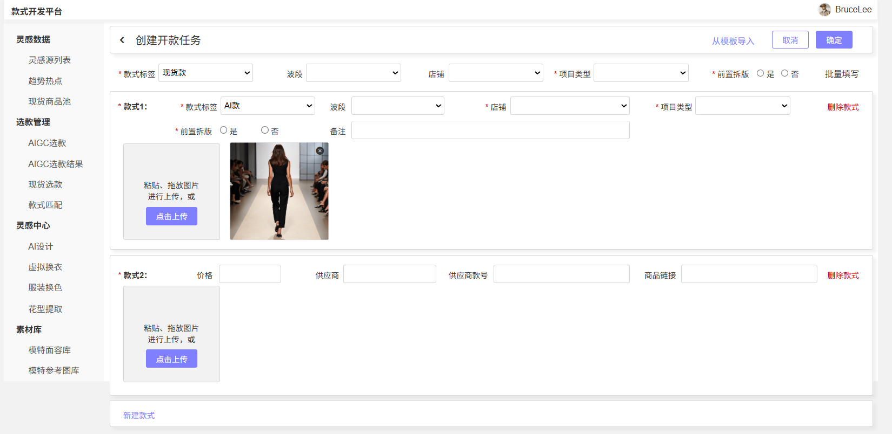
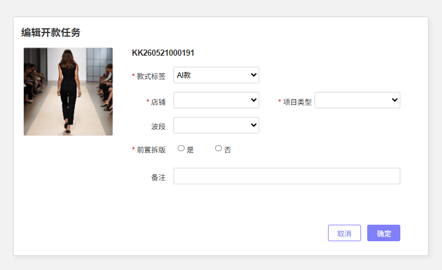
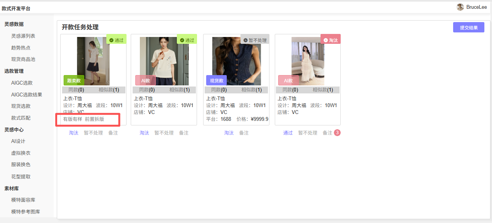
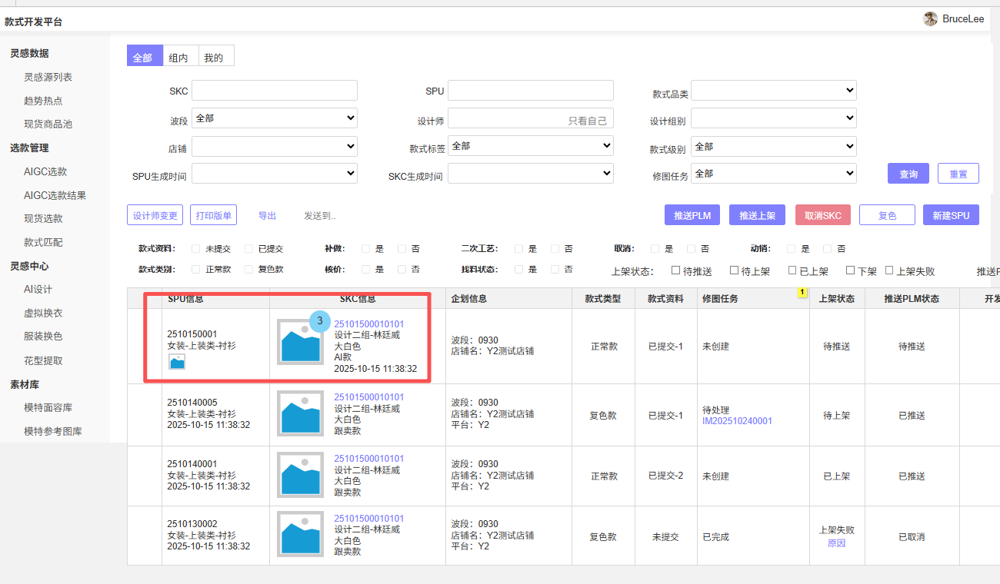
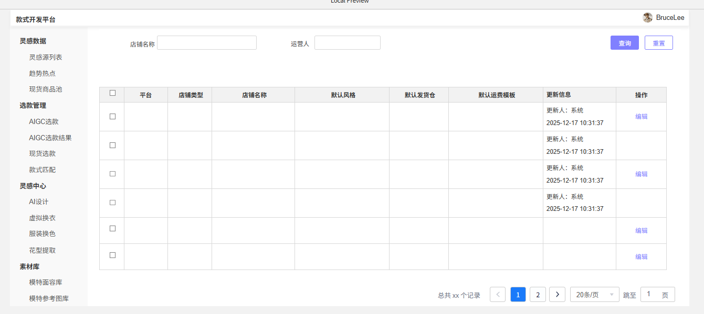

# 规划文档：SDP v2.6 商品开发迭代

| 属性 | 内容 |
|------|------|
| 规划文档编号 | REV-20260519-001 |
| 关联版本 | v2.6.0 |
| 需求提出方 | 商品开发组 |
| 规划人 | 林廷威 |
| 规划日期 | 2026-05-19 |
| 状态 | 开发中 |

---

## 1. 需求背景

### 1.1 问题描述

SDP v2.6 商品开发模块集中迭代，涉及开款任务管理、款式管理、修图任务、商品管理、通知中心等多个模块。主要围绕：

1. **开款效率提升**：字段映射自动填充、项目类型/开发信息前置、批量操作优化
2. **SKC维度下沉**：项目类型等字段从SPU维度拆分到SKC维度，涉及款式管理、现货管理、商品管理的联动调整
3. **修图任务升级**：从SPU维度改为SKC维度创建，新增指定美工、编辑修图任务功能
4. **通知能力建设**：新增通知中心模块，覆盖PLM推送、上架、发布、测价等关键节点
5. **店铺默认值管理**：新增店铺维度默认配置，支持店铺→风格自动映射

### 1.2 需求清单

| 序号 | 需求编号 | 需求描述 | 需求类型 | 涉及模块 | 优先级 |
|------|---------|---------|---------|---------|--------|
| 1 | #67 | 开款时选择店铺后自动对应风格 | 功能优化 | 开款任务管理 | P2 |
| 2 | #74 | 支持修改款式类型 | 功能优化 | 开款任务管理 | P2 |
| 3 | #125 | 批量导入款式后单独编辑款式店铺 | 功能优化 | 开款任务管理 | P2 |
| 4 | #142 | 开款备注+审款显示备注 | 功能优化 | 开款任务管理 | P2 |
| 5 | #145 | 开款任务字段映射（店铺→风格、款式标签→款式级别、套装品类→件数） | 功能优化 | 开款任务管理 | P1 |
| 6 | #153 | 批量创建缺少必填信息时自动滑动到该款式位置 | 功能优化 | 开款任务管理 | P1 |
| 7 | #154 | 创建款式后清除空白款式 | 功能优化 | 开款任务管理 | P2 |
| 8 | #156 | 项目类型改为必填（非现货款时） | 功能优化 | 开款任务管理 | P1 |
| 9 | #164 | 款式管理营销图预览+缩略图数量+SPU首张SKC图 | 功能优化 | 款式管理 | P1 |
| 10 | #169 | 款式编码筛选栏增加清空快捷键 | 功能优化 | 款式管理 | P1 |
| 11 | #175 | 开发信息前置到开款页面填写（可批量） | 功能优化 | 开款任务管理 | P2 |
| 12 | #181 | 图片浏览点击空白处退出 | 功能优化 | 开款任务管理 | P2 |
| 13 | #207 | 批量填写仅覆盖空白字段 | 功能优化 | 开款任务管理 | P2 |
| 14 | #214 | 制作方式前置到开款页面填写 | 功能优化 | 开款任务管理 | P2 |
| 15 | #231 | 项目类型&前置拆版标签前置到开款页面（现货款项目类型非必填） | 功能优化 | 开款任务管理 | P1 |
| 16 | #143 | 修图任务SKC维度+指定美工+展示店铺/SKC | 功能优化 | 修图任务 | P1 |
| 17 | #159 | 批量上传多图片备注显示修复 | 缺陷修复 | 修图任务 | P1 |
| 18 | #232 | SKC维度调整：款式管理/现货管理增加SKC创建时间、项目类型拆分到SKC | 功能优化 | 款式管理, 现货管理, 商品管理 | P1 |
| 19 | #152 | 通知中心增加PLM推送失败/推送上架失败/发布失败/测价通过通知 | 新增模块 | 通知中心 | P1 |
| 20 | — | 店铺默认值管理 | 新增功能 | 店铺管理 (shop-management) | P1 |

### 1.3 版本说明

v2.6.0 版本，覆盖 商品开发 领域 20 个需求点。基于 v2.4.3（SKC维度调整）的成果继续深化SKC维度拆分。

---

## 2. 影响分析

### 2.1 受影响模块

| 模块 | 变更前版本 | 影响类型 | 影响说明 |
|------|----------|---------|---------|
| 开款任务管理 (design-task) | v1.0.0 | 直接 | 14个功能点：字段映射、项目类型/拆版标签前置、备注、开发信息/制作方式前置、批量操作优化、新增编辑开款任务页 |
| 款式管理 (style-management) | v1.1.0 | 直接 | 3个功能点：营销图预览、快捷键、SKC维度拆分 |
| 现货管理 (spot-goods) | v1.2.0 | 直接 | SKC维度同步：新增SKC创建时间、项目类型字段 |
| 修图任务 (image-update) | v1.0.0 | 直接 | 2个功能点：SKC维度创建+指定美工+编辑修图任务、批量上传备注修复 |
| 商品管理 (temu-product) | v1.1.0 | 间接 | SKC维度变更传播：待上架/商品列表显示调整 |
| 通知中心 | — | 新增 | 新增模块 |
| 店铺管理 (shop-management) | v2.6.0 | 直接 | 新增店铺维度默认配置，支持店铺→风格自动映射（新增功能） |

### 2.2 依赖传播链

```
店铺默认值管理 (新增)
  │
  └─ hard → 开款任务管理 选择店铺→读取默认风格 (#67, #145)
              │
              ├─ 字段映射写入 → 款式管理
              │                    │
              │                    ├─ hard → 现货管理
              │                    │           │
              │                    │           └─ hard → 商品管理
              │                    │
              │                    └─ hard → 商品管理
              │
              └─ 项目类型/拆版标签前置(SKC维度) (#231, #156)
                   │
                   └─→ #232 款式管理/现货管理 SKC维度拆分
                         │
                         └─→ 商品管理 待上架/商品列表 显示调整

通知中心 (新增)
  └─ soft → 款式管理、现货管理、商品管理、开款任务管理

修图任务 SKC维度改造 (#143)
  └─ hard → 款式管理(读SKC数据)、现货管理(读库存)
```

### 2.3 冲突分析

| 冲突点 | 涉及模块 | 说明 | 解决方案 |
|--------|---------|------|---------|
| 项目类型在#231前置(SKC维度) + #232拆分到SKC维度 | design-task, style-management, spot-goods, temu-product | 项目类型需在开款时按SKC填写，流转后保留SKC维度 | 开款按SKC维度填写，向下游传递时保持SKC维度 |
| 店铺→风格映射在#67和#145中均有涉及 | design-task, 店铺默认值管理 | 同一规则两处引用 | 统一由店铺默认值管理提供 |

---

## 3. 模块变更详情

### 3.1 模块：开款任务管理 (design-task)  v1.0.0 → v2.6.0

#### 变更概述

开款页面新增字段映射规则、前置填写项、备注信息；新增编辑开款任务页面；批量开款优化交互；审款页面展示新增字段；新增对店铺默认值管理的依赖。

#### 页面变更
1. **创建开款任务**
  1. 需要根据标签值切换可填字段，非现货款时新增「项目类型」「前置拆版标签」，均为必填，可批量填写；
  2. 新增「备注」字段，供设计师填写审核参考
  3. 批量导入后清除空白款式行
  4. 支持提交不同店铺的开款任务，支持单独编辑店铺 
  5. 导入模板新增 店铺、波段及款式标签字段



2. **编辑开款任务**
支持修改除了图片以外的字段，包括款式标签


3. **审款**
  显示项目类型和前置拆版标签（去掉原本的平台标签）


4. **批量开款**
  a. 新增「项目类型」「前置拆版标签」「制作方式」「是否拼接」「尺码」，可批量填写；**非现货款时均为必填**
  b. 校验失败自动滑动到缺必填行
  c.批量填写仅覆盖空白字段
  d.字段映射：选择店铺→自动带出风格；选择款式标签→映射款式级别；选择套装品类→映射SKU分类件数
  e.图片浏览点击空白处退出


#### 数据模型变更

| 实体 | 变更类型 | 变更内容 | 说明 |
|------|---------|---------|------|
| 开款任务 | 新增属性 | 备注: 长文本, 可选 | #142 |
| 开款任务 | 新增属性 | 项目类型: 引用, 条件必填| #231 #156 |
| 开款任务 | 新增属性 | 前置拆版标签: 引用, ,条件必填 | #231 |
| 开款任务 | 新增属性 | 制作方式: 枚举(3D/实物样), 条件必填 | #214 |
| 开款任务 | 新增属性 | 是否拼接, 条件必填 | #214 |
| 开款任务 | 新增属性 | 尺码, 条件必填 | #214 |

#### 依赖变更

| 变更类型 | 目标模块 | 类型 | 说明 |
|---------|---------|------|------|
| 新增依赖 | 店铺默认值管理 | hard | #67 #145 选择店铺后读取默认风格 |


---

### 3.2 模块：款式管理 (style-management)  v1.1.0 → v2.6.0

#### 变更概述

列表增加营销图预览及数量标记、SPU行展示首张SKC图；筛选栏增加清空快捷键；SKC维度拆分（新增SKC创建时间、项目类型从SPU下移到SKC）。

#### 页面变更

| 页面名称 | 变更类型 | 具体变更 | 变更原因 |
|---------|---------|---------|---------|
| 款式管理列表 | 修改 | #164 增加营销图预览功能，支持从列表发起查看当前SKC的所有营销图 | 快速查看图片 |
| 款式管理列表 | 修改 | #164 列表的缩略图右上角标记营销图数量 | 检查上架条件 |
| 款式管理列表 | 修改 | #164 SPU行增加首张SKC商品图缩略图 | 复色款识别 |
| 款式管理列表 | 修改 | #232 SKC行增加「SKC创建时间」「项目类型」 | SKC维度拆分 |



#### 数据模型变更

| 实体 | 变更类型 | 变更内容 | 说明 |
|------|---------|---------|------|
| SKC | 新增属性 | 项目类型: 引用, 必填 | #232 从SPU拆分到SKC |
| SPU | 删除属性 | 项目类型 | #232 统一由SKC维度管理 |

---

### 3.3 模块：现货管理 (spot-goods)  v1.2.0 → v2.6.0

#### 变更概述

配合#232，SKC维度新增SKC创建时间、项目类型字段。

#### 页面变更

| 页面名称 | 变更类型 | 具体变更 | 变更原因 |
|---------|---------|---------|---------|
| 现货管理-列表 | 修改 | #232 SKC行增加「SKC创建时间」


#### 数据模型变更

| 实体 | 变更类型 | 变更内容 | 说明 |
|------|---------|---------|------|
| SKC | 新增属性 | SKC创建时间: 日期时间, 自动 | #232 |

---

### 3.4 模块：修图任务 (image-update)  v1.0.0 → v2.6.0

#### 变更概述

修图任务创建从SPU维度改为SKC维度；新增指定美工功能；新增修图任务编辑页；任务列表增加店铺、SKC、上传图片人展示；修复批量上传备注异常。

#### 页面变更

| 页面名称 | 变更类型 | 具体变更 | 变更原因 |
|---------|---------|---------|---------|
| 图片更新任务列表 | 修改 | 列表维度从SPU改为SKC | SKC维度改造 |
| 图片更新任务列表 | 修改 | #143 新增「店铺名称」「SKC」「上传图片人」「任务处理人(美工)」列 | SKC维度改造 |
| 创建修图任务 | 修改 | #143 改为SKC维度发起；新增「指定美工」选择项 | SKC维度改造 |
| 编辑修图任务 | 新增 | 支持编辑修图说明和指定美工 | 灵活修正 |
| 上传图片 | 修改 | #159 修复批量上传多图片备注显示异常 | 缺陷修复 |

1. 创建/编辑修图任务


#### 数据模型变更

| 实体 | 变更类型 | 变更内容 | 说明 |
|------|---------|---------|------|
| 修图任务 | 修改属性 | 关联维度: SPU → SKC | #143 |
| 修图任务 | 新增属性 | 指定美工: 引用, 可选 | #143 |
| 修图任务 | 新增属性 | 上传图片人: 引用, 自动 | #143 |
| 修图任务 | 新增属性 | 修图说明: 长文本, 可选 | 编辑页可修改 |

---

### 3.5 模块：商品管理 (temu-product)  v1.1.0 → v2.6.0

#### 变更概述

配合#232 SKC维度调整，待上架列表、商品列表中项目类型改为SKC维度展示，新增SKC创建时间。

#### 页面变更

| 页面名称 | 变更类型 | 具体变更 | 变更原因 |
|---------|---------|---------|---------|
| 待上架列表 | 修改 | #232 SKC信息增加项目类型（每SKC独立），SPU行移除项目类型；增加SKC创建时间 | SKC维度拆分 |
| 商品列表 | 修改 | #232 SKC信息增加项目类型（每SKC独立），SPU行移除项目类型；增加SKC创建时间 | SKC维度拆分 |
| 待上架详情 | 修改 | #232 SKC信息增加项目类型（每SKC独立），SPU移除项目类型；增加SKC创建时间 | SKC维度拆分 |
| 商品详情 | 修改 | #232 SKC信息增加项目类型（每SKC独立），SPU移除项目类型；增加SKC创建时间 | SKC维度拆分 |
#### 数据模型变更

| 实体 | 变更类型 | 变更内容 | 说明 |
|------|---------|---------|------|
| StyleOnShelves | 修改属性 | 项目类型快照: 从SPU字段改为SKC维度传递 | #232 |
| skc_on_shelves | 新增属性 | 项目类型: 引用 | #232 |
| skc_on_shelves | 新增属性 | SKC创建时间: 日期时间 | #232 |

### 3.6 模块：店铺管理 (shop-management)  v1.1.0 → v2.6.0

#### 变更概述

新增「店铺默认值」子域：新增店铺默认值列表页及编辑弹窗，支持按店铺维度配置默认风格；开款任务选择店铺后自动读取并填充风格字段（#67、#145）。

#### 页面变更

| 页面名称 | 变更类型 | 具体变更 | 变更原因 |
|---------|---------|---------|---------|
| 店铺默认值列表 | 新增 | 展示所有启用店铺的默认值配置，支持按店铺名称/默认风格筛选 | #67 #145 店铺→风格自动映射 |
| 编辑店铺默认值 | 新增 | 弹窗编辑指定店铺的默认风格；店铺创建时自动生成空记录 | #67 #145 |




#### 数据模型变更

| 实体 | 变更类型 | 变更内容 | 说明 |
|------|---------|---------|------|
| ShopDefault | 新增 | 店铺ID(引用,必填)、默认风格编码(引用,可选)、默认风格名称(短文本,自动)、更新人/更新时间(自动) | #67 #145 每个店铺1:1关联一条默认值记录 |

#### 依赖变更

| 变更类型 | 目标模块 | 类型 | 说明 |
|---------|---------|------|------|
| 新增 exposed_api | design-task | hard | 开款任务选择店铺后调用本模块获取默认风格 |


---

## 4. 新增模块定义

### 4.1 模块：通知中心

#### 模块概述

负责系统通知的集中管理和展示，首批通知类型覆盖 PLM推送失败、推送上架失败、发布失败、测价通过 四个业务节点。

#### 依赖声明

```yaml
depends_on:
    - module: "style-management"
    type: "soft"
    use_case: "PLM推送结果通知、推送上架结果通知"
  - module: "spot-goods"
    type: "soft"
    use_case: "现货推送结果通知"
  - module: "temu-product"
    type: "soft"
    use_case: "发布结果通知、测价结果通知"
exposed_api: []
```
#### 通知模板

| 通知类型 | 触发事件 | 触发来源 | 通知内容 | 接收通知人 |
|---------|---------|---------|---------|---------|
| PLM推送失败 | 款式审核通过后推送PLM失败 | style-management | 款号：{SPU编号}，失败原因：{原因}，失败时间：{时间} | 款式创建人（设计师） |
| 推送上架驳回 | 款式/现货推送到待上架被驳回 | style-management / spot-goods | 款号：{SPU编号}，驳回原因：{原因}，驳回时间：{时间} | 操作推送上架的用户 |
| 发布失败 | 商品发布到Temu失败 | temu-product | 款号：{SPU编号}/{SKC编号}，失败原因：{原因}，失败时间：{时间} | 操作推送上架的用户 |
| 测价通过 | 商品测价标记为通过 | temu-product | 款号：{SPU编号}/{SKC编号}，测价通过时间：{时间} | 款式创建人（设计师）（SKC维度） |


---

## 5. 执行记录

| 日期 | 操作 | 操作人 | 结果 |
|------|------|--------|------|
| 2026-05-19 | 创建规划文档 | — | — |
| 2026-05-19 | 确认修改方案 | — | — |
| 2026-05-20 | 执行模块文档更新 | — | 成功 |

---

## 6. 变更汇总

| 模块 | 变更前版本 | 变更后版本 | 变更类型 | 状态 |
|------|----------|----------|---------|------|
| design-task | v2.4.1 | v2.6.0 | 功能优化 | executed |
| style-management | v2.4.1 | v2.6.0 | 功能优化 | executed |
| spot-goods | v2.4.1 | v2.6.0 | 功能优化 | executed |
| image-update | v2.4.1 | v2.6.0 | 功能优化 | executed |
| temu-product | v2.4.1 | v2.6.0 | 功能优化 | executed |
| shop-management | v2.6.0 | v2.6.0 | 新增功能 | executed |
| notification-center (通知中心) | — | v2.6.0 | 新增模块 | executed |

---

## 附：相关文档索引

| 文档 | 路径 | 说明 |
|------|------|------|
| 通用设计语言规范 | build-prd.skill/references/通用设计语言规范.md | 字段类型、页面类型标准 |
| 文档结构模板 | build-prd.skill/references/文档结构.md | 模块文档结构模板 |
| 规划文档 v2.4.3 | revisions/规划文档_v2.4.3_SKC维度调整.md | 前序SKC维度调整规划 |
