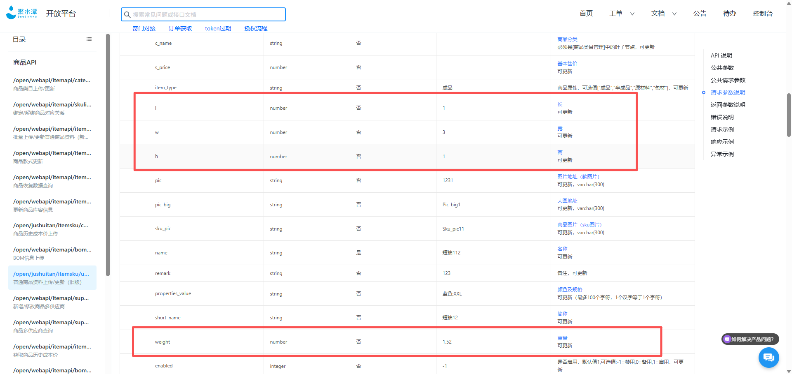

# 生产事故复盘报告（产研视角）

**事故编号：** INC-20260521-001
**事故等级：** P1
**复盘日期：** 2026年6月3日
**适用范围：** 产品、研发、QA

---

## 一、事情还原：5W2H 分析

| 维度 | 内容 |
|------|------|
| **What（发生了什么）** | SDP 商品重量（单位：g）同步至聚水潭时，未做除以1000换算，导致约300g服饰被写入为300kg，物流系统据此计费，单笔物流费达 $305~$652，正常应为 $10~30 |
| **Who（涉及哪些角色）** | 开发：负责 SDP→聚水潭同步接口；QA：未覆盖跨系统数据一致性测试；运营：发现问题；PM：无变更管控流程 |
| **When（何时发生）** | 5月21日功能上线后立即触发，6月1日21:00运营巡店发现，**潜伏11天无任何系统告警** |
| **Where（问题在哪）** | SDP→聚水潭商品信息同步接口，`weight` 字段写入逻辑，未处理系统间单位差异 |
| **Why（为何发生）** | 两系统对 `weight` 字段的单位语义不同（g vs kg），接口设计时未建立数据契约，未做单位转换，也未做合理性校验 |
| **How（如何发现和处置）** | 运营人工巡店发现物流费异常 → 产研介入排查根因 → 0.5天内完成技术修复 → 批量修正存量数据 → 运营手动拦截在途订单 |
| **How much（损失多少）** | 504单受影响，6家店铺，**$6,500 已损失（13单尾程已发货）**，324单批量修正挽救，92单手动干预 |

---

## 二、根本原因分析

### 2.1 技术根因（直接触发）

```
SDP.weight = 300   (语义: 克, g)
          ↓ 直接赋值，无换算
聚水潭.weight = 300 (语义: 千克, kg)
          ↓
物流计费按 300kg → 费用 × 20
```

这是**系统集成边界处的数据契约缺失**：两个系统对相同字段名定义了不同的值域语义，对接时没有任何文档、注释、或校验约束来捕获这一差异。


### 2.2 测试根因（本可拦截）

集成上线前缺少端到端验证。若任取1个真实 SKU 走完"SDP 修改重量 → 聚水潭同步 → 物流费预估"完整链路，问题必然在测试阶段暴露。QA 用例只覆盖了单系统功能验证，未覆盖**跨系统数据一致性**这一测试维度。

### 2.3 监控根因（本可早发现）

物流费是核心成本指标，但：
- 没有单笔物流费异常阈值告警
- 没有商品重量写入异常检测
- 没有数据同步后的回写校验

导致问题静默11天，完全依赖人工发现，损失持续累积。

### 2.4 流程根因（系统性缺失）

| 缺失的防线 | 具体表现 |
|-----------|---------|
| 数据契约 | 跨系统字段无单位规范文档，对接靠"口头对齐" |
| 变更管控 | 影响物流计费的功能变更，无上线 checklist，无运营审批节点 |
| 灰度机制 | 数据同步类功能直接全量上线，无小范围验证窗口 |
| 上线观察期 | 上线后无人主动监控关键数据指标变化 |

---

## 三、责任区分

复盘的目的是**找到系统性漏洞，而非追责个人**。以下区分有助于针对性改进：

| 层面 | 问题归属 | 性质 |
|------|---------|------|
| 接口单位未换算 | 开发实现 | 技术遗漏，已修复 |
| 测试未覆盖跨系统数据一致性 | QA + 开发共同 | 测试策略缺陷 |
| 无上线 checklist | 产品研发流程 | 流程空白 |
| 无物流费监控告警 | 产研+数据团队 | 监控建设欠账 |
| 11天未主动发现 | 运营+产研共同 | 观察机制缺失 |

**结论：这是一次典型的"瑞士奶酪"事故——多层防线同时失效，单一个人的失误不是根本原因，流程和工具的系统性缺失才是。**

---

## 四、成本相关高风险字段梳理

此次事故反映出一类共性风险：**跨系统同步的字段中，凡涉及计费计量的，都存在类似的单位/精度/语义错误隐患**。

以下是当前系统中需要排查和加固的字段清单：

| 字段 | 涉及系统 | 风险类型 | 当前管控状态 | 建议措施 |
|------|---------|---------|------------|---------|
| `weight`（重量） | SDP / 聚水潭 / 物流商 | 单位不一致（g/kg） | ✅ 本次已修复 | 已加单位转换 + 合理性校验 |
| `volume`（体积/尺寸） | SDP / 聚水潭 / 物流商 | 单位不一致（cm/mm），影响抛重计费 | ❓ 待确认 | 全量审查，统一为 cm |
| `declared_value`（申报价值） | 聚水潭 / 清关系统 | 货币单位、汇率版本差异 | ❓ 待确认 | 标注货币单位，锁定汇率来源 |
| `quantity`（数量） | 订单系统 / 仓库系统 | pcs vs 箱（carton），影响头程费用 | ❓ 待确认 | 字段命名区分，增加单位标注 |
| `freight_fee`（物流费） | 平台 / 内部财务 | 汇率差、含税/不含税混用 | ❓ 待确认 | 标注计费口径，统一币种 |
| `price`（商品价格） | SDP / 聚水潭 / Temu平台 | 含税价 vs 不含税，人民币 vs 美元 | ❓ 待确认 | 字段拆分，明确口径 |

**建议：** 对上表"待确认"字段，由产研主导完成一次跨系统字段对齐专项审查，形成《计量计费字段规范表》，作为后续所有系统对接的数据契约基础。

---

## 五、改进措施与跟踪闭环

### 5.1 短期措施（1周内完成）

| # | 做什么 | 谁负责 | 验收标准 | 截止日期 |
|---|--------|--------|---------|---------|
| S1 | 修复 weight 同步单位转换逻辑（g÷1000）| 后端开发 | ✅ 已完成，单元测试覆盖 | 6月2日 |
| S2 | 批量修正存量异常重量数据（5月21日后同步的所有SKU）| 后端开发 | ✅ 已完成，无>50kg服饰SKU | 6月2日 |
| S3 | weight 接口层增加合理性拦截：单件>50kg 拒绝写入并触发人工审核 | 后端开发 | 接口测试通过，异常重量写入被拒绝并有日志 | 6月9日 |
| S4 | 完成 volume / declared_value / quantity / price 四类字段的跨系统单位核查 | 后端+产品 | 输出字段核查报告，标注各字段当前单位和是否存在同步风险 | 6月9日 |

### 5.2 中期措施（1个月内完成）

| # | 做什么 | 谁负责 | 验收标准 | 截止日期 |
|---|--------|--------|---------|---------|
| M1 | 上线物流费异常告警：单笔>$100 或超历史均值3倍，自动推送运营群 | 数据+产研 | 告警规则上线，完成1次模拟触发验证 | 6月16日 |
| M2 | 上线商品重量异常告警：单件>50kg 或较历史均值偏差>200%，触发人工审核 | 产研 | 告警规则上线，完成1次模拟触发验证 | 6月16日 |
| M3 | 制定并发布《跨系统对接上线 Checklist》，涵盖：字段映射确认、单位规范、集成测试、灰度方案、回滚方案、上线后观察指标 | PM + 产研 | 文档发布，下一个跨系统项目强制执行并留有执行记录 | 6月30日 |
| M4 | 建立高风险变更审批节点：涉及订单/物流/财务计算的功能变更，需运营负责人在上线单上确认 | PM | 审批流程在项目工具（飞书/Jira）中落地 | 6月30日 |
| M5 | 完成核查报告中识别的高风险字段修复（由 S4 评估结果决定范围）| 后端开发 | 所有 high risk 字段完成修复，回归测试通过 | 6月30日 |

### 5.3 长期措施（3个月内完成）

| # | 做什么 | 谁负责 | 验收标准 | 截止日期 |
|---|--------|--------|---------|---------|
| L1 | 建立《计量计费字段规范表》，所有跨系统字段明确：字段名、数据类型、单位、取值范围、业务含义，作为数据契约文档 | 后端架构+PM | 文档发布，所有现存跨系统对接接口完成对照确认 | 8月31日 |
| L2 | 引入灰度发布机制：跨系统数据同步类功能，必须先对1-2个SKU灰度验证，T+1确认数据正确后再全量放开 | 产研 | 灰度流程纳入研发规范，连续3个跨系统项目有执行记录 | 8月31日 |
| L3 | 完善集成测试用例库，增加"跨系统数据一致性"测试维度，覆盖：字段映射正确性、边界值、单位换算 | QA | 集成测试用例库包含数据一致性测试套件，新跨系统项目上线前必须通过 | 8月31日 |
| L4 | 建立跨系统变更的上线观察期制度（默认3天），观察期内 oncall 每日检查关键指标，发现异常立即回滚 | PM + 产研 | 制度纳入发布 SOP，近3个月跨系统上线均有观察期记录 | 8月31日 |

---

## 六、跟踪机制

**周会检查点：** 每周同步短期/中期措施完成进度，未完成项说明阻塞原因

**看板跟踪：** 上述所有行动项在项目看板创建对应卡片，Owner 每周更新状态

**验收闭环：** 每项措施完成后，由 PM 和对应负责人完成验收确认，留存验收记录

**复盘跟踪会：** 2026年7月初召开一次跟踪会，确认以下三点：
1. 短期/中期措施全部落地
2. 监控告警实际运行有效（是否有触发记录）
3. Checklist 在新上线项目中被实际使用

---

## 七、知识沉淀

本次事故产出以下两份长期有效的流程资产，提交到团队知识库：

1. **《跨系统数据同步规范》** — 包含：字段单位标准、数据契约模板、合理性校验规则
2. **《系统变更上线 Checklist》** — 包含：集成测试验收、灰度方案、观察期指标、回滚条件

> 技术修复是治标。流程资产和监控体系才是让同类事故不再发生的治本手段。

---

*文档版本 v1.0 · 下次更新节点：2026年7月跟踪会后*
